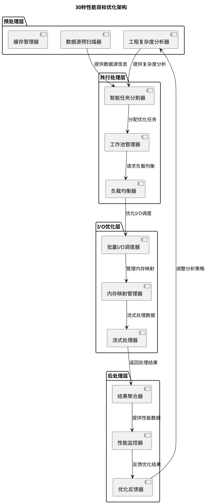
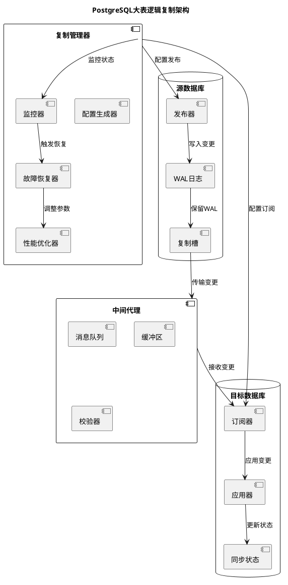
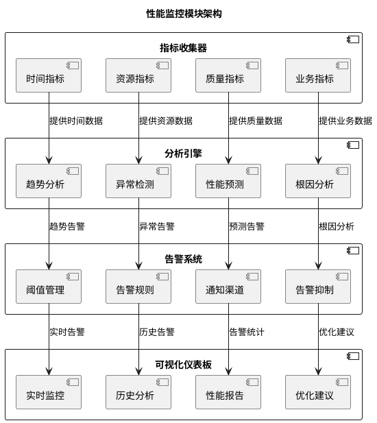

# ArcGIS Pro迁移系统架构设计审查报告

## 审查概述

基于对以下文件的深入分析：
- `migration_system_architecture.md` - 现有的架构设计文档
- `requirements.md` - 需求规格说明书
- `arcgis_migration_schema.xsd` - XML Schema定义
- `script/aprx_parser.py` - 现有的解析代码
- `script/main.py` - 主程序入口

我对ArcGIS Pro迁移系统的架构设计进行了全面的审查，包括完整性检查、一致性检查、可实施性检查、性能目标检查、风险识别和扩展性检查。

## 发现的问题列表（按优先级排序）

### **高优先级问题**

#### **问题1：30秒性能目标的优化策略不足**
- **问题描述**：架构设计中对30秒单工程迁移目标的优化策略过于简单，缺乏具体的量化分析和分层优化方案。
- **影响分析**：无法确保性能目标的可达性，可能导致实际实施后性能不达标。
- **改进建议**：
  1. 增加详细的性能分析模型
  2. 设计分层优化策略（预解析、并行处理、缓存机制）
  3. 增加性能基准测试框架

#### **问题2：PostgreSQL大表逻辑复制的具体实现方案缺失**
- **问题描述**：虽然提到了逻辑复制，但缺乏具体的实现流程、配置管理和监控机制。
- **影响分析**：>1TB表的处理可能成为系统瓶颈，影响整体迁移效率。
- **改进建议**：
  1. 设计完整的逻辑复制流水线
  2. 增加复制状态管理和故障恢复机制
  3. 设计增量同步和回退策略

#### **问题3：两阶段架构的通信和数据同步机制不完善**
- **问题描述**：第一阶段（ArcGIS端）和第二阶段（QGIS端）之间的数据同步和状态管理机制不清晰。
- **影响分析**：可能导致阶段间数据不一致，任务状态丢失，缺乏容错能力。
- **改进建议**：
  1. 设计统一的任务状态管理系统
  2. 增加中间文件校验和完整性验证
  3. 设计断点续传和任务重试机制

### **中优先级问题**

#### **问题4：样式转换的详细映射表不完整**
- **问题描述**：样式转换模块的符号映射表过于简单，缺少对复杂符号和渲染器的完整映射。
- **影响分析**：可能导致样式转换不准确，影响迁移结果的视觉一致性。
- **改进建议**：
  1. 完善符号类型映射表
  2. 增加渲染器转换规则
  3. 设计样式验证和校正机制

#### **问题5：批量处理200个工程的资源管理策略不足**
- **问题描述**：对200个工程并发处理的资源调度、内存管理和负载均衡策略不足。
- **影响分析**：可能引发资源竞争，导致系统不稳定或性能下降。
- **改进建议**：
  1. 设计智能的任务调度算法
  2. 增加资源监控和动态调整机制
  3. 设计工作窃取和负载均衡策略

#### **问题6：验证系统的完整性和准确性验证不足**
- **问题描述**：验证系统只关注数据采样对比，缺少对布局、符号、配置的全面验证。
- **影响分析**：可能遗漏重要的功能差异，影响迁移质量。
- **改进建议**：
  1. 设计多层次验证体系
  2. 增加布局和符号的像素级对比
  3. 设计自动化验证报告生成

### **低优先级问题**

#### **问题7：错误处理和恢复机制不完善**
- **问题描述**：错误分类不够细致，缺乏针对特定错误的恢复策略。
- **影响分析**：系统鲁棒性不足，可能因个别错误导致整个批量处理失败。
- **改进建议**：
  1. 设计详细的错误分类体系
  2. 增加针对性的恢复策略
  3. 设计优雅降级和部分迁移支持

#### **问题8：扩展性架构设计不够清晰**
- **问题描述**：对未来功能扩展的接口和架构支持不足。
- **影响分析**：系统难以适应未来的需求变化和功能增强。
- **改进建议**：
  1. 设计插件化架构
  2. 定义清晰的扩展接口
  3. 设计配置驱动的功能扩展

## 详细的改进方案

### **3.1 30秒性能目标优化方案**

**补充内容：性能优化架构**



**具体优化策略：**
1. **预解析优化**：在XML生成前进行工程复杂度分析，动态调整解析策略
2. **并行流水线**：设计四级并行流水线（解析->采样->转换->生成）
3. **内存优化**：使用内存映射和流式处理减少内存占用
4. **I/O优化**：批量I/O操作，预读取和缓存机制

### **3.2 PostgreSQL大表逻辑复制完整方案**

**补充内容：逻辑复制架构**



**具体实现方案：**
1. **预检阶段**：表大小分析、权限检查、兼容性验证
2. **初始同步**：并行数据导出、增量WAL应用
3. **持续复制**：实时变更捕获、批量应用
4. **监控维护**：延迟监控、冲突检测、自动恢复

### **3.3 两阶段架构通信增强方案**

**补充内容：任务状态管理接口**

```python
class TaskStateManager:
    """任务状态管理器"""
    
    def __init__(self, storage_backend: str = "file"):
        self.backend = self._get_backend(storage_backend)
        self.state_cache = {}
    
    def create_task(self, project_path: str, config: dict) -> TaskInfo:
        """创建新任务"""
        task_id = self._generate_task_id(project_path)
        task_info = TaskInfo(
            task_id=task_id,
            project_path=project_path,
            status="pending",
            stage="initial",
            created_time=datetime.now(),
            config=config
        )
        self.backend.save_task(task_info)
        return task_info
    
    def update_task_status(
        self, 
        task_id: str, 
        status: str,
        stage: str = None,
        progress: float = None,
        metadata: dict = None
    ) -> bool:
        """更新任务状态"""
        task_info = self.backend.get_task(task_id)
        if not task_info:
            return False
        
        task_info.status = status
        if stage:
            task_info.stage = stage
        if progress is not None:
            task_info.progress = progress
        if metadata:
            task_info.metadata.update(metadata)
        
        task_info.updated_time = datetime.now()
        self.backend.save_task(task_info)
        
        # 触发状态变更事件
        self._notify_status_change(task_info)
        return True
    
    def get_task_dependencies(self, task_id: str) -> List[str]:
        """获取任务依赖关系"""
        task_info = self.backend.get_task(task_id)
        if not task_info:
            return []
        
        # 分析数据源依赖关系
        dependencies = self._analyze_dependencies(task_info)
        return dependencies
    
    def can_proceed_to_stage(self, task_id: str, target_stage: str) -> bool:
        """检查是否可以进入下一阶段"""
        task_info = self.backend.get_task(task_id)
        if not task_info:
            return False
        
        # 检查当前阶段是否完成
        if task_info.status != "completed":
            return False
        
        # 检查阶段转移规则
        stage_rules = self._get_stage_transition_rules()
        if task_info.stage not in stage_rules:
            return False
        
        return target_stage in stage_rules[task_info.stage]
```

## 补充的架构设计内容

### **4.1 新增性能监控模块**



### **4.2 新增数据验证模块接口**

```python
class DataValidator:
    """数据验证器"""
    
    def __init__(self, tolerance_config: ValidationToleranceConfig):
        self.tolerance = tolerance_config
        self.validators = {
            "structure": StructureValidator(),
            "geometry": GeometryValidator(),
            "attribute": AttributeValidator(),
            "symbology": SymbologyValidator(),
            "layout": LayoutValidator()
        }
    
    def validate_migration(
        self, 
        source_info: SourceProjectInfo,
        target_info: TargetProjectInfo,
        validation_level: str = "comprehensive"
    ) -> ValidationReport:
        """验证迁移结果"""
        report = ValidationReport()
        
        # 1. 结构验证
        structure_result = self.validators["structure"].validate(
            source_info.structure, target_info.structure
        )
        report.add_result("structure", structure_result)
        
        # 2. 几何验证
        geometry_result = self.validators["geometry"].validate(
            source_info.geometry_samples, target_info.geometry_samples,
            self.tolerance.geometry_tolerance
        )
        report.add_result("geometry", geometry_result)
        
        # 3. 属性验证
        attribute_result = self.validators["attribute"].validate(
            source_info.attribute_samples, target_info.attribute_samples,
            self.tolerance.attribute_tolerance
        )
        report.add_result("attribute", attribute_result)
        
        # 4. 符号验证
        symbology_result = self.validators["symbology"].validate(
            source_info.symbology_config, target_info.symbology_config,
            self.tolerance.visual_tolerance
        )
        report.add_result("symbology", symbology_result)
        
        # 5. 布局验证
        layout_result = self.validators["layout"].validate(
            source_info.layout_config, target_info.layout_config,
            self.tolerance.layout_tolerance
        )
        report.add_result("layout", layout_result)
        
        # 计算总体评分
        report.calculate_overall_score()
        return report


class ValidationToleranceConfig:
    """验证容差配置"""
    
    def __init__(self):
        self.geometry_tolerance = 0.001  # 几何容差（单位：地图单位）
        self.attribute_tolerance = 0.0   # 属性容差（必须完全一致）
        self.visual_tolerance = 0.05     # 视觉容差（5%差异）
        self.layout_tolerance = 1.0      # 布局容差（1像素）
        self.time_tolerance = 2.0        # 时间容差（2秒）
```

### **4.3 新增扩展性接口定义**

```python
class MigrationPlugin:
    """迁移插件基类"""
    
    def __init__(self, plugin_id: str, version: str):
        self.plugin_id = plugin_id
        self.version = version
        self.supported_formats = []
        self.config_schema = {}
    
    def initialize(self, config: dict) -> bool:
        """初始化插件"""
        raise NotImplementedError
    
    def process(self, data: Any, context: dict) -> Any:
        """处理数据"""
        raise NotImplementedError
    
    def validate(self, input_data: Any, output_data: Any) -> ValidationResult:
        """验证处理结果"""
        raise NotImplementedError
    
    def cleanup(self) -> None:
        """清理资源"""
        raise NotImplementedError


class PluginManager:
    """插件管理器"""
    
    def __init__(self, plugin_dir: str):
        self.plugin_dir = plugin_dir
        self.plugins = {}
        self.loaded_plugins = {}
    
    def discover_plugins(self) -> List[str]:
        """发现可用插件"""
        plugin_files = []
        for root, dirs, files in os.walk(self.plugin_dir):
            for file in files:
                if file.endswith('.py') and not file.startswith('_'):
                    plugin_files.append(os.path.join(root, file))
        return plugin_files
    
    def load_plugin(self, plugin_path: str) -> MigrationPlugin:
        """加载插件"""
        plugin_module = self._import_plugin(plugin_path)
        plugin_instance = plugin_module.create_plugin()
        
        # 验证插件接口
        if not self._validate_plugin(plugin_instance):
            raise ValueError(f"插件 {plugin_path} 接口验证失败")
        
        self.loaded_plugins[plugin_instance.plugin_id] = plugin_instance
        return plugin_instance
    
    def register_plugin(self, plugin: MigrationPlugin) -> bool:
        """注册插件"""
        if plugin.plugin_id in self.loaded_plugins:
            return False
        
        self.loaded_plugins[plugin.plugin_id] = plugin
        return True
    
    def get_plugin_for_format(self, format_type: str) -> Optional[MigrationPlugin]:
        """根据格式获取插件"""
        for plugin in self.loaded_plugins.values():
            if format_type in plugin.supported_formats:
                return plugin
        return None
```

## 实施建议

### **第一阶段实施（1-2周）**
1. **完善性能监控框架**：实现基础指标收集和告警机制
2. **增强错误处理**：完善错误分类和恢复策略
3. **优化任务状态管理**：实现统一的状态管理接口

### **第二阶段实施（2-3周）**
1. **实现逻辑复制核心**：完成PostgreSQL大表复制的基础功能
2. **完善样式转换映射**：补充完整的符号映射表
3. **优化批量处理调度**：实现智能任务调度算法

### **第三阶段实施（3-4周）**
1. **实现全面验证系统**：完成多层次验证体系
2. **优化性能瓶颈**：基于监控数据优化关键路径
3. **完善扩展性架构**：实现插件化架构和扩展接口

### **第四阶段实施（1-2周）**
1. **集成测试和调优**：进行大规模集成测试和性能调优
2. **文档完善**：完成技术文档和用户指南
3. **部署准备**：准备生产环境部署方案

## 架构更新建议

基于以上审查结果，建议对现有的`migration_system_architecture.md`进行以下更新：

1. **增加性能优化章节**：详细描述30秒性能目标的实现策略
2. **完善逻辑复制方案**：补充完整的PostgreSQL大表处理流程
3. **增强通信机制**：详细说明两阶段间的数据同步和状态管理
4. **补充验证体系**：增加全面的验证策略和方法
5. **增加扩展性设计**：描述插件化架构和扩展接口

## 代码实现建议

1. **重构现有解析代码**：基于新的接口定义重构`aprx_parser.py`
2. **实现核心接口**：优先实现任务管理和性能监控接口
3. **逐步增强功能**：按照实施计划分阶段实现各项功能
4. **建立测试体系**：同步建立完整的单元测试和集成测试

## 风险缓解措施更新

基于审查发现的风险，建议更新风险缓解措施：

1. **性能不达标风险**：建立性能基准测试，实时监控优化效果
2. **数据不一致风险**：增加多层次验证，实现数据完整性检查
3. **系统稳定性风险**：完善错误处理和恢复机制，设计优雅降级
4. **扩展性不足风险**：采用插件化架构，定义清晰的扩展接口

## 验证建议

建议在实施过程中进行以下验证：

1. **让 `code-reviewer` 代理验证**：核心模块的代码实现和接口设计
2. **让 `test-runner` 代理验证**：性能基准测试方案和验证策略
3. **分阶段验证**：每个实施阶段完成后进行全面的功能验证
4. **用户场景验证**：使用真实用户场景进行端到端验证

通过以上改进，可以确保ArcGIS Pro迁移系统的架构设计更加完善，能够满足需求规格中的所有要求，同时具备良好的可实施性、可扩展性和可维护性。

**设计验证建议**：
- 可让 `code-reviewer` 代理协助验证新增模块的代码实现
- 可让 `test-runner` 代理协助验证性能优化方案的有效性
- 建议按照实施建议分阶段推进，确保每个阶段的质量和稳定性

---
*审查报告版本：1.0*
*生成时间：2026-03-03*
*审查依据：migration_system_architecture.md (v2.0), requirements.md (v1.0)*