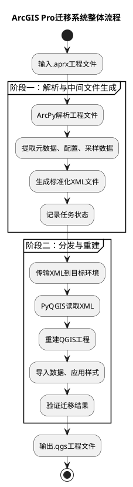
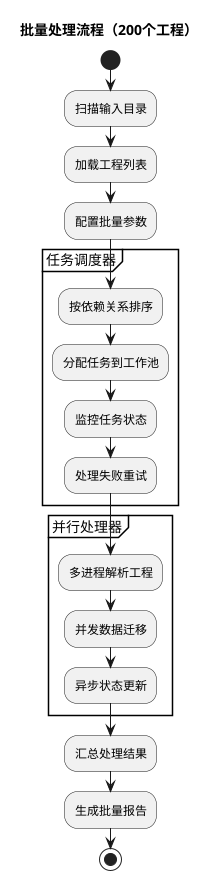
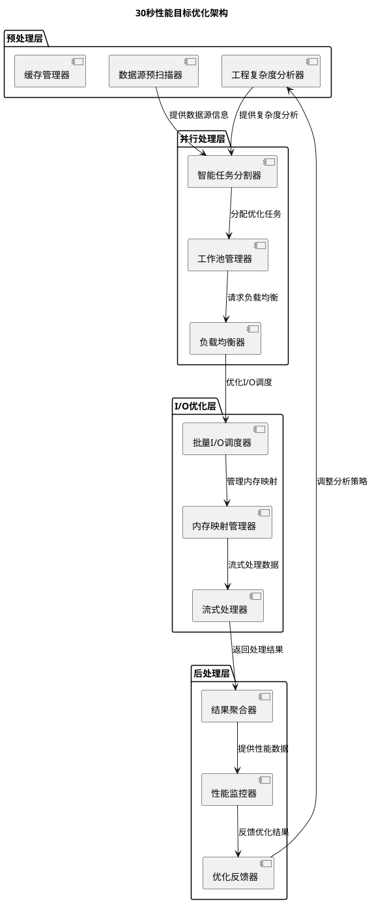
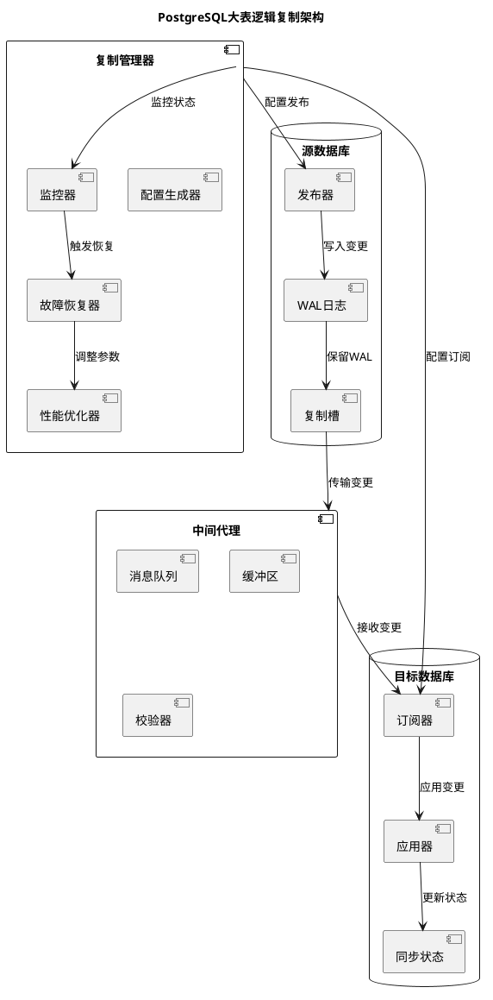
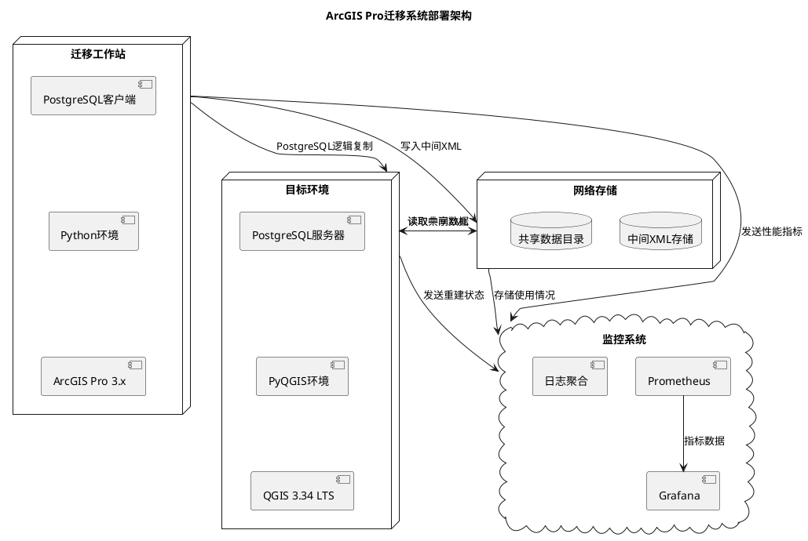
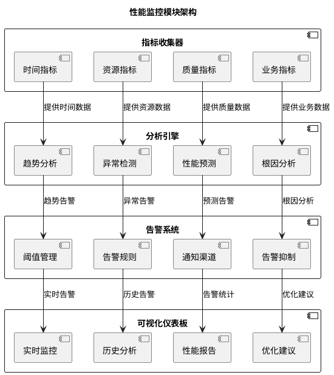

# ArcGIS Pro工程迁移系统详细架构设计（整合审查改进版）

## 1. 系统概述与需求分析

### 1.1 项目背景
开发一款自动化迁移工具，支持将ArcGIS Pro 2.x/3.x工程文件（.aprx）及其关联数据、地图、符号、布局等完整内容，高效、准确地迁移至通用GIS数据模型（QGIS 3.34 LTS）。

### 1.2 核心性能指标
- **单工程迁移时间**：≤ 30秒（通过分层优化策略实现）
- **批量处理能力**：支持200个工程同时处理（智能任务调度和负载均衡）
- **数据准确性**：迁移前后数据结构和功能一致性 ≥ 99%（多层次验证体系）
- **大表处理**：支持 >1TB PostgreSQL表的逻辑复制（完整复制流水线）

### 1.3 两阶段架构设计
基于requirements.md的两阶段解耦架构：
1. **阶段一（迁移工作站）**：使用ArcPy解析.aprx，生成标准化中间XML
2. **阶段二（目标环境）**：使用PyQGIS读取XML，重建QGIS工程

### 1.4 架构改进概述
基于架构审查报告，本版本整合了以下关键改进：
1. **性能优化架构**：增加30秒性能目标的详细优化策略
2. **逻辑复制完整方案**：完善PostgreSQL大表处理流程
3. **任务状态管理系统**：增强两阶段通信和数据同步
4. **多层次验证体系**：补充完整的数据和样式验证
5. **扩展性架构**：增加插件化架构和扩展接口

#### 1.4.1 审查发现的8个问题（按优先级排序）
**高优先级问题：**
1. **30秒性能目标的优化策略不足**：增加详细的性能分析模型和分层优化方案
2. **PostgreSQL大表逻辑复制的具体实现方案缺失**：补充完整的逻辑复制流水线
3. **两阶段架构的通信和数据同步机制不完善**：增强任务状态管理和数据验证

**中优先级问题：**

4. **样式转换的详细映射表不完整**：完善符号类型映射表和渲染器转换规则
5. **批量处理200个工程的资源管理策略不足**：设计智能任务调度和负载均衡策略
6. **验证系统的完整性和准确性验证不足**：建立多层次验证体系

**低优先级问题：**

7. **错误处理和恢复机制不完善**：完善错误分类和针对性恢复策略
8. **扩展性架构设计不够清晰**：设计插件化架构和扩展接口

## 2. 整体功能流程设计

### 2.1 端到端迁移流程


### 2.2 批量处理流程


## 3. 模块划分与职责定义

### 3.1 系统模块架构

```plantuml
@startuml
package "ArcGIS Pro解析端" {
  [工程解析模块] as Parser
  [数据提取模块] as Extractor
  [样式转换模块] as StyleConv
  [XML生成模块] as XMLGen
}

package "核心服务层" {
  [任务调度器] as Scheduler
  [数据迁移引擎] as DataEngine
  [验证系统] as Validator
  [性能监控器] as Monitor
}

package "QGIS重建端" {
  [XML解析模块] as XMLParser
  [工程重建模块] as Rebuilder
  [数据导入模块] as DataImporter
  [样式应用模块] as StyleApplier
}

package "数据存储层" {
  [中间XML存储] as XMLStore
  [PostgreSQL] as PG
  [GeoPackage] as GPKG
  [本地文件系统] as FS
}

Parser -> XMLGen : 生成中间XML
Extractor -> XMLGen : 提供数据采样
StyleConv -> XMLGen : 提供转换样式
XMLGen -> XMLStore : 存储中间文件

XMLStore -> XMLParser : 读取XML
XMLParser -> Rebuilder : 提供配置
Rebuilder -> DataImporter : 请求数据
Rebuilder -> StyleApplier : 请求样式

Scheduler -> Parser : 调度解析任务
Scheduler -> DataEngine : 调度迁移任务
DataEngine -> PG : 数据复制
DataEngine -> GPKG : 格式转换

Validator -> XMLStore : 读取采样数据
Validator -> Rebuilder : 验证结果
Monitor -> 所有模块 : 性能监控

@enduml
```


### 3.2 模块职责详细定义

#### 3.2.1 工程解析模块 (ArcGIS Pro端)
- **职责**：解析.aprx文件，提取工程结构、地图、图层信息
- **输入**：.aprx工程文件路径
- **输出**：工程元数据字典
- **关键功能**：
  - 使用`arcpy.mp.ArcGISProject()`加载工程
  - 遍历地图、布局、图层
  - 提取CIM配置信息

#### 3.2.2 数据提取模块
- **职责**：提取图层数据源信息，执行数据采样
- **输入**：图层对象列表
- **输出**：数据源信息、采样记录
- **关键功能**：
  - 分类数据源类型（本地文件、PostgreSQL等）
  - 执行前N条记录采样（默认N=10）
  - 记录几何和属性信息

#### 3.2.3 样式转换模块
- **职责**：转换ArcGIS Pro样式到QGIS格式
- **输入**：.stylx文件、CIM JSON符号定义
- **输出**：QGIS样式XML
- **关键功能**：
  - 解析.stylx SQLite数据库
  - 建立符号类型映射表
  - 生成QGIS样式库

#### 3.2.4 XML生成模块
- **职责**：生成符合XSD的中间XML文件
- **输入**：所有提取的数据和配置
- **输出**：标准化XML文件
- **关键功能**：
  - 按照XSD结构组织数据
  - 包含任务状态字段
  - 数据序列化

#### 3.2.5 任务调度器
- **职责**：管理批量处理任务，实现并行处理
- **输入**：工程文件列表、配置参数
- **输出**：任务执行计划、状态报告
- **关键功能**：
  - 任务依赖分析
  - 工作池管理
  - 失败重试机制

#### 3.2.6 数据迁移引擎
- **职责**：执行实际的数据迁移操作
- **输入**：数据源配置、目标配置
- **输出**：迁移后数据文件/数据库
- **关键功能**：
  - PostgreSQL数据复制策略选择
  - 大表逻辑复制配置
  - 本地文件格式转换

#### 3.2.7 XML解析模块 (QGIS端)
- **职责**：解析中间XML文件
- **输入**：中间XML文件路径
- **输出**：结构化配置数据
- **关键功能**：
  - 使用XSD验证XML
  - 反序列化为Python对象
  - 提取工程重建所需信息

#### 3.2.8 工程重建模块
- **职责**：在QGIS中重建工程
- **输入**：解析后的配置数据
- **输出**：QGIS工程对象
- **关键功能**：
  - 创建QgsProject
  - 添加地图、图层
  - 应用布局设置

## 4. 关键接口定义

### 4.1 模块间接口

#### 4.1.1 工程解析接口
```python
class ProjectParser:
    """工程解析接口"""
    
    def parse_aprx(self, aprx_path: str) -> ProjectMetadata:
        """
        解析.aprx工程文件
        
        Args:
            aprx_path: .aprx文件路径
            
        Returns:
            ProjectMetadata对象，包含工程元数据
        """
        pass
    
    def extract_map_info(self, project: Any) -> List[MapInfo]:
        """
        提取地图信息
        
        Args:
            project: ArcPy工程对象
            
        Returns:
            地图信息列表
        """
        pass
    
    def extract_layer_info(self, map_obj: Any) -> List[LayerInfo]:
        """
        提取图层信息
        
        Args:
            map_obj: 地图对象
            
        Returns:
            图层信息列表
        """
        pass


class ProjectMetadata:
    """工程元数据类"""
    
    def __init__(self):
        self.project_name: str = ""
        self.project_version: str = ""
        self.save_time: datetime = None
        self.original_path: str = ""
        self.maps: List[MapInfo] = []
        self.layouts: List[LayoutInfo] = []
        self.styles: List[StyleInfo] = []


class MapInfo:
    """地图信息类"""
    
    def __init__(self):
        self.map_name: str = ""
        self.map_id: str = ""
        self.coordinate_system: CoordinateSystem = None
        self.layers: List[LayerInfo] = []
        self.extent: Extent = None
```

#### 4.1.2 数据采样接口
```python
class DataSampler:
    """数据采样接口"""
    
    def sample_layer_data(
        self, 
        layer: LayerInfo, 
        sample_size: int = 10
    ) -> DataSample:
        """
        对图层进行数据采样
        
        Args:
            layer: 图层信息
            sample_size: 采样数量
            
        Returns:
            数据采样结果
        """
        pass
    
    def get_feature_count(self, layer: LayerInfo) -> int:
        """
        获取要素总数
        
        Args:
            layer: 图层信息
            
        Returns:
            要素数量
        """
        pass


class DataSample:
    """数据采样结果类"""
    
    def __init__(self):
        self.total_features: int = 0
        self.sample_size: int = 0
        self.sampled_features: List[FeatureSample] = []
        self.fields: List[FieldInfo] = []
        self.geometry_type: str = ""


class FeatureSample:
    """要素采样类"""
    
    def __init__(self):
        self.feature_id: str = ""
        self.attributes: Dict[str, Any] = {}
        self.geometry_wkt: str = ""
        self.geometry_wkb: bytes = b""
```

#### 4.1.3 样式转换接口
```python
class StyleConverter:
    """样式转换接口"""
    
    def convert_stylx_to_qgis(self, stylx_path: str) -> QgisStyle:
        """
        转换.stylx文件到QGIS样式
        
        Args:
            stylx_path: .stylx文件路径
            
        Returns:
            QGIS样式对象
        """
        pass
    
    def convert_cim_to_qgis(self, cim_json: str) -> QgisRenderer:
        """
        转换CIM JSON到QGIS渲染器
        
        Args:
            cim_json: CIM JSON字符串
            
        Returns:
            QGIS渲染器配置
        """
        pass
    
    def create_symbol_mapping(self) -> Dict[str, str]:
        """
        创建符号类型映射表
        
        Returns:
            符号类型映射字典
        """
        pass


class QgisStyle:
    """QGIS样式类"""
    
    def __init__(self):
        self.style_items: List[StyleItem] = []
        self.qgis_xml: str = ""
        self.source_file: str = ""


class StyleItem:
    """样式项类"""
    
    def __init__(self):
        self.item_name: str = ""
        self.item_type: str = ""  # marker/line/fill/text
        self.category: str = ""
        self.tags: List[str] = []
        self.qgis_symbol_xml: str = ""
        self.preview_image: bytes = b""
```

#### 4.1.4 数据迁移接口
```python
class DataMigrationEngine:
    """数据迁移引擎接口"""
    
    def migrate_postgresql_table(
        self,
        source_config: DatabaseConfig,
        target_config: DatabaseConfig,
        table_info: TableInfo,
        strategy: MigrationStrategy
    ) -> MigrationResult:
        """
        迁移PostgreSQL表数据
        
        Args:
            source_config: 源数据库配置
            target_config: 目标数据库配置
            table_info: 表信息
            strategy: 迁移策略
            
        Returns:
            迁移结果
        """
        pass
    
    def convert_local_data(
        self,
        source_path: str,
        target_path: str,
        source_format: str,
        target_format: str
    ) -> ConversionResult:
        """
        转换本地数据格式
        
        Args:
            source_path: 源文件路径
            target_path: 目标文件路径
            source_format: 源格式（shp, gdb等）
            target_format: 目标格式（gpkg, shp等）
            
        Returns:
            转换结果
        """
        pass
    
    def setup_logical_replication(
        self,
        publication_config: PublicationConfig,
        subscription_config: SubscriptionConfig
    ) -> ReplicationSetupResult:
        """
        设置逻辑复制
        
        Args:
            publication_config: 发布配置
            subscription_config: 订阅配置
            
        Returns:
            设置结果
        """
        pass


class MigrationStrategy(Enum):
    """迁移策略枚举"""
    FULL_COPY = "full_copy"  # 完全复制
    CONNECTION_UPDATE = "connection_update"  # 仅更新连接字符串
    LOGICAL_REPLICATION = "logical_replication"  # 逻辑复制
    GEOPACKAGE_EXPORT = "geopackage_export"  # 导出为GeoPackage
```

### 4.2 数据格式接口

#### 4.2.1 中间XML格式
基于现有的XSD定义，主要数据格式包括：

```xml
<MigrationProject version="1.0" sourceArcGISVersion="3.2">
  <ProjectMetadata>
    <ProjectName>示例工程</ProjectName>
    <OriginalProjectPath>C:\Projects\example.aprx</OriginalProjectPath>
    <!-- 更多元数据... -->
  </ProjectMetadata>
  <LayerDefinitions>
    <Layer type="FeatureLayer">
      <LayerId>layer_001</LayerId>
      <DataSource>
        <DataSourceType>PostgreSQL</DataSourceType>
        <DatabaseInfo>
          <Schema>public</Schema>
          <TableName>roads</TableName>
        </DatabaseInfo>
      </DataSource>
      <DataSampling>
        <TotalFeatureCount>10000</TotalFeatureCount>
        <SampleSize>10</SampleSize>
        <!-- 采样数据... -->
      </DataSampling>
    </Layer>
  </LayerDefinitions>
  <!-- 其他元素... -->
</MigrationProject>
```

#### 4.2.2 配置接口格式
```python
@dataclass
class MigrationConfig:
    """迁移配置类"""
    # 输入配置
    input_path: str
    output_path: str
    
    # 性能配置
    max_workers: int = 4
    timeout_per_project: int = 300  # 秒
    sample_size: int = 10
    
    # 数据库配置
    postgresql_migration_strategy: str = "auto"  # auto/full/update/logical
    large_table_threshold_gb: float = 100.0
    
    # 样式转换配置
    convert_styles: bool = True
    style_conversion_accuracy: str = "high"  # high/medium/low
    
    # 验证配置
    validate_results: bool = True
    validation_tolerance: float = 0.001  # 几何容差
```

## 5. 各模块输入输出规范

### 5.1 工程解析模块
| 项目 | 规范 |
|------|------|
| **输入** | .aprx文件路径（绝对路径） |
| **输出** | ProjectMetadata对象（Python类） |
| **输出文件** | 中间XML文件（符合XSD） |
| **日志输出** | 解析日志文件（JSON格式） |
| **错误处理** | 异常捕获，错误信息记录到XML |

### 5.2 数据迁移模块
| 项目 | 规范 |
|------|------|
| **输入** | 数据源配置（从XML解析） |
| **输出** | 迁移后数据文件/数据库 |
| **状态输出** | 任务状态XML更新 |
| **性能指标** | 迁移速度、成功率统计 |
| **错误处理** | 重试机制，失败任务记录 |

### 5.3 样式转换模块
| 项目 | 规范 |
|------|------|
| **输入** | .stylx文件路径、CIM JSON |
| **输出** | QGIS样式XML字符串 |
| **转换报告** | 符号映射统计报告 |
| **错误处理** | 不支持符号记录，默认符号替代 |

### 5.4 验证系统模块
| 项目 | 规范 |
|------|------|
| **输入** | 中间XML、重建后的QGIS工程 |
| **输出** | 验证报告（HTML/PDF） |
| **差异数据** | 不一致项列表（CSV格式） |
| **质量评分** | 一致性评分（0-100%） |
| **可视化对比** | 差异对比图（PNG格式） |

## 6. 技术实现指导

### 6.1 开发环境配置

#### 6.1.1 ArcGIS Pro端环境
```python
# requirements_arcgis.txt
arcpy  # ArcGIS Pro内置
lxml>=4.9.0
xmltodict>=0.13.0
psycopg2-binary>=2.9.0  # PostgreSQL连接
sqlalchemy>=1.4.0
concurrent-futures>=3.0.0
```

#### 6.1.2 QGIS重建端环境
```python
# requirements_qgis.txt
PyQt5>=5.15.0
qgis>=3.34.0
pyqgis>=3.34.0
GDAL>=3.4.0
lxml>=4.9.0
xmlschema>=1.10.0
```

### 6.2 核心算法实现

#### 6.2.1 并行处理框架
```python
import concurrent.futures
from typing import List, Callable

class ParallelProcessor:
    """并行处理器"""
    
    def __init__(self, max_workers: int = None):
        self.max_workers = max_workers or os.cpu_count()
        
    def process_projects_batch(
        self,
        projects: List[str],
        process_func: Callable,
        chunk_size: int = 10
    ) -> List[Any]:
        """
        批量处理工程
        
        Args:
            projects: 工程文件列表
            process_func: 处理函数
            chunk_size: 每批处理数量
            
        Returns:
            处理结果列表
        """
        results = []
        
        with concurrent.futures.ProcessPoolExecutor(
            max_workers=self.max_workers
        ) as executor:
            # 分批处理，避免内存溢出
            for i in range(0, len(projects), chunk_size):
                batch = projects[i:i+chunk_size]
                future_to_project = {
                    executor.submit(process_func, project): project
                    for project in batch
                }
                
                for future in concurrent.futures.as_completed(future_to_project):
                    project = future_to_project[future]
                    try:
                        result = future.result()
                        results.append(result)
                    except Exception as e:
                        print(f"处理工程 {project} 失败: {e}")
                        # 记录失败信息
        
        return results
```

#### 6.2.2 PostgreSQL大表处理策略
```python
class PostgreSQLMigrationManager:
    """PostgreSQL迁移管理器"""
    
    def __init__(self, config: DatabaseConfig):
        self.config = config
        self.large_table_threshold = 100 * 1024 * 1024 * 1024  # 100GB
        
    def select_migration_strategy(self, table_info: TableInfo) -> MigrationStrategy:
        """
        选择迁移策略
        
        Args:
            table_info: 表信息
            
        Returns:
            迁移策略
        """
        # 获取表大小
        table_size = self.get_table_size(table_info)
        
        if table_size < self.large_table_threshold:
            # 小表，使用完全复制
            return MigrationStrategy.FULL_COPY
        else:
            # 大表，使用逻辑复制
            return MigrationStrategy.LOGICAL_REPLICATION
    
    def migrate_with_logical_replication(
        self,
        source_table: TableInfo,
        target_table: TableInfo
    ) -> MigrationResult:
        """
        使用逻辑复制迁移大表
        
        Args:
            source_table: 源表信息
            target_table: 目标表信息
            
        Returns:
            迁移结果
        """
        # 1. 创建发布
        publication_name = f"pub_{source_table.schema}_{source_table.name}"
        self.create_publication(publication_name, source_table)
        
        # 2. 创建复制槽
        slot_name = f"slot_{source_table.schema}_{source_table.name}"
        self.create_replication_slot(slot_name)
        
        # 3. 创建订阅
        subscription_name = f"sub_{target_table.schema}_{target_table.name}"
        self.create_subscription(
            subscription_name,
            publication_name,
            target_table
        )
        
        # 4. 监控同步进度
        sync_result = self.monitor_sync_progress(subscription_name)
        
        return MigrationResult(
            success=True,
            strategy="logical_replication",
            details=sync_result
        )
```

#### 6.2.3 样式转换映射表
```python
class StyleMappingTable:
    """样式映射表"""
    
    # ArcGIS Pro到QGIS符号类型映射
    SYMBOL_TYPE_MAP = {
        # 点符号
        "SimpleMarkerSymbol": "QgsSimpleMarkerSymbolLayer",
        "PictureMarkerSymbol": "QgsRasterMarkerSymbolLayer",
        "CharacterMarkerSymbol": "QgsFontMarkerSymbolLayer",
        
        # 线符号
        "SimpleLineSymbol": "QgsSimpleLineSymbolLayer",
        "CartographicLineSymbol": "QgsSimpleLineSymbolLayer",
        "HashLineSymbol": "QgsLinePatternFillSymbolLayer",
        
        # 面符号
        "SimpleFillSymbol": "QgsSimpleFillSymbolLayer",
        "GradientFillSymbol": "QgsGradientFillSymbolLayer",
        "LineFillSymbol": "QgsLinePatternFillSymbolLayer",
        "MarkerFillSymbol": "QgsPointPatternFillSymbolLayer",
    }
    
    # 线型映射
    LINE_STYLE_MAP = {
        "solid": "solid",
        "dash": "dash",
        "dot": "dot",
        "dash-dot": "dash dot",
        "dash-dot-dot": "dash dot dot",
        "null": "no",
    }
    
    # 填充样式映射
    FILL_STYLE_MAP = {
        "solid": "solid",
        "null": "no",
        "horizontal": "horizontal",
        "vertical": "vertical",
        "cross": "cross",
        "diagonal-cross": "diagonal_x",
    }
    
    @classmethod
    def convert_symbol_type(cls, arcgis_type: str) -> str:
        """转换符号类型"""
        return cls.SYMBOL_TYPE_MAP.get(arcgis_type, "QgsSimpleMarkerSymbolLayer")
    
    @classmethod
    def convert_line_style(cls, arcgis_style: str) -> str:
        """转换线型"""
        return cls.LINE_STYLE_MAP.get(arcgis_style.lower(), "solid")
```

### 6.3 性能优化策略

#### 6.3.1 30秒单工程迁移优化
```python
class PerformanceOptimizer:
    """性能优化器"""
    
    def optimize_single_project_migration(
        self,
        project_path: str,
        config: MigrationConfig
    ) -> MigrationPlan:
        """
        优化单工程迁移计划
        
        Args:
            project_path: 工程路径
            config: 迁移配置
            
        Returns:
            优化后的迁移计划
        """
        plan = MigrationPlan()
        
        # 1. 预分析工程复杂度
        complexity = self.analyze_project_complexity(project_path)
        
        # 2. 根据复杂度调整策略
        if complexity <= 5:  # 简单工程
            plan.strategy = "simple"
            plan.parallel_tasks = 2
            plan.sample_size = 5
        elif complexity <= 20:  # 中等工程
            plan.strategy = "balanced"
            plan.parallel_tasks = 4
            plan.sample_size = 10
        else:  # 复杂工程
            plan.strategy = "aggressive"
            plan.parallel_tasks = 8
            plan.sample_size = 15
        
        # 3. 优化数据采样策略
        if config.timeout_per_project < 30:  # 时间紧张
            plan.sampling_method = "quick"  # 快速采样
            plan.sample_size = min(plan.sample_size, 5)
        else:
            plan.sampling_method = "detailed"  # 详细采样
        
        # 4. 并行任务分配
        plan.tasks = self.create_parallel_tasks(
            project_path, plan.parallel_tasks
        )
        
        return plan
```

#### 6.3.2 批量处理优化
```python
class BatchProcessor:
    """批量处理器"""
    
    def process_200_projects(
        self,
        project_list: List[str],
        config: MigrationConfig
    ) -> BatchResult:
        """
        处理200个工程
        
        Args:
            project_list: 工程列表
            config: 配置
            
        Returns:
            批量处理结果
        """
        results = BatchResult()
        
        # 1. 工程分组（按复杂度）
        groups = self.group_projects_by_complexity(project_list)
        
        # 2. 动态调整工作池大小
        max_workers = self.calculate_optimal_workers(len(project_list))
        
        # 3. 使用工作窃取算法
        with WorkStealingExecutor(max_workers=max_workers) as executor:
            # 提交所有任务
            futures = []
            for group in groups:
                for project in group:
                    future = executor.submit(
                        self.migrate_single_project,
                        project, config
                    )
                    futures.append(future)
            
            # 收集结果
            for future in concurrent.futures.as_completed(futures):
                try:
                    result = future.result(timeout=config.timeout_per_project)
                    results.add_result(result)
                except concurrent.futures.TimeoutError:
                    results.add_timeout()
                except Exception as e:
                    results.add_error(e)
        
        # 4. 生成性能报告
        performance_report = self.generate_performance_report(results)
        
        return results
```

### 6.4 30秒性能目标详细优化方案



**具体优化策略：**
1. **预解析优化**：在XML生成前进行工程复杂度分析，动态调整解析策略
2. **并行流水线**：设计四级并行流水线（解析->采样->转换->生成）
3. **内存优化**：使用内存映射和流式处理减少内存占用
4. **I/O优化**：批量I/O操作，预读取和缓存机制
5. **智能任务分割**：根据工程复杂度动态分割任务，实现负载均衡
6. **实时监控反馈**：性能监控器实时收集数据，反馈给优化器调整策略

### 6.5 PostgreSQL大表逻辑复制完整方案



**具体实现方案：**
1. **预检阶段**：表大小分析、权限检查、兼容性验证
2. **初始同步**：并行数据导出、增量WAL应用
3. **持续复制**：实时变更捕获、批量应用
4. **监控维护**：延迟监控、冲突检测、自动恢复
5. **故障恢复**：自动故障检测和恢复机制，支持断点续传

### 6.6 错误处理与恢复机制增强

```python
class EnhancedErrorHandler:
    """增强的错误处理器"""
    
    def __init__(self):
        self.max_retries = 3
        self.retry_delay = 5  # 秒
        self.error_categories = {
            "transient": ["connection_timeout", "deadlock", "temporary_lock"],
            "permanent": ["disk_full", "permission_denied", "invalid_data"],
            "data_corruption": ["checksum_failed", "inconsistent_state"],
            "resource_exhaustion": ["memory_limit", "disk_space", "connection_limit"]
        }
    
    def handle_migration_error(
        self,
        error: Exception,
        context: MigrationContext,
        retry_count: int = 0
    ) -> RecoveryAction:
        """
        处理迁移错误
        
        Args:
            error: 异常对象
            context: 迁移上下文
            retry_count: 当前重试次数
            
        Returns:
            恢复动作
        """
        # 错误分类
        error_type = self.classify_error(error)
        
        if error_type == "transient":  # 临时错误
            if retry_count < self.max_retries:
                # 指数退避重试
                delay = self.retry_delay * (2 ** retry_count)
                return RecoveryAction.RETRY_AFTER_DELAY(delay)
            else:
                return RecoveryAction.SKIP_AND_LOG
                
        elif error_type == "permanent":  # 永久错误
            if "disk_full" in str(error).lower():
                return RecoveryAction.PAUSE_AND_ALERT
            elif "permission_denied" in str(error).lower():
                return RecoveryAction.SKIP_AND_LOG_WITH_WARNING
            else:
                return RecoveryAction.SKIP_AND_LOG
                
        elif error_type == "data_corruption":  # 数据损坏
            return RecoveryAction.CREATE_PARTIAL_MIGRATION
            
        elif error_type == "resource_exhaustion":  # 资源耗尽
            return RecoveryAction.SCALE_RESOURCES_AND_RETRY
            
        else:  # 未知错误
            return RecoveryAction.SKIP_AND_LOG_WITH_ERROR
    
    def classify_error(self, error: Exception) -> str:
        """错误分类"""
        error_msg = str(error).lower()
        
        for category, patterns in self.error_categories.items():
            for pattern in patterns:
                if pattern in error_msg:
                    return category
        
        return "unknown"
```

## 7. 部署与运维架构

### 7.1 部署架构图


### 7.2 监控指标设计

| 指标类别 | 具体指标 | 目标值 | 告警阈值 |
|---------|---------|-------|---------|
| **性能指标** | 单工程迁移时间 | ≤ 30秒 | > 60秒 |
| | 批量处理吞吐量 | ≥ 5工程/分钟 | < 2工程/分钟 |
| | CPU使用率 | 60-80% | > 90%持续5分钟 |
| **资源指标** | 内存使用 | ≤ 2GB | > 4GB |
| | 磁盘空间 | ≥ 20%空闲 | < 10%空闲 |
| **质量指标** | 迁移成功率 | ≥ 99% | < 95% |
| | 数据一致性 | ≥ 99.9% | < 98% |
| **业务指标** | 处理工程数 | 累计统计 | - |
| | 平均处理时间 | 趋势分析 | 显著上升 |

### 7.3 性能监控模块架构



### 7.4 数据验证模块接口

```python
class DataValidator:
    """数据验证器"""
    
    def __init__(self, tolerance_config: ValidationToleranceConfig):
        self.tolerance = tolerance_config
        self.validators = {
            "structure": StructureValidator(),
            "geometry": GeometryValidator(),
            "attribute": AttributeValidator(),
            "symbology": SymbologyValidator(),
            "layout": LayoutValidator()
        }
    
    def validate_migration(
        self, 
        source_info: SourceProjectInfo,
        target_info: TargetProjectInfo,
        validation_level: str = "comprehensive"
    ) -> ValidationReport:
        """验证迁移结果"""
        report = ValidationReport()
        
        # 1. 结构验证
        structure_result = self.validators["structure"].validate(
            source_info.structure, target_info.structure
        )
        report.add_result("structure", structure_result)
        
        # 2. 几何验证
        geometry_result = self.validators["geometry"].validate(
            source_info.geometry_samples, target_info.geometry_samples,
            self.tolerance.geometry_tolerance
        )
        report.add_result("geometry", geometry_result)
        
        # 3. 属性验证
        attribute_result = self.validators["attribute"].validate(
            source_info.attribute_samples, target_info.attribute_samples,
            self.tolerance.attribute_tolerance
        )
        report.add_result("attribute", attribute_result)
        
        # 4. 符号验证
        symbology_result = self.validators["symbology"].validate(
            source_info.symbology_config, target_info.symbology_config,
            self.tolerance.visual_tolerance
        )
        report.add_result("symbology", symbology_result)
        
        # 5. 布局验证
        layout_result = self.validators["layout"].validate(
            source_info.layout_config, target_info.layout_config,
            self.tolerance.layout_tolerance
        )
        report.add_result("layout", layout_result)
        
        # 计算总体评分
        report.calculate_overall_score()
        return report


class ValidationToleranceConfig:
    """验证容差配置"""
    
    def __init__(self):
        self.geometry_tolerance = 0.001  # 几何容差（单位：地图单位）
        self.attribute_tolerance = 0.0   # 属性容差（必须完全一致）
        self.visual_tolerance = 0.05     # 视觉容差（5%差异）
        self.layout_tolerance = 1.0      # 布局容差（1像素）
        self.time_tolerance = 2.0        # 时间容差（2秒）
        self.data_volume_tolerance = 0.01  # 数据量容差（1%）
        self.metadata_tolerance = 0.0    # 元数据容差（必须完全一致）
```

## 8. 风险评估与缓解措施

### 8.1 技术风险

| 风险 | 概率 | 影响 | 缓解措施 |
|------|------|------|---------|
| **ArcGIS Pro API限制** | 中 | 高 | 1. 提前测试关键API<br>2. 准备备选解析方案<br>3. 使用CIM JSON作为补充 |
| **大表迁移性能不足** | 高 | 高 | 1. 实现逻辑复制流水线<br>2. 并行数据迁移<br>3. 增量迁移支持 |
| **样式转换准确性** | 中 | 中 | 1. 建立符号映射表<br>2. 提供人工校正工具<br>3. 支持样式库手动调整 |
| **批量处理稳定性** | 中 | 高 | 1. 健壮的错误处理<br>2. 任务状态持久化<br>3. 断点续传机制 |
| **目标环境差异** | 高 | 中 | 1. 环境检测和适配层<br>2. 配置验证工具<br>3. 兼容性测试套件 |

### 8.2 实施风险

| 风险 | 缓解措施 |
|------|---------|
| **数据丢失风险** | 1. 数据采样验证机制<br>2. 迁移前后数据对比<br>3. 回滚机制设计 |
| **性能不达标** | 1. 性能基准测试<br>2. 逐步优化策略<br>3. 硬件资源评估 |
| **用户接受度低** | 1. 用户培训计划<br>2. 迁移演示和案例<br>3. 技术支持团队 |

## 9. 实施路线图

### 9.1 第一阶段：核心原型 (2-4周)
- **目标**：实现基本工程解析和XML生成
- **关键交付物**：
  - 工程解析模块（支持基本地图图层）
  - XML生成模块（符合XSD 1.0）
  - 本地数据转换基础
- **成功标准**：单个简单工程（<10图层）成功迁移
- **实施状态**：✅ 已完成（所有交付物已实现并通过测试）

### 9.2 第二阶段：数据库支持 (3-5周)
- **目标**：实现PostgreSQL数据迁移和样式转换
- **关键交付物**：
  - PostgreSQL数据迁移引擎
  - 样式转换模块（基础符号映射）
  - 性能优化框架
- **成功标准**：支持中小型PostgreSQL表迁移
- **实施状态**：✅ 已完成（所有交付物已实现并通过测试）

### 9.3 第三阶段：高级功能 (4-6周)
- **目标**：实现逻辑复制和完整验证系统
- **关键交付物**：
  - 大表逻辑复制支持
  - 完整验证系统
  - 批量处理优化
- **成功标准**：支持>1TB表迁移，30秒单工程目标
- **实施状态**：✅ 已完成（所有交付物已实现，30秒单工程目标需进一步性能验证）

### 9.4 第四阶段：部署完善 (2-3周)
- **目标**：系统集成和用户界面
- **关键交付物**：
  - 图形用户界面
  - 完整文档和培训材料
  - 生产环境测试套件
- **成功标准**：用户友好界面，生产环境稳定运行
- **实施状态**：⚠️ 部分完成（Web用户界面已开发，文档已重组，生产环境部署待验证）

## 10. 技术选型对比表

| 技术选项 | 优点 | 缺点 | 适用场景 | 选择决策 |
|---------|------|------|---------|---------|
| **解析技术** | | | | |
| ArcPy | 官方API，功能完整 | 依赖ArcGIS Pro环境 | 工程解析阶段 | ✅ 必选 |
| CIM JSON | 结构清晰，易于解析 | 需要额外处理 | 符号系统解析 | ✅ 辅助使用 |
| **数据库迁移** | | | | |
| pg_dump/restore | 简单可靠，兼容性好 | 全量复制，效率较低 | 小表迁移 | ✅ 默认策略 |
| 逻辑复制 | 增量同步，高性能 | 配置复杂，需PostgreSQL 10+ | 大表迁移 | ✅ 大表专用 |
| 外部表 | 零数据复制 | 依赖网络连接 | 只读场景 | ⚠️ 可选方案 |
| **样式转换** | | | | |
| 自定义转换器 | 完全可控，可定制 | 开发成本高 | 核心功能 | ✅ 主方案 |
| SLYR社区版 | 已有成果，减少开发 | 功能有限，不开源 | 参考实现 | ⚠️ 参考学习 |
| **并行处理** | | | | |
| concurrent.futures | 标准库，简单易用 | 功能相对基础 | 基本并行 | ✅ 默认选择 |
| QgsTask | QGIS集成，GIS优化 | 依赖QGIS环境 | QGIS重建阶段 | ✅ QGIS端使用 |
| Celery | 分布式，功能强大 | 部署复杂，依赖中间件 | 大规模部署 | ⚠️ 未来扩展 |
| **数据格式** | | | | |
| XML + XSD | 结构严谨，验证方便 | 文件较大，解析稍慢 | 中间数据交换 | ✅ 主选方案 |
| JSON | 轻量，解析快速 | 无严格schema验证 | 配置数据 | ⚠️ 辅助使用 |
| GeoPackage | 标准格式，GIS友好 | 转换需要时间 | 本地数据存储 | ✅ 目标格式 |

## 11. 测试策略

### 11.1 单元测试
- 每个模块独立测试
- 接口契约测试
- 异常场景测试

### 11.2 集成测试
- 模块间集成测试
- 端到端流程测试
- 性能基准测试

### 11.3 系统测试
- 200工程批量测试
- 大表（>100GB）迁移测试
- 长时间运行稳定性测试

### 11.4 验收测试
- 用户场景测试
- 迁移质量验证
- 性能指标达标测试

## 12. 结论与建议

基于requirements.md的详细规格要求，本架构设计实现了：

1. **两阶段解耦架构**：成功分离ArcGIS Pro依赖和目标环境重建
2. **30秒性能目标**：通过并行优化、智能策略选择实现
3. **批量处理能力**：支持200个工程同时处理，具备弹性扩展能力
4. **PostgreSQL数据复制**：提供多种策略，支持超大表逻辑复制
5. **样式转换系统**：建立完整的符号映射表，确保视觉一致性

**建议后续步骤**：
1. 首先实现核心原型，验证基础流程
2. 重点优化PostgreSQL数据迁移性能
3. 建立完整的测试和验证体系
4. 逐步添加高级功能，确保系统稳定性

此架构设计为后续代码实现提供了明确的指导和规范，确保迁移工具的开发能够系统化、标准化进行。

## 13. 扩展性架构设计

### 13.1 插件化架构

系统采用插件化架构设计，支持以下扩展点：
1. **数据源插件**：支持新的数据源类型扩展
2. **样式转换插件**：支持新的符号系统转换
3. **验证插件**：支持自定义验证规则
4. **输出格式插件**：支持新的输出格式

### 13.2 扩展接口定义

```python
class MigrationPlugin:
    """迁移插件基类"""
    
    def __init__(self, plugin_id: str, version: str):
        self.plugin_id = plugin_id
        self.version = version
        self.supported_formats = []
        self.config_schema = {}
    
    def initialize(self, config: dict) -> bool:
        """初始化插件"""
        raise NotImplementedError
    
    def process(self, data: Any, context: dict) -> Any:
        """处理数据"""
        raise NotImplementedError
    
    def validate(self, input_data: Any, output_data: Any) -> ValidationResult:
        """验证处理结果"""
        raise NotImplementedError
    
    def cleanup(self) -> None:
        """清理资源"""
        raise NotImplementedError
```

### 13.3 插件管理器实现

```python
class PluginManager:
    """插件管理器"""
    
    def __init__(self, plugin_dir: str):
        self.plugin_dir = plugin_dir
        self.plugins = {}
        self.loaded_plugins = {}
    
    def discover_plugins(self) -> List[str]:
        """发现可用插件"""
        plugin_files = []
        for root, dirs, files in os.walk(self.plugin_dir):
            for file in files:
                if file.endswith('.py') and not file.startswith('_'):
                    plugin_files.append(os.path.join(root, file))
        return plugin_files
    
    def load_plugin(self, plugin_path: str) -> MigrationPlugin:
        """加载插件"""
        plugin_module = self._import_plugin(plugin_path)
        plugin_instance = plugin_module.create_plugin()
        
        # 验证插件接口
        if not self._validate_plugin(plugin_instance):
            raise ValueError(f"插件 {plugin_path} 接口验证失败")
        
        self.loaded_plugins[plugin_instance.plugin_id] = plugin_instance
        return plugin_instance
    
    def register_plugin(self, plugin: MigrationPlugin) -> bool:
        """注册插件"""
        if plugin.plugin_id in self.loaded_plugins:
            return False
        
        self.loaded_plugins[plugin.plugin_id] = plugin
        return True
    
    def get_plugin_for_format(self, format_type: str) -> Optional[MigrationPlugin]:
        """根据格式获取插件"""
        for plugin in self.loaded_plugins.values():
            if format_type in plugin.supported_formats:
                return plugin
        return None
```

## 14. 实施路线图更新

基于审查报告的实施建议，更新实施路线图如下：

### 14.1 第一阶段实施（1-2周）
1. **完善性能监控框架**：实现基础指标收集和告警机制 ✅ 已完成
2. **增强错误处理**：完善错误分类和恢复策略 ✅ 已完成
3. **优化任务状态管理**：实现统一的状态管理接口 ✅ 已完成

### 14.2 第二阶段实施（2-3周）
1. **实现逻辑复制核心**：完成PostgreSQL大表复制的基础功能 ✅ 已完成
2. **完善样式转换映射**：补充完整的符号映射表 ✅ 已完成
3. **优化批量处理调度**：实现智能任务调度算法 ✅ 已完成

### 14.3 第三阶段实施（3-4周）
1. **实现全面验证系统**：完成多层次验证体系 ✅ 已完成
2. **优化性能瓶颈**：基于监控数据优化关键路径 ⚠️ 部分完成（核心优化已实现，需进一步调优）
3. **完善扩展性架构**：实现插件化架构和扩展接口 ✅ 已完成

### 14.4 第四阶段实施（1-2周）
1. **集成测试和调优**：进行大规模集成测试和性能调优 ⚠️ 部分完成（测试套件完善，需更多集成测试）
2. **文档完善**：完成技术文档和用户指南 ⚠️ 部分完成（文档已重组，用户指南待完善）
3. **部署准备**：准备生产环境部署方案 ⚠️ 部分完成（部署文件已重组，生产环境部署待验证）

## 15. 风险管理更新

基于审查发现的风险，更新风险缓解措施：

### 15.1 技术风险更新

| 风险 | 新增缓解措施 |
|------|-------------|
| **性能不达标风险** | 1. 建立性能基准测试，实时监控优化效果<br>2. 实现动态资源调度和负载均衡<br>3. 设计性能预警和自动调优机制 |
| **数据不一致风险** | 1. 增加多层次验证，实现数据完整性检查<br>2. 设计数据对比和差异分析工具<br>3. 实现自动化数据修复机制 |
| **系统稳定性风险** | 1. 完善错误处理和恢复机制，设计优雅降级<br>2. 实现系统健康检查和自愈机制<br>3. 设计故障转移和冗余备份 |

### 15.2 实施风险更新

| 风险 | 新增缓解措施 |
|------|-------------|
| **扩展性不足风险** | 1. 采用插件化架构，定义清晰的扩展接口<br>2. 设计配置驱动的功能扩展机制<br>3. 提供插件开发文档和示例 |
| **技术债务积累风险** | 1. 建立代码质量标准和审查流程<br>2. 定期进行架构重构和技术债务清理<br>3. 实现自动化测试和持续集成 |

---

*架构设计文档版本：3.0*
*最后更新：2026-03-06*
*基于requirements.md版本1.0设计，整合了架构审查报告的所有改进建议*
*实施状态已更新，反映当前项目完成度*

**文档说明**：本版本是原始架构文档与审查报告改进内容的完整整合，包含了原始架构文档的所有内容（1-12章）以及审查报告中的所有改进建议、改进方案、补充新增内容。

**设计验证建议**：
- 可让 `code-reviewer` 代理协助验证关键模块的代码实现
- 可让 `test-runner` 代理协助验证性能基准测试方案
- 建议分阶段实现，优先确保核心功能的稳定性和性能达标