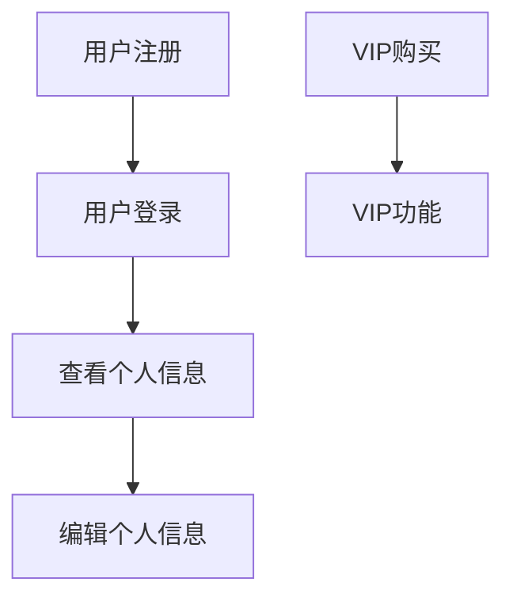
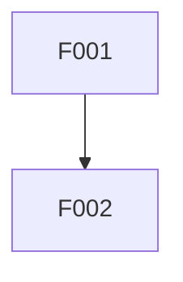

# Demand Analyzer

需求分析Skill，从原始需求文档中提取、验证、分类需求，生成结构化的需求规格说明书。

---

## 一、Skill概述

### 1.1 功能定位

本Skill用于将原始需求文档转换为结构化的需求规格说明书，确保：

1. **需求提取**：从对话记录、描述文本中提取明确需求
2. **需求验证**：使用SMART/INVEST原则验证需求质量
3. **需求分类**：区分功能需求与非功能需求
4. **优先级排序**：使用MoSCoW方法确定需求优先级
5. **冲突检测**：识别需求之间的冲突和依赖关系
6. **追溯建立**：建立需求来源追溯关系

### 1.2 Quick Start (5分钟)

**基本用法:**
```
> 分析需求文档 yangzt_demand.md
```

**验证需求完整性:**
```
> 验证需求文档是否完整
```

**生成需求规格说明书:**
```
> 从需求文档生成需求规格说明书
```

**That's it!** 系统会：
1. 解析原始需求文档结构
2. 提取功能需求和非功能需求
3. 验证需求完整性（SMART原则）
4. 检测需求冲突和依赖
5. 生成结构化需求规格说明书

**快速输出示例:**
```markdown
# [项目名称] 需求规格说明书

## 1. 文档信息
- 版本: v1.0
- 日期: 2026-04-03
- 来源: yangzt_demand.md

## 2. 功能需求

### 2.1 Must Have（必须实现）
| ID | 需求描述 | 验收标准 | 优先级 |
|----|----------|----------|--------|
| F001 | 用户登录功能 | 用户名密码验证成功返回token | P0 |
| F002 | 用户注册功能 | 填写信息后成功创建账户 | P0 |

### 2.2 Should Have（应该实现）
...

## 3. 非功能需求
| ID | 类型 | 需求描述 | 验收标准 |
|----|------|----------|----------|
| NF001 | 性能 | 登录响应时间<200ms | 压力测试验证 |

## 4. 需求依赖关系
- F001（登录）→ F002（注册）：前置依赖

## 5. 需求冲突
无冲突

## 6. 风险清单
- R1: 第三方登录接口可能不稳定，建议实现本地降级
```

### 1.3 性能预期

| 需求文档规模 | 提取需求数 | 处理时间 | 输出大小 |
|--------------|------------|----------|----------|
| 小型 (<10条) | 5-10 | 10-30秒 | ~3KB |
| 中型 (10-30条) | 10-30 | 30-60秒 | ~8KB |
| 大型 (30-50条) | 30-50 | 1-2分钟 | ~15KB |
| 超大型 (>50条) | 50+ | 2-5分钟 | ~25KB |

**性能影响因素:**
- 需求描述复杂度: 模糊描述需要更多分析时间
- 冲突检测范围: 需求数量多会增加冲突检测时间
- 验证规则数量: 验证规则多会增加处理时间

**优化建议:**
- 先进行快速提取，再详细验证
- 对于大型需求集，可分批处理
- 优先处理P0级需求

### 1.4 触发条件

当出现以下情况时，应调用本Skill：

- 用户需要分析需求文档
- 用户询问需求是否完整/合理
- 用户提到"需求分析"、"需求验证"、"需求提取"
- 用户要求生成需求规格说明书
- 用户询问"需求有什么问题"、"需求冲突"

### 1.5 核心约束（必读）

**✅ 必须做的事**：
- 为每个需求生成唯一ID（F001, F002...）
- 验证每个需求的验收标准非空
- 使用MoSCoW方法分类需求
- 检测需求之间的冲突和依赖
- 为每个需求标注来源

**❌ 不要做的事**：
- 不要修改用户原始需求描述
- 不要添加文档中未提及的需求
- 不要跳过SMART验证
- 不要忽略需求冲突
- 不要假设缺失的验收标准
- 不要为无法验证的需求生成通过结果

### 1.6 与其他Skill的关系

```
┌─────────────────────────────────────────────────────────────┐
│                    Skill协作关系图                           │
├─────────────────────────────────────────────────────────────┤
│                                                             │
│   [需求文档]                                                 │
│       │                                                     │
│       ▼                                                     │
│   ┌───────────────────┐                                     │
│   │ demand-analyzer   │ ◄── 本Skill                          │
│   │ - 需求提取       │                                     │
│   │ - 需求验证       │                                     │
│   │ - 优先级排序     │                                     │
│   └─────────┬─────────┘                                     │
│             │                                               │
│             ▼                                               │
│   ┌───────────────────┐                                     │
│   │design-generator   │ ◄── 下游Skill                        │
│   │ - 架构设计        │     基于需求规格生成设计              │
│   └─────────┬─────────┘                                     │
│             │                                               │
│             ▼                                               │
│   ┌───────────────────┐                                     │
│   │design-doc-validator│ ◄── 验证Skill                      │
│   └─────────┬─────────┘                                     │
│             │                                               │
│             ▼                                               │
│   ┌───────────────────┐                                     │
│   │    task-planner   │ ◄── 任务拆分                         │
│   └───────────────────┘                                     │
│                                                             │
└─────────────────────────────────────────────────────────────┘
```

---

## 二、输入要求

### 2.1 支持的输入格式

| 格式 | 说明 | 支持程度 | 大小限制 |
|------|------|----------|----------|
| Markdown (.md) | 原始需求文档 | ✅ 完全支持 | < 1MB |
| 纯文本 (.txt) | 文本格式需求 | ✅ 完全支持 | < 1MB |
| 对话记录 | 用户对话形式的需求 | ✅ 完全支持 | < 500KB |
| JSON | 结构化需求数据 | ⚠️ 需转换 | < 2MB |

> **注意**: 超过大小限制的文件建议拆分后分批处理。

### 2.2 输入内容要求

**必需包含的信息**：
- 用户想要实现的功能
- 业务场景描述
- 期望的输出/结果

**可选包含的信息**：
- 技术约束
- 性能要求
- 安全要求
- 时间限制

**输入示例:**

```markdown
# 用户需求记录

用户张三：
我需要一个会员管理系统，会员可以登录、注册、查看个人信息。
会员分为普通会员和VIP会员，VIP可以享受更多服务。
VIP需要付费才能成为，年费199元。
希望系统能够支持10000人同时在线，响应时间要快。

用户李四：
还需要会员积分功能，消费1元积1分。
积分可以兑换礼品。
```

---

## 三、核心功能

### 3.1 需求提取

#### 3.1.1 功能需求提取

从原始文档中提取功能需求：

| 提取方法 | 说明 |
|----------|------|
| 关键词匹配 | 识别"需要"、"可以"、"支持"等动词 |
| 实体识别 | 识别人物、角色、功能模块 |
| 场景分析 | 分析用户描述的业务场景 |

**提取规则:**
- 每个功能需求对应一个独立的功能点
- 功能需求应该描述"做什么"而非"怎么做"
- 避免重复提取相似需求

#### 3.1.2 非功能需求提取

从原始文档中提取非功能需求：

| 类型 | 关键词 | 示例 |
|------|--------|------|
| 性能 | 快、响应时间、并发 | 支持10000人同时在线 |
| 安全 | 安全、加密、权限 | 需要登录验证 |
| 可用性 | 易用、简单、友好 | 界面要友好 |
| 可扩展 | 扩展、支持 | 支持未来扩展 |

### 3.2 需求验证

#### 3.2.1 SMART原则验证

验证每个需求是否符合SMART原则：

| 原则 | 检查项 | 验证方法 |
|------|--------|----------|
| **S**pecific（具体） | 需求描述是否明确 | 检查是否包含具体动作和对象 |
| **M**easurable（可衡量） | 是否有验收标准 | 检查是否包含可测试的指标 |
| **A**chievable（可达成） | 技术上是否可行 | 检查是否有技术约束 |
| **R**elevant（相关） | 是否与业务相关 | 检查是否与核心功能相关 |
| **T**ime-bound（时限） | 是否有时间限制 | 检查是否包含时间要求 |

**验证结果标记:**
- ✅ 通过：完全符合SMART原则
- ⚠️ 警告：部分符合，需要补充
- ❌ 不通过：无法验证或不符合

#### 3.2.2 INVEST原则验证（可选）

对于用户故事格式的需求，额外验证：

| 原则 | 说明 |
|------|------|
| Independent（独立） | 需求之间依赖最小化 |
| Negotiable（可协商） | 需求不是固定不变的 |
| Valuable（有价值） | 对用户有实际价值 |
| Estimable（可估算） | 可以估算开发工作量 |
| Small（小巧） | 需求足够小，可在一个迭代完成 |
| Testable（可测试） | 可以编写测试用例验证 |

### 3.3 需求分类

#### 3.3.1 MoSCoW分类

| 分类 | 说明 | 处理策略 |
|------|------|----------|
| **Must**（必须） | 核心功能，必需实现 | 优先实现，验收严格 |
| **Should**（应该） | 重要功能，应该实现 | 次优先，实现但可简化 |
| **Could**（可以） | 增强功能，可以实现 | 时间允许时实现 |
| **Won't**（不实现） | 暂不实现 | 记录但本期不考虑 |

**分类规则:**
- 如果缺少该功能系统无法运行 → Must
- 如果缺少该功能用户体验严重下降 → Should
- 如果缺少该功能但有替代方案 → Could
- 明确不在本期范围内 → Won't

#### 3.3.2 需求类型分类

| 类型 | 说明 | 示例 |
|------|------|------|
| 功能需求 | 描述系统应该做什么 | 用户登录、注册 |
| 业务需求 | 描述业务目标 | 提高用户留存率 |
| 技术需求 | 技术约束条件 | 使用PostgreSQL |
| 用户需求 | 用户期望的功能 | 界面美观易用 |

### 3.4 优先级排序

#### 3.4.1 P优先级

| 优先级 | 说明 | 响应时间 | 交付要求 |
|--------|------|----------|----------|
| **P0** | 最高优先级 | 立即处理 | 本期必须交付 |
| **P1** | 高优先级 | 24小时内 | 本期尽量交付 |
| **P2** | 中优先级 | 3天内 | 可延后到下期 |
| **P3** | 低优先级 | 1周内 | 可选择实现 |

#### 3.4.2 优先级判定矩阵

| 业务价值 \ 技术复杂度 | 低 | 中 | 高 |
|----------------------|-----|-----|-----|
| **高** | P1 | P1 | P0 |
| **中** | P2 | P1 | P1 |
| **低** | P3 | P2 | P1 |

### 3.5 冲突检测

#### 3.5.1 冲突类型

| 冲突类型 | 说明 | 示例 |
|----------|------|------|
| 功能冲突 | 两个功能互斥 | "用户自动登录" vs "每次需要手动登录" |
| 资源冲突 | 资源竞争 | "实时同步" vs "节省带宽" |
| 优先级冲突 | 优先级矛盾 | "最快速度" vs "最低成本" |
| 依赖冲突 | 循环依赖 | A依赖B，B依赖A |

#### 3.5.2 冲突解决策略

| 策略 | 说明 | 适用场景 |
|------|------|----------|
| 协商 | 与需求方协商调整 | 优先级冲突 |
| 拆分 | 将冲突需求拆分 | 功能冲突 |
| 延后 | 延后实现其中一个 | 资源冲突 |
| 折中 | 实现折中方案 | 多种冲突 |

### 3.6 依赖分析

#### 3.6.1 依赖类型

| 依赖类型 | 说明 | 标记方式 |
|----------|------|----------|
| 前置依赖 | A需要B先完成 | A → B |
| 可选依赖 | A可以依赖B但非必须 | A ──► B |
| 冲突依赖 | A与B不能同时实现 | A ⟷ B |

#### 3.6.2 依赖图生成



---

## 四、输出格式

### 4.1 JSON输出格式

#### 4.1.1 完整JSON Schema

```json
{
  "$schema": "http://json-schema.org/draft-07/schema#",
  "title": "RequirementSpecification",
  "type": "object",
  "required": ["requirement_spec"],
  "properties": {
    "requirement_spec": {
      "type": "object",
      "required": ["version", "date", "source", "functional_requirements"],
      "properties": {
        "version": {
          "type": "string",
          "pattern": "^\\d+\\.\\d+$",
          "description": "需求规格版本号"
        },
        "date": {
          "type": "string",
          "format": "date",
          "description": "生成日期"
        },
        "source": {
          "type": "string",
          "description": "来源文档名称"
        },
        "functional_requirements": {
          "type": "array",
          "minItems": 1,
          "items": {
            "type": "object",
            "required": ["id", "description", "acceptance_criteria", "priority", "moscow"],
            "properties": {
              "id": {
                "type": "string",
                "pattern": "^F\\d{3}$",
                "description": "功能需求ID"
              },
              "description": {
                "type": "string",
                "minLength": 10,
                "description": "需求描述"
              },
              "acceptance_criteria": {
                "type": "string",
                "minLength": 5,
                "description": "验收标准"
              },
              "priority": {
                "type": "string",
                "enum": ["P0", "P1", "P2", "P3"],
                "description": "优先级"
              },
              "moscow": {
                "type": "string",
                "enum": ["Must", "Should", "Could", "Won't"],
                "description": "MoSCoW分类"
              },
              "source": {
                "type": "string",
                "description": "需求来源"
              },
              "type": {
                "type": "string",
                "enum": ["功能需求", "业务需求", "用户需求"],
                "description": "需求类型"
              },
              "dependencies": {
                "type": "array",
                "items": {"type": "string"},
                "description": "依赖的需求ID"
              },
              "validation": {
                "type": "object",
                "properties": {
                  "smart": {"type": "string", "enum": ["pass", "warning", "fail"]},
                  "invest": {"type": "string", "enum": ["pass", "warning", "fail"]},
                  "issues": {"type": "array", "items": {"type": "string"}}
                }
              }
            }
          }
        },
        "non_functional_requirements": {
          "type": "array",
          "items": {
            "type": "object",
            "required": ["id", "type", "description", "acceptance_criteria"],
            "properties": {
              "id": {"type": "string", "pattern": "^NF\\d{3}$"},
              "type": {"type": "string", "enum": ["性能", "安全", "可用性", "可扩展性", "兼容性"]},
              "description": {"type": "string"},
              "acceptance_criteria": {"type": "string"},
              "priority": {"type": "string", "enum": ["P0", "P1", "P2", "P3"]}
            }
          }
        },
        "dependencies": {
          "type": "array",
          "items": {
            "type": "object",
            "properties": {
              "from": {"type": "string"},
              "to": {"type": "string"},
              "type": {"type": "string", "enum": ["前置依赖", "可选依赖"]}
            }
          }
        },
        "risks": {
          "type": "array",
          "items": {
            "type": "object",
            "properties": {
              "id": {"type": "string", "pattern": "^R\\d{3}$"},
              "description": {"type": "string"},
              "impact": {"type": "string", "enum": ["高", "中", "低"]},
              "mitigation": {"type": "string"}
            }
          }
        },
        "conflicts": {
          "type": "array",
          "items": {
            "type": "object",
            "properties": {
              "requirement1": {"type": "string"},
              "requirement2": {"type": "string"},
              "description": {"type": "string"},
              "resolution": {"type": "string"}
            }
          }
        }
      }
    }
  }
}
```

#### 4.1.2 最小输出示例

```json
{
  "requirement_spec": {
    "version": "1.0",
    "date": "2026-04-03",
    "source": "yangzt_demand.md",
    "functional_requirements": [
      {
        "id": "F001",
        "description": "用户登录功能：用户可以使用用户名密码登录系统",
        "acceptance_criteria": "输入正确的用户名密码返回token，输入错误返回错误提示",
        "priority": "P0",
        "moscow": "Must",
        "source": "用户张三对话"
      }
    ],
    "non_functional_requirements": [
      {
        "id": "NF001",
        "type": "性能",
        "description": "登录响应时间<200ms",
        "acceptance_criteria": "压力测试1000并发，响应时间P99<200ms",
        "priority": "P1"
      }
    ],
    "dependencies": [],
    "risks": [],
    "conflicts": []
  }
}
```

### 4.2 Markdown输出格式

#### 4.2.1 需求规格说明书模板

```markdown
# [项目名称] 需求规格说明书

**版本**: v1.0
**日期**: YYYY-MM-DD
**来源**: [原始需求文档]

---

## 1. 文档信息

| 项目 | 内容 |
|------|------|
| 版本 | v1.0 |
| 日期 | YYYY-MM-DD |
| 来源 | xxx_demand.md |
| 需求总数 | N个 |
| Must数量 | N个 |
| P0数量 | N个 |

## 2. 功能需求

### 2.1 Must Have（必须实现）

| ID | 需求描述 | 验收标准 | 优先级 | 来源 |
|----|----------|----------|--------|------|
| F001 | ... | ... | P0 | ... |

### 2.2 Should Have（应该实现）

...

### 2.3 Could Have（可以实现）

...

### 2.4 Won't Have（暂不实现）

...

## 3. 非功能需求

### 3.1 性能需求

| ID | 需求描述 | 验收标准 | 优先级 |
|----|----------|----------|--------|
| NF001 | ... | ... | P1 |

### 3.2 安全需求

...

### 3.3 可用性需求

...

## 4. 需求依赖关系

### 4.1 依赖图



### 4.2 依赖列表

| 源需求 | 目标需求 | 依赖类型 |
|--------|----------|----------|
| F001 | F002 | 前置依赖 |

## 5. 需求冲突

无冲突

或：

| 需求1 | 需求2 | 冲突描述 | 解决方案 |
|-------|-------|----------|----------|
| F003 | F004 | 功能互斥 | 延后F004 |

## 6. 风险清单

| ID | 风险描述 | 影响程度 | 缓解措施 |
|----|----------|----------|----------|
| R001 | 第三方接口不稳定 | 中 | 实现降级方案 |

## 7. 验证结果

### 7.1 SMART验证

| 需求ID | S | M | A | R | T | 结果 |
|--------|---|---|---|---|---|------|
| F001 | ✅ | ✅ | ✅ | ✅ | ✅ | 通过 |

### 7.2 问题列表

| ID | 需求ID | 问题描述 | 严重程度 |
|----|--------|----------|----------|
| Q001 | F002 | 验收标准不明确 | 警告 |

---

## 8. 附录

### 8.1 需求ID说明

- Fxxx: 功能需求（Functional）
- NFxxx: 非功能需求（Non-Functional）
- Rxxx: 风险（Risk）
- Qxxx: 问题（Question）

### 8.2 优先级说明

- P0: 最高优先级，必须本期交付
- P1: 高优先级，尽量本期交付
- P2: 中优先级，可延后
- P3: 低优先级，可选择实现

### 8.3 MoSCoW说明

- Must: 必须实现
- Should: 应该实现
- Could: 可以实现
- Won't: 本期不实现
```

---

## 五、错误处理

### 5.1 错误分级机制

| 错误级别 | 说明 | 处理策略 | 示例 |
|----------|------|----------|------|
| 🔴 致命 (Fatal) | 无法继续处理 | 终止处理，返回错误报告 | 文件格式不支持、文件为空 |
| 🟠 严重 (Error) | 部分功能受影响 | 跳过问题项，继续处理 | 需求提取失败 |
| 🟡 警告 (Warning) | 不影响主流程 | 标记警告，继续处理 | 验收标准缺失 |
| 🔵 信息 (Info) | 提示性信息 | 记录日志 | 需求数量过多 |

### 5.2 常见错误

| 错误类型 | 级别 | 原因 | 处理方法 |
|----------|------|------|----------|
| 需求文档格式不支持 | 🔴 致命 | 输入格式不是Markdown/文本 | 提示用户转换格式 |
| 需求提取失败 | 🟠 严重 | 文档内容无法解析 | 返回原始文本，标记失败 |
| 需求冲突无法解决 | 🟡 警告 | 冲突无法自动协调 | 生成冲突报告，请求用户决策 |
| 验收标准缺失 | 🟡 警告 | 需求描述不完整 | 标记为警告，建议补充 |

### 5.3 错误消息

| 场景 | 错误消息 |
|------|----------|
| 格式不支持 | "不支持xxx格式，请转换为Markdown或文本格式" |
| 提取失败 | "无法从文档中提取需求，请检查文档内容是否有效" |
| 冲突未解决 | "发现N个需求冲突，请查看冲突报告并决策" |
| 验收标准缺失 | "以下需求的验收标准缺失：F001, F002" |

### 5.3 回退机制

当自动处理失败时：
1. 返回尽可能多的提取结果
2. 标记失败和疑问点
3. 提供人工确认选项

---

## 六、质量保证

### 6.1 验收检查清单

**需求提取**
- [ ] 每个识别出的需求都有唯一ID
- [ ] 需求描述包含动作和对象
- [ ] 避免重复和相似需求

**需求验证**
- [ ] 每个需求都有验收标准
- [ ] SMART验证结果已记录
- [ ] 不通过的需求已标记

**需求分类**
- [ ] 使用MoSCoW分类
- [ ] 优先级已分配
- [ ] 需求类型已标注

**依赖和冲突**
- [ ] 依赖关系已识别
- [ ] 冲突已检测
- [ ] 冲突解决方案已提供

### 6.2 输出质量标准

| 标准 | 要求 |
|------|------|
| 需求ID唯一性 | 同一文档内ID不重复 |
| 验收标准完整性 | 每个功能需求都有验收标准 |
| 分类一致性 | MoSCoW分类符合业务逻辑 |
| 可追溯性 | 每个需求都标注来源 |

---

## 七、使用示例

### 示例1: 基本需求分析

**用户输入:**
```
分析需求文档 yangzt_demand.md
```

**系统输出:**
```markdown
# 需求规格说明书

## 文档信息
- 版本: v1.0
- 日期: 2026-04-03
- 来源: yangzt_demand.md

## 功能需求

### Must Have
| ID | 需求描述 | 验收标准 | 优先级 |
|----|----------|----------|--------|
| F001 | 用户登录 | 正确账号密码登录成功 | P0 |
| F002 | 用户注册 | 填写信息后成功创建账户 | P0 |
| F003 | VIP购买 | 支付成功后成为VIP | P0 |

...
```

### 示例2: 需求验证

**用户输入:**
```
验证需求文档是否完整
```

**系统输出:**
```markdown
## 需求验证报告

### 验证结果: ⚠️ 有警告

| 验证项 | 结果 | 说明 |
|--------|------|------|
| 功能需求数量 | ✅ 通过 | 提取到8个功能需求 |
| 验收标准 | ⚠️ 警告 | F003验收标准不明确 |
| 优先级分配 | ✅ 通过 | 所有需求已分配优先级 |
| 冲突检测 | ✅ 通过 | 无冲突 |

### 建议
1. 为F003补充明确的验收标准
2. 考虑将F007延后到下期
```

### 示例3: 冲突解决

**用户输入:**
```
检测需求冲突
```

**系统输出:**
```markdown
## 需求冲突报告

### 发现1个冲突

| 需求1 | 需求2 | 冲突类型 | 描述 |
|-------|-------|----------|------|
| F003 | F004 | 功能冲突 | 实时同步 vs 节省带宽 |

### 解决方案建议

**方案A: 延后F004**
- 优先级：低
- 影响：用户可接受批量同步
- 实施难度：低

**方案B: 实现折中方案**
- 实时同步但限制频率
- 优先级：高
- 实施难度：中

请选择解决方案或提供您的决定。
```

---

## 八、版本历史

| 版本 | 日期 | 变更内容 |
|------|------|----------|
| v1.1 | 2026-04-03 | 添加输入文件大小限制说明；添加错误分级机制 |
| v1.0 | 2026-04-03 | 初始版本 |
