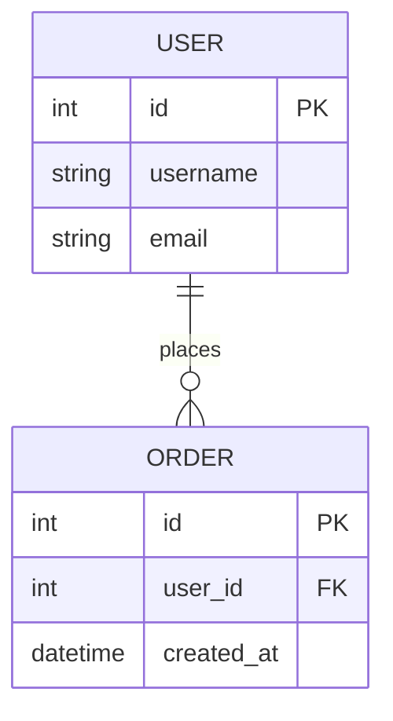

# Design Generator

设计文档生成Skill，基于需求规格说明书生成架构设计、模块划分、接口定义和技术选型，产出结构化设计文档。

---

## 一、Skill概述

### 1.1 功能定位

本Skill用于将需求规格说明书转换为结构化的设计文档，确保：

1. **架构设计**：根据需求特点选择合适的架构模式
2. **模块划分**：基于功能需求划分模块，确保高内聚低耦合
3. **接口定义**：定义模块间的接口和数据结构
4. **技术选型**：根据约束条件选择合适的技术栈
5. **追溯建立**：建立需求到设计的追溯矩阵

### 1.2 Quick Start (5分钟)

**基本用法:**
```
> 基于需求规格生成设计文档
```

**指定架构模式:**
```
> 使用微服务架构生成设计文档
```

**That's it!** 系统会：
1. 解析需求规格说明书
2. 选择合适的架构模式
3. 划分功能模块
4. 定义接口和数据结构
5. 生成设计文档初稿

**快速输出示例:**
```markdown
# [项目名称] 设计文档

**版本**: v1.0
**日期**: 2026-04-03
**需求来源**: xxx_requirement_spec.md

---

## 1. 概述

### 1.1 文档目的
本文档描述系统的技术架构和详细设计。

### 1.2 需求覆盖
- F001 登录功能 → 4.1 认证模块
- F002 注册功能 → 4.1 认证模块
- F003 VIP购买 → 4.2 会员模块

## 2. 系统架构

### 2.1 整体架构
采用分层架构模式...

## 3. 模块设计

### 3.1 认证模块 (auth)
- 功能: 用户登录、注册、登出
- 接口: AuthService
- 依赖: 无

## 4. 接口设计

### 4.1 AuthService

| 方法 | 参数 | 返回值 | 说明 |
|------|------|--------|------|
| login | username, password | token | 用户登录 |
| register | userInfo | userId | 用户注册 |

## 5. 需求追溯矩阵

| 需求ID | 设计章节 | 实现模块 | 状态 |
|--------|----------|----------|------|
| F001 | 4.1 | auth | 待实现 |
```

### 1.3 性能预期

| 需求规模 | 模块数 | 处理时间 | 输出大小 |
|----------|--------|----------|----------|
| 小型 (<10条) | 2-3 | 30-60秒 | ~5KB |
| 中型 (10-30条) | 4-6 | 1-2分钟 | ~15KB |
| 大型 (30-50条) | 6-10 | 2-5分钟 | ~30KB |
| 超大型 (>50条) | 10+ | 5-10分钟 | ~50KB |

**性能影响因素:**
- 需求复杂度: 功能需求多会增加模块划分时间
- 架构选择: 微服务架构设计时间更长
- 接口数量: 接口多会增加定义时间

**优化建议:**
- 先进行架构选择，再详细设计
- 对于大型系统，可分模块生成
- 优先设计核心模块

### 1.4 触发条件

当出现以下情况时，应调用本Skill：

- 用户需要生成设计文档
- 用户提到"设计文档"、"架构设计"、"模块划分"
- 用户要求"基于需求生成设计"
- 用户询问"如何实现这些需求"
- demand-analyzer已完成需求分析

### 1.5 核心约束（必读）

**✅ 必须做的事**：
- 为每个模块生成唯一标识
- 确保所有功能需求都有对应的设计
- 建立需求-设计追溯矩阵
- 定义清晰的接口边界
- 选择合适的技术栈

**❌ 不要做的事**：
- 不要设计需求中未提及的功能
- 不要忽略非功能需求
- 不要选择与约束冲突的技术
- 不要创建过度复杂的架构
- 不要遗漏需求追溯

### 1.6 与其他Skill的关系

```
┌─────────────────────────────────────────────────────────────┐
│                    Skill协作关系图                           │
├─────────────────────────────────────────────────────────────┤
│                                                             │
│   ┌───────────────────┐                                     │
│   │ demand-analyzer   │ ◄── 上游Skill                        │
│   │ - 需求提取       │     提供需求规格说明书                │
│   └─────────┬─────────┘                                     │
│             │                                               │
│             ▼                                               │
│   ┌───────────────────┐                                     │
│   │design-generator   │ ◄── 本Skill                          │
│   │ - 架构设计       │                                     │
│   │ - 模块划分       │                                     │
│   │ - 接口定义       │                                     │
│   └─────────┬─────────┘                                     │
│             │                                               │
│             ▼                                               │
│   ┌───────────────────┐                                     │
│   │design-doc-validator│ ◄── 验证Skill                      │
│   │ - 质量检查       │     验证设计文档质量                  │
│   └─────────┬─────────┘                                     │
│             │                                               │
│             ▼                                               │
│   ┌───────────────────┐                                     │
│   │    task-planner   │ ◄── 任务拆分                         │
│   └───────────────────┘                                     │
│                                                             │
└─────────────────────────────────────────────────────────────┘
```

---

## 二、输入要求

### 2.1 支持的输入格式

| 格式 | 说明 | 支持程度 |
|------|------|----------|
| JSON | 需求规格JSON格式 | ✅ 完全支持 |
| Markdown | 需求规格说明书 | ✅ 完全支持 |
| 需求列表 | 简单需求列表 | ⚠️ 需补充信息 |

### 2.2 输入内容要求

**必需包含的信息**：
- 功能需求列表（至少1个）
- 非功能需求（可选但建议）

**可选包含的信息**：
- 技术约束
- 性能要求
- 安全要求
- 架构偏好

**输入验证规则**：

| 字段 | 验证规则 | 错误提示 |
|------|----------|----------|
| functional_requirements | 非空数组，至少1个元素 | "功能需求不能为空" |
| functional_requirements[].id | 符合F\\d{3}格式 | "需求ID格式错误，应为F001格式" |
| functional_requirements[].description | 长度≥10字符 | "需求描述过短，请补充详细描述" |
| functional_requirements[].acceptance_criteria | 非空 | "验收标准不能为空" |

**输入验证示例**：
```json
// ✅ 有效输入
{
  "requirement_spec": {
    "functional_requirements": [
      {"id": "F001", "description": "用户登录功能", "acceptance_criteria": "验证成功返回token"}
    ]
  }
}

// ❌ 无效输入
{
  "requirement_spec": {
    "functional_requirements": []  // 错误：空数组
  }
}
```

**输入示例 (JSON):**

```json
{
  "requirement_spec": {
    "version": "1.0",
    "date": "2026-04-03",
    "source": "xxx_demand.md",
    "functional_requirements": [
      {
        "id": "F001",
        "description": "用户登录功能",
        "acceptance_criteria": "用户名密码验证成功返回token",
        "priority": "P0",
        "moscow": "Must"
      }
    ],
    "non_functional_requirements": [
      {
        "id": "NF001",
        "type": "性能",
        "description": "登录响应时间<200ms",
        "acceptance_criteria": "压力测试验证"
      }
    ]
  }
}
```

---

## 三、核心功能

### 3.1 架构模式选择

#### 3.1.1 架构模式库

| 模式 | 适用场景 | 优点 | 缺点 |
|------|----------|------|------|
| **分层架构** | 企业应用、管理系统 | 简单、易维护 | 性能受限 |
| **微服务架构** | 大型系统、高并发 | 可扩展、独立部署 | 复杂度高 |
| **事件驱动架构** | 实时系统、消息处理 | 高响应、解耦 | 调试困难 |
| **CQRS** | 读写分离场景 | 性能优化 | 复杂度增加 |
| **六边形架构** | 需要适配多种外部系统 | 可测试、灵活 | 学习曲线 |

#### 3.1.2 架构选择规则

| 需求特征 | 推荐架构 | 选择理由 |
|----------|----------|----------|
| 功能需求<10个，用户<1000 | 分层架构 | 简单够用 |
| 功能需求>20个，或需要独立扩展 | 微服务架构 | 可扩展性 |
| 实时通知、消息处理 | 事件驱动 | 响应性 |
| 读写比例>10:1 | CQRS | 性能优化 |
| 多种外部系统集成 | 六边形架构 | 适配性 |

#### 3.1.3 架构决策记录

为每个架构决策生成ADR（Architecture Decision Record）：

```markdown
## ADR-001: 选择分层架构

### 背景
系统功能需求8个，预计用户<1000，需要快速开发。

### 决策
采用三层架构：表现层、业务层、数据层。

### 理由
1. 功能需求较少，分层架构足够
2. 团队熟悉分层架构，开发效率高
3. 后期可演进为微服务

### 影响
- 模块间通过接口通信
- 数据层使用Repository模式
```

### 3.2 模块划分

#### 3.2.1 模块划分原则

| 原则 | 说明 | 检查方法 |
|------|------|----------|
| **单一职责** | 每个模块只负责一个功能领域 | 模块描述是否清晰 |
| **高内聚** | 模块内部功能紧密相关 | 功能是否属于同一领域 |
| **低耦合** | 模块间依赖最小化 | 依赖数量是否合理 |
| **可测试** | 模块可独立测试 | 是否可mock依赖 |

#### 3.2.2 模块划分方法

**方法1: 按功能领域划分**

| 功能需求 | 归属模块 | 模块职责 |
|----------|----------|----------|
| F001 登录 | auth | 用户认证 |
| F002 注册 | auth | 用户认证 |
| F003 VIP购买 | member | 会员管理 |
| F004 积分 | member | 会员管理 |

**方法2: 按业务流程划分**

```
用户流程: 注册 → 登录 → 使用功能 → VIP购买

模块划分:
- auth: 注册、登录
- core: 核心功能
- payment: VIP购买
```

#### 3.2.3 模块定义模板

```markdown
### 3.X [模块名] ([模块标识])

**功能描述**: [描述模块的主要功能]

**需求覆盖**: [列出覆盖的需求ID]

**接口定义**:
| 接口名 | 方法 | 说明 |
|--------|------|------|
| [接口名] | [方法列表] | [说明] |

**依赖关系**: [列出依赖的其他模块]

**数据结构**: [定义核心数据结构]
```

### 3.3 接口定义

#### 3.3.1 接口设计原则

| 原则 | 说明 |
|------|------|
| **接口隔离** | 接口应该小而专一 |
| **依赖倒置** | 依赖抽象而非具体实现 |
| **明确边界** | 接口参数和返回值明确 |
| **版本兼容** | 考虑接口演进 |

#### 3.3.2 接口定义格式

**API接口:**

```markdown
### [接口名]

**路径**: `POST /api/v1/[resource]`

**请求参数**:
| 参数名 | 类型 | 必需 | 说明 |
|--------|------|------|------|
| username | string | 是 | 用户名 |
| password | string | 是 | 密码 |

**返回值**:
```json
{
  "code": 0,
  "data": {
    "token": "xxx"
  },
  "message": "success"
}
```

**错误码**:
| 错误码 | 说明 |
|--------|------|
| 1001 | 用户名不存在 |
| 1002 | 密码错误 |
```

**类接口:**

```markdown
### [类名]

**职责**: [描述类的职责]

**方法**:
| 方法名 | 参数 | 返回值 | 说明 |
|--------|------|--------|------|
| login | username, password | token | 用户登录 |

**依赖**: [列出依赖的其他类]
```

### 3.4 技术选型

#### 3.4.1 技术选型矩阵

| 技术领域 | 候选技术 | 选择标准 | 推荐方案 |
|----------|----------|----------|----------|
| 编程语言 | Python/Java/Go | 团队熟悉度、性能需求 | [根据约束选择] |
| Web框架 | FastAPI/Spring/Gin | 开发效率、性能 | [根据约束选择] |
| 数据库 | PostgreSQL/MySQL/MongoDB | 数据模型、性能 | [根据约束选择] |
| 缓存 | Redis/Memcached | 性能需求 | [根据约束选择] |
| 消息队列 | RabbitMQ/Kafka | 吞吐量需求 | [根据约束选择] |

#### 3.4.2 技术选型决策

```markdown
## 技术选型

### 编程语言: Python 3.11
- 理由: 团队熟悉，开发效率高
- 约束匹配: 满足性能需求

### Web框架: FastAPI
- 理由: 异步支持好，自动文档生成
- 约束匹配: 满足高并发需求

### 数据库: PostgreSQL
- 理由: 支持JSON，ACID保证
- 约束匹配: 满足数据一致性需求

### 缓存: Redis
- 理由: 高性能，支持多种数据结构
- 约束匹配: 满足性能需求
```

### 3.5 需求追溯矩阵

#### 3.5.1 追溯矩阵结构

| 需求ID | 需求描述 | 设计章节 | 实现模块 | 接口 | 状态 |
|--------|----------|----------|----------|------|------|
| F001 | 用户登录 | 4.1 | auth | AuthService.login | 📋 待实现 |
| F002 | 用户注册 | 4.1 | auth | AuthService.register | 📋 待实现 |
| F003 | VIP购买 | 4.2 | member | MemberService.buyVIP | 📋 待实现 |

#### 3.5.2 追溯验证规则

- 每个功能需求必须有对应的设计章节
- 每个设计模块必须覆盖至少一个需求
- 接口定义必须与需求验收标准对应

### 3.6 数据模型设计

#### 3.6.1 实体识别方法

| 方法 | 说明 | 示例 |
|------|------|------|
| 名词识别 | 从需求中识别核心名词 | 用户、订单、商品 |
| 关系识别 | 识别实体间的关系 | 用户-订单（一对多） |
| 属性识别 | 识别实体的属性 | 用户：ID、名称、邮箱 |

#### 3.6.2 数据模型设计原则

| 原则 | 说明 |
|------|------|
| 规范化 | 遵循数据库设计范式（1NF、2NF、3NF） |
| 性能优化 | 考虑查询性能，适度反规范化 |
| 扩展性 | 预留扩展字段，使用JSON类型存储灵活数据 |

#### 3.6.3 数据模型输出格式

```markdown
### 5.1 实体关系图



### 5.2 数据表设计

#### 表: users

| 字段名 | 类型 | 约束 | 说明 |
|--------|------|------|------|
| id | SERIAL | PRIMARY KEY | 用户ID |
| username | VARCHAR(50) | UNIQUE, NOT NULL | 用户名 |
| email | VARCHAR(100) | UNIQUE | 邮箱 |
| created_at | TIMESTAMP | DEFAULT NOW() | 创建时间 |

**索引设计**:
- idx_users_username: 用于用户名查询优化
- idx_users_email: 用于邮箱查询优化
```

---

## 四、输出格式

### 4.1 设计文档模板

```markdown
# [项目名称] 设计文档

**版本**: v1.0
**日期**: YYYY-MM-DD
**状态**: 设计中
**需求来源**: [需求规格说明书 v1.0]

---

## 1. 概述

### 1.1 文档目的
[描述本文档的目的]

### 1.2 范围
[描述设计范围]

### 1.3 参考文档
- [需求规格说明书 v1.0]

### 1.4 需求追溯

| 需求ID | 需求描述 | 设计章节 |
|--------|----------|----------|
| F001 | ... | 4.1 |

## 2. 设计目标

### 2.1 核心目标
[列出核心设计目标]

### 2.2 设计原则
- 单一职责原则
- 开闭原则
- 依赖倒置原则

### 2.3 约束条件
[列出技术约束和业务约束]

## 3. 系统架构

### 3.1 整体架构

[架构图]

```
┌─────────────────────────────────────────────────────────────┐
│                      表现层 (Presentation)                   │
├─────────────────────────────────────────────────────────────┤
│                      业务层 (Business)                       │
├─────────────────────────────────────────────────────────────┤
│                      数据层 (Data)                           │
└─────────────────────────────────────────────────────────────┘
```

### 3.2 架构决策

[ADR记录]

### 3.3 技术选型

| 层次 | 技术选型 | 版本 |
|------|----------|------|
| 表现层 | FastAPI | 0.100+ |
| 业务层 | Python | 3.11+ |
| 数据层 | PostgreSQL | 15+ |

## 4. 核心模块设计

### 4.1 [模块A]

**功能描述**: [描述模块功能]

**需求覆盖**: F001, F002

**接口定义**:

| 接口名 | 方法 | 说明 |
|--------|------|------|
| login | POST | 用户登录 |

**依赖关系**: 无

**数据结构**:

```python
class User:
    id: int
    username: str
    password_hash: str
    created_at: datetime
```

### 4.2 [模块B]
...

## 5. 数据模型

### 5.1 实体关系

[ER图或实体关系描述]

### 5.2 数据库设计

#### 表: users

| 字段名 | 类型 | 约束 | 说明 |
|--------|------|------|------|
| id | SERIAL | PRIMARY KEY | 用户ID |
| username | VARCHAR(50) | UNIQUE, NOT NULL | 用户名 |
| password_hash | VARCHAR(255) | NOT NULL | 密码哈希 |
| created_at | TIMESTAMP | DEFAULT NOW() | 创建时间 |

## 6. 接口设计

### 6.1 API列表

| 模块 | 接口 | 方法 | 路径 |
|------|------|------|------|
| auth | 登录 | POST | /api/v1/auth/login |
| auth | 注册 | POST | /api/v1/auth/register |

### 6.2 接口详细设计

#### POST /api/v1/auth/login

**请求参数**:
| 参数名 | 类型 | 必需 | 说明 |
|--------|------|------|------|
| username | string | 是 | 用户名 |
| password | string | 是 | 密码 |

**返回值**:
```json
{
  "code": 0,
  "data": {"token": "xxx"},
  "message": "success"
}
```

## 7. 非功能性设计

### 7.1 性能设计
- 登录响应时间 < 200ms
- 支持1000并发用户

### 7.2 安全设计
- 密码使用bcrypt加密
- JWT token认证
- HTTPS传输

### 7.3 可扩展性设计
- 模块化设计，支持水平扩展
- 数据库读写分离预留

## 8. 测试策略

### 8.1 单元测试
- 覆盖率目标: >80%
- 测试框架: pytest

### 8.2 集成测试
- API测试: 使用pytest + httpx
- 数据库测试: 使用测试数据库

### 8.3 性能测试
- 工具: Locust
- 场景: 1000并发登录

## 9. 需求追溯矩阵

| 需求ID | 设计章节 | 实现模块 | 接口 | 测试用例 | 状态 |
|--------|----------|----------|------|----------|------|
| F001 | 4.1 | auth | login | TC001 | 📋 待实现 |
| F002 | 4.1 | auth | register | TC002 | 📋 待实现 |

## 10. 附录

### 10.1 术语表
- ADR: Architecture Decision Record
- JWT: JSON Web Token

### 10.2 参考资源
- [相关技术文档链接]
```

---

## 五、错误处理

### 5.1 错误分级机制

| 错误级别 | 说明 | 处理策略 | 示例 |
|----------|------|----------|------|
| 🔴 致命 (Fatal) | 无法继续处理 | 终止处理，返回错误报告 | 需求规格缺失必需字段 |
| 🟠 严重 (Error) | 部分功能受影响 | 跳过问题项，继续处理 | 架构模式不匹配 |
| 🟡 警告 (Warning) | 不影响主流程 | 标记警告，继续处理 | 技术选型冲突 |
| 🔵 信息 (Info) | 提示性信息 | 记录日志 | 模块划分建议 |

### 5.2 常见错误

| 错误类型 | 级别 | 原因 | 处理方法 |
|----------|------|------|----------|
| 需求规格不完整 | 🔴 致命 | 缺少必需字段 | 回退到demand-analyzer补充 |
| 技术选型冲突 | 🟡 警告 | 约束条件矛盾 | 生成多方案对比 |
| 架构模式不匹配 | 🟠 严重 | 需求特征与模式不符 | 提供相似模式建议 |
| 模块划分困难 | 🟡 警告 | 需求边界不清晰 | 请求用户确认 |

### 5.3 错误消息

| 场景 | 错误消息 |
|------|----------|
| 需求规格缺失 | "需求规格缺少以下信息，请补充后重试: [缺失字段列表]" |
| 技术冲突 | "发现N个技术冲突，请选择方案: [方案列表]" |
| 架构不匹配 | "未找到匹配的架构模式，建议使用: [推荐模式]" |

### 5.3 回退机制

当自动设计失败时：
1. 返回部分设计结果
2. 标记需要人工决策的点
3. 提供多个备选方案

---

## 六、质量保证

### 6.1 验收检查清单

**架构设计**
- [ ] 架构模式已选择并记录理由
- [ ] 架构图已绘制
- [ ] ADR已记录

**模块划分**
- [ ] 每个模块职责清晰
- [ ] 模块间依赖合理
- [ ] 所有需求已覆盖

**接口定义**
- [ ] 接口参数和返回值明确
- [ ] 错误处理已定义
- [ ] 接口版本已考虑

**技术选型**
- [ ] 技术选型有理由
- [ ] 满足约束条件
- [ ] 团队能力匹配

**追溯矩阵**
- [ ] 每个需求都有设计对应
- [ ] 追溯关系清晰
- [ ] 状态已标记

### 6.2 输出质量标准

| 标准 | 要求 |
|------|------|
| 需求覆盖率 | 100%功能需求有设计对应 |
| 模块内聚性 | 每个模块职责单一 |
| 接口清晰度 | 每个接口有明确输入输出 |
| 技术合理性 | 技术选型满足约束 |

---

## 七、使用示例

### 示例1: 基本设计生成

**用户输入:**
```
基于需求规格生成设计文档
```

**系统输出:**
```markdown
# 会员管理系统 设计文档

## 1. 概述
...

## 2. 系统架构
采用三层架构...

## 3. 模块设计
### 3.1 认证模块 (auth)
- 功能: 用户登录、注册
- 接口: AuthService
...
```

### 示例2: 指定架构模式

**用户输入:**
```
使用微服务架构生成设计文档
```

**系统输出:**
```markdown
# 会员管理系统 设计文档

## 2. 系统架构
采用微服务架构...

### 服务划分
- auth-service: 认证服务
- member-service: 会员服务
- payment-service: 支付服务
...
```

### 示例3: 技术选型建议

**用户输入:**
```
推荐技术选型
```

**系统输出:**
```markdown
## 技术选型建议

### 编程语言
推荐: Python 3.11
理由: 团队熟悉，开发效率高
备选: Go (更高性能需求)

### 数据库
推荐: PostgreSQL
理由: 支持JSON，ACID保证
备选: MySQL (更简单场景)
...
```

---

## 八、版本历史

| 版本 | 日期 | 变更内容 |
|------|------|----------|
| v1.1 | 2026-04-03 | 添加输入验证规则；添加数据模型设计方法；添加错误分级机制 |
| v1.0 | 2026-04-03 | 初始版本 |
