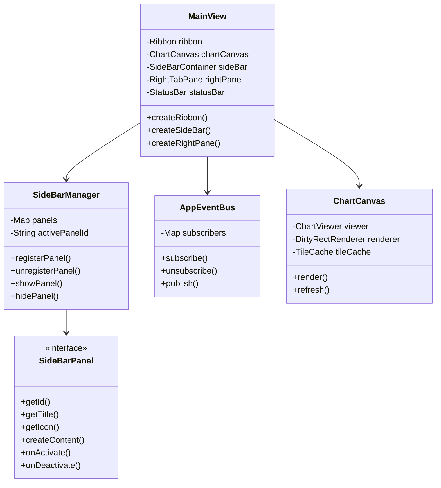
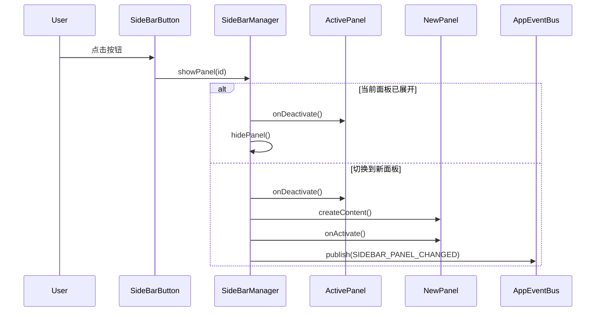

# JavaFX应用布局设计

> **版本**: v1.6  
> **日期**: 2026-04-11

---

## 一、整体布局结构

```
┌──────────────────────────────────────────────────────────────────────┐
│                          Ribbon 菜单栏                                │
├────────┬─────────────────────────────────────────┬───────────────────┤
│        │                                         │                   │
│  侧边栏 │              主显示窗口                  │   可停靠窗口       │
│        │                                         │                   │
│ (可折叠)│           (海图显示与交互)               │  (多标签面板)      │
│        │                                         │                   │
├────────┴─────────────────────────────────────────┴───────────────────┤
│                            状态栏                                      │
│  [服务状态] [显示区域] [鼠标位置] [瓦片级数] [缩放比例] ...             │
└──────────────────────────────────────────────────────────────────────┘
```

---

## 二、各区域详细设计

### 2.1 顶部 Ribbon 菜单栏

**功能**: 应用程序主菜单和工具按钮

**现有标签页**:
| 标签 | 功能组 | 说明 |
|------|--------|------|
| 文件 | 文件操作、编辑、退出 | 打开/保存/关闭海图、撤销/重做 |
| 视图 | 缩放、缩放比例、适应 | 视图控制操作 |
| 工具 | 测量、航线、工具 | 测量工具、航线规划 |
| 图层 | 图层管理、可见性 | 图层面板控制 |
| 设置 | 显示设置、选项 | 主题切换、显示选项 |
| 帮助 | 帮助 | 帮助文档、关于 |

---

### 2.2 左侧侧边栏

**功能**: 快速访问常用功能面板

**交互行为**:
- 点击按钮 → 显示对应面板
- 再次点击同一按钮 → 关闭面板
- 点击另一按钮 → 切换到对应面板

**侧边栏按钮列表**:

| 图标 | 名称 | 面板内容 |
|------|------|----------|
| 📁 | 数据目录 | 海图数据文件树形结构 |
| 🔄 | 数据转换 | 格式转换、坐标转换工具 |
| 📊 | 数据查询 | 属性查询、空间查询 |
| 🎨 | 符号样式 | S-52符号库、样式配置 |
| ⚙️ | 工具集 | 批量处理、脚本工具 |

**侧边栏面板设计**:

```
┌─────────────────┐
│  数据目录树      │  ← 面板标题栏
├─────────────────┤
│ ▼ 本地数据源    │
│   ├─ 海图文件   │
│   │   ├─ CN0000001.000
│   │   └─ CN0000002.000
│   ├─ 航线数据   │
│   └─ AIS数据    │
│ ▼ 在线服务      │
│   ├─ WMS服务    │
│   └─ WFS服务    │
└─────────────────┘
```

**技术实现要点**:
- 使用 `BorderPane` 左侧区域
- 侧边栏按钮使用 `ToggleButton` 实现
- 面板使用 `StackPane` 或自定义容器
- 支持面板宽度拖拽调整

---

### 2.3 中间主显示窗口

**功能**: 海图显示与主交互操作

**核心组件**:
- `ChartCanvas`: 海图渲染画布
- 交互处理器:
  - 平移/缩放
  - 要素选择
  - 测量工具
  - 航线编辑

**显示内容**:
| 内容类型 | 说明 |
|----------|------|
| 海图数据 | S-57/S-52标准海图 |
| 叠加图层 | 卫星影像、地形图 |
| AIS数据 | 船舶动态信息 |
| 航线数据 | 规划航线、历史航迹 |
| 标注信息 | 用户标注、测量结果 |

**交互功能**:
- 鼠标平移/缩放
- 要素点击选择
- 右键上下文菜单
- 工具模式切换

---

### 2.4 右侧可停靠窗口

**功能**: 多标签面板，显示辅助信息

**标签页列表**:

| 标签 | 图标 | 内容 |
|------|------|------|
| 数据属性 | 📋 | 选中要素的属性信息 |
| 数据检查 | ✓ | 数据质量检查结果 |
| 脚本处理 | 📜 | 脚本编辑器与执行 |
| 日志输出 | 📝 | 系统日志、操作日志 |

**面板设计**:

```
┌─────────────────────────┐
│ [属性] [检查] [脚本] [日志] │  ← 标签栏
├─────────────────────────┤
│                         │
│   数据属性面板           │
│                         │
│   ┌─────────────────┐   │
│   │ 要素类型: 灯塔   │   │
│   │ ID: CN0001234    │   │
│   │ 名称: 东港灯塔   │   │
│   │ 位置: 120.5°E    │   │
│   │        30.2°N    │   │
│   └─────────────────┘   │
│                         │
└─────────────────────────┘
```

**技术实现要点**:
- 使用 `TabPane` 实现多标签
- 支持标签页拖拽排序
- 支持面板最小化/最大化
- 支持面板隐藏/显示切换

---

### 2.5 底部状态栏

**功能**: 显示系统状态和操作信息

**状态栏分区**:

```
┌──────────┬──────────┬──────────────┬──────────┬──────────┬──────────┐
│ 服务状态  │ 显示区域  │   鼠标位置    │ 瓦片级数  │ 缩放比例  │ 提示信息  │
│ ● 已连接  │ 东海区域  │ 120.5°E 30.2°N │  Level 8  │   1:50000 │ 就绪     │
└──────────┴──────────┴──────────────┴──────────┴──────────┴──────────┘
```

**状态项详细说明**:

| 状态项 | 内容 | 更新时机 |
|--------|------|----------|
| 服务状态 | 数据服务连接状态 | 连接变化时 |
| 显示区域 | 当前视图覆盖区域 | 视图变化时 |
| 鼠标位置 | 鼠标所在地理坐标 | 鼠标移动时 |
| 瓦片级数 | 当前瓦片金字塔级别 | 缩放变化时 |
| 缩放比例 | 当前显示比例尺 | 缩放变化时 |
| 提示信息 | 操作提示/警告信息 | 操作触发时 |

**技术实现要点**:
- 使用 `HBox` 水平布局
- 各状态项使用 `Label` 组件
- 支持状态项点击展开详情
- 状态颜色区分（正常/警告/错误）

---

## 三、布局技术架构

### 3.1 主布局结构

```java
BorderPane mainLayout = new BorderPane();

// 顶部: Ribbon菜单
mainLayout.setTop(ribbon);

// 左侧: 侧边栏 + 面板
HBox leftArea = new HBox();
leftArea.getChildren().addAll(sidebarButtons, activePanel);
mainLayout.setLeft(leftArea);

// 中间: 主显示窗口
mainLayout.setCenter(chartCanvas);

// 右侧: 可停靠窗口
mainLayout.setRight(dockableTabs);

// 底部: 状态栏
mainLayout.setBottom(statusBar);
```

### 3.2 组件层次结构

```
MainView (BorderPane)
├── Top: Ribbon
│   └── RibbonTab[]
│       └── RibbonGroup[]
│           └── Button/MenuButton/ComboBox...
├── Left: SideBarContainer (HBox)
│   ├── SideBarButtons (VBox)
│   │   └── ToggleButton[]
│   └── ActivePanel (StackPane)
│       ├── DataCatalogPanel
│       ├── DataConvertPanel
│       ├── QueryPanel
│       └── StylePanel
├── Center: ChartCanvas
│   └── Canvas + InteractionHandlers
├── Right: DockablePane (TabPane)
│   └── Tab[]
│       ├── PropertyTab
│       ├── ValidationTab
│       ├── ScriptTab
│       └── LogTab
└── Bottom: StatusBar (HBox)
    ├── ServiceStatus
    ├── DisplayRegion
    ├── MousePosition
    ├── TileLevel
    ├── ZoomRatio
    └── MessageInfo
```

---

## 四、响应式布局设计

### 4.1 断点定义

| 断点名称 | 窗口宽度 | 布局策略 |
|----------|----------|----------|
| 紧凑模式 | < 1024px | 侧边栏收起，右侧面板浮动 |
| 标准模式 | 1024px - 1440px | 侧边栏固定，右侧面板固定 |
| 宽屏模式 | > 1440px | 面板宽度可调，最大限制 |

### 4.2 响应式行为

```java
public class ResponsiveLayoutManager {
    
    private static final int COMPACT_WIDTH = 1024;
    private static final int STANDARD_WIDTH = 1440;
    
    public void onWindowResize(double width) {
        if (width < COMPACT_WIDTH) {
            applyCompactLayout();
        } else if (width < STANDARD_WIDTH) {
            applyStandardLayout();
        } else {
            applyWideLayout();
        }
    }
    
    private void applyCompactLayout() {
        // 侧边栏面板自动收起
        sideBar.collapsePanel();
        // 右侧面板转为浮动窗口
        rightPanel.detachToFloatWindow();
        // 状态栏简化显示
        statusBar.setCompactMode(true);
    }
    
    private void applyStandardLayout() {
        // 侧边栏面板宽度固定200px
        sideBar.setPanelWidth(200);
        // 右侧面板宽度固定250px
        rightPanel.setWidth(250);
        // 状态栏完整显示
        statusBar.setCompactMode(false);
    }
    
    private void applyWideLayout() {
        // 面板宽度可调，设置最大限制
        sideBar.setPanelWidthRange(200, 300);
        rightPanel.setWidthRange(250, 400);
    }
}
```

### 4.3 面板尺寸约束

| 元素 | 最小值 | 默认值 | 最大值 | 说明 |
|------|--------|--------|--------|------|
| Ribbon高度 | 100px | 120px | 150px | 包含标签页 |
| 侧边栏按钮区 | 36px | 40px | 48px | 固定宽度 |
| 侧边栏面板 | 180px | 250px | 350px | 可拖拽调整 |
| 右侧面板 | 200px | 300px | 450px | 可拖拽调整 |
| 状态栏高度 | 24px | 28px | 32px | 固定高度 |

---

## 五、组件间通信机制

### 5.1 事件总线设计

```java
public class AppEventBus {
    
    private static final AppEventBus INSTANCE = new AppEventBus();
    private final Map<AppEventType, List<Consumer<AppEvent>>> subscribers = new ConcurrentHashMap<>();
    
    public static AppEventBus getInstance() {
        return INSTANCE;
    }
    
    public void subscribe(AppEventType type, Consumer<AppEvent> handler) {
        subscribers.computeIfAbsent(type, k -> new CopyOnWriteArrayList<>()).add(handler);
    }
    
    public void unsubscribe(AppEventType type, Consumer<AppEvent> handler) {
        List<Consumer<AppEvent>> handlers = subscribers.get(type);
        if (handlers != null) {
            handlers.remove(handler);
        }
    }
    
    public void publish(AppEvent event) {
        List<Consumer<AppEvent>> handlers = subscribers.get(event.getType());
        if (handlers != null) {
            Platform.runLater(() -> {
                for (Consumer<AppEvent> handler : handlers) {
                    handler.accept(event);
                }
            });
        }
    }
}
```

### 5.2 事件类型定义

```java
public enum AppEventType {
    // 数据事件
    CHART_LOADED,
    CHART_CLOSED,
    FEATURE_SELECTED,
    FEATURE_DESELECTED,
    
    // 图层事件
    LAYER_ADDED,
    LAYER_REMOVED,
    LAYER_VISIBILITY_CHANGED,
    LAYER_ORDER_CHANGED,
    
    // 视图事件
    VIEW_CHANGED,
    ZOOM_CHANGED,
    CENTER_CHANGED,
    
    // UI事件
    SIDEBAR_PANEL_CHANGED,
    RIGHT_TAB_CHANGED,
    STATUS_MESSAGE,
    
    // 服务事件
    SERVICE_CONNECTED,
    SERVICE_DISCONNECTED,
    SERVICE_ERROR
}

public class AppEvent {
    private final AppEventType type;
    private final Object source;
    private final Map<String, Object> data;
    
    public AppEvent(AppEventType type, Object source) {
        this.type = type;
        this.source = source;
        this.data = new HashMap<>();
    }
    
    public AppEvent withData(String key, Object value) {
        data.put(key, value);
        return this;
    }
    
    // getters...
}
```

### 5.3 通信示例

```java
// 发布要素选择事件
AppEventBus.getInstance().publish(
    new AppEvent(AppEventType.FEATURE_SELECTED, this)
        .withData("feature", selectedFeature)
        .withData("layer", currentLayer)
);

// 订阅要素选择事件
AppEventBus.getInstance().subscribe(AppEventType.FEATURE_SELECTED, event -> {
    Feature feature = (Feature) event.getData().get("feature");
    propertyPanel.displayFeature(feature);
});
```

---

## 六、Canvas渲染优化策略

### 6.1 脏区域重绘

```java
public class DirtyRectRenderer {
    
    private Rectangle2D dirtyRect = null;
    private boolean fullRepaintNeeded = true;
    
    public void markDirty(double x, double y, double width, double height) {
        if (dirtyRect == null) {
            dirtyRect = new Rectangle2D(x, y, width, height);
        } else {
            dirtyRect = Rectangle2D.union(dirtyRect, new Rectangle2D(x, y, width, height));
        }
    }
    
    public void markFullRepaint() {
        fullRepaintNeeded = true;
        dirtyRect = null;
    }
    
    public void render(GraphicsContext gc, double canvasWidth, double canvasHeight) {
        if (fullRepaintNeeded) {
            // 完整重绘
            renderFull(gc, canvasWidth, canvasHeight);
            fullRepaintNeeded = false;
        } else if (dirtyRect != null) {
            // 脏区域重绘
            renderDirtyRect(gc, dirtyRect);
            dirtyRect = null;
        }
    }
    
    private void renderDirtyRect(GraphicsContext gc, Rectangle2D rect) {
        gc.save();
        gc.beginPath();
        gc.rect(rect.getMinX(), rect.getMinY(), rect.getWidth(), rect.getHeight());
        gc.clip();
        // 渲染脏区域内的内容
        renderContent(gc, rect);
        gc.restore();
    }
}
```

### 6.2 瓦片缓存策略

```java
public class TileCache {
    
    private static final int MAX_CACHE_SIZE = 100;
    private final LRUCache<TileKey, Image> cache = new LRUCache<>(MAX_CACHE_SIZE);
    private final ExecutorService executor = Executors.newFixedThreadPool(2);
    
    public CompletableFuture<Image> getTileAsync(TileKey key) {
        Image cached = cache.get(key);
        if (cached != null) {
            return CompletableFuture.completedFuture(cached);
        }
        
        return CompletableFuture.supplyAsync(() -> {
            Image tile = loadTileFromDisk(key);
            if (tile != null) {
                cache.put(key, tile);
            }
            return tile;
        }, executor);
    }
    
    public void preloadTiles(List<TileKey> keys) {
        for (TileKey key : keys) {
            if (!cache.containsKey(key)) {
                getTileAsync(key);
            }
        }
    }
    
    public void clearCache() {
        cache.clear();
    }
}

class LRUCache<K, V> extends LinkedHashMap<K, V> {
    private final int maxSize;
    
    LRUCache(int maxSize) {
        super(maxSize, 0.75f, true);
        this.maxSize = maxSize;
    }
    
    @Override
    protected boolean removeEldestEntry(Map.Entry<K, V> eldest) {
        return size() > maxSize;
    }
}
```

### 6.3 LOD细节层次策略

```java
public class LODStrategy {
    
    private static final double[] SCALE_THRESHOLDS = {
        1.0 / 50000,    // Level 3: 高细节
        1.0 / 200000,   // Level 2: 中细节
        1.0 / 500000    // Level 1: 低细节
    };
    
    public int getDetailLevel(double scale) {
        for (int i = 0; i < SCALE_THRESHOLDS.length; i++) {
            if (scale > SCALE_THRESHOLDS[i]) {
                return SCALE_THRESHOLDS.length - i;
            }
        }
        return 1;
    }
    
    public List<String> getVisibleLayers(int detailLevel) {
        switch (detailLevel) {
            case 3:
                return Arrays.asList("base", "navigation", "depth", "obstacles", "text");
            case 2:
                return Arrays.asList("base", "navigation", "depth", "obstacles");
            case 1:
            default:
                return Arrays.asList("base", "navigation");
        }
    }
    
    public double getSymbolSizeFactor(int detailLevel) {
        switch (detailLevel) {
            case 3: return 1.0;
            case 2: return 0.8;
            case 1: return 0.6;
            default: return 0.5;
        }
    }
}
```

### 6.4 渲染性能监控

```java
public class RenderPerformanceMonitor {
    
    private long lastRenderTime = 0;
    private int frameCount = 0;
    private double averageFPS = 0;
    private final Queue<Long> renderTimes = new LinkedList<>();
    
    public void recordRenderStart() {
        lastRenderTime = System.nanoTime();
    }
    
    public void recordRenderEnd() {
        long renderTime = System.nanoTime() - lastRenderTime;
        renderTimes.offer(renderTime);
        if (renderTimes.size() > 60) {
            renderTimes.poll();
        }
        frameCount++;
        
        if (frameCount % 30 == 0) {
            calculateFPS();
        }
    }
    
    private void calculateFPS() {
        double avgNanos = renderTimes.stream()
            .mapToLong(Long::longValue)
            .average()
            .orElse(0);
        averageFPS = 1_000_000_000.0 / avgNanos;
        
        // 发布FPS事件
        AppEventBus.getInstance().publish(
            new AppEvent(AppEventType.STATUS_MESSAGE, this)
                .withData("fps", String.format("%.1f FPS", averageFPS))
        );
    }
    
    public double getAverageFPS() {
        return averageFPS;
    }
}
```

---

## 七、面板扩展机制

### 7.1 侧边栏面板接口

```java
public interface SideBarPanel {
    
    String getId();
    
    String getTitle();
    
    Node getIcon();
    
    Node createContent();
    
    default void onActivate() {}
    
    default void onDeactivate() {}
    
    default void onDestroy() {}
}
```

### 7.2 面板管理器

```java
public class SideBarManager {
    
    private final VBox buttonContainer;
    private final StackPane panelContainer;
    private final Map<String, SideBarPanel> panels = new LinkedHashMap<>();
    private final Map<String, ToggleButton> buttons = new HashMap<>();
    private String activePanelId = null;
    
    public SideBarManager(VBox buttonContainer, StackPane panelContainer) {
        this.buttonContainer = buttonContainer;
        this.panelContainer = panelContainer;
    }
    
    public void registerPanel(SideBarPanel panel) {
        panels.put(panel.getId(), panel);
        
        ToggleButton button = createButton(panel);
        buttons.put(panel.getId(), button);
        buttonContainer.getChildren().add(button);
    }
    
    public void unregisterPanel(String panelId) {
        SideBarPanel panel = panels.remove(panelId);
        if (panel != null) {
            panel.onDestroy();
            buttonContainer.getChildren().remove(buttons.remove(panelId));
        }
    }
    
    public void showPanel(String panelId) {
        if (activePanelId != null && activePanelId.equals(panelId)) {
            hidePanel();
            return;
        }
        
        SideBarPanel panel = panels.get(panelId);
        if (panel == null) return;
        
        // 隐藏当前面板
        if (activePanelId != null) {
            SideBarPanel activePanel = panels.get(activePanelId);
            if (activePanel != null) {
                activePanel.onDeactivate();
            }
            buttons.get(activePanelId).setSelected(false);
        }
        
        // 显示新面板
        panelContainer.getChildren().clear();
        panelContainer.getChildren().add(panel.createContent());
        panel.onActivate();
        buttons.get(panelId).setSelected(true);
        activePanelId = panelId;
        
        // 发布事件
        AppEventBus.getInstance().publish(
            new AppEvent(AppEventType.SIDEBAR_PANEL_CHANGED, this)
                .withData("panelId", panelId)
        );
    }
    
    public void hidePanel() {
        if (activePanelId != null) {
            SideBarPanel panel = panels.get(activePanelId);
            if (panel != null) {
                panel.onDeactivate();
            }
            buttons.get(activePanelId).setSelected(false);
            panelContainer.getChildren().clear();
            activePanelId = null;
        }
    }
    
    private ToggleButton createButton(SideBarPanel panel) {
        ToggleButton button = new ToggleButton();
        button.setGraphic(panel.getIcon());
        button.setTooltip(new Tooltip(panel.getTitle()));
        button.setOnAction(e -> showPanel(panel.getId()));
        return button;
    }
}
```

### 7.3 右侧标签页扩展

```java
public interface RightTabPanel {
    
    String getId();
    
    String getTitle();
    
    Node getIcon();
    
    Tab createTab();
    
    default void onActivate() {}
    
    default void onDeactivate() {}
}

public class RightTabManager {
    
    private final TabPane tabPane;
    private final Map<String, RightTabPanel> panels = new LinkedHashMap<>();
    private final Map<String, Tab> tabs = new HashMap<>();
    
    public RightTabManager(TabPane tabPane) {
        this.tabPane = tabPane;
    }
    
    public void registerPanel(RightTabPanel panel) {
        panels.put(panel.getId(), panel);
        Tab tab = panel.createTab();
        tabs.put(panel.getId(), tab);
        tabPane.getTabs().add(tab);
    }
    
    public void unregisterPanel(String panelId) {
        RightTabPanel panel = panels.remove(panelId);
        if (panel != null) {
            Tab tab = tabs.remove(panelId);
            tabPane.getTabs().remove(tab);
        }
    }
    
    public void selectTab(String panelId) {
        Tab tab = tabs.get(panelId);
        if (tab != null) {
            tabPane.getSelectionModel().select(tab);
            panels.get(panelId).onActivate();
        }
    }
}
```

---

## 八、异常状态处理

### 8.1 异常状态类型

| 异常类型 | 触发条件 | UI反馈 |
|----------|----------|--------|
| 数据加载失败 | 文件损坏/格式错误 | 红色警告图标 + 错误详情 + 重试按钮 |
| 服务断开 | 网络中断/服务停止 | 状态栏红色"已断开" + 重连按钮 |
| 渲染异常 | 内存不足/渲染错误 | 错误占位图 + 刷新按钮 |
| 操作超时 | 长时间无响应 | 进度条 + 取消按钮 |

### 8.2 异常处理实现

```java
public class ErrorHandler {
    
    public static void handleDataLoadError(TreeItem<String> item, Exception e) {
        // 设置红色警告图标
        item.setGraphic(createErrorIcon());
        
        // 鼠标悬停显示错误详情
        Tooltip tooltip = new Tooltip("加载失败: " + e.getMessage());
        Tooltip.install(item.getGraphic(), tooltip);
        
        // 添加重试按钮
        ContextMenu menu = new ContextMenu();
        MenuItem retryItem = new MenuItem("重试");
        retryItem.setOnAction(ev -> retryLoad(item));
        menu.getItems().add(retryItem);
    }
    
    public static void handleServiceDisconnect() {
        // 更新状态栏
        StatusBar statusBar = AppContext.getStatusBar();
        statusBar.setServiceStatus("已断开", StatusLevel.ERROR);
        
        // 弹出提示对话框
        Alert alert = new Alert(Alert.AlertType.WARNING);
        alert.setTitle("服务断开");
        alert.setHeaderText("数据服务连接已断开");
        alert.setContentText("请检查网络连接后重试");
        
        ButtonType reconnectBtn = new ButtonType("重新连接");
        ButtonType closeBtn = new ButtonType("关闭", ButtonBar.ButtonData.CANCEL_CLOSE);
        alert.getButtonTypes().setAll(reconnectBtn, closeBtn);
        
        Optional<ButtonType> result = alert.showAndWait();
        if (result.isPresent() && result.get() == reconnectBtn) {
            reconnectService();
        }
    }
    
    public static void handleRenderError(Canvas canvas) {
        GraphicsContext gc = canvas.getGraphicsContext2D();
        gc.clearRect(0, 0, canvas.getWidth(), canvas.getHeight());
        
        // 显示错误占位图
        gc.setFill(Color.LIGHTGRAY);
        gc.fillRect(0, 0, canvas.getWidth(), canvas.getHeight());
        
        gc.setFill(Color.GRAY);
        gc.setFont(Font.font(14));
        gc.fillText("渲染异常，请刷新重试", 
            canvas.getWidth() / 2 - 70, canvas.getHeight() / 2);
        
        // 记录日志
        LogPanel.logError("渲染异常: " + e.getMessage());
    }
}
```

---

## 九、键盘快捷键设计

### 9.1 全局快捷键

| 快捷键 | 功能 | 说明 |
|--------|------|------|
| Ctrl+O | 打开文件 | 打开海图文件对话框 |
| Ctrl+S | 保存文件 | 保存当前海图 |
| Ctrl+W | 关闭文件 | 关闭当前海图 |
| Ctrl+Q | 退出程序 | 退出应用程序 |
| Ctrl+F | 查找 | 打开查找对话框 |
| Ctrl+Shift+F | 高级查询 | 打开高级查询面板 |
| F5 | 刷新视图 | 重新渲染当前视图 |
| F11 | 全屏模式 | 切换全屏显示 |
| Esc | 取消操作 | 取消当前操作/关闭对话框 |
| Tab | 切换焦点 | 切换面板焦点 |

### 9.2 主窗口快捷键

| 快捷键 | 功能 | 说明 |
|--------|------|------|
| + / = | 放大 | 放大视图 |
| - | 缩小 | 缩小视图 |
| 0 | 适应窗口 | 海图适应窗口大小 |
| 方向键 | 平移 | 平移视图 |
| Home | 回到原点 | 回到初始位置 |
| Space | 临时平移 | 按住空格临时切换到平移模式 |
| Ctrl+Z | 撤销 | 撤销上一步操作 |
| Ctrl+Y | 重做 | 重做上一步操作 |

### 9.3 快捷键实现

```java
public class ShortcutManager {
    
    public static void registerGlobalShortcuts(Scene scene) {
        scene.getAccelerators().putAll(Map.of(
            // 文件操作
            KeyCombination.valueOf("Ctrl+O"), () -> AppContext.getController().openChart(),
            KeyCombination.valueOf("Ctrl+S"), () -> AppContext.getController().saveChart(),
            KeyCombination.valueOf("Ctrl+W"), () -> AppContext.getController().closeChart(),
            KeyCombination.valueOf("Ctrl+Q"), () -> AppContext.getController().exitApplication(),
            
            // 视图操作
            KeyCombination.valueOf("F5"), () -> AppContext.getChartCanvas().refresh(),
            KeyCombination.valueOf("F11"), () -> toggleFullScreen(),
            KeyCombination.valueOf("Plus"), () -> AppContext.getController().zoomIn(),
            KeyCombination.valueOf("Minus"), () -> AppContext.getController().zoomOut(),
            KeyCombination.valueOf("Digit0"), () -> AppContext.getController().fitToWindow(),
            
            // 编辑操作
            KeyCombination.valueOf("Ctrl+Z"), () -> AppContext.getController().undo(),
            KeyCombination.valueOf("Ctrl+Y"), () -> AppContext.getController().redo(),
            
            // 查找
            KeyCombination.valueOf("Ctrl+F"), () -> AppContext.getSideBarManager().showPanel("query")
        ));
    }
    
    private static void toggleFullScreen() {
        Stage stage = AppContext.getPrimaryStage();
        stage.setFullScreen(!stage.isFullScreen());
    }
}
```

---

## 十、模块集成设计

### 10.1 模块依赖关系

```
┌─────────────────────────────────────────────┐
│                  javafx-app                  │
│  ┌─────────────────────────────────────────┐│
│  │              MainView                    ││
│  │  ┌─────────────┐  ┌─────────────────┐   ││
│  │  │ ChartCanvas │  │  SideBarPanel   │   ││
│  │  │             │  │                 │   ││
│  │  │  ┌───────┐  │  │  ┌───────────┐  │   ││
│  │  │  │Viewer │  │  │  │DataCatalog│  │   ││
│  │  │  └───────┘  │  │  └───────────┘  │   ││
│  │  └─────────────┘  └─────────────────┘   ││
│  └─────────────────────────────────────────┘│
└─────────────────────────────────────────────┘
           │                    │
           ▼                    ▼
    ┌─────────────┐      ┌─────────────┐
    │ javawrapper │      │   jni       │
    │ ChartViewer │      │ JniBridge   │
    └─────────────┘      └─────────────┘
           │                    │
           ▼                    ▼
    ┌─────────────────────────────────┐
    │         ogc_chart_jni.dll       │
    └─────────────────────────────────┘
```

### 10.2 数据流设计

```
用户操作 → MainView → MainController
                           │
              ┌────────────┼────────────┐
              ▼            ▼            ▼
        ChartCanvas   SideBarPanel   StatusBar
              │            │            │
              ▼            ▼            ▼
        ChartViewer   DataManager   StatusService
              │            │            │
              └────────────┼────────────┘
                           ▼
                    JniBridge (JNI)
                           │
                           ▼
                    ogc_chart_jni.dll
```

### 10.3 集成接口

```java
public class AppContext {
    
    private static ChartViewer chartViewer;
    private static MainController controller;
    private static SideBarManager sideBarManager;
    private static RightTabManager rightTabManager;
    private static StatusBar statusBar;
    private static Stage primaryStage;
    
    public static void initialize(Stage stage, ChartViewer viewer) {
        primaryStage = stage;
        chartViewer = viewer;
        controller = new MainController(viewer);
        
        // 初始化JNI
        JniBridge.initialize();
    }
    
    public static ChartViewer getChartViewer() {
        return chartViewer;
    }
    
    public static MainController getController() {
        return controller;
    }
    
    // ... other getters
}
```

---

## 十一、交互设计规范

### 11.1 侧边栏交互

| 操作 | 行为 |
|------|------|
| 点击按钮 | 展开对应面板 |
| 再次点击 | 收起面板 |
| 切换按钮 | 切换面板内容 |
| 面板拖拽边缘 | 调整面板宽度 |

### 11.2 主窗口交互

| 操作 | 行为 |
|------|------|
| 鼠标左键拖拽 | 平移视图 |
| 鼠标滚轮 | 缩放视图 |
| 鼠标左键点击 | 选择要素 |
| 鼠标右键 | 上下文菜单 |
| 双击 | 要素详情 |

### 11.3 右侧面板交互

| 操作 | 行为 |
|------|------|
| 点击标签 | 切换面板 |
| 拖拽标签 | 排序标签 |
| 点击关闭 | 隐藏面板 |
| 面板拖拽边缘 | 调整面板宽度 |

---

## 十二、样式规范

### 12.1 颜色主题

| 元素 | 颜色值 | 说明 |
|------|--------|------|
| 主色调 | #2B579A | 海洋蓝 |
| 背景色 | #F5F5F5 | 浅灰背景 |
| 边框色 | #E0E0E0 | 分隔线 |
| 高亮色 | #4A90D9 | 选中状态 |
| 警告色 | #FF9800 | 警告状态 |
| 错误色 | #F44336 | 错误状态 |

### 12.2 尺寸规范

| 元素 | 最小值 | 默认值 | 最大值 | 说明 |
|------|--------|--------|--------|------|
| Ribbon高度 | 100px | 120px | 150px | 包含标签页 |
| 侧边栏按钮区 | 36px | 40px | 48px | 固定宽度 |
| 侧边栏面板 | 180px | 250px | 350px | 可拖拽调整 |
| 右侧面板 | 200px | 300px | 450px | 可拖拽调整 |
| 状态栏高度 | 24px | 28px | 32px | 固定高度 |

---

## 十三、测试策略

### 13.1 单元测试

| 测试模块 | 测试内容 | 测试框架 |
|----------|----------|----------|
| AppEventBus | 事件发布/订阅/取消订阅 | JUnit 5 |
| SideBarManager | 面板注册/切换/销毁 | JUnit 5 + TestFX |
| RightTabManager | 标签页注册/切换/关闭 | JUnit 5 + TestFX |
| ResponsiveLayoutManager | 断点检测/布局切换 | JUnit 5 |
| TileCache | 缓存命中/淘汰/预加载 | JUnit 5 |
| LODStrategy | 细节层次计算 | JUnit 5 |

### 13.2 集成测试

| 测试场景 | 测试内容 | 测试方法 |
|----------|----------|----------|
| 主布局加载 | 所有组件正确初始化 | TestFX |
| 面板切换 | 侧边栏/右侧面板切换正常 | TestFX |
| 事件通信 | 组件间事件传递正确 | TestFX |
| 响应式布局 | 窗口缩放布局正确调整 | TestFX |
| 快捷键 | 全局快捷键响应正确 | TestFX |

### 13.3 UI自动化测试

```java
@Test
public void testSideBarPanelSwitch() {
    // 点击数据目录按钮
    clickOn("#sidebar-data-catalog");
    verifyThat("#sidebar-panel", isVisible());
    verifyThat("#data-catalog-panel", isVisible());
    
    // 再次点击收起
    clickOn("#sidebar-data-catalog");
    verifyThat("#sidebar-panel", isInvisible());
    
    // 切换到其他面板
    clickOn("#sidebar-data-convert");
    verifyThat("#data-convert-panel", isVisible());
}

@Test
public void testResponsiveLayout() {
    // 宽屏模式
    resizeStage(1600, 900);
    verifyThat("#sidebar-panel", hasWidth(250));
    
    // 标准模式
    resizeStage(1200, 800);
    verifyThat("#sidebar-panel", hasWidth(200));
    
    // 紧凑模式
    resizeStage(800, 600);
    verifyThat("#sidebar-panel", isInvisible());
}
```

---

## 十四、实施计划

### 14.1 阶段一：基础布局 (3天)

- [ ] 创建 BorderPane 主布局
- [ ] 实现状态栏组件
- [ ] 实现响应式布局管理器
- [ ] 调整 Ribbon 样式

### 14.2 阶段二：侧边栏 (4天)

- [ ] 创建侧边栏按钮组件
- [ ] 实现面板管理器
- [ ] 实现数据目录树面板
- [ ] 实现面板切换逻辑

### 14.3 阶段三：右侧面板 (3天)

- [ ] 创建可停靠 TabPane
- [ ] 实现标签页管理器
- [ ] 实现数据属性面板
- [ ] 实现日志输出面板

### 14.4 阶段四：交互完善 (3天)

- [ ] 实现事件总线
- [ ] 实现键盘快捷键
- [ ] 实现异常状态处理
- [ ] 完善状态栏信息

### 14.5 阶段五：性能优化 (2天)

- [ ] 实现脏区域重绘
- [ ] 实现瓦片缓存
- [ ] 实现LOD策略
- [ ] 性能测试与调优

---

## 十五、类图与时序图

### 15.1 核心类图



### 15.2 面板切换时序图



---

## 十六、高DPI适配

### 16.1 DPI检测与缩放

```java
public class DPIScaler {
    
    private static final double BASE_DPI = 96.0;
    private static double currentScale = 1.0;
    
    public static double getScaleFactor() {
        Screen screen = Screen.getPrimary();
        currentScale = screen.getDpi() / BASE_DPI;
        return currentScale;
    }
    
    public static void applyDPIScaling(Node node) {
        double scale = getScaleFactor();
        if (scale != 1.0) {
            node.setScaleX(scale);
            node.setScaleY(scale);
        }
    }
    
    public static void applyDPIScaling(Scene scene) {
        double scale = getScaleFactor();
        if (scale != 1.0) {
            scene.getRoot().setStyle(String.format(
                "-fx-font-size: %.1fpx;", 12 * scale
            ));
        }
    }
    
    public static double getScaledValue(double value) {
        return value * currentScale;
    }
}
```

### 16.2 高DPI布局调整

| DPI范围 | 缩放因子 | 布局调整 |
|---------|----------|----------|
| 96 DPI (100%) | 1.0 | 默认尺寸 |
| 120 DPI (125%) | 1.25 | 字体+2px，图标+8px |
| 144 DPI (150%) | 1.5 | 字体+4px，图标+16px |
| 192 DPI (200%) | 2.0 | 字体+8px，图标+32px |

### 16.3 图标资源适配

```
resources/
├── icons/
│   ├── 16x16/     # 96 DPI
│   ├── 20x20/     # 120 DPI
│   ├── 24x24/     # 144 DPI
│   └── 32x32/     # 192 DPI
```

```java
public class IconLoader {
    
    public static Image loadIcon(String name) {
        double scale = DPIScaler.getScaleFactor();
        String sizeDir = getIconSizeDir(scale);
        String path = String.format("/icons/%s/%s.png", sizeDir, name);
        return new Image(IconLoader.class.getResourceAsStream(path));
    }
    
    private static String getIconSizeDir(double scale) {
        if (scale >= 2.0) return "32x32";
        if (scale >= 1.5) return "24x24";
        if (scale >= 1.25) return "20x20";
        return "16x16";
    }
}
```

---

## 十七、多语言支持

### 17.1 国际化架构

```java
public class I18nManager {
    
    private static final String BUNDLE_BASE = "i18n.messages";
    private static ResourceBundle bundle;
    private static Locale currentLocale = Locale.getDefault();
    
    public static void initialize() {
        bundle = ResourceBundle.getBundle(BUNDLE_BASE, currentLocale);
    }
    
    public static void setLocale(Locale locale) {
        currentLocale = locale;
        bundle = ResourceBundle.getBundle(BUNDLE_BASE, locale);
        Locale.setDefault(locale);
        
        // 发布语言变更事件
        AppEventBus.getInstance().publish(
            new AppEvent(AppEventType.LOCALE_CHANGED, I18nManager.class)
                .withData("locale", locale)
        );
    }
    
    public static String get(String key) {
        try {
            return bundle.getString(key);
        } catch (MissingResourceException e) {
            return key;
        }
    }
    
    public static String get(String key, Object... args) {
        return String.format(get(key), args);
    }
    
    public static Locale getCurrentLocale() {
        return currentLocale;
    }
}
```

### 17.2 资源文件结构

```
resources/
├── i18n/
│   ├── messages.properties        # 默认(中文)
│   ├── messages_en.properties     # 英文
│   ├── messages_ja.properties     # 日文
│   └── messages_ko.properties     # 韩文
```

**messages.properties (中文)**:
```properties
app.title=Cycle海图浏览器
menu.file=文件
menu.view=视图
menu.tools=工具
menu.layer=图层
menu.settings=设置
menu.help=帮助
sidebar.datacatalog=数据目录
sidebar.dataconvert=数据转换
sidebar.query=数据查询
sidebar.style=符号样式
sidebar.tools=工具集
status.service=服务状态
status.region=显示区域
status.position=鼠标位置
status.tilelevel=瓦片级数
status.zoom=缩放比例
status.message=提示信息
```

**messages_en.properties (英文)**:
```properties
app.title=Cycle Chart Viewer
menu.file=File
menu.view=View
menu.tools=Tools
menu.layer=Layer
menu.settings=Settings
menu.help=Help
sidebar.datacatalog=Data Catalog
sidebar.dataconvert=Data Convert
sidebar.query=Data Query
sidebar.style=Symbol Style
sidebar.tools=Toolbox
status.service=Service Status
status.region=Display Region
status.position=Mouse Position
status.tilelevel=Tile Level
status.zoom=Zoom Ratio
status.message=Message
```

### 17.3 UI组件国际化

```java
public class I18nLabel extends Label {
    
    private String key;
    
    public I18nLabel(String key) {
        this.key = key;
        setText(I18nManager.get(key));
        
        // 监听语言变更事件
        AppEventBus.getInstance().subscribe(
            AppEventType.LOCALE_CHANGED, 
            event -> setText(I18nManager.get(key))
        );
    }
}

public class I18nButton extends Button {
    
    private String key;
    
    public I18nButton(String key) {
        this.key = key;
        setText(I18nManager.get(key));
        
        AppEventBus.getInstance().subscribe(
            AppEventType.LOCALE_CHANGED,
            event -> setText(I18nManager.get(key))
        );
    }
}
```

### 17.4 语言切换实现

```java
public class LanguageMenu {
    
    public static Menu createLanguageMenu() {
        Menu menu = new Menu(I18nManager.get("menu.language"));
        
        MenuItem chinese = new MenuItem("中文");
        chinese.setOnAction(e -> I18nManager.setLocale(Locale.SIMPLIFIED_CHINESE));
        
        MenuItem english = new MenuItem("English");
        english.setOnAction(e -> I18nManager.setLocale(Locale.ENGLISH));
        
        MenuItem japanese = new MenuItem("日本語");
        japanese.setOnAction(e -> I18nManager.setLocale(Locale.JAPANESE));
        
        menu.getItems().addAll(chinese, english, japanese);
        return menu;
    }
}
```

---

## 十八、主题切换机制

### 18.1 主题管理器

```java
public class ThemeManager {
    
    private static final String LIGHT_THEME = "/themes/theme-light.css";
    private static final String DARK_THEME = "/themes/theme-dark.css";
    private static final String OCEAN_THEME = "/themes/theme-ocean.css";
    
    private static String currentTheme = LIGHT_THEME;
    private static Scene currentScene;
    
    public enum Theme {
        LIGHT("light", LIGHT_THEME),
        DARK("dark", DARK_THEME),
        OCEAN("ocean", OCEAN_THEME);
        
        private final String name;
        private final String path;
        
        Theme(String name, String path) {
            this.name = name;
            this.path = path;
        }
    }
    
    public static void initialize(Scene scene) {
        currentScene = scene;
        applyTheme(Theme.LIGHT);
    }
    
    public static void applyTheme(Theme theme) {
        if (currentScene == null) return;
        
        currentScene.getStylesheets().clear();
        currentScene.getStylesheets().add(
            ThemeManager.class.getResource(theme.path).toExternalForm()
        );
        currentTheme = theme.path;
        
        // 发布主题变更事件
        AppEventBus.getInstance().publish(
            new AppEvent(AppEventType.THEME_CHANGED, ThemeManager.class)
                .withData("theme", theme.name)
        );
    }
    
    public static String getCurrentTheme() {
        return currentTheme;
    }
}
```

### 18.2 主题CSS定义

**theme-light.css (浅色主题)**:
```css
.root {
    -fx-base: #f5f5f5;
    -fx-background: #ffffff;
    -fx-control-inner-background: #ffffff;
    -fx-text-fill: #333333;
    
    -color-primary: #2B579A;
    -color-secondary: #4A90D9;
    -color-accent: #5BA3E0;
    -color-warning: #FF9800;
    -color-error: #F44336;
    -color-success: #4CAF50;
    
    -color-border: #E0E0E0;
    -color-hover: #E3F2FD;
    -color-selected: #BBDEFB;
}

.ribbon {
    -fx-background-color: -color-primary;
}

.sidebar {
    -fx-background-color: -fx-base;
    -fx-border-color: -color-border;
    -fx-border-width: 0 1 0 0;
}

.status-bar {
    -fx-background-color: -fx-base;
    -fx-border-color: -color-border;
    -fx-border-width: 1 0 0 0;
}
```

**theme-dark.css (深色主题)**:
```css
.root {
    -fx-base: #2d2d2d;
    -fx-background: #1e1e1e;
    -fx-control-inner-background: #3c3c3c;
    -fx-text-fill: #e0e0e0;
    
    -color-primary: #3D6DB6;
    -color-secondary: #5A9BD4;
    -color-accent: #7AB8E8;
    -color-warning: #FFB74D;
    -color-error: #EF5350;
    -color-success: #66BB6A;
    
    -color-border: #4a4a4a;
    -color-hover: #3c5a7c;
    -color-selected: #4a7aa8;
}

.ribbon {
    -fx-background-color: derive(-color-primary, -20%);
}

.sidebar {
    -fx-background-color: -fx-base;
    -fx-border-color: -color-border;
    -fx-border-width: 0 1 0 0;
}

.status-bar {
    -fx-background-color: -fx-base;
    -fx-border-color: -color-border;
    -fx-border-width: 1 0 0 0;
}
```

**theme-ocean.css (海洋主题)**:
```css
.root {
    -fx-base: #e8f4f8;
    -fx-background: #ffffff;
    -fx-control-inner-background: #f0f8ff;
    -fx-text-fill: #1a3a4a;
    
    -color-primary: #0D47A1;
    -color-secondary: #1565C0;
    -color-accent: #42A5F5;
    -color-warning: #FF8F00;
    -color-error: #D32F2F;
    -color-success: #388E3C;
    
    -color-border: #B3E5FC;
    -color-hover: #E1F5FE;
    -color-selected: #B3E5FC;
}

.ribbon {
    -fx-background-color: linear-gradient(to bottom, #1565C0, #0D47A1);
}

.sidebar {
    -fx-background-color: -fx-base;
    -fx-border-color: -color-border;
    -fx-border-width: 0 1 0 0;
}

.status-bar {
    -fx-background-color: derive(-color-primary, 80%);
    -fx-border-color: -color-border;
    -fx-border-width: 1 0 0 0;
}
```

### 18.3 主题切换UI

```java
public class ThemeMenu {
    
    public static Menu createThemeMenu() {
        Menu menu = new Menu(I18nManager.get("menu.theme"));
        
        ToggleGroup group = new ToggleGroup();
        
        RadioMenuItem lightItem = new RadioMenuItem("浅色主题");
        lightItem.setToggleGroup(group);
        lightItem.setSelected(true);
        lightItem.setOnAction(e -> ThemeManager.applyTheme(ThemeManager.Theme.LIGHT));
        
        RadioMenuItem darkItem = new RadioMenuItem("深色主题");
        darkItem.setToggleGroup(group);
        darkItem.setOnAction(e -> ThemeManager.applyTheme(ThemeManager.Theme.DARK));
        
        RadioMenuItem oceanItem = new RadioMenuItem("海洋主题");
        oceanItem.setToggleGroup(group);
        oceanItem.setOnAction(e -> ThemeManager.applyTheme(ThemeManager.Theme.OCEAN));
        
        menu.getItems().addAll(lightItem, darkItem, oceanItem);
        return menu;
    }
}
```

### 18.4 主题持久化

```java
public class ThemePreferences {
    
    private static final String PREF_KEY_THEME = "app.theme";
    private static final Preferences prefs = Preferences.userNodeForPackage(ThemePreferences.class);
    
    public static void saveTheme(String themeName) {
        prefs.put(PREF_KEY_THEME, themeName);
    }
    
    public static String loadTheme() {
        return prefs.get(PREF_KEY_THEME, "light");
    }
    
    public static void applySavedTheme() {
        String savedTheme = loadTheme();
        switch (savedTheme) {
            case "dark":
                ThemeManager.applyTheme(ThemeManager.Theme.DARK);
                break;
            case "ocean":
                ThemeManager.applyTheme(ThemeManager.Theme.OCEAN);
                break;
            default:
                ThemeManager.applyTheme(ThemeManager.Theme.LIGHT);
        }
    }
}
```

---

## 十九、文件索引

### 19.1 相关设计文档

| 文档 | 路径 | 说明 |
|------|------|------|
| 布局设计文档 | cycle/doc/app_layout_design.md | 本文档 |
| 类方法检查报告 | cycle/doc/app_layout_class_method_check.md | 类与方法一致性检查 |
| 技术评审报告 | cycle/doc/app_layout_design_audit.md | 技术评审记录 |
| Ribbon集成设计 | cycle/doc/app_ribbon_design.md | FXRibbon集成方案 |
| 任务清单 | cycle/doc/app_layout_run_tasks.md | 实施任务计划 |

### 19.2 源码目录结构

| 模块 | 路径 | 说明 |
|------|------|------|
| fxribbon | cycle/fxribbon | Ribbon UI组件库 |
| javawrapper | cycle/javawrapper | Java封装层 |
| javafx-app | cycle/javafx-app | JavaFX应用程序 |
| jni | cycle/jni | JNI本地接口 |

> **详细目录结构**: 参见 [第三十三章 项目目录结构](#三十三章项目目录结构)

### 19.3 资源文件

| 类型 | 路径 | 说明 |
|------|------|------|
| 图标资源 | javafx-app/src/main/resources/control/ | Ribbon按钮图标 |
| CSS样式 | fxribbon/src/main/resources/com/cycle/control/fxribbon.css | Ribbon样式 |
| 国际化 | javafx-app/src/main/resources/i18n/ | 多语言资源 |
| FXML布局 | javafx-app/src/main/resources/fxml/ | FXML布局文件 |
| 主题样式 | javafx-app/src/main/resources/themes/ | 主题CSS文件 |

### 19.4 章节索引

| 章节 | 标题 | 说明 |
|------|------|------|
| 第一章 | 应用布局概述 | 整体布局结构 |
| 第二章 | 布局容器选择 | BorderPane布局说明 |
| 第三章 | 布局技术架构 | 技术架构图 |
| 第四章 | 侧边栏设计 | SideBar设计 |
| 第五章 | 组件间通信机制 | 事件总线设计 |
| 第六章 | Canvas渲染优化策略 | 渲染优化 |
| 第七章 | 右侧可停靠面板设计 | RightTab设计 |
| 第八章 | 状态栏设计 | StatusBar设计 |
| 第九章 | 键盘快捷键 | 快捷键设计 |
| 第十章 | 响应式布局设计 | 响应式布局 |
| 第十一章 | 面板扩展机制 | 插件架构 |
| 第十二章 | UI设计规范 | 样式规范 |
| 第十三章 | 测试策略 | 测试方案 |
| 第十四章 | 高DPI适配 | DPI适配 |
| 第十五章 | 多语言支持 | 国际化 |
| 第十六章 | 主题切换机制 | 主题管理 |
| 第十七章 | 组件生命周期管理 | 生命周期 |
| 第十八章 | 线程安全设计 | 并发安全 |
| 第十九章 | 文件索引 | 本章节 |
| 第二十章 | 实施检查结论与建议 | 实施建议 |
| 第二十一章 | 性能基准指标 | 性能指标 |
| 第二十二章 | 加载状态设计 | 加载状态 |
| 第二十三章 | 内存管理策略 | 内存管理 |
| 第二十四章 | 面板状态持久化 | 状态持久化 |
| 第二十五章 | 大文件加载策略 | 大文件加载 |
| 第二十六章 | 键盘导航支持 | 键盘导航 |
| 第二十七章 | CSS变量定义 | CSS变量 |
| 第二十八章 | 无障碍访问设计 | 无障碍 |
| 第二十九章 | 用户偏好持久化 | 用户偏好 |
| 第三十章 | 模块集成与依赖 | 模块集成 |
| 第三十一章 | 测试策略补充 | 测试补充 |
| 第三十二章 | FXML布局分离 | FXML分离 |
| 第三十三章 | 项目目录结构 | 目录结构 |

---

## 二十、实施检查结论与建议

> **来源**: cycle/doc/app_layout_class_method_check.md

### 20.1 类实现状态

| 类别 | 数量 | 占比 | 说明 |
|------|------|------|------|
| ✅ 已存在且一致 | 8 | 18% | Ribbon, ChartViewer, Viewport等核心类 |
| ⚠️ 已存在有差异 | 1 | 2% | I18nManager (实际实现更完善) |
| ❌ 不存在-高优先级 | 10 | 23% | AppEventBus, AppContext, SideBarManager等 |
| ❌ 不存在-中优先级 | 6 | 14% | DirtyRectRenderer, TileCache, ThemeManager等 |
| ❌ 不存在-低优先级 | 9 | 20% | DPIScaler, IconLoader, I18nLabel等 |

### 20.2 高优先级待实现类

| 类名 | 功能描述 | 建议包路径 | 依赖关系 |
|------|----------|-----------|----------|
| AppEventBus | 事件总线，解耦组件通信 | cn.cycle.app.event | 无 |
| AppEvent | 事件封装类 | cn.cycle.app.event | 无 |
| AppEventType | 事件类型枚举 | cn.cycle.app.event | 无 |
| AppContext | 应用上下文，全局访问 | cn.cycle.app | ChartViewer, MainController |
| SideBarManager | 侧边栏面板管理 | cn.cycle.app.sidebar | SideBarPanel |
| SideBarPanel | 侧边栏面板接口 | cn.cycle.app.sidebar | 无 |
| RightTabManager | 右侧标签页管理 | cn.cycle.app.panel | RightTabPanel |
| RightTabPanel | 右侧标签页接口 | cn.cycle.app.panel | 无 |
| StatusBar | 状态栏组件 | cn.cycle.app.view | 无 |
| ResponsiveLayoutManager | 响应式布局管理 | cn.cycle.app.layout | 无 |

### 20.3 方法一致性统计

| 类名 | 一致方法 | 差异方法 | 额外方法 |
|------|----------|----------|----------|
| Ribbon | 5 | 0 | 0 |
| RibbonTab | 2 | 1 | 1 |
| RibbonGroup | 3 | 0 | 0 |
| ChartViewer | 11 | 0 | 0 |
| Viewport | 10 | 0 | 0 |
| JniBridge | 3 | 0 | 0 |
| ChartCanvas | 6 | 0 | 0 |
| MainController | 11 | 0 | 0 |
| I18nManager | 1 | 3 | 2 |
| **总计** | **52** | **4** | **3** |

### 20.4 实施建议

1. **优先实现高优先级类**: AppEventBus、AppContext、SideBarManager、RightTabManager、StatusBar
2. **更新设计文档**: 将I18nManager的设计文档更新为匹配实际实现（单例模式+缓存）
3. **分阶段实施**: 按设计文档的实施计划分五阶段实现缺失类
4. **保持一致性**: 新实现类应遵循设计文档的接口定义

### 20.5 I18nManager实现差异说明

**设计文档定义** (静态方法模式):
```java
public class I18nManager {
    private static ResourceBundle bundle;
    public static void initialize() { ... }
    public static String get(String key) { ... }
}
```

**实际代码实现** (单例模式+缓存):
```java
public class I18nManager {
    private static I18nManager instance;
    private final ConcurrentHashMap<Locale, ResourceBundle> bundles;
    private final ObjectProperty<Locale> localeProperty;
    
    public static I18nManager getInstance() { ... }
    public String getString(String key) { ... }
    public static String tr(String key) { ... }  // 快捷方法
}
```

**建议**: 保留实际实现，其设计更完善（支持缓存、属性绑定、快捷方法）

---

## 二十一、组件生命周期管理

### 21.1 初始化顺序

```
应用启动
    │
    ▼
┌─────────────────────────────────────┐
│ 1. JniBridge.initialize()           │  ← JNI初始化
│ 2. AppContext.initialize()          │  ← 应用上下文
│ 3. AppEventBus.getInstance()        │  ← 事件总线
│ 4. ThemeManager.initialize()        │  ← 主题管理
│ 5. I18nManager.getInstance()        │  ← 国际化
│ 6. SideBarManager.initialize()      │  ← 侧边栏管理
│ 7. RightTabManager.initialize()     │  ← 右侧面板管理
│ 8. MainView.initialize()            │  ← 主视图
│ 9. ShortcutManager.register()       │  ← 快捷键注册
└─────────────────────────────────────┘
    │
    ▼
应用就绪
```

### 21.2 组件生命周期接口

```java
public interface LifecycleComponent {
    
    void initialize();
    
    void activate();
    
    void deactivate();
    
    void dispose();
}

public abstract class AbstractLifecycleComponent implements LifecycleComponent {
    
    private volatile boolean initialized = false;
    private volatile boolean active = false;
    
    @Override
    public final synchronized void initialize() {
        if (initialized) return;
        doInitialize();
        initialized = true;
    }
    
    @Override
    public final synchronized void activate() {
        if (!initialized) initialize();
        if (active) return;
        doActivate();
        active = true;
    }
    
    @Override
    public final synchronized void deactivate() {
        if (!active) return;
        doDeactivate();
        active = false;
    }
    
    @Override
    public final synchronized void dispose() {
        deactivate();
        if (!initialized) return;
        doDispose();
        initialized = false;
    }
    
    protected abstract void doInitialize();
    protected void doActivate() {}
    protected void doDeactivate() {}
    protected void doDispose() {}
}
```

### 21.3 销毁顺序

```
应用关闭
    │
    ▼
┌─────────────────────────────────────┐
│ 1. ShortcutManager.unregister()     │  ← 快捷键注销
│ 2. MainView.dispose()               │  ← 主视图销毁
│ 3. RightTabManager.dispose()        │  ← 右侧面板销毁
│ 4. SideBarManager.dispose()         │  ← 侧边栏销毁
│ 5. TileCache.clear()                │  ← 缓存清理
│ 6. AppEventBus.clear()              │  ← 事件总线清理
│ 7. AppContext.clear()               │  ← 上下文清理
│ 8. JniBridge.shutdown()             │  ← JNI关闭
└─────────────────────────────────────┘
    │
    ▼
应用退出
```

---

## 二十二、线程安全设计

### 22.1 线程模型

```
┌─────────────────────────────────────────────────────────────┐
│                      线程模型                                │
├─────────────────────────────────────────────────────────────┤
│                                                             │
│  JavaFX Application Thread                                  │
│  ├── UI组件操作                                              │
│  ├── 事件处理                                                │
│  └── 渲染操作                                                │
│                                                             │
│  Background Thread Pool                                     │
│  ├── 海图加载                                                │
│  ├── 瓦片预加载                                              │
│  └── 数据处理                                                │
│                                                             │
│  JNI Native Thread                                          │
│  └── 本地渲染                                                │
│                                                             │
└─────────────────────────────────────────────────────────────┘
```

### 22.2 线程安全AppContext

```java
public class AppContext {
    
    private static volatile ChartViewer chartViewer;
    private static volatile MainController controller;
    private static volatile SideBarManager sideBarManager;
    private static volatile RightTabManager rightTabManager;
    private static volatile StatusBar statusBar;
    private static volatile Stage primaryStage;
    private static final Object lock = new Object();
    
    public static void initialize(Stage stage, ChartViewer viewer) {
        synchronized (lock) {
            primaryStage = stage;
            chartViewer = viewer;
            controller = new MainController(viewer);
            JniBridge.initialize();
        }
    }
    
    public static ChartViewer getChartViewer() {
        return chartViewer;
    }
    
    public static MainController getController() {
        return controller;
    }
    
    public static void clear() {
        synchronized (lock) {
            chartViewer = null;
            controller = null;
            sideBarManager = null;
            rightTabManager = null;
            statusBar = null;
            primaryStage = null;
        }
    }
}
```

### 22.3 线程安全事件总线

```java
public class AppEventBus {
    
    private static final AppEventBus INSTANCE = new AppEventBus();
    private final ConcurrentHashMap<AppEventType, CopyOnWriteArrayList<Consumer<AppEvent>>> subscribers;
    
    public void publish(AppEvent event) {
        List<Consumer<AppEvent>> handlers = subscribers.get(event.getType());
        if (handlers == null || handlers.isEmpty()) return;
        
        Runnable dispatch = () -> {
            for (Consumer<AppEvent> handler : handlers) {
                try {
                    handler.accept(event);
                } catch (Exception e) {
                    System.err.println("Event handler error: " + e.getMessage());
                }
            }
        };
        
        if (Platform.isFxApplicationThread()) {
            dispatch.run();
        } else {
            Platform.runLater(dispatch);
        }
    }
}
```

---

## 二十三、性能基准指标

### 23.1 性能目标

| 指标 | 目标值 | 最低可接受 | 测量方法 |
|------|--------|------------|----------|
| 帧率 (FPS) | ≥ 60 | ≥ 30 | RenderPerformanceMonitor |
| 帧时间 | ≤ 16ms | ≤ 33ms | System.nanoTime() |
| 内存使用 | ≤ 256MB | ≤ 512MB | Runtime.totalMemory() |
| 冷启动时间 | ≤ 2s | ≤ 3s | 应用启动到首帧渲染 |
| 海图加载时间 | ≤ 1s | ≤ 2s | 单个海图文件加载 |
| 瓦片缓存命中率 | ≥ 90% | ≥ 80% | TileCache统计 |
| UI响应时间 | ≤ 100ms | ≤ 200ms | 用户操作到UI更新 |

### 23.2 性能监控实现

```java
public class PerformanceMonitor {
    
    private static final int TARGET_FPS = 60;
    private static final long TARGET_FRAME_TIME_NS = 1_000_000_000L / TARGET_FPS;
    private static final long MAX_MEMORY_BYTES = 256 * 1024 * 1024;
    
    private final AtomicLong frameCount = new AtomicLong(0);
    private final AtomicLong lastFrameTime = new AtomicLong(0);
    private final DoubleAdder totalFrameTime = new DoubleAdder();
    
    public void recordFrame(long frameTimeNanos) {
        frameCount.incrementAndGet();
        totalFrameTime.add(frameTimeNanos);
        lastFrameTime.set(frameTimeNanos);
        
        if (frameTimeNanos > TARGET_FRAME_TIME_NS * 2) {
            warnSlowFrame(frameTimeNanos);
        }
    }
    
    public PerformanceReport getReport() {
        long frames = frameCount.get();
        double avgFrameTime = frames > 0 ? totalFrameTime.sum() / frames : 0;
        double fps = avgFrameTime > 0 ? 1_000_000_000.0 / avgFrameTime : 0;
        long usedMemory = Runtime.getRuntime().totalMemory() - Runtime.getRuntime().freeMemory();
        
        return new PerformanceReport(fps, avgFrameTime / 1_000_000.0, usedMemory);
    }
}
```

### 23.3 性能告警阈值

| 告警级别 | FPS | 内存使用 | 帧时间 |
|----------|-----|----------|--------|
| 正常 | ≥ 50 | < 200MB | < 20ms |
| 警告 | 30-50 | 200-400MB | 20-33ms |
| 严重 | < 30 | > 400MB | > 33ms |

---

## 二十四、加载状态设计

### 24.1 加载状态类型

| 状态 | UI表现 | 使用场景 |
|------|--------|----------|
| IDLE | 无遮罩 | 正常状态 |
| LOADING | 旋转图标+文字 | 海图加载、数据处理 |
| LOADING_WITH_PROGRESS | 进度条+百分比 | 批量导入、导出 |
| SKELETON | 骨架屏 | 首次加载面板内容 |
| ERROR | 错误图标+重试按钮 | 加载失败 |

### 24.2 加载状态管理器

```java
public class LoadingStateManager {
    
    private final StackPane loadingOverlay;
    private final ProgressIndicator progressIndicator;
    private final Label loadingLabel;
    private final ProgressBar progressBar;
    
    public LoadingStateManager(StackPane root) {
        loadingOverlay = createLoadingOverlay();
        progressIndicator = new ProgressIndicator();
        loadingLabel = new Label();
        progressBar = new ProgressBar(-1);
        
        loadingOverlay.getChildren().addAll(progressIndicator, loadingLabel, progressBar);
        root.getChildren().add(loadingOverlay);
        loadingOverlay.setVisible(false);
    }
    
    public void showLoading(String message) {
        Platform.runLater(() -> {
            loadingLabel.setText(message);
            progressIndicator.setProgress(-1);
            progressBar.setVisible(false);
            loadingOverlay.setVisible(true);
        });
    }
    
    public void showProgress(String message, double progress) {
        Platform.runLater(() -> {
            loadingLabel.setText(message);
            progressIndicator.setVisible(false);
            progressBar.setProgress(progress);
            progressBar.setVisible(true);
            loadingOverlay.setVisible(true);
        });
    }
    
    public void hideLoading() {
        Platform.runLater(() -> loadingOverlay.setVisible(false));
    }
    
    public void showError(String message, Runnable retryAction) {
        Platform.runLater(() -> {
            loadingLabel.setText(message);
            progressIndicator.setVisible(false);
            // 显示重试按钮
            Button retryBtn = new Button("重试");
            retryBtn.setOnAction(e -> retryAction.run());
            loadingOverlay.getChildren().setAll(loadingLabel, retryBtn);
            loadingOverlay.setVisible(true);
        });
    }
}
```

### 24.3 骨架屏设计

```java
public class SkeletonLoader {
    
    public static Node createSkeleton(double width, double height) {
        StackPane skeleton = new StackPane();
        skeleton.setPrefSize(width, height);
        skeleton.setStyle("-fx-background-color: #E0E0E0; -fx-background-radius: 4;");
        
        Timeline animation = new Timeline(
            new KeyFrame(Duration.ZERO, new KeyValue(skeleton.opacityProperty(), 0.3)),
            new KeyFrame(Duration.millis(500), new KeyValue(skeleton.opacityProperty(), 0.6)),
            new KeyFrame(Duration.millis(1000), new KeyValue(skeleton.opacityProperty(), 0.3))
        );
        animation.setCycleCount(Timeline.INDEFINITE);
        animation.play();
        
        return skeleton;
    }
    
    public static Node createPropertySkeleton() {
        VBox skeleton = new VBox(10);
        skeleton.getChildren().addAll(
            createSkeleton(200, 20),
            createSkeleton(150, 16),
            createSkeleton(180, 16),
            createSkeleton(160, 16)
        );
        return skeleton;
    }
}
```

---

## 二十五、内存管理策略

### 25.1 内存限制配置

```java
public class MemoryConfig {
    
    public static final long MAX_TILE_CACHE_MEMORY = 128 * 1024 * 1024;  // 128MB
    public static final long MAX_IMAGE_CACHE_MEMORY = 64 * 1024 * 1024;  // 64MB
    public static final long MAX_GEOMETRY_CACHE_MEMORY = 32 * 1024 * 1024; // 32MB
    public static final double MEMORY_WARNING_THRESHOLD = 0.8;
    public static final double MEMORY_CRITICAL_THRESHOLD = 0.9;
}
```

### 25.2 内存感知缓存

```java
public class MemoryAwareTileCache {
    
    private final LinkedHashMap<TileKey, CacheEntry> cache;
    private final AtomicLong currentMemoryUsage = new AtomicLong(0);
    private final long maxMemoryBytes;
    
    public MemoryAwareTileCache(long maxMemoryBytes) {
        this.maxMemoryBytes = maxMemoryBytes;
        this.cache = new LinkedHashMap<>(16, 0.75f, true);
    }
    
    public void put(TileKey key, Image image) {
        long size = estimateImageSize(image);
        
        synchronized (cache) {
            while (currentMemoryUsage.get() + size > maxMemoryBytes && !cache.isEmpty()) {
                evictEldest();
            }
            
            CacheEntry entry = new CacheEntry(image, size);
            cache.put(key, entry);
            currentMemoryUsage.addAndGet(size);
        }
    }
    
    private void evictEldest() {
        Map.Entry<TileKey, CacheEntry> eldest = cache.entrySet().iterator().next();
        currentMemoryUsage.addAndGet(-eldest.getValue().size);
        cache.remove(eldest.getKey());
    }
    
    private long estimateImageSize(Image image) {
        int width = (int) image.getWidth();
        int height = (int) image.getHeight();
        return width * height * 4L; // ARGB = 4 bytes per pixel
    }
    
    public void clear() {
        synchronized (cache) {
            cache.clear();
            currentMemoryUsage.set(0);
        }
    }
}
```

### 25.3 内存监控与告警

```java
public class MemoryMonitor {
    
    private static final MemoryMonitor INSTANCE = new MemoryMonitor();
    private final ScheduledExecutorService scheduler = Executors.newScheduledThreadPool(1);
    
    public void startMonitoring() {
        scheduler.scheduleAtFixedRate(this::checkMemory, 5, 5, TimeUnit.SECONDS);
    }
    
    private void checkMemory() {
        Runtime runtime = Runtime.getRuntime();
        long maxMemory = runtime.maxMemory();
        long usedMemory = runtime.totalMemory() - runtime.freeMemory();
        double usageRatio = (double) usedMemory / maxMemory;
        
        if (usageRatio > MemoryConfig.MEMORY_CRITICAL_THRESHOLD) {
            Platform.runLater(() -> {
                AppEventBus.getInstance().publish(
                    new AppEvent(AppEventType.MEMORY_CRITICAL, this)
                        .withData("usage", usageRatio)
                );
            });
            triggerGC();
        } else if (usageRatio > MemoryConfig.MEMORY_WARNING_THRESHOLD) {
            Platform.runLater(() -> {
                AppEventBus.getInstance().publish(
                    new AppEvent(AppEventType.MEMORY_WARNING, this)
                        .withData("usage", usageRatio)
                );
            });
        }
    }
    
    private void triggerGC() {
        System.gc();
    }
}
```

---

## 二十六、面板状态持久化

### 26.1 状态持久化接口

```java
public interface StatePersistable {
    
    JSONObject saveState();
    
    void restoreState(JSONObject state);
}

public class PanelStateManager {
    
    private static final String PREFS_KEY = "app.panel.states";
    private final Preferences prefs = Preferences.userNodeForPackage(PanelStateManager.class);
    
    public void savePanelStates(SideBarManager sideBarManager, RightTabManager rightTabManager) {
        JSONObject states = new JSONObject();
        
        states.put("activeSideBarPanel", sideBarManager.getActivePanelId());
        states.put("sideBarWidth", sideBarManager.getPanelWidth());
        states.put("activeRightTab", rightTabManager.getActiveTabId());
        states.put("rightPanelWidth", rightTabManager.getWidth());
        
        prefs.put(PREFS_KEY, states.toString());
    }
    
    public void restorePanelStates(SideBarManager sideBarManager, RightTabManager rightTabManager) {
        String saved = prefs.get(PREFS_KEY, null);
        if (saved == null) return;
        
        JSONObject states = new JSONObject(saved);
        
        String activeSideBar = states.optString("activeSideBarPanel", null);
        if (activeSideBar != null) {
            sideBarManager.showPanel(activeSideBar);
        }
        
        int sideBarWidth = states.optInt("sideBarWidth", 250);
        sideBarManager.setPanelWidth(sideBarWidth);
        
        String activeRightTab = states.optString("activeRightTab", null);
        if (activeRightTab != null) {
            rightTabManager.selectTab(activeRightTab);
        }
        
        int rightWidth = states.optInt("rightPanelWidth", 300);
        rightTabManager.setWidth(rightWidth);
    }
}
```

### 26.2 状态恢复时机

```
应用启动
    │
    ▼
┌─────────────────────────────────────┐
│ 1. AppContext.initialize()          │
│ 2. SideBarManager.initialize()      │
│ 3. RightTabManager.initialize()     │
│ 4. PanelStateManager.restore()      │  ← 恢复面板状态
│ 5. MainView.show()                  │
└─────────────────────────────────────┘
```

---

## 二十七、大文件加载策略

### 27.1 分块加载机制

```java
public class ChunkedChartLoader {
    
    private static final int CHUNK_SIZE = 1024 * 1024; // 1MB
    private final ExecutorService executor = Executors.newSingleThreadExecutor();
    
    public CompletableFuture<Void> loadChartAsync(String filePath, ProgressCallback callback) {
        return CompletableFuture.runAsync(() -> {
            try {
                File file = new File(filePath);
                long fileSize = file.length();
                long totalRead = 0;
                
                try (InputStream is = new FileInputStream(file)) {
                    byte[] buffer = new byte[CHUNK_SIZE];
                    int bytesRead;
                    
                    while ((bytesRead = is.read(buffer)) != -1) {
                        totalRead += bytesRead;
                        double progress = (double) totalRead / fileSize;
                        
                        Platform.runLater(() -> callback.onProgress(progress));
                        
                        processChunk(buffer, bytesRead);
                    }
                }
                
                Platform.runLater(callback::onComplete);
                
            } catch (Exception e) {
                Platform.runLater(() -> callback.onError(e));
            }
        }, executor);
    }
    
    private void processChunk(byte[] data, int length) {
        // 处理数据块
    }
}

interface ProgressCallback {
    void onProgress(double progress);
    void onComplete();
    void onError(Exception e);
}
```

### 27.2 流式渲染策略

```java
public class StreamingRenderer {
    
    private final Queue<RenderTask> taskQueue = new ConcurrentLinkedQueue<>();
    private volatile boolean rendering = false;
    
    public void queueRenderTask(RenderTask task) {
        taskQueue.offer(task);
        if (!rendering) {
            processNextTask();
        }
    }
    
    private void processNextTask() {
        RenderTask task = taskQueue.poll();
        if (task == null) {
            rendering = false;
            return;
        }
        
        rendering = true;
        CompletableFuture.runAsync(() -> {
            task.execute();
            return null;
        }).thenRunAsync(() -> {
            Platform.runLater(this::processNextTask);
        });
    }
}
```

### 27.3 内存优化策略

| 策略 | 说明 | 适用场景 |
|------|------|----------|
| 分块加载 | 按固定大小分块读取 | 大型海图文件 |
| 延迟解析 | 仅解析可视区域数据 | 大范围海图 |
| 流式渲染 | 分批次渲染要素 | 高密度海图 |
| 内存映射 | 使用MappedByteBuffer | 超大文件 |

---

## 二十八、键盘导航支持

### 28.1 焦点遍历顺序

```
焦点遍历顺序 (Tab键):

Ribbon → 侧边栏按钮 → 侧边栏面板 → 主画布 → 右侧面板标签 → 右侧面板内容 → 状态栏
    │                                                    │
    └──────────────── 循环 ────────────────────────────────┘
```

### 28.2 焦点管理实现

```java
public class FocusManager {
    
    private final List<Node> focusableNodes = new ArrayList<>();
    private int currentIndex = 0;
    
    public void registerFocusable(Node node) {
        focusableNodes.add(node);
        node.focusedProperty().addListener((obs, old, focused) -> {
            if (focused) {
                currentIndex = focusableNodes.indexOf(node);
            }
        });
    }
    
    public void focusNext() {
        if (focusableNodes.isEmpty()) return;
        currentIndex = (currentIndex + 1) % focusableNodes.size();
        focusableNodes.get(currentIndex).requestFocus();
    }
    
    public void focusPrevious() {
        if (focusableNodes.isEmpty()) return;
        currentIndex = (currentIndex - 1 + focusableNodes.size()) % focusableNodes.size();
        focusableNodes.get(currentIndex).requestFocus();
    }
    
    public void focusFirst() {
        if (focusableNodes.isEmpty()) return;
        currentIndex = 0;
        focusableNodes.get(0).requestFocus();
    }
}
```

### 28.3 快捷键提示

```java
public class ShortcutTooltip {
    
    public static void install(Node node, String description, KeyCombination shortcut) {
        String tooltipText = String.format("%s (%s)", description, shortcut.getDisplayText());
        Tooltip tooltip = new Tooltip(tooltipText);
        Tooltip.install(node, tooltip);
        
        node.getStyleClass().add("has-shortcut");
    }
}
```

---

## 二十九、CSS变量定义

### 29.1 主题CSS变量

```css
/* theme-light.css */
:root {
    -fx-primary-color: #2B579A;
    -fx-background-color: #F5F5F5;
    -fx-border-color: #E0E0E0;
    -fx-highlight-color: #4A90D9;
    -fx-warning-color: #FF9800;
    -fx-error-color: #F44336;
    -fx-text-color: #333333;
    -fx-text-secondary: #666666;
    
    -fx-font-size-base: 12px;
    -fx-font-size-small: 10px;
    -fx-font-size-large: 14px;
    
    -fx-spacing-small: 4px;
    -fx-spacing-medium: 8px;
    -fx-spacing-large: 16px;
    
    -fx-radius-small: 2px;
    -fx-radius-medium: 4px;
    -fx-radius-large: 8px;
}

/* theme-dark.css */
:root {
    -fx-primary-color: #4A90D9;
    -fx-background-color: #1E1E1E;
    -fx-border-color: #3C3C3C;
    -fx-highlight-color: #0078D4;
    -fx-warning-color: #FFB900;
    -fx-error-color: #E81123;
    -fx-text-color: #FFFFFF;
    -fx-text-secondary: #AAAAAA;
}
```

### 29.2 组件样式变量

```css
.ribbon {
    -fx-background-color: -fx-background-color;
    -fx-border-color: -fx-border-color;
    -fx-border-width: 0 0 1 0;
}

.ribbon-tab {
    -fx-background-color: transparent;
    -fx-text-fill: -fx-text-secondary;
}

.ribbon-tab:selected {
    -fx-background-color: -fx-primary-color;
    -fx-text-fill: white;
}

.sidebar-panel {
    -fx-background-color: -fx-background-color;
    -fx-border-color: -fx-border-color;
    -fx-border-width: 0 1 0 0;
}

.status-bar {
    -fx-background-color: derive(-fx-background-color, -10%);
    -fx-border-color: -fx-border-color;
    -fx-border-width: 1 0 0 0;
}
```

---

## 三十、无障碍访问设计

### 30.1 屏幕阅读器支持

```java
public class AccessibilityHelper {
    
    public static void setupAccessible(Node node, String name, String help) {
        AccessibleRole role = determineRole(node);
        
        node.setAccessibleRole(role);
        node.setAccessibleText(name);
        node.setAccessibleHelp(help);
    }
    
    private static AccessibleRole determineRole(Node node) {
        if (node instanceof Button) return AccessibleRole.BUTTON;
        if (node instanceof TextField) return AccessibleRole.TEXT_FIELD;
        if (node instanceof ListView) return AccessibleRole.LIST_VIEW;
        if (node instanceof TreeView) return AccessibleRole.TREE_VIEW;
        if (node instanceof TabPane) return AccessibleRole.TAB_PANE;
        return AccessibleRole.NODE;
    }
    
    public static void announce(String message) {
        Platform.runLater(() -> {
            AccessibilityProvider provider = AccessibilityProvider.getProvider();
            if (provider != null) {
                provider.postMessage(message);
            }
        });
    }
}
```

### 30.2 高对比度模式

```java
public class HighContrastMode {
    
    private static boolean enabled = false;
    
    public static void enable() {
        enabled = true;
        applyHighContrastStyles();
    }
    
    public static void disable() {
        enabled = false;
        restoreNormalStyles();
    }
    
    private static void applyHighContrastStyles() {
        Scene scene = AppContext.getPrimaryStage().getScene();
        scene.getStylesheets().add(
            HighContrastMode.class.getResource("/themes/high-contrast.css").toExternalForm()
        );
    }
    
    private static void restoreNormalStyles() {
        Scene scene = AppContext.getPrimaryStage().getScene();
        scene.getStylesheets().removeIf(s -> s.contains("high-contrast"));
    }
    
    public static boolean isEnabled() {
        return enabled;
    }
}
```

### 30.3 高对比度CSS

```css
/* high-contrast.css */
:root {
    -fx-primary-color: #000000;
    -fx-background-color: #FFFFFF;
    -fx-border-color: #000000;
    -fx-highlight-color: #0000FF;
    -fx-text-color: #000000;
    -fx-focus-color: #000000;
}

.button {
    -fx-border-width: 2px;
    -fx-border-color: black;
}

.button:focused {
    -fx-border-width: 3px;
    -fx-border-color: blue;
}

.text-field {
    -fx-border-width: 2px;
    -fx-background-color: white;
}
```

---

## 三十一、用户偏好持久化

### 31.1 偏好设置管理

```java
public class UserPreferences {
    
    private static final String NODE_NAME = "cn/cycle/chart/app";
    private final Preferences prefs;
    
    public UserPreferences() {
        prefs = Preferences.userRoot().node(NODE_NAME);
    }
    
    // 窗口设置
    public void saveWindowBounds(double x, double y, double width, double height, boolean maximized) {
        prefs.putDouble("window.x", x);
        prefs.putDouble("window.y", y);
        prefs.putDouble("window.width", width);
        prefs.putDouble("window.height", height);
        prefs.putBoolean("window.maximized", maximized);
    }
    
    public Rectangle2D loadWindowBounds() {
        double x = prefs.getDouble("window.x", -1);
        double y = prefs.getDouble("window.y", -1);
        double width = prefs.getDouble("window.width", 1280);
        double height = prefs.getDouble("window.height", 720);
        return new Rectangle2D(x, y, width, height);
    }
    
    public boolean wasMaximized() {
        return prefs.getBoolean("window.maximized", false);
    }
    
    // 显示设置
    public void saveDisplaySettings(boolean showStatusBar, boolean showSideBar, boolean showRightPanel) {
        prefs.putBoolean("display.statusBar", showStatusBar);
        prefs.putBoolean("display.sideBar", showSideBar);
        prefs.putBoolean("display.rightPanel", showRightPanel);
    }
    
    // 最近文件
    public void addRecentFile(String path) {
        String[] recent = getRecentFiles();
        List<String> list = new ArrayList<>(Arrays.asList(recent));
        list.remove(path);
        list.add(0, path);
        if (list.size() > 10) list.remove(list.size() - 1);
        
        prefs.put("recentFiles.count", String.valueOf(list.size()));
        for (int i = 0; i < list.size(); i++) {
            prefs.put("recentFiles." + i, list.get(i));
        }
    }
    
    public String[] getRecentFiles() {
        int count = prefs.getInt("recentFiles.count", 0);
        String[] files = new String[count];
        for (int i = 0; i < count; i++) {
            files[i] = prefs.get("recentFiles." + i, "");
        }
        return files;
    }
}
```

### 31.2 偏好设置应用

```java
public class PreferenceApplier {
    
    public static void applyWindowPreferences(Stage stage, UserPreferences prefs) {
        Rectangle2D bounds = prefs.loadWindowBounds();
        
        if (bounds.getMinX() >= 0) {
            stage.setX(bounds.getMinX());
            stage.setY(bounds.getMinY());
        }
        
        stage.setWidth(bounds.getWidth());
        stage.setHeight(bounds.getHeight());
        
        if (prefs.wasMaximized()) {
            stage.setMaximized(true);
        }
    }
    
    public static void applyDisplayPreferences(UserPreferences prefs, MainView mainView) {
        boolean showStatusBar = prefs.getBoolean("display.statusBar", true);
        boolean showSideBar = prefs.getBoolean("display.sideBar", true);
        boolean showRightPanel = prefs.getBoolean("display.rightPanel", true);
        
        mainView.setStatusBarVisible(showStatusBar);
        mainView.setSideBarVisible(showSideBar);
        mainView.setRightPanelVisible(showRightPanel);
    }
}
```

---

## 三十二、FXML布局分离

### 32.1 FXML文件结构

```
resources/
├── fxml/
│   ├── MainView.fxml          # 主视图布局
│   ├── Ribbon.fxml            # Ribbon菜单
│   ├── SideBar.fxml           # 侧边栏
│   ├── StatusBar.fxml         # 状态栏
│   ├── panels/
│   │   ├── DataCatalogPanel.fxml
│   │   ├── PropertyPanel.fxml
│   │   └── LogPanel.fxml
│   └── dialogs/
│       ├── AboutDialog.fxml
│       └── SettingsDialog.fxml
```

### 32.2 FXML示例

**MainView.fxml**:
```xml
<?xml version="1.0" encoding="UTF-8"?>

<?import javafx.scene.layout.BorderPane?>
<?import javafx.scene.control.TabPane?>

<BorderPane fx:id="root" xmlns="http://javafx.com/javafx/11" xmlns:fx="http://javafx.com/fxml/1">
    <top>
        <fx:include source="Ribbon.fxml"/>
    </top>
    <left>
        <fx:include source="SideBar.fxml"/>
    </left>
    <center>
        <Canvas fx:id="chartCanvas"/>
    </center>
    <right>
        <TabPane fx:id="rightTabPane"/>
    </right>
    <bottom>
        <fx:include source="StatusBar.fxml"/>
    </bottom>
</BorderPane>
```

### 32.3 控制器绑定

```java
public class MainViewController implements Initializable {
    
    @FXML private BorderPane root;
    @FXML private Canvas chartCanvas;
    @FXML private TabPane rightTabPane;
    
    @FXML private RibbonController ribbonController;
    @FXML private SideBarController sideBarController;
    @FXML private StatusBarController statusBarController;
    
    @Override
    public void initialize(URL location, ResourceBundle resources) {
        initializeChartCanvas();
        initializeRightPanel();
        setupEventHandlers();
    }
    
    private void initializeChartCanvas() {
        ChartViewer viewer = AppContext.getChartViewer();
        ChartCanvas canvas = new ChartCanvas(viewer);
        root.setCenter(canvas);
    }
}
```

### 32.4 FXML加载器

```java
public class FxmlLoader {
    
    private static final String FXML_PATH = "/fxml/";
    
    public static <T> T load(String fxmlFile) throws IOException {
        FXMLLoader loader = new FXMLLoader();
        loader.setLocation(FxmlLoader.class.getResource(FXML_PATH + fxmlFile));
        return loader.load();
    }
    
    public static <T> T loadWithController(String fxmlFile, Object controller) throws IOException {
        FXMLLoader loader = new FXMLLoader();
        loader.setLocation(FxmlLoader.class.getResource(FXML_PATH + fxmlFile));
        loader.setController(controller);
        return loader.load();
    }
    
    public static FXMLLoader getLoader(String fxmlFile) {
        FXMLLoader loader = new FXMLLoader();
        loader.setLocation(FxmlLoader.class.getResource(FXML_PATH + fxmlFile));
        return loader;
    }
}
```

---

## 三十三章、项目目录结构

### 33.1 现有项目结构

```
f:\cycle\trae\chart\cycle\
├── fxribbon/                    # Ribbon组件模块
│   └── src/main/java/com/cycle/control/
│       ├── Ribbon.java
│       ├── ribbon/
│       │   ├── RibbonTab.java
│       │   ├── RibbonItem.java
│       │   └── Column.java
│       └── skin/
│           └── RibbonSkin.java
│
├── javafx-app/                  # 主应用模块 (任务主要在此执行)
│   └── src/main/java/cn/cycle/app/
│       ├── MainApp.java
│       ├── controller/
│       │   └── MainController.java
│       ├── util/
│       │   ├── I18nManager.java
│       │   └── AccessibilityHelper.java
│       └── view/
│           ├── MainView.java
│           ├── ChartCanvas.java
│           └── ...
│
├── javawrapper/                 # Java封装层
│   └── src/main/java/cn/cycle/chart/
│       ├── api/core/
│       │   ├── ChartViewer.java
│       │   └── Viewport.java
│       └── jni/
│           └── JniBridge.java
│
└── jni/                         # JNI本地接口
    └── src/
        └── jni_onload.cpp
```

### 33.2 任务执行时需要创建的新目录

根据任务清单，需要在 `javafx-app` 模块下创建以下新包结构：

```
f:\cycle\trae\chart\cycle\javafx-app\src\main\java\cn\cycle\app\
│
├── event/                       # T2-T4: 事件系统
│   ├── AppEvent.java
│   ├── AppEventType.java
│   └── AppEventBus.java
│
├── context/                     # T5: 应用上下文
│   └── AppContext.java
│
├── lifecycle/                   # T6-T7: 生命周期管理
│   ├── LifecycleComponent.java
│   └── AbstractLifecycleComponent.java
│
├── layout/                      # T8: 响应式布局
│   └── ResponsiveLayoutManager.java
│
├── shortcut/                    # T9: 快捷键管理
│   └── ShortcutManager.java
│
├── exception/                   # T10: 异常处理
│   └── ExceptionHandler.java
│
├── dpi/                         # T11-T12: DPI适配
│   ├── DPIScaler.java
│   └── IconLoader.java
│
├── sidebar/                     # T13-T18: 侧边栏
│   ├── SideBarPanel.java        # 接口
│   ├── SideBarManager.java
│   ├── DataCatalogPanel.java
│   ├── DataConvertPanel.java
│   ├── QueryPanel.java
│   └── StylePanel.java
│
├── panel/                       # T19-T24: 右侧面板
│   ├── RightTabPanel.java       # 接口
│   ├── RightTabManager.java
│   ├── PropertyPanel.java
│   ├── ValidationPanel.java
│   ├── ScriptPanel.java
│   └── LogPanel.java
│
├── status/                      # T25: 状态栏
│   └── StatusBar.java
│
├── render/                      # T27-T30: 渲染优化
│   ├── DirtyRectRenderer.java
│   ├── TileCache.java
│   ├── LODStrategy.java
│   └── RenderPerformanceMonitor.java
│
├── i18n/                        # T31-T33: 国际化
│   ├── I18nLabel.java
│   └── I18nButton.java
│
├── theme/                       # T34-T36: 主题管理
│   ├── ThemeManager.java
│   └── ThemePreferences.java
│
├── loading/                     # T37-T38: 加载状态
│   ├── LoadingStateManager.java
│   └── SkeletonLoader.java
│
├── accessibility/               # T39-T40: 无障碍
│   ├── AccessibilityHelper.java
│   └── HighContrastMode.java
│
├── memory/                      # T41-T42: 内存管理
│   ├── MemoryAwareTileCache.java
│   └── MemoryMonitor.java
│
├── state/                       # T43, T53: 状态持久化
│   ├── StatePersistable.java
│   └── PanelStateManager.java
│
├── loader/                      # T44, T57: 大文件加载
│   ├── ChunkedChartLoader.java
│   ├── ProgressCallback.java
│   └── StreamingRenderer.java
│
├── focus/                       # T46: 焦点管理
│   └── FocusManager.java
│
├── prefs/                       # T47: 用户偏好
│   └── UserPreferences.java
│
├── fxml/                        # T54-T55: FXML布局
│   └── FxmlLoader.java
│
├── performance/                 # T56: 性能监控
│   └── PerformanceMonitor.java
│
└── view/                        # 现有视图 (T26扩展)
    └── MainView.java
```

### 33.3 资源文件目录

```
f:\cycle\trae\chart\cycle\javafx-app\src\main\resources\
│
├── fxml/                        # T54: FXML布局文件
│   ├── MainView.fxml
│   ├── Ribbon.fxml
│   ├── SideBar.fxml
│   ├── StatusBar.fxml
│   └── panels/
│       ├── DataCatalogPanel.fxml
│       ├── PropertyPanel.fxml
│       └── LogPanel.fxml
│
├── i18n/                        # T33: 多语言资源
│   ├── messages.properties      # 中文
│   ├── messages_en.properties   # 英文
│   ├── messages_ja.properties   # 日文
│   └── messages_ko.properties   # 韩文
│
├── themes/                      # T35: 主题CSS
│   ├── theme-light.css
│   ├── theme-dark.css
│   ├── theme-ocean.css
│   └── high-contrast.css
│
└── icons/                       # T12: 图标资源
    ├── 16x16/
    ├── 20x20/
    ├── 24x24/
    └── 32x32/
```

### 33.4 编译输出目录

| 输出类型 | 目录 | 说明 |
|----------|------|------|
| **JAR文件** | `f:\cycle\trae\chart\code\build\test\` | 最终可执行JAR |
| **临时文件** | `f:\cycle\trae\chart\code\build\` | 编译中间文件 |
| **DLL文件** | `f:\cycle\trae\chart\code\build\test\` | JNI本地库 |

### 33.5 目录结构总结

| 项目 | 说明 |
|------|------|
| **主要执行目录** | `f:\cycle\trae\chart\cycle\javafx-app\src\main\java\cn\cycle\app\` |
| **新增包数量** | 约18个新包 |
| **新增类数量** | 约45个新类 |
| **资源目录** | `f:\cycle\trae\chart\cycle\javafx-app\src\main\resources\` |
| **编译输出** | `f:\cycle\trae\chart\code\build\test\` |

---

**版本历史**:
- v1.6 (2026-04-11): 添加项目目录结构章节
- v1.5 (2026-04-11): 添加面板状态持久化、大文件加载策略、键盘导航支持、CSS变量定义、无障碍访问设计、用户偏好持久化、FXML布局分离
- v1.4 (2026-04-11): 添加组件生命周期管理、线程安全设计、性能基准指标、加载状态设计、内存管理策略
- v1.3 (2026-04-11): 添加文件索引、实施检查结论与建议
- v1.2 (2026-04-11): 添加高DPI适配、多语言支持、主题切换机制
- v1.1 (2026-04-11): 添加响应式布局、通信机制、渲染优化、扩展机制、异常处理、快捷键、模块集成、测试策略
- v1.0 (2026-04-11): 初始设计文档
