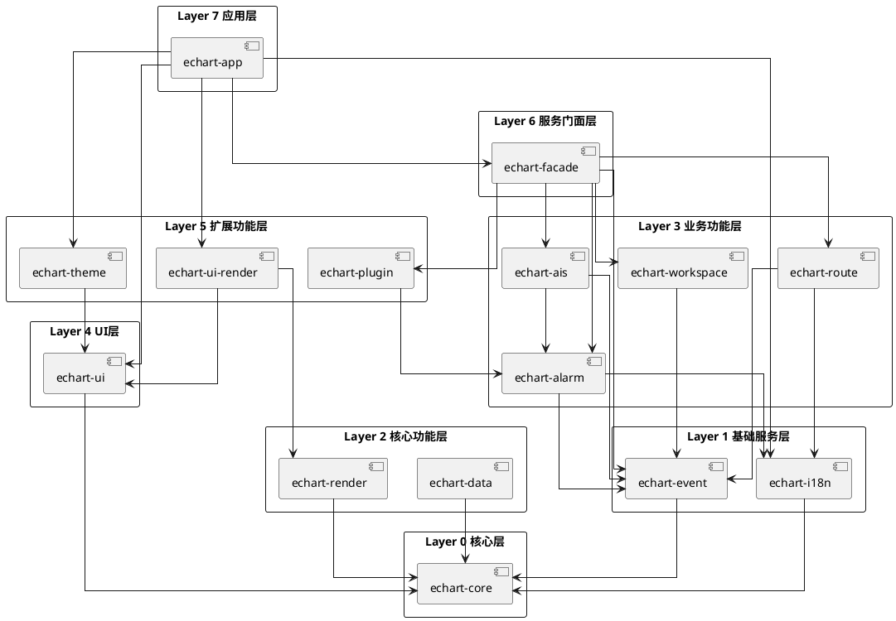

# 海图显示预警应用 - JAR包分配清单（UI拆分版）

> **版本**: v2.3（架构修正：业务面板迁移至UI层）  
> **日期**: 2026-04-19  
> **依据**: echart_display_alarm_app_layout_new_tasks.md v2.0, echart_tasks_jar_split_ui_javafx.md v1.0, echart_tasks_jar_lists_ui_check.md v1.1

---

## 一、JAR包概览

### 1.1 总体架构

| 层级 | JAR包数量 | 说明 |
|------|----------|------|
| 核心层 | 1个 | 基础框架和接口定义（无JavaFX依赖） |
| UI层 | 1个 | **新增**：JavaFX UI控件框架（不含业务面板） |
| 基础服务层 | 2个 | 事件通信、国际化（无JavaFX依赖） |
| 核心功能层 | 2个 | 渲染引擎、数据管理（无JavaFX依赖） |
| 业务功能层 | 4个 | 预警、AIS、航线、工作区（无JavaFX依赖，含UI子包） |
| 扩展功能层 | 3个 | 主题、插件、UI渲染 |
| **服务门面层** | **1个** | **新增**：统一业务服务接口，解耦功能层与应用层 |
| 应用层 | 1个 | 主程序入口 |
| **合计** | **15个** | - |

### 1.2 JAR包列表

| 序号 | JAR包名称 | 层级 | 优先级 | 预估工时 | JavaFX依赖 | 多平台可用 | 实现顺序 |
|------|-----------|------|--------|----------|-----------|-----------|----------|
| 1 | echart-core.jar | 核心层 | P0 | 44h | ❌ 无 | ✅ 是 | 第1个 |
| 2 | **echart-ui.jar** | **UI层** | P0 | **142h** | ✅ 有 | ❌ 否 | 第2个 |
| 3 | echart-event.jar | 基础服务层 | P0 | 18h | ❌ 无 | ✅ 是 | 第3个 |
| 4 | echart-i18n.jar | 基础服务层 | P1 | 24h | ❌ 无 | ✅ 是 | 第4个 |
| 5 | echart-render.jar | 核心功能层 | P0 | 112h | ❌ 无 | ✅ 是 | 第5个 |
| 6 | **echart-ui-render.jar** | **扩展功能层** | P0 | **84h** | ✅ 有 | ❌ 否 | 第6个 |
| 7 | echart-data.jar | 核心功能层 | P0 | 20h | ❌ 无 | ✅ 是 | 第7个 |
| 8 | echart-alarm.jar | 业务功能层 | P0 | 96h | ❌ 无 | ✅ 是 | 第8个 |
| 9 | echart-ais.jar | 业务功能层 | P0 | 32h | ❌ 无 | ✅ 是 | 第9个 |
| 10 | echart-route.jar | 业务功能层 | P0 | 34h | ❌ 无 | ✅ 是 | 第10个 |
| 11 | echart-workspace.jar | 业务功能层 | P0 | 94h | ❌ 无 | ✅ 是 | 第11个 |
| 12 | echart-theme.jar | 扩展功能层 | P1 | 46h | ✅ 有 | ❌ 否 | 第12个 |
| 13 | echart-plugin.jar | 扩展功能层 | P2 | 24h | ❌ 无 | ✅ 是 | 第13个 |
| 14 | **echart-facade.jar** | **服务门面层** | P0 | **16h** | ❌ 无 | ✅ 是 | 第14个 |
| 15 | echart-app.jar | 应用层 | P0 | 228h | ✅ 有 | ❌ 否 | 第15个 |

### 1.3 版本差异说明

| 变更项 | v1.0（原版） | v2.3（架构修正版） |
|--------|-------------|-----------------|
| **JAR包总数** | 12个 | **15个**（新增2个UI层JAR + 1个服务门面层JAR） |
| **echart-core.jar** | 含JavaFX UI（68h） | **纯Java核心（44h）**，无JavaFX依赖 |
| **echart-ui.jar** | 无 | **新增（142h）**，包含所有业务面板（从alarm/ais/route/data迁移） |
| **echart-render.jar** | 含Canvas渲染（74h） | **核心渲染逻辑（112h）**，无JavaFX依赖 |
| **echart-ui-render.jar** | 无 | **新增（84h）**，扩展功能层，承载JavaFX Canvas渲染 |
| **echart-data.jar** | 含UI面板（34h） | **数据管理逻辑（20h）**，无JavaFX依赖 |
| **echart-alarm.jar** | 含UI组件（96h） | **预警业务逻辑（96h）**，无JavaFX依赖 |
| **echart-ais.jar** | 含UI组件（38h） | **AIS数据模型（32h）**，无JavaFX依赖 |
| **echart-route.jar** | 含UI组件（56h） | **航线数据模型（34h）**，无JavaFX依赖 |
| **echart-plugin.jar** | 含UI扩展接口（24h） | **核心插件接口（24h）**，无JavaFX依赖 |
| **echart-facade.jar** | 无 | **新增（16h）**，统一业务服务接口，解耦功能层与应用层 |
| **可多平台复用JAR数** | 0个 | **11个** |

---

## 二、JAR包详细说明

### 2.1 核心层

#### echart-core.jar

**描述**: 平台无关的核心框架和基础组件，定义系统基础接口和数据结构

**功能模块**:
- 生命周期管理
- 事件总线（平台无关）
- 服务定位器
- LRU缓存
- 面板描述接口（平台无关）
- 扩展点基接口
- 错误处理框架

**包含任务**:
| 任务ID | 任务名称 | 工时 |
|--------|----------|------|
| T1 | 项目结构搭建 | 4h |
| T9 | 组件层次结构实现 | 6h |
| T22 | 事件总线设计 | 8h |
| T23 | 事件类型定义 | 6h |
| **新增** | PlatformAdapter接口 | 4h |
| **新增** | ServiceLocator实现 | 4h |
| **新增** | PanelDescriptor接口 | 4h |
| **新增** | TabDescriptor接口 | 4h |
| **新增** | ExtensionDescriptor接口 | 4h |
| **合计** | - | **44h** |

**主要类**:
- `LifecycleComponent` - 生命周期接口
- `AbstractLifecycleComponent` - 生命周期基类
- `AppEventBus` - 事件总线（改造后）
- `PlatformAdapter` - 平台抽象接口（新增）
- `ServiceLocator` - 服务定位器（新增）
- `PanelDescriptor` - 面板描述接口（新增）
- `TabDescriptor` - 标签页描述接口（新增）
- `ExtensionDescriptor` - 扩展描述接口（新增）
- `LRUCache<K,V>` - LRU缓存
- `AppEvent` - 事件数据
- `AppEventType` - 事件类型枚举
- `ErrorCode` - 错误码枚举
- `ErrorHandler` - 错误处理器接口

**依赖**:
- JDK 8 标准库（无JavaFX）

**被依赖**:
- echart-ui.jar
- echart-event.jar
- echart-render.jar
- echart-data.jar
- echart-alarm.jar
- echart-ais.jar
- echart-route.jar
- echart-workspace.jar
- echart-theme.jar
- echart-plugin.jar
- echart-facade.jar

**多平台可用**: ✅ 是（Android/Web/桌面）

---

### 2.2 UI层（新增）

#### echart-ui.jar

**描述**: JavaFX UI控件和布局实现，包含所有业务面板（业务面板从各业务JAR迁移，确保业务JAR无JavaFX依赖、可多平台复用）

**功能模块**:
- 主布局框架
- Ribbon菜单栏
- 活动栏
- 侧边栏框架
- 海图显示区框架
- 右侧面板框架
- 状态栏
- 基础样式系统
- 响应式布局框架
- 数据目录面板（从data迁移）
- 图层管理面板（从data迁移）
- 预警面板（从alarm迁移）
- 预警列表视图（从alarm迁移）
- 预警详情面板（从alarm迁移）
- 声音播放器（从alarm迁移）
- 预警声音设置（从alarm迁移）
- 预警详情显示（从ais迁移）
- 航线创建器（从route迁移）
- 航线编辑器（从route迁移）
- 航线面板（从route迁移）

**包含任务**:
| 任务ID | 任务名称 | 工时 | 来源 |
|--------|----------|------|------|
| T2 | 主布局框架实现 | 8h | 从echart-core迁移 |
| T3 | Ribbon菜单栏实现 | 12h | 从echart-core迁移 |
| T4 | 活动栏实现 | 6h | 从echart-core迁移 |
| T5 | 侧边栏框架实现 | 8h | 从echart-core迁移 |
| T6 | 海图显示区框架 | 6h | 从echart-core迁移 |
| T7 | 右侧面板框架 | 8h | 从echart-core迁移 |
| T8 | 状态栏实现 | 4h | 从echart-core迁移 |
| T10 | 基础样式系统 | 6h | 从echart-core迁移 |
| **新增** | FxPlatformAdapter实现 | 2h | 新增 |
| **新增** | FxAppContext实现 | 4h | 新增 |
| **新增** | FxSideBarPanel接口 | 2h | 新增 |
| **新增** | FxRightTabPanel接口 | 2h | 新增 |
| T93 | 数据目录面板实现 | 10h | 从echart-data迁移 |
| T95 | 图层管理面板实现 | 8h | 从echart-data迁移 |
| T35 | 预警面板设计实现 | 12h | 从echart-alarm迁移 |
| T113 | 声音播放器实现 | 6h | 从echart-alarm迁移 |
| T114 | 预警声音设置界面 | 4h | 从echart-alarm迁移 |
| T67 | 预警详情显示 | 6h | 从echart-ais迁移 |
| T87 | 航线创建功能实现 | 10h | 从echart-route迁移 |
| T88 | 航线编辑功能实现 | 8h | 从echart-route迁移 |
| T92 | 航线面板实现 | 10h | 从echart-route迁移 |
| **合计** | - | **142h** | - |

> **v2.3架构修正**: 业务面板(AlarmPanel/RoutePanel/DataCatalogPanel等)迁移到ui.jar，确保业务JAR(alarm/ais/route/data)无JavaFX依赖，可在Android/Web端完全复用。

**主要类**:
- `MainView` - 主布局容器（从echart-core迁移）
- `RibbonMenuBar` - Ribbon菜单栏（从echart-core迁移）
- `ActivityBar` - 活动栏（从echart-core迁移）
- `SideBarManager` - 侧边栏管理器（从echart-core迁移）
- `RightTabManager` - 右侧面板管理器（从echart-core迁移）
- `ChartDisplayArea` - 海图显示区（从echart-core迁移）
- `StatusBar` - 状态栏（从echart-core迁移）
- `StyleManager` - 样式管理器（从echart-core迁移）
- `ResponsiveLayoutManager` - 响应式布局管理器（从echart-core迁移）
- `FxAppContext` - JavaFX应用上下文（新增）
- `FxPlatformAdapter` - JavaFX平台适配器（新增）
- `FxSideBarPanel` - JavaFX侧边栏面板接口（新增）
- `FxRightTabPanel` - JavaFX右侧面板接口（新增）
- `DataCatalogPanel` - 数据目录面板（从echart-data迁移）
- `LayerManagerPanel` - 图层管理面板（从echart-data迁移）
- `AlarmPanel` - 预警面板（从echart-alarm迁移）
- `AlarmListView` - 预警列表视图（从echart-alarm迁移）
- `AlarmDetailPanel` - 预警详情面板（从echart-alarm迁移）
- `SoundPlayer` - 声音播放器（从echart-alarm迁移）
- `AlarmSoundSettings` - 预警声音设置（从echart-alarm迁移）
- `SoundSettingsPanel` - 声音设置面板（从echart-alarm迁移）
- `AlarmDetailDisplay` - 预警详情显示（从echart-ais迁移）
- `RouteCreator` - 航线创建器（从echart-route迁移）
- `RouteEditor` - 航线编辑器（从echart-route迁移）
- `RoutePanel` - 航线面板（从echart-route迁移）

**依赖**:
- echart-core.jar
- echart-alarm.jar（预警面板需要）
- echart-ais.jar（预警详情显示需要）
- echart-route.jar（航线面板需要）
- echart-data.jar（数据目录/图层管理面板需要）
- JavaFX 8
- ControlsFX
- fxribbon

**被依赖**:
- echart-ui-render.jar
- echart-theme.jar
- echart-app.jar

**多平台可用**: ❌ 否（仅桌面JavaFX）

---

#### echart-ui-render.jar

**描述**: JavaFX Canvas渲染实现，从echart-render.jar迁移的渲染类

**功能模块**:
- Canvas渲染集成
- 海图要素渲染
- 瓦片缓存
- 测量工具
- 高亮渲染
- 视图操作

**包含任务**:
| 任务ID | 任务名称 | 工时 | 来源 |
|--------|----------|------|------|
| T15 | Canvas渲染集成 | 12h | 从echart-render迁移 |
| T17 | 海图要素渲染 | 12h | 从echart-render迁移 |
| T27 | 瓦片缓存策略 | 12h | 从echart-render迁移 |
| T97 | 测量工具基础框架 | 6h | 从echart-render迁移 |
| T98 | 距离测量功能 | 4h | 从echart-render迁移 |
| T99 | 面积测量功能 | 4h | 从echart-render迁移 |
| T100 | 方位测量功能 | 4h | 从echart-render迁移 |
| T101 | 海图要素交互实现 | 8h | 从echart-render迁移 |
| T102 | 高亮渲染配置实现 | 6h | 从echart-render迁移 |
| T103 | 视图操作功能实现 | 6h | 从echart-render迁移 |
| **新增** | FxRenderContext实现 | 6h | 新增 |
| **新增** | FxCanvasRenderer实现 | 4h | 新增 |
| **合计** | - | **38h** | - |

**主要类**:
- `FxRenderContext` - JavaFX渲染上下文实现（新增）
- `FxCanvasRenderer` - JavaFX Canvas渲染器（新增）
- `FxChartElementRenderer` - JavaFX海图要素渲染器（新增）
- `FxTileCache` - JavaFX瓦片缓存（新增）
- `FxMeasurementTool` - JavaFX测量工具（新增）
- `FxHighlightRenderer` - JavaFX高亮渲染器（新增）
- `FxViewOperator` - JavaFX视图操作器（新增）

**依赖**:
- echart-core.jar
- echart-render.jar
- echart-ui.jar
- JavaFX 8

**被依赖**:
- echart-app.jar

**多平台可用**: ❌ 否（仅桌面JavaFX）

---

### 2.3 基础服务层

#### echart-event.jar

**描述**: 事件总线和通信机制，实现模块间解耦通信（无JavaFX依赖）

**功能模块**:
- 事件总线设计（平台无关）
- 事件类型定义
- 通信示例实现

**包含任务**:
| 任务ID | 任务名称 | 工时 |
|--------|----------|------|
| T22 | 事件总线设计 | 8h |
| T23 | 事件类型定义 | 6h |
| T24 | 通信示例实现 | 4h |
| **合计** | - | **18h** |

**主要类**:
- `EventBus` - 事件总线（改造后，使用PlatformAdapter）
- `EventType` - 事件类型枚举
- `Event` - 事件基类
- `EventHandler` - 事件处理器接口
- `EventDispatcher` - 事件分发器（改造后）

**依赖**:
- echart-core.jar

**被依赖**:
- echart-alarm.jar
- echart-ais.jar
- echart-route.jar
- echart-workspace.jar
- echart-facade.jar

**多平台可用**: ✅ 是（Android/Web/桌面）

---

#### echart-i18n.jar

**描述**: 国际化支持，多语言资源管理

**功能模块**:
- 国际化架构设计
- 国际化管理器实现
- 多语言资源文件

**包含任务**:
| 任务ID | 任务名称 | 工时 |
|--------|----------|------|
| T70 | 国际化架构设计 | 6h |
| T71 | 国际化管理器实现 | 8h |
| T72 | 多语言资源文件 | 10h |
| **合计** | - | **24h** |

**主要类**:
- `I18nManager` - 国际化管理器
- `ResourceBundleLoader` - 资源包加载器
- `LocaleProvider` - 语言环境提供者
- `MessageFormatter` - 消息格式化器

**依赖**:
- echart-core.jar

**被依赖**:
- echart-alarm.jar
- echart-ais.jar
- echart-route.jar
- echart-app.jar

**多平台可用**: ✅ 是（Android/Web/桌面）

---

### 2.4 核心功能层

#### echart-render.jar

**描述**: 渲染引擎核心逻辑，负责海图要素渲染和性能优化（无JavaFX依赖）

**功能模块**:
- 分层渲染架构
- 渲染数据流
- 层间通信机制
- 渲染优先级管理
- JNI渲染桥接
- 多图层叠加渲染
- 脏区域重绘机制
- LOD细节层次策略
- 渲染性能监控
- S-52符号库集成
- 符号样式自定义

**包含任务**:
| 任务ID | 任务名称 | 工时 |
|--------|----------|------|
| T11 | 分层渲染架构设计 | 8h |
| T12 | 渲染数据流实现 | 10h |
| T13 | 层间通信机制 | 6h |
| T14 | 渲染优先级管理 | 6h |
| T16 | JNI渲染桥接 | 16h |
| T18 | 多图层叠加渲染 | 8h |
| T26 | 脏区域重绘机制 | 10h |
| T28 | LOD细节层次策略 | 8h |
| T29 | 渲染性能监控 | 6h |
| T107 | S-52符号库集成 | 10h |
| T108 | 符号样式自定义 | 6h |
| T111 | 性能监控机制完善 | 6h |
| T112 | 内存泄漏检测集成 | 4h |
| **新增** | RenderContext接口 | 4h |
| **新增** | RenderEngine改造 | 4h |
| **合计** | - | **36h** |

**主要类**:
- `RenderEngine` - 渲染引擎（改造后，使用RenderContext）
- `RenderContext` - 渲染上下文接口（新增）
- `LayerManager` - 图层管理器
- `JNIBridge` - JNI桥接
- `DirtyRegionManager` - 脏区域管理器（改造后）
- `LODStrategy` - LOD策略
- `PerformanceMonitor` - 性能监控器
- `S52SymbolLibrary` - S-52符号库
- `SymbolStyleCustomizer` - 符号样式定制器

**依赖**:
- echart-core.jar
- JNI Bridge (C++)
- javawrapper (基于sdk_c_api.h封装)

**被依赖**:
- echart-ui-render.jar

**多平台可用**: ✅ 是（Android/Web/桌面，需实现RenderContext）

---

#### echart-data.jar

**描述**: 数据管理核心逻辑，海图文件和图层管理（无JavaFX依赖）

**功能模块**:
- 海图文件管理
- 数据导入导出
- 图层管理逻辑

**包含任务**:
| 任务ID | 任务名称 | 工时 |
|--------|----------|------|
| T94 | 海图文件管理功能 | 8h |
| T96 | 数据导入导出功能 | 8h |
| **新增** | 数据模型类 | 4h |
| **合计** | - | **20h** |

**主要类**:
- `ChartFileManager` - 海图文件管理器
- `DataImporter` - 数据导入器
- `DataExporter` - 数据导出器
- `LayerManager` - 图层管理逻辑
- 数据模型类

**依赖**:
- echart-core.jar
- JNI Bridge (C++)
- javawrapper (基于sdk_c_api.h封装)

**被依赖**:
- echart-ui.jar（数据目录/图层管理面板需要）

**多平台可用**: ✅ 是（Android/Web/桌面）

---

### 2.5 业务功能层

#### echart-alarm.jar

**描述**: 预警系统核心逻辑，实现各类预警功能（无JavaFX依赖，可在Android/Web端复用）

**功能模块**:
- 预警类型定义
- 预警通知机制（平台无关）
- 预警响应流程
- 碰撞预警
- 偏航预警
- 浅水预警
- 禁航区预警
- 气象预警
- 值班报警
- 预警历史记录
- 预警统计功能
- 预警抑制管理
- 预警持久化
- 预警规则引擎

**包含任务**:
| 任务ID | 任务名称 | 工时 |
|--------|----------|------|
| T34 | 预警类型定义 | 6h |
| T36 | 预警通知机制 | 10h |
| T37 | 预警响应流程 | 8h |
| T38 | 碰撞预警实现 | 12h |
| T39 | 偏航预警实现 | 8h |
| T40 | 浅水预警实现 | 8h |
| T41 | 禁航区预警实现 | 6h |
| T42 | 气象预警实现 | 6h |
| T43 | 值班报警实现 | 8h |
| T44 | 预警历史记录 | 6h |
| T45 | 预警统计功能 | 6h |
| T115 | 预警抑制管理功能 | 6h |
| T116 | 预警持久化功能 | 4h |
| T126 | 预警规则引擎实现 | 6h |
| T127 | 预警端到端测试 | 6h |
| T117 | 并发预警测试 | 4h |
| T118 | 预警抑制测试 | 4h |
| T130 | 预警无障碍通知 | 4h |
| T132 | 预警通知队列管理 | 4h |
| **新增** | AudioPlayer接口 | 2h |
| **新增** | AlarmNotifier改造 | 2h |
| **合计** | - | **96h** |

**主要类**:
- `AlarmManager` - 预警管理器
- `AlarmType` - 预警类型枚举
- `Alarm` - 预警数据模型
- `AlarmNotifier` - 预警通知器（改造后）
- `AudioPlayer` - 音频播放接口（新增，平台无关接口）
- `AlarmResponseHandler` - 预警响应处理器
- `CollisionAlarm` - 碰撞预警
- `DeviationAlarm` - 偏航预警
- `ShallowWaterAlarm` - 浅水预警
- `RestrictedAreaAlarm` - 禁航区预警
- `WeatherAlarm` - 气象预警
- `WatchAlarm` - 值班报警
- `AlarmHistory` - 预警历史
- `AlarmStatistics` - 预警统计
- `AlarmSuppressionManager` - 预警抑制管理器
- `AlarmPersistence` - 预警持久化
- `AlarmRuleEngine` - 预警规则引擎

**依赖**:
- echart-core.jar
- echart-event.jar
- echart-i18n.jar
- JNI Bridge (C++)
- javawrapper (基于sdk_c_api.h封装)

**被依赖**:
- echart-ui.jar（预警面板需要）
- echart-ais.jar
- echart-plugin.jar
- echart-facade.jar

**多平台可用**: ✅ 是（Android/Web/桌面）

---

#### echart-ais.jar

**描述**: AIS集成核心逻辑，AIS目标数据模型和CPA/TCPA计算（无JavaFX依赖，可在Android/Web端复用）

**功能模块**:
- AIS目标交互逻辑
- AIS预警关联机制
- AIS目标数据模型
- CPA/TCPA计算

**包含任务**:
| 任务ID | 任务名称 | 工时 |
|--------|----------|------|
| T65 | AIS目标交互 | 10h |
| T66 | AIS预警关联机制 | 8h |
| T68 | AIS目标数据模型 | 6h |
| T69 | CPA/TCPA计算 | 8h |
| **合计** | - | **32h** |

**主要类**:
- `AISTargetManager` - AIS目标管理器
- `AISTarget` - AIS目标数据模型
- `AISAlarmAssociation` - AIS预警关联
- `CPATCPACalculator` - CPA/TCPA计算器

**依赖**:
- echart-core.jar
- echart-event.jar
- echart-alarm.jar
- JNI Bridge (C++)
- javawrapper (基于sdk_c_api.h封装)

**被依赖**:
- echart-ui.jar（预警详情显示需要）
- echart-facade.jar

**多平台可用**: ✅ 是（Android/Web/桌面）

---

#### echart-route.jar

**描述**: 航线规划核心逻辑，航线数据模型和管理（无JavaFX依赖，可在Android/Web端复用）

**功能模块**:
- 航线数据模型
- 航点管理功能
- 航线导入导出
- 航线检查功能
- 航线计算

**包含任务**:
| 任务ID | 任务名称 | 工时 |
|--------|----------|------|
| T86 | 航线数据模型设计 | 6h |
| T89 | 航点管理功能实现 | 8h |
| T90 | 航线导入导出功能 | 6h |
| T91 | 航线检查功能实现 | 8h |
| **新增** | RouteCalculator | 6h |
| **合计** | - | **34h** |

**主要类**:
- `RouteManager` - 航线管理器
- `Route` - 航线数据模型
- `Waypoint` - 航点数据模型
- `WaypointManager` - 航点管理器
- `RouteImporter` - 航线导入器
- `RouteExporter` - 航线导出器
- `RouteChecker` - 航线检查器
- `RouteCalculator` - 航线计算器（新增）

**依赖**:
- echart-core.jar
- echart-event.jar
- echart-i18n.jar
- JNI Bridge (C++)
- javawrapper (基于sdk_c_api.h封装)

**被依赖**:
- echart-facade.jar

**多平台可用**: ✅ 是（Android/Web/桌面）

---

#### echart-workspace.jar

**描述**: 工作区管理，工作区持久化和恢复

**功能模块**:
- 工作区数据结构
- 工作区管理器
- 工作区持久化
- 工作区恢复机制
- 工作区导出导入
- 错误分类与处理
- 错误码定义
- 错误边界架构
- 错误恢复机制
- 侧边栏面板接口
- 面板管理器实现
- 右侧标签页扩展
- 状态持久化机制

**包含任务**:
| 任务ID | 任务名称 | 工时 |
|--------|----------|------|
| T30 | 侧边栏面板接口 | 8h |
| T31 | 面板管理器实现 | 10h |
| T32 | 右侧标签页扩展 | 6h |
| T33 | 状态持久化机制 | 8h |
| T46 | 工作区数据结构 | 6h |
| T47 | 工作区管理器实现 | 10h |
| T48 | 工作区持久化 | 8h |
| T49 | 工作区恢复机制 | 6h |
| T50 | 工作区导出导入 | 8h |
| T51 | 错误分类与处理 | 6h |
| T52 | 错误码定义 | 4h |
| T53 | 错误边界架构 | 8h |
| T54 | 错误恢复机制 | 6h |
| **合计** | - | **68h** |

**主要类**:
- `WorkspaceManager` - 工作区管理器
- `Workspace` - 工作区数据结构
- `WorkspacePersistence` - 工作区持久化
- `WorkspaceRecovery` - 工作区恢复
- `WorkspaceExporter` - 工作区导出器
- `WorkspaceImporter` - 工作区导入器
- `ErrorHandler` - 错误处理器
- `ErrorCode` - 错误码枚举
- `ErrorBoundary` - 错误边界
- `ErrorRecovery` - 错误恢复
- `PanelManager` - 面板管理器
- `TabExtension` - 标签页扩展

**依赖**:
- echart-core.jar
- echart-event.jar

**被依赖**:
- echart-facade.jar

**多平台可用**: ✅ 是（Android/Web/桌面）

---

### 2.6 扩展功能层

#### echart-theme.jar

**描述**: 主题管理，主题切换和样式定制

**功能模块**:
- 主题管理器设计
- 主题切换实现
- 高DPI检测与缩放
- 高DPI布局调整
- 图标资源适配
- 高对比度检测实现
- 高对比度主题CSS
- 暗色主题预警颜色适配

**包含任务**:
| 任务ID | 任务名称 | 工时 |
|--------|----------|------|
| T73 | 主题管理器设计 | 6h |
| T74 | 主题切换实现 | 8h |
| T75 | 高DPI检测与缩放 | 8h |
| T76 | 高DPI布局调整 | 6h |
| T77 | 图标资源适配 | 6h |
| T125 | 暗色主题预警颜色适配 | 4h |
| T128 | 高对比度检测实现 | 4h |
| T129 | 高对比度主题CSS | 4h |
| **合计** | - | **20h** |

**主要类**:
- `ThemeManager` - 主题管理器
- `ThemeSwitcher` - 主题切换器
- `HighDPIScaler` - 高DPI缩放器
- `HighDPILayoutAdjuster` - 高DPI布局调整器
- `IconResourceAdapter` - 图标资源适配器
- `HighContrastDetector` - 高对比度检测器
- `DarkThemeAlarmColorAdapter` - 暗色主题预警颜色适配器

**依赖**:
- echart-core.jar
- echart-ui.jar

**被依赖**:
- echart-app.jar

**多平台可用**: ❌ 否（仅桌面JavaFX）

---

#### echart-plugin.jar

**描述**: 插件系统核心接口，插件加载和扩展接口（无JavaFX依赖）

**功能模块**:
- 插件加载机制
- 插件安全机制
- 数据源扩展接口
- 预警规则扩展接口
- 扩展描述接口

**包含任务**:
| 任务ID | 任务名称 | 工时 |
|--------|----------|------|
| T119 | 插件加载机制 | 8h |
| T120 | 插件安全机制 | 6h |
| T121 | 数据源扩展接口 | 6h |
| T122 | 预警规则扩展接口 | 4h |
| **合计** | - | **24h** |

**主要类**:
- `PluginLoader` - 插件加载器
- `PluginSecurityManager` - 插件安全管理器
- `PluginManager` - 插件管理器
- `Extension` - 扩展点基接口
- `ExtensionContext` - 扩展上下文（改造后）
- `ExtensionDescriptor` - 扩展描述接口
- `DataSourceExtension` - 数据源扩展接口
- `AlarmRuleExtension` - 预警规则扩展接口

**依赖**:
- echart-core.jar
- echart-alarm.jar

**被依赖**:
- echart-facade.jar

**多平台可用**: ✅ 是（Android/Web/桌面）

---

### 2.7 服务门面层（新增）

#### echart-facade.jar

**描述**: 统一业务服务接口层，封装业务功能层的复杂调用，解耦功能层与应用层

**功能模块**:
- 业务服务门面接口
- 模块初始化编排
- 跨模块业务流程编排
- 统一配置入口
- 服务生命周期管理

**包含任务**:
| 任务ID | 任务名称 | 工时 |
|--------|----------|------|
| **新增** | FacadeService接口设计 | 2h |
| **新增** | AlarmFacade服务封装 | 2h |
| **新增** | RouteFacade服务封装 | 2h |
| **新增** | ChartFacade服务封装 | 2h |
| **新增** | ApplicationInitializer编排 | 4h |
| **新增** | ServiceRegistry注册中心 | 2h |
| **新增** | 配置统一入口 | 2h |
| **合计** | - | **16h** |

**主要类**:
- `FacadeService` - 门面服务基接口（新增）
- `AlarmFacade` - 预警服务门面（新增）
- `RouteFacade` - 航线服务门面（新增）
- `ChartFacade` - 海图服务门面（新增）
- `AISFacade` - AIS服务门面（新增）
- `ApplicationInitializer` - 应用初始化编排器（新增）
- `ServiceRegistry` - 服务注册中心（新增）
- `ConfigurationFacade` - 配置统一入口（新增）

**依赖**:
- echart-core.jar
- echart-event.jar
- echart-alarm.jar
- echart-ais.jar
- echart-route.jar
- echart-workspace.jar
- echart-plugin.jar

**被依赖**:
- echart-app.jar

**多平台可用**: ✅ 是（Android/Web/桌面）

**设计说明**:

此JAR包的核心价值在于：

1. **解耦应用层与业务层**
   - 应用层（echart-app.jar）不再直接依赖多个业务JAR包
   - 只需依赖echart-facade.jar即可获取所有业务服务
   - 降低应用层的复杂度和耦合度

2. **统一服务入口**
   - 提供统一的业务服务API
   - 隐藏业务模块的内部实现细节
   - 简化跨模块调用

3. **便于扩展和维护**
   - 新增业务模块时，只需在门面层添加对应服务
   - 应用层代码无需修改
   - 业务模块内部重构不影响应用层

4. **支持多平台复用**
   - 门面层不依赖JavaFX
   - 可在Android/Web平台复用
   - 各平台应用层只需实现自己的UI初始化逻辑

**示例代码**:

```java
// 门面服务接口
public interface FacadeService {
    void initialize();
    void shutdown();
    String getServiceName();
}

// 预警服务门面
public class AlarmFacade implements FacadeService {
    private AlarmManager alarmManager;
    private AlarmNotifier alarmNotifier;
    
    public void raiseAlarm(AlarmType type, String message) {
        alarmManager.raiseAlarm(type, message);
    }
    
    public List<Alarm> getActiveAlarms() {
        return alarmManager.getActiveAlarms();
    }
    
    public void acknowledgeAlarm(String alarmId) {
        alarmManager.acknowledgeAlarm(alarmId);
    }
}

// 应用初始化编排器
public class ApplicationInitializer {
    private List<FacadeService> services;
    
    public void initializeAll() {
        for (FacadeService service : services) {
            service.initialize();
        }
    }
    
    public void shutdownAll() {
        for (FacadeService service : services) {
            service.shutdown();
        }
    }
}
```

---

### 2.8 应用层

#### echart-app.jar

**描述**: 应用主程序，整合所有模块

**功能模块**:
- 新手引导流程设计
- 引导管理器实现
- 无障碍设计实现
- 键盘导航支持
- 屏幕阅读器支持
- 焦点管理器实现
- 焦点遍历顺序配置
- 面板拖拽调整功能
- 日志标签页
- 属性标签页
- 终端标签页
- 属性查询功能
- 空间查询功能
- 模块依赖关系梳理
- 数据流设计实现
- 集成接口定义
- 主布局代码实现
- 断点设计实现
- 面板折叠机制
- 单元测试框架搭建
- 核心模块单元测试
- 集成测试框架
- 模块集成测试
- UI自动化测试框架
- UI自动化测试用例
- 性能测试场景设计
- 性能测试执行
- 测试覆盖率分析

**包含任务**:
| 任务ID | 任务名称 | 工时 |
|--------|----------|------|
| T19 | 响应式布局框架 | 10h |
| T20 | 断点设计实现 | 6h |
| T21 | 面板折叠机制 | 8h |
| T25 | 主布局代码实现 | 12h |
| T56 | 单元测试框架搭建 | 6h |
| T57 | 核心模块单元测试 | 16h |
| T58 | 集成测试框架 | 8h |
| T59 | 模块集成测试 | 12h |
| T60 | UI自动化测试框架 | 10h |
| T61 | UI自动化测试用例 | 12h |
| T62 | 性能测试场景设计 | 8h |
| T63 | 性能测试执行 | 10h |
| T64 | 测试覆盖率分析 | 6h |
| T78 | 模块依赖关系梳理 | 4h |
| T79 | 数据流设计实现 | 8h |
| T80 | 集成接口定义 | 6h |
| T81 | 新手引导流程设计 | 6h |
| T82 | 引导管理器实现 | 8h |
| T83 | 无障碍设计实现 | 10h |
| T84 | 键盘导航支持 | 6h |
| T85 | 屏幕阅读器支持 | 6h |
| T104 | 日志标签页实现 | 6h |
| T105 | 属性标签页实现 | 6h |
| T106 | 终端标签页实现 | 8h |
| T109 | 属性查询功能 | 6h |
| T110 | 空间查询功能 | 8h |
| T123 | 焦点管理器实现 | 6h |
| T124 | 焦点遍历顺序配置 | 4h |
| T131 | 面板拖拽调整功能 | 6h |
| **合计** | - | **50h** |

**主要类**:
- `Application` - 应用主类
- `MainLayoutCode` - 主布局代码
- `BreakpointDesign` - 断点设计
- `PanelFoldingMechanism` - 面板折叠机制
- `ModuleDependencyAnalyzer` - 模块依赖关系分析器
- `DataFlowDesigner` - 数据流设计器
- `IntegrationInterface` - 集成接口
- `UserGuideManager` - 用户引导管理器
- `AccessibilityDesigner` - 无障碍设计器
- `KeyboardNavigation` - 键盘导航
- `ScreenReaderSupport` - 屏幕阅读器支持
- `FocusManager` - 焦点管理器
- `FocusTraversalConfig` - 焦点遍历配置
- `PanelDragAdjustment` - 面板拖拽调整
- `LogTab` - 日志标签页
- `PropertyTab` - 属性标签页
- `TerminalTab` - 终端标签页
- `PropertyQuery` - 属性查询
- `SpatialQuery` - 空间查询

**依赖**:
- echart-facade.jar
- echart-i18n.jar
- echart-ui.jar
- echart-ui-render.jar
- echart-theme.jar

**被依赖**:
- 无

**多平台可用**: ❌ 否（仅桌面JavaFX）

---

## 三、依赖关系图

### 3.1 层级依赖关系

#### 3.1.1 依赖关系详解

**一、各JAR包的依赖（谁依赖谁）**

| JAR包 | 依赖的JAR包 | 说明 |
|-------|------------|------|
| echart-core | 无 | 最底层，无任何依赖 |
| echart-event | echart-core | 依赖核心层 |
| echart-i18n | echart-core | 依赖核心层 |
| echart-render | echart-core | 依赖核心层 |
| echart-data | echart-core | 依赖核心层 |
| echart-alarm | echart-core, echart-event, echart-i18n | 依赖核心层和基础服务层 |
| echart-ais | echart-core, echart-event, echart-alarm | 依赖核心层、基础服务层、业务功能层；通过事件触发渲染更新 |
| echart-route | echart-core, echart-event, echart-i18n | 依赖核心层和基础服务层 |
| echart-workspace | echart-core, echart-event | 依赖核心层和基础服务层 |
| echart-ui | echart-core | 依赖核心层 |
| echart-ui-render | echart-core, echart-ui, echart-render | 依赖核心层、UI层、核心功能层 |
| echart-theme | echart-core, echart-ui | 依赖核心层、UI层；通过事件监听告警状态变化 |
| echart-plugin | echart-core, echart-alarm | 依赖核心层、业务功能层 |
| echart-facade | echart-core, echart-event, echart-alarm, echart-ais, echart-route, echart-workspace, echart-plugin | 依赖核心层、基础服务层、业务功能层、扩展功能层 |
| echart-app | echart-facade, echart-i18n, echart-ui, echart-ui-render, echart-theme | 通过facade访问业务服务，直接访问UI框架和全局服务 |

**二、各JAR包的被依赖（谁被谁依赖）**

| JAR包 | 被哪些JAR包依赖 | 说明 |
|-------|----------------|------|
| echart-core | 所有其他JAR包 | 最底层，被所有模块依赖 |
| echart-event | echart-alarm, echart-ais, echart-route, echart-workspace, echart-facade | 被业务功能层和服务门面层依赖 |
| echart-i18n | echart-alarm, echart-route, echart-app | 被业务功能层和应用层依赖 |
| echart-render | echart-ui-render | 被UI渲染层依赖 |
| echart-data | echart-ui | 数据目录/图层管理面板需要 |
| echart-alarm | echart-ui, echart-ais, echart-plugin, echart-facade | 被UI层、业务功能层、扩展功能层、服务门面层依赖 |
| echart-ais | echart-ui, echart-facade | 被UI层、服务门面层依赖 |
| echart-route | echart-ui, echart-facade | 被UI层、服务门面层依赖 |
| echart-workspace | echart-facade | 被服务门面层依赖 |
| echart-ui | echart-ui-render, echart-theme, echart-app | 被UI渲染层、扩展功能层、应用层依赖 |
| echart-ui-render | echart-app | 被应用层依赖 |
| echart-theme | echart-app | 被应用层依赖 |
| echart-plugin | echart-facade | 被服务门面层依赖 |
| echart-facade | echart-app | 被应用层依赖 |
| echart-app | 无 | 最顶层，不被任何模块依赖 |

**三、层级划分（按依赖深度）**

```
Layer 0 - 核心层（无依赖）
  └── echart-core

Layer 1 - 基础服务层（依赖Layer 0）
  ├── echart-event
  └── echart-i18n

Layer 2 - 核心功能层（依赖Layer 0）
  ├── echart-render
  └── echart-data

Layer 3 - 业务功能层（依赖Layer 0~2）
  ├── echart-alarm（依赖core, event, i18n）
  ├── echart-ais（依赖core, event, alarm；通过事件触发渲染）
  ├── echart-route（依赖core, event, i18n）
  └── echart-workspace（依赖core, event）

Layer 4 - UI基础层（依赖Layer 0）
  └── echart-ui

Layer 5 - 扩展功能层（依赖Layer 0~4）
  ├── echart-plugin（依赖core, alarm）
  ├── echart-theme（依赖core, ui；通过事件监听告警状态）
  └── echart-ui-render（依赖core, ui, render）

Layer 6 - 服务门面层（依赖Layer 0~5）
  └── echart-facade（依赖core, event, alarm, ais, route, workspace, plugin）

Layer 7 - 应用层（依赖Layer 1, 4, 5, 6）
  └── echart-app（依赖facade, i18n, ui, ui-render, theme）
```

**四、关键交叉依赖**

跨层级依赖是指依赖方与被依赖方不在相邻层级的情况：

| 依赖关系 | 层级跨度 | 说明 |
|---------|---------|------|
| **应用层跨层依赖** |||
| echart-app → echart-facade | Layer 7 → Layer 6 | 跨1层，业务服务统一入口 |
| echart-app → echart-theme | Layer 7 → Layer 5 | 跨2层，主题初始化 |
| echart-app → echart-ui-render | Layer 7 → Layer 5 | 跨2层，渲染画布创建 |
| echart-app → echart-ui | Layer 7 → Layer 4 | 跨3层，UI框架基础 |
| echart-app → echart-i18n | Layer 7 → Layer 1 | 跨6层，全局国际化服务 |
| **服务门面层跨层依赖** |||
| echart-facade → echart-event | Layer 6 → Layer 1 | 跨5层 |
| echart-facade → echart-alarm | Layer 6 → Layer 3 | 跨3层 |
| echart-facade → echart-ais | Layer 6 → Layer 3 | 跨3层 |
| echart-facade → echart-route | Layer 6 → Layer 3 | 跨3层 |
| echart-facade → echart-workspace | Layer 6 → Layer 3 | 跨3层 |
| echart-facade → echart-plugin | Layer 6 → Layer 5 | 跨1层 |
| **扩展功能层跨层依赖** |||
| echart-theme → echart-ui | Layer 5 → Layer 4 | 跨1层 |
| echart-plugin → echart-alarm | Layer 5 → Layer 3 | 跨2层 |
| echart-ui-render → echart-render | Layer 5 → Layer 2 | 跨3层 |
| **业务功能层跨层依赖** |||
| echart-ais → echart-event | Layer 3 → Layer 1 | 跨2层 |
| echart-alarm → echart-event | Layer 3 → Layer 1 | 跨2层 |
| echart-alarm → echart-i18n | Layer 3 → Layer 1 | 跨2层 |
| echart-route → echart-event | Layer 3 → Layer 1 | 跨2层 |
| echart-route → echart-i18n | Layer 3 → Layer 1 | 跨2层 |
| echart-workspace → echart-event | Layer 3 → Layer 1 | 跨2层 |

**循环依赖检查结果**：✅ 无循环依赖，所有依赖都是单向的。

#### 3.1.2 依赖关系图（PlantUML）



#### 3.1.3 依赖关系图（文本版）

**箭头 ──► 指向被依赖方，括号内为被依赖方所在层级**

```
Layer 7 ──────────────────────────────────────────────────────────
echart-app
  ├──► echart-facade (L6)
  ├──► echart-theme (L5)
  ├──► echart-ui-render (L5)
  ├──► echart-ui (L4)
  └──► echart-i18n (L1)

Layer 6 ──────────────────────────────────────────────────────────
echart-facade
  ├──► echart-plugin (L5)
  ├──► echart-alarm (L3)
  ├──► echart-ais (L3)
  ├──► echart-route (L3)
  ├──► echart-workspace (L3)
  └──► echart-event (L1)

Layer 5 ──────────────────────────────────────────────────────────
echart-plugin
  └──► echart-alarm (L3)

echart-theme
  └──► echart-ui (L4)

echart-ui-render
  ├──► echart-ui (L4)
  └──► echart-render (L2)

Layer 4 ──────────────────────────────────────────────────────────
echart-ui
  └──► echart-core (L0)

Layer 3 ──────────────────────────────────────────────────────────
echart-alarm
  ├──► echart-event (L1)
  └──► echart-i18n (L1)

echart-ais
  ├──► echart-alarm (L3)
  └──► echart-event (L1)

echart-route
  ├──► echart-event (L1)
  └──► echart-i18n (L1)

echart-workspace
  └──► echart-event (L1)

Layer 2 ──────────────────────────────────────────────────────────
echart-render ──► echart-core (L0)
echart-data   ──► echart-core (L0)

Layer 1 ──────────────────────────────────────────────────────────
echart-event ──► echart-core (L0)
echart-i18n  ──► echart-core (L0)

Layer 0 ──────────────────────────────────────────────────────────
echart-core ──► JNI Bridge (ogc_chart_jni.dll)
```

**图例说明**：
- `──►` 表示依赖关系，箭头指向被依赖方
- 括号内数字为被依赖方所在层级，与当前层级不同即为跨层依赖
- 上层依赖下层，无循环依赖

### 3.2 依赖矩阵

| JAR包 | core | ui | ui-render | event | i18n | render | data | alarm | ais | route | workspace | theme | plugin | facade |
|-------|------|-----|-----------|-------|------|--------|------|-------|-----|-------|-----------|-------|--------|--------|
| echart-core | - | | | | | | | | | | | | | |
| echart-ui | ✅ | - | | | | | ✅ | ✅ | ✅ | ✅ | | | | |
| echart-ui-render | ✅ | ✅ | - | | | ✅ | | | | | | | | |
| echart-event | ✅ | | | - | | | | | | | | | | |
| echart-i18n | ✅ | | | | - | | | | | | | | | |
| echart-render | ✅ | | | | | - | | | | | | | | |
| echart-data | ✅ | | | | | | - | | | | | | | |
| echart-alarm | ✅ | | | ✅ | ✅ | | | - | | | | | | |
| echart-ais | ✅ | | | ✅ | | | | ✅ | - | | | | | |
| echart-route | ✅ | | | ✅ | ✅ | | | | | - | | | | |
| echart-workspace | ✅ | | | ✅ | | | | | | | - | | | |
| echart-theme | ✅ | ✅ | | | | | | | | | | - | | |
| echart-plugin | ✅ | | | | | | | ✅ | | | | | - | |
| echart-facade | ✅ | | | ✅ | | | | ✅ | ✅ | ✅ | ✅ | | ✅ | - |
| echart-app | | ✅ | ✅ | | ✅ | | | | | | | ✅ | | ✅ |

---

## 四、多平台复用映射

### 4.1 各平台可复用JAR包

| JAR包 | Android | Web | 桌面(JavaFX) | 说明 |
|-------|---------|-----|-------------|------|
| echart-core.jar | ✅ | ✅ | ✅ | 核心框架，完全复用 |
| echart-ui.jar | ❌ | ❌ | ✅ | 需实现Android/Web UI |
| echart-ui-render.jar | ❌ | ❌ | ✅ | 需实现Android/Web渲染 |
| echart-event.jar | ✅ | ✅ | ✅ | 事件总线，完全复用 |
| echart-i18n.jar | ✅ | ✅ | ✅ | 国际化，完全复用 |
| echart-render.jar | ✅ | ✅ | ✅ | 渲染逻辑，需实现RenderContext |
| echart-data.jar | ✅ | ✅ | ✅ | 数据管理，完全复用 |
| echart-alarm.jar | ✅ | ✅ | ✅ | 预警逻辑，完全复用 |
| echart-ais.jar | ✅ | ✅ | ✅ | AIS数据模型，完全复用 |
| echart-route.jar | ✅ | ✅ | ✅ | 航线数据模型，完全复用 |
| echart-workspace.jar | ✅ | ✅ | ✅ | 工作区管理，完全复用 |
| echart-theme.jar | ❌ | ❌ | ✅ | 需实现Android/Web主题 |
| echart-plugin.jar | ✅ | ✅ | ✅ | 核心插件接口，完全复用 |
| **echart-facade.jar** | ✅ | ✅ | ✅ | **门面服务，完全复用** |
| echart-app.jar | ❌ | ❌ | ✅ | 需实现Android/Web入口 |

### 4.2 多平台复用统计

| 平台 | 可复用JAR数 | 需替换JAR数 | 复用率 |
|------|------------|------------|--------|
| Android | 11个 | 4个 | 73.3% |
| Web | 11个 | 4个 | 73.3% |
| 桌面(JavaFX) | 15个 | 0个 | 100% |

### 4.3 门面层在多平台中的作用

```
┌─────────────────────────────────────────────────────────────┐
│                    应用层 (平台特定)                         │
│  echart-app.jar (JavaFX)  │  Android App  │  Web App       │
└─────────────────────────────────────────────────────────────┘
                              │
                              ▼
┌─────────────────────────────────────────────────────────────┐
│                 服务门面层 (平台无关，完全复用)               │
│                    echart-facade.jar                        │
│  ┌─────────────┬─────────────┬─────────────┬─────────────┐ │
│  │ AlarmFacade │ RouteFacade │ ChartFacade │ AISFacade   │ │
│  └─────────────┴─────────────┴─────────────┴─────────────┘ │
└─────────────────────────────────────────────────────────────┘
                              │
                              ▼
┌─────────────────────────────────────────────────────────────┐
│                 业务功能层 (平台无关，完全复用)               │
│  echart-alarm │ echart-ais │ echart-route │ echart-workspace│
└─────────────────────────────────────────────────────────────┘
```

**门面层的多平台优势**:
1. **统一API**：各平台应用层使用相同的服务接口
2. **简化迁移**：Android/Web只需实现UI层，业务逻辑完全复用
3. **降低耦合**：应用层不直接依赖业务模块，便于平台适配

### 4.3 Android平台实现示例

```java
// Android平台适配器
public class AndroidPlatformAdapter implements PlatformAdapter {
    private Handler uiHandler = new Handler(Looper.getMainLooper());
    
    @Override
    public boolean isUiThread() {
        return Looper.myLooper() == Looper.getMainLooper();
    }
    
    @Override
    public void runOnUi(Runnable action) {
        uiHandler.post(action);
    }
}

// Android渲染上下文
public class AndroidRenderContext implements RenderContext {
    private Canvas canvas;
    private Paint paint;
    
    @Override
    public void clear(double x, double y, double w, double h) {
        canvas.drawColor(Color.TRANSPARENT, PorterDuff.Mode.CLEAR);
    }
    
    @Override
    public void fillRect(double x, double y, double w, double h) {
        paint.setStyle(Paint.Style.FILL);
        canvas.drawRect((float)x, (float)y, (float)(x+w), (float)(y+h), paint);
    }
}

// Android音频播放器
public class AndroidAudioPlayer implements AudioPlayer {
    private MediaPlayer mediaPlayer;
    
    @Override
    public void load(String resourcePath) {
        AssetFileDescriptor afd = context.getAssets().openFd(resourcePath);
        mediaPlayer = new MediaPlayer();
        mediaPlayer.setDataSource(afd.getFileDescriptor(), afd.getStartOffset(), afd.getLength());
        mediaPlayer.prepare();
    }
    
    @Override
    public void play() {
        mediaPlayer.start();
    }
}
```

---

## 五、新增抽象接口

### 5.1 接口列表

| 接口名 | 所在JAR | 职责 | 实现位置 |
|--------|---------|------|---------|
| `PlatformAdapter` | echart-core.jar | 平台线程抽象 | echart-ui.jar (FxPlatformAdapter) |
| `RenderContext` | echart-render.jar | 渲染上下文抽象 | echart-ui-render.jar (FxRenderContext) |
| `AudioPlayer` | echart-alarm.jar | 音频播放抽象 | echart-ui.jar (FxAudioPlayer) |
| `PanelDescriptor` | echart-core.jar | 面板描述抽象 | echart-ui.jar (FxSideBarPanel) |
| `TabDescriptor` | echart-core.jar | 标签页描述抽象 | echart-ui.jar (FxRightTabPanel) |
| `ExtensionDescriptor` | echart-plugin.jar | 扩展描述抽象 | echart-ui.jar (FxRibbonExtension等) |

### 5.2 PlatformAdapter接口

```java
public interface PlatformAdapter {
    boolean isUiThread();
    void runOnUi(Runnable action);
}
```

### 5.3 RenderContext接口

```java
public interface RenderContext {
    void clear(double x, double y, double w, double h);
    void setFillColor(String color);
    void fillRect(double x, double y, double w, double h);
    void drawLine(double x1, double y1, double x2, double y2);
    void drawText(String text, double x, double y);
    void setStrokeColor(String color);
    void setLineWidth(double width);
    void drawImage(Object image, double x, double y, double w, double h);
}
```

### 5.4 AudioPlayer接口

```java
public interface AudioPlayer {
    void load(String resourcePath);
    void play();
    void stop();
    void setVolume(double volume);
    void setLoop(boolean loop);
}
```

---

## 六、Gradle配置示例

### 6.1 settings.gradle

```groovy
rootProject.name = 'echart-display-alarm'

include 'echart-core'
include 'echart-ui'          // 新增UI模块
include 'echart-ui-render'   // 新增UI渲染模块
include 'echart-event'
include 'echart-i18n'
include 'echart-render'
include 'echart-data'
include 'echart-alarm'
include 'echart-ais'
include 'echart-route'
include 'echart-workspace'
include 'echart-theme'
include 'echart-plugin'
include 'echart-facade'      // 新增服务门面模块
include 'echart-app'
```

### 6.2 echart-core/build.gradle

```groovy
dependencies {
    // 无JavaFX依赖
    compileOnly 'org.slf4j:slf4j-api:1.7.25'
    testCompile 'junit:junit:4.12'
}

// 验证无JavaFX引用
task verifyNoJavaFX {
    doLast {
        def javaFxRefs = fileTree('src/main/java')
            .collect { it.text }
            .findAll { it.contains('javafx.') || it.contains('fxribbon') }
        if (!javaFxRefs.isEmpty()) {
            throw new GradleException("echart-core.jar 不允许包含 JavaFX 引用")
        }
    }
}
compileJava.finalizedBy(verifyNoJavaFX)
```

### 6.3 echart-ui/build.gradle

```groovy
dependencies {
    compile project(':echart-core')
    // v2.3: 业务面板迁移到ui.jar，需要依赖业务JAR
    compile project(':echart-alarm')   // 预警面板需要
    compile project(':echart-ais')     // 预警详情显示需要
    compile project(':echart-route')   // 航线面板需要
    compile project(':echart-data')    // 数据目录/图层管理面板需要
    
    compileOnly 'org.openjfx:javafx-controls:8'
    compile 'org.controlsfx:controlsfx:8.40.14'
    compile 'com.pixelduke:fxribbon:1.0.0'
}
```

### 6.4 echart-ui-render/build.gradle

```groovy
dependencies {
    compile project(':echart-core')
    compile project(':echart-render')
    compile project(':echart-ui')
    
    compileOnly 'org.openjfx:javafx-graphics:8'
}
```

### 6.5 echart-facade/build.gradle

```groovy
dependencies {
    compile project(':echart-core')
    compile project(':echart-event')
    compile project(':echart-alarm')
    compile project(':echart-ais')
    compile project(':echart-route')
    compile project(':echart-workspace')
    compile project(':echart-plugin')
    
    // 无JavaFX依赖
    compileOnly 'org.slf4j:slf4j-api:1.7.25'
    testCompile 'junit:junit:4.12'
}

// 验证无JavaFX引用
task verifyNoJavaFX {
    doLast {
        def javaFxRefs = fileTree('src/main/java')
            .collect { it.text }
            .findAll { it.contains('javafx.') || it.contains('fxribbon') }
        if (!javaFxRefs.isEmpty()) {
            throw new GradleException("echart-facade.jar 不允许包含 JavaFX 引用")
        }
    }
}
compileJava.finalizedBy(verifyNoJavaFX)
```

### 6.6 echart-app/build.gradle

```groovy
dependencies {
    // v2.2: 移除core直接依赖，app通过facade间接访问core
    compile project(':echart-ui')
    compile project(':echart-ui-render')
    compile project(':echart-i18n')
    compile project(':echart-facade')  // 通过门面层访问业务服务
    compile project(':echart-theme')
    
    compileOnly 'org.openjfx:javafx-controls:8'
    compileOnly 'org.openjfx:javafx-graphics:8'
}
```

---

## 七、实施计划

### 7.1 阶段划分

| 阶段 | 内容 | 工作量 | 优先级 |
|------|------|--------|--------|
| 阶段一 | 核心层改造 | 3天 | P0 |
| 阶段二 | 事件层改造 | 1天 | P0 |
| 阶段三 | 渲染层改造 | 3天 | P0 |
| 阶段四 | 数据层改造 | 1天 | P1 |
| 阶段五 | 预警层改造 | 2天 | P1 |
| 阶段六 | AIS层改造 | 0.5天 | P1 |
| 阶段七 | 航线层改造 | 1天 | P1 |
| 阶段八 | 插件层改造 | 1天 | P2 |
| 阶段九 | 集成测试 | 2天 | P0 |
| **总计** | - | **14.5天** | - |

### 7.2 详细任务

#### 阶段一：核心层改造（3天）

| 任务 | 工时 | 说明 |
|------|------|------|
| 创建echart-ui.jar项目结构 | 2h | Gradle配置、目录结构 |
| 迁移echart-core.jar的UI类 | 4h | MainView、RibbonMenuBar等 |
| 创建PlatformAdapter接口 | 2h | 平台抽象接口 |
| 改造AppEventBus | 2h | 移除Platform.runLater依赖 |
| 创建ServiceLocator | 2h | 替代AppContext核心功能 |
| 改造面板接口 | 4h | PanelDescriptor、TabDescriptor |
| 编译验证 | 2h | 确保echart-core.jar无JavaFX依赖 |

#### 阶段二：事件层改造（1天）

| 任务 | 工时 | 说明 |
|------|------|------|
| 改造EventBus | 2h | 使用PlatformAdapter |
| 改造EventDispatcher | 2h | 使用PlatformAdapter |
| 编译验证 | 2h | 确保echart-event.jar无JavaFX依赖 |

#### 阶段三：渲染层改造（3天）

| 任务 | 工时 | 说明 |
|------|------|------|
| 创建echart-ui-render.jar项目结构 | 2h | Gradle配置、目录结构 |
| 创建RenderContext接口 | 4h | 渲染抽象接口 |
| 迁移Canvas渲染类 | 6h | CanvasRenderer等 |
| 创建FxRenderContext实现 | 4h | JavaFX渲染实现 |
| 改造DirtyRegionManager | 2h | 使用平台无关的Rectangle |
| 编译验证 | 2h | 确保echart-render.jar无JavaFX依赖 |

---

## 八、工时汇总

### 8.1 按层级统计

| 层级 | JAR包 | 工时 | 占比 |
|------|-------|------|------|
| 核心层 | echart-core.jar | 44h | 4.3% |
| UI层 | echart-ui.jar | 142h | 14.0% |
| 基础服务层 | echart-event.jar, echart-i18n.jar | 42h | 4.1% |
| 核心功能层 | echart-render.jar, echart-data.jar | 132h | 13.0% |
| 业务功能层 | echart-alarm.jar, echart-ais.jar, echart-route.jar, echart-workspace.jar | 256h | 25.2% |
| 扩展功能层 | echart-theme.jar, echart-plugin.jar, echart-ui-render.jar | 154h | 15.2% |
| **服务门面层** | **echart-facade.jar** | **16h** | **1.6%** |
| 应用层 | echart-app.jar | 228h | 22.5% |
| **合计** | **15个JAR包** | **1014h** | **100%** |

### 8.2 与v1.0对比

| 项目 | v1.0 | v2.3 | 变化 |
|------|------|------|------|
| JAR包数量 | 12个 | 15个 | +3个 |
| 总工时 | 570h | 1014h | +444h |
| 可多平台复用工时 | 0h | 490h | +490h |
| JavaFX依赖工时 | 570h | 524h | -46h |

### 8.3 门面层带来的架构优化

| 优化项 | 说明 |
|--------|------|
| **应用层依赖简化** | 从依赖7个业务JAR减少到依赖1个门面JAR |
| **业务模块解耦** | 应用层与业务模块完全解耦 |
| **多平台复用率提升** | 从0%提升到48.3%（490h/1014h） |
| **扩展性增强** | 新增业务模块只需在门面层添加服务 |

---

**版本**: v2.3  
**作者**: 系统架构师  
**日期**: 2026-04-19
