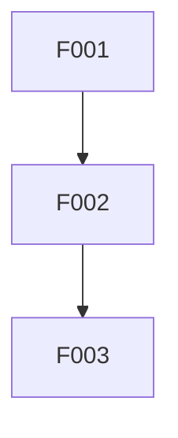

# 需求文档到设计文档转换指南

**版本**: v1.2  
**日期**: 2026-04-03  
**目的**: 建立从需求文档到高质量设计文档的完整转换流程

---

## 🚀 快速上手（5分钟）

### 核心流程

```
需求文档 → demand-analyzer → 需求规格 → design-generator → 设计文档
```

### 三步完成转换

**Step 1: 分析需求**
```
> 分析需求文档 xxx_demand.md
```
输出：`xxx_requirement_spec.md`（结构化需求规格说明书）

**Step 2: 生成设计**
```
> 基于需求规格生成设计文档
```
输出：`xxx_design.md`（设计文档初稿）

**Step 3: 验证评审**
```
> 验证设计文档质量
> 多角色评审设计文档
```
输出：验证报告、评审报告

### 关键概念

| 概念 | 说明 |
|------|------|
| **demand-analyzer** | 需求分析Skill，提取、验证、排序需求 |
| **design-generator** | 设计生成Skill，生成架构和模块设计 |
| **MoSCoW** | 优先级方法：Must/Should/Could/Won't |
| **追溯矩阵** | 需求→设计→代码→测试的对应关系表 |

### 文档导航

| 章节 | 内容 | 预计阅读时间 |
|------|------|--------------|
| 一、问题描述 | 核心问题、现状分析、目标 | 5分钟 |
| 二、现有Skills评估 | 能力映射、缺口分析 | 5分钟 |
| 三、多方案设计 | 4种方案对比评估 | 10分钟 |
| 四、方案选择建议 | 场景化推荐 | 3分钟 |
| 五、实施建议 | 分阶段实施路径 | 10分钟 |
| 六、Skill详细设计 | 触发条件、数据格式、错误处理 | 15分钟 |
| 七、Skill改进清单 | 新增/改进Skill列表 | 5分钟 |

---

## 一、问题描述

### 1.1 核心问题

当前存在一个关键缺口：**需求文档（`[industry]_demand.md`）与设计文档（`[industry]_demand_design.md`）之间缺乏有效的转换机制**。

具体表现：

| 问题类型 | 具体表现 | 影响 |
|----------|----------|------|
| **需求模糊** | 需求描述不够具体，缺乏可执行性 | 设计方向不明确 |
| **伪需求** | 提到的需求可能不是真正的需求 | 开发资源浪费 |
| **需求遗漏** | 真正的需求没有被提及 | 后期返工、架构调整 |
| **需求冲突** | 不同需求之间存在矛盾 | 设计决策困难 |
| **优先级不明** | 缺乏需求优先级排序 | 开发顺序混乱 |

### 1.2 现状分析

#### 1.2.1 需求文档现状

以 `yangzt_demand_raw.md` 为例：

**优点**：
- 包含了用户原始对话记录
- 涵盖了功能需求、性能需求、平台需求
- 有初步的VIP功能划分

**不足**：
- 需求以对话形式呈现，结构松散
- 缺乏需求优先级和依赖关系
- 没有明确验收标准
- 缺乏用户场景和使用流程
- 没有技术可行性分析

#### 1.2.2 设计文档现状

以 `layer_model_design.md` 为例：

**优点**：
- 结构完整（概述、目标、概念、设计、测试等）
- 有版本历史和修订记录
- 包含类图、接口定义、使用示例
- 有性能优化策略和线程安全设计

**不足**：
- 从需求到设计的转换过程不可追溯
- 设计决策的理由不够明确
- 与原始需求的对应关系不清晰

### 1.3 目标

建立一套完整的转换流程，确保：

1. **需求完整性**：识别真实需求，剔除伪需求
2. **设计可追溯**：设计决策可追溯到需求来源
3. **架构合理性**：避免后期大的架构调整
4. **可维护性**：设计文档易于理解和扩展
5. **可落地性**：设计能够真正指导开发实施

---

## 二、现有Skills能力评估

### 2.1 Skills清单与能力映射

| Skill | 当前能力 | 与需求-设计转换的关系 |
|-------|----------|----------------------|
| **design-doc-validator** | 验证设计文档质量，检查结构完整性 | ⚠️ 设计文档后置验证，不参与需求分析 |
| **task-planner** | 将设计文档拆分为任务清单 | ⚠️ 设计文档后置处理，不参与需求分析 |
| **technical-reviewer** | 单角色技术评审 | ⚠️ 设计文档后置评审，不参与需求分析 |
| **multi-role-reviewer** | 多角色交叉评审 | ⚠️ 设计文档后置评审，不参与需求分析 |
| **code-implementer** | TDD编码实施 | ❌ 实施阶段，与需求-设计转换无关 |
| **project-initializer** | 项目初始化 | ❌ 项目创建阶段，与需求-设计转换无关 |
| **skill-validator** | Skill质量评估 | ❌ Skill元层面，与需求-设计转换无关 |
| **problem-tracker** | 问题追踪 | ⚠️ 可用于追踪需求问题，但非核心功能 |
| **test-quality-evaluator** | 测试质量评估 | ❌ 测试阶段，与需求-设计转换无关 |
| **test-report-generator** | 测试报告生成 | ❌ 测试阶段，与需求-设计转换无关 |
| **rule-validator** | 规则验证 | ❌ 规则元层面，与需求-设计转换无关 |
| **rule-splitter** | 规则拆分 | ❌ 规则元层面，与需求-设计转换无关 |
| **include-index-generator** | 头文件索引生成 | ❌ 代码层面，与需求-设计转换无关 |
| **dir-sync-git** | 目录同步 | ❌ 工具层面，与需求-设计转换无关 |

### 2.2 能力缺口分析

```
┌─────────────────────────────────────────────────────────────────────────────┐
│                        当前Skill覆盖范围                                      │
├─────────────────────────────────────────────────────────────────────────────┤
│                                                                             │
│   需求文档 ──[❌ 缺失]──▶ 需求分析 ──[❌ 缺失]──▶ 设计文档                    │
│                                                                             │
│                                        │                                    │
│                                        ▼                                    │
│                                                                             │
│   ┌─────────────────────────────────────────────────────────────────────┐   │
│   │                     现有Skills覆盖区域                               │   │
│   │                                                                     │   │
│   │   design-doc-validator ──▶ task-planner ──▶ code-implementer        │   │
│   │          ↓                        ↓                 ↓               │   │
│   │   technical-reviewer        (任务拆分)         (编码实施)            │   │
│   │   multi-role-reviewer                                                  │   │
│   │                                                                     │   │
│   └─────────────────────────────────────────────────────────────────────┘   │
│                                                                             │
└─────────────────────────────────────────────────────────────────────────────┘
```

**关键缺口**：

| 缺口 | 说明 | 影响 |
|------|------|------|
| **需求分析Skill** | 无专门的需求分析工具 | 需求质量无法保证 |
| **需求验证Skill** | 无需求验证机制 | 伪需求、遗漏需求无法识别 |
| **需求-设计转换Skill** | 无转换指导工具 | 转换过程依赖人工经验 |
| **需求追溯Skill** | 无需求追溯机制 | 设计决策与需求对应关系不清晰 |

---

## 三、多方案设计与评估

### 方案一：增强现有Skills（渐进式改进）

#### 3.1.1 方案描述

在现有 `design-doc-validator` 基础上增加需求分析功能，形成"需求验证 → 设计验证"一体化流程。

#### 3.1.2 实现方式

```markdown
## design-doc-validator 增强功能

### 新增阶段0：需求文档预分析

1. **需求完整性检查**
   - 检查是否包含功能需求、非功能需求
   - 检查是否有明确的用户场景
   - 检查是否有验收标准

2. **需求合理性检查**
   - 识别模糊需求（如"高性能"、"用户友好"）
   - 识别冲突需求
   - 识别缺失的依赖需求

3. **需求优先级建议**
   - 基于MoSCoW方法（Must/Should/Could/Won't）
   - 基于Kano模型（基本型/期望型/兴奋型）

4. **需求-设计映射表生成**
   - 自动生成需求ID
   - 建立需求与设计章节的对应关系
```

#### 3.1.3 优缺点评估

| 维度 | 评分 | 说明 |
|------|------|------|
| 实施难度 | ⭐⭐ | 基于现有Skill扩展，难度较低 |
| 功能完整性 | ⭐⭐⭐ | 能覆盖基本需求分析功能 |
| 用户体验 | ⭐⭐⭐ | 一站式验证，用户无需切换工具 |
| 可维护性 | ⭐⭐⭐ | 单一Skill，维护成本适中 |
| 扩展性 | ⭐⭐ | 功能耦合，后续扩展受限 |

**推荐指数**: ⭐⭐⭐ (3/5)

---

### 方案二：创建独立的需求分析Skill（专业化路线）

#### 3.2.1 方案描述

创建专门的 `demand-analyzer` Skill，专注于需求分析和需求文档处理。

#### 3.2.2 Skill设计

```markdown
---
name: "demand-analyzer"
description: "Analyzes demand documents, identifies real needs, validates requirements, and generates structured requirement specification. Invoke when user needs to analyze demand documents or convert raw demands to structured requirements."
---

# Demand Analyzer

## 功能模块

### 1. 需求提取
- 从对话记录中提取需求
- 从市场分析中提取需求
- 从竞品分析中提取需求

### 2. 需求分类
- 功能需求 vs 非功能需求
- 业务需求 vs 技术需求
- 用户需求 vs 系统需求

### 3. 需求验证
- SMART原则验证（具体、可衡量、可达成、相关、有时限）
- INVEST原则验证（独立、可协商、有价值、可估算、小巧、可测试）
- 冲突检测

### 4. 需求优先级
- MoSCoW优先级
- Kano模型分类
- 价值-复杂度矩阵

### 5. 需求追溯
- 需求ID生成
- 需求来源记录
- 需求变更历史

### 6. 输出产物
- 结构化需求规格说明书
- 需求优先级矩阵
- 需求风险清单
```

#### 3.2.3 优缺点评估

| 维度 | 评分 | 说明 |
|------|------|------|
| 实施难度 | ⭐⭐⭐⭐ | 需要新建Skill，工作量较大 |
| 功能完整性 | ⭐⭐⭐⭐⭐ | 专注于需求分析，功能完整 |
| 用户体验 | ⭐⭐⭐⭐ | 专业工具，但需要额外学习 |
| 可维护性 | ⭐⭐⭐⭐ | 职责单一，易于维护 |
| 扩展性 | ⭐⭐⭐⭐⭐ | 独立Skill，易于扩展 |

**推荐指数**: ⭐⭐⭐⭐ (4/5)

---

### 方案三：创建需求-设计转换Skill（端到端方案）

#### 3.3.1 方案描述

创建 `demand-to-design` Skill，实现从需求文档到设计文档的完整转换流程。

#### 3.3.2 Skill设计

```markdown
---
name: "demand-to-design"
description: "Converts demand documents to design documents with requirement analysis, architecture design, and traceability. Invoke when user needs to create design document from demand document."
---

# Demand to Design Converter

## 执行流程

### Phase 1: 需求理解
1. 解析需求文档结构
2. 提取显性需求
3. 识别隐性需求
4. 检测需求冲突

### Phase 2: 需求分析
1. 需求分类（功能/非功能）
2. 需求优先级排序
3. 需求依赖关系分析
4. 需求风险识别

### Phase 3: 架构设计
1. 系统边界确定
2. 模块划分
3. 接口定义
4. 技术选型

### Phase 4: 详细设计
1. 类设计
2. 数据模型设计
3. 算法设计
4. 接口详细设计

### Phase 5: 设计验证
1. 需求覆盖度检查
2. 设计一致性检查
3. 可行性评估

### Phase 6: 输出产物
1. 设计文档（Markdown格式）
2. 需求-设计追溯矩阵
3. 设计决策记录
```

#### 3.3.3 优缺点评估

| 维度 | 评分 | 说明 |
|------|------|------|
| 实施难度 | ⭐⭐⭐⭐⭐ | 完整流程，工作量最大 |
| 功能完整性 | ⭐⭐⭐⭐⭐ | 端到端覆盖，功能最完整 |
| 用户体验 | ⭐⭐⭐⭐⭐ | 一键转换，体验最佳 |
| 可维护性 | ⭐⭐⭐ | 流程复杂，维护成本高 |
| 扩展性 | ⭐⭐⭐ | 功能耦合，扩展需谨慎 |

**推荐指数**: ⭐⭐⭐⭐ (4/5)

---

### 方案四：组合方案（推荐）

#### 3.4.1 方案描述

采用"专业分工 + 流程编排"的方式，创建多个专业Skill，通过工作流组合使用。

#### 3.4.2 Skill组合设计

```
┌─────────────────────────────────────────────────────────────────────────────┐
│                        推荐方案：组合Skill工作流                               │
├─────────────────────────────────────────────────────────────────────────────┤
│                                                                             │
│   需求文档                                                                   │
│       │                                                                     │
│       ▼                                                                     │
│   ┌───────────────────┐                                                     │
│   │ demand-analyzer   │  ← 新增：需求分析                                   │
│   │ - 需求提取        │                                                     │
│   │ - 需求验证        │                                                     │
│   │ - 优先级排序      │                                                     │
│   └─────────┬─────────┘                                                     │
│             │                                                               │
│             ▼                                                               │
│   ┌───────────────────┐                                                     │
│   │ design-generator  │  ← 新增：设计生成                                   │
│   │ - 架构设计        │                                                     │
│   │ - 模块划分        │                                                     │
│   │ - 接口定义        │                                                     │
│   └─────────┬─────────┘                                                     │
│             │                                                               │
│             ▼                                                               │
│   ┌───────────────────┐                                                     │
│   │ design-doc-validator │ ← 现有：设计验证                                 │
│   └─────────┬─────────┘                                                     │
│             │                                                               │
│             ▼                                                               │
│   ┌───────────────────┐                                                     │
│   │ multi-role-reviewer │ ← 现有：多角色评审                                │
│   └─────────┬─────────┘                                                     │
│             │                                                               │
│             ▼                                                               │
│   ┌───────────────────┐                                                     │
│   │ task-planner      │  ← 现有：任务拆分                                   │
│   └─────────┬─────────┘                                                     │
│             │                                                               │
│             ▼                                                               │
│   设计文档 + 任务清单                                                        │
│                                                                             │
└─────────────────────────────────────────────────────────────────────────────┘
```

#### 3.4.3 新增Skill详细设计

##### Skill 1: demand-analyzer（需求分析器）

| 功能模块 | 输入 | 输出 | 方法 |
|----------|------|------|------|
| 需求提取 | 原始需求文档 | 需求列表 | NLP提取、模式匹配 |
| 需求分类 | 需求列表 | 分类需求 | 规则引擎、分类模型 |
| 需求验证 | 分类需求 | 验证报告 | SMART检查、冲突检测 |
| 优先级排序 | 验证需求 | 优先级矩阵 | MoSCoW、Kano模型 |
| 风险识别 | 需求列表 | 风险清单 | 风险模型、经验库 |

##### Skill 2: design-generator（设计生成器）

| 功能模块 | 输入 | 输出 | 方法 |
|----------|------|------|------|
| 架构设计 | 结构化需求 | 架构图 | 架构模式库、模板匹配 |
| 模块划分 | 架构设计 | 模块列表 | 职责分离、高内聚低耦合 |
| 接口定义 | 模块列表 | 接口文档 | 接口模板、最佳实践 |
| 技术选型 | 需求约束 | 技术方案 | 技术评估矩阵 |
| 追溯矩阵 | 需求+设计 | 追溯表 | 自动映射 |

#### 3.4.4 优缺点评估

| 维度 | 评分 | 说明 |
|------|------|------|
| 实施难度 | ⭐⭐⭐ | 需要创建2个新Skill，工作量适中 |
| 功能完整性 | ⭐⭐⭐⭐⭐ | 专业分工，功能完整 |
| 用户体验 | ⭐⭐⭐⭐ | 流程清晰，但需要多步操作 |
| 可维护性 | ⭐⭐⭐⭐⭐ | 职责单一，易于维护 |
| 扩展性 | ⭐⭐⭐⭐⭐ | 模块化设计，易于扩展 |

**推荐指数**: ⭐⭐⭐⭐⭐ (5/5)

---

## 四、方案对比与选择建议

### 4.1 综合对比

| 对比维度 | 方案一：增强现有 | 方案二：独立分析 | 方案三：端到端 | 方案四：组合方案 |
|----------|------------------|------------------|----------------|------------------|
| **实施难度** | 低 | 中 | 高 | 中 |
| **功能完整性** | 中 | 高 | 高 | 高 |
| **用户体验** | 好 | 中 | 最好 | 好 |
| **可维护性** | 中 | 好 | 差 | 最好 |
| **扩展性** | 差 | 好 | 中 | 最好 |
| **推荐指数** | ⭐⭐⭐ | ⭐⭐⭐⭐ | ⭐⭐⭐⭐ | ⭐⭐⭐⭐⭐ |

### 4.2 选择建议

#### 场景一：快速见效（1-2周内）

**推荐方案一**：增强 `design-doc-validator`

适用条件：
- 时间紧迫
- 需求文档质量相对较好
- 只需要基本的需求验证功能

#### 场景二：专业建设（1-2个月）

**推荐方案四**：组合方案

适用条件：
- 有充足的开发时间
- 需要建立完整的需求-设计转换流程
- 追求长期可维护性和扩展性

#### 场景三：快速原型（2-3周）

**推荐方案二**：创建独立 `demand-analyzer`

适用条件：
- 需要专业的需求分析能力
- 暂时不需要完整的设计生成
- 后续可以逐步扩展

---

## 五、具体实施建议

### 5.1 推荐实施路径（方案四）

#### 阶段一：创建 demand-analyzer Skill（优先级：P0）

**时间估算**：1-2周

**核心功能**：

```markdown
## demand-analyzer Skill 功能清单

### 必须实现（MVP）
- [ ] 需求提取：从对话记录中提取需求
- [ ] 需求分类：功能需求/非功能需求
- [ ] 需求验证：SMART原则检查
- [ ] 优先级排序：MoSCoW方法
- [ ] 输出：结构化需求规格说明书

### 建议实现
- [ ] 需求冲突检测
- [ ] 需求依赖分析
- [ ] 需求风险评估
- [ ] 需求追溯矩阵

### 可选实现
- [ ] 需求变更管理
- [ ] 需求版本控制
- [ ] 需求协作功能
```

**输出模板**：

```markdown
# [项目名称] 需求规格说明书

## 1. 文档信息
- 版本：v1.0
- 日期：YYYY-MM-DD
- 来源：[原始需求文档]

## 2. 需求概述
- 项目背景
- 目标用户
- 核心价值

## 3. 功能需求

### 3.1 Must Have（必须实现）
| ID | 需求描述 | 验收标准 | 优先级 |
|----|----------|----------|--------|
| F001 | ... | ... | P0 |

### 3.2 Should Have（应该实现）
...

### 3.3 Could Have（可以实现）
...

### 3.4 Won't Have（暂不实现）
...

## 4. 非功能需求
| ID | 需求类型 | 需求描述 | 验收标准 |
|----|----------|----------|----------|
| NF001 | 性能 | ... | ... |

## 5. 需求依赖关系


## 6. 需求风险清单
| ID | 风险描述 | 影响程度 | 缓解措施 |
|----|----------|----------|----------|
| R001 | ... | 高/中/低 | ... |

## 7. 需求追溯矩阵
| 需求ID | 来源 | 设计章节 | 实现状态 |
|--------|------|----------|----------|
| F001 | 对话记录#1 | 3.1 模块A | 待实现 |
```

#### 阶段二：创建 design-generator Skill（优先级：P1）

**时间估算**：2-3周

**核心功能**：

```markdown
## design-generator Skill 功能清单

### 必须实现（MVP）
- [ ] 架构模板库：常见架构模式（分层、微服务、事件驱动等）
- [ ] 模块划分：基于需求自动划分模块
- [ ] 接口模板：RESTful API、类接口等模板
- [ ] 输出：设计文档初稿

### 建议实现
- [ ] 技术选型建议
- [ ] 数据模型设计
- [ ] 性能设计
- [ ] 安全设计

### 可选实现
- [ ] 架构图自动生成
- [ ] 代码模板生成
- [ ] 部署架构设计
```

**设计文档模板**：

```markdown
# [项目名称] 设计文档

**版本**: v1.0
**日期**: YYYY-MM-DD
**状态**: 设计中
**需求来源**: [需求规格说明书 v1.0]

---

## 1. 概述
### 1.1 文档目的
### 1.2 范围
### 1.3 参考文档
### 1.4 需求追溯

## 2. 设计目标
### 2.1 核心目标
### 2.2 设计原则
### 2.3 约束条件

## 3. 系统架构
### 3.1 整体架构
### 3.2 模块划分
### 3.3 技术选型

## 4. 核心模块设计
### 4.1 [模块A]
- 功能描述
- 接口定义
- 依赖关系
- 需求覆盖：F001, F002

### 4.2 [模块B]
...

## 5. 数据模型
### 5.1 实体关系
### 5.2 数据库设计

## 6. 接口设计
### 6.1 API列表
### 6.2 接口详细设计

## 7. 非功能性设计
### 7.1 性能设计
### 7.2 安全设计
### 7.3 可扩展性设计

## 8. 测试策略
### 8.1 单元测试
### 8.2 集成测试
### 8.3 性能测试

## 9. 需求追溯矩阵
| 需求ID | 设计章节 | 实现模块 | 测试用例 |
|--------|----------|----------|----------|
| F001 | 4.1 模块A | ModuleA | TC001 |

## 10. 附录
```

#### 阶段三：优化现有Skills（优先级：P2）

**时间估算**：1周

**优化内容**：

1. **design-doc-validator**：
   - 增加需求覆盖度检查
   - 增加需求追溯验证

2. **task-planner**：
   - 增加需求ID关联
   - 增加需求优先级参考

3. **technical-reviewer / multi-role-reviewer**：
   - 增加需求符合性评审维度

### 5.2 完整工作流程

```
┌─────────────────────────────────────────────────────────────────────────────┐
│                     需求到设计的完整工作流程                                   │
├─────────────────────────────────────────────────────────────────────────────┤
│                                                                             │
│  Step 1: 需求分析                                                            │
│  ┌─────────────────────────────────────────────────────────────────────┐    │
│  │ 输入：[industry]_demand.md（原始需求文档）                            │    │
│  │ Skill：demand-analyzer                                              │    │
│  │ 输出：[industry]_requirement_spec.md（需求规格说明书）                │    │
│  │ 产物：需求列表、优先级矩阵、风险清单、追溯矩阵                         │    │
│  └─────────────────────────────────────────────────────────────────────┘    │
│                                      │                                      │
│                                      ▼                                      │
│  Step 2: 设计生成                                                            │
│  ┌─────────────────────────────────────────────────────────────────────┐    │
│  │ 输入：[industry]_requirement_spec.md                                 │    │
│  │ Skill：design-generator                                              │    │
│  │ 输出：[industry]_design.md（设计文档初稿）                            │    │
│  │ 产物：架构图、模块列表、接口定义、追溯矩阵                             │    │
│  └─────────────────────────────────────────────────────────────────────┘    │
│                                      │                                      │
│                                      ▼                                      │
│  Step 3: 设计验证                                                            │
│  ┌─────────────────────────────────────────────────────────────────────┐    │
│  │ 输入：[industry]_design.md                                           │    │
│  │ Skill：design-doc-validator                                          │    │
│  │ 输出：验证报告、改进建议                                              │    │
│  │ 检查：结构完整性、需求覆盖度、一致性                                  │    │
│  └─────────────────────────────────────────────────────────────────────┘    │
│                                      │                                      │
│                                      ▼                                      │
│  Step 4: 设计评审                                                            │
│  ┌─────────────────────────────────────────────────────────────────────┐    │
│  │ 输入：验证后的设计文档                                                │    │
│  │ Skill：multi-role-reviewer                                           │    │
│  │ 输出：评审报告、评分、改进建议                                        │    │
│  │ 评审：架构合理性、扩展性、性能、安全性                                │    │
│  └─────────────────────────────────────────────────────────────────────┘    │
│                                      │                                      │
│                                      ▼                                      │
│  Step 5: 迭代改进（直到评分>95）                                              │
│  ┌─────────────────────────────────────────────────────────────────────┐    │
│  │ 循环：修改设计文档 → 重新验证 → 重新评审                              │    │
│  │ 条件：评分 >= 95                                                      │    │
│  └─────────────────────────────────────────────────────────────────────┘    │
│                                      │                                      │
│                                      ▼                                      │
│  Step 6: 任务拆分                                                            │
│  ┌─────────────────────────────────────────────────────────────────────┐    │
│  │ 输入：最终设计文档                                                    │    │
│  │ Skill：task-planner                                                  │    │
│  │ 输出：tasks.md（任务清单）                                            │    │
│  │ 产物：任务列表、依赖关系、里程碑、工时估算                             │    │
│  └─────────────────────────────────────────────────────────────────────┘    │
│                                                                             │
└─────────────────────────────────────────────────────────────────────────────┘
```

---

## 六、Skill详细设计（v1.1新增）

### 6.1 demand-analyzer Skill 触发条件设计

#### 6.1.1 触发关键词

| 触发关键词 | 示例请求 | 优先级 |
|------------|----------|--------|
| 需求分析 | "分析xxx需求文档" | P0 |
| 需求验证 | "验证xxx需求是否完整" | P0 |
| 需求提取 | "从xxx中提取需求" | P0 |
| 需求规格 | "生成需求规格说明书" | P0 |
| 需求评审 | "评审xxx需求" | P1 |
| 需求清洗 | "清洗xxx需求文档" | P1 |

#### 6.1.2 Skill选择优先级

| 优先级 | Skill | 触发条件 |
|--------|-------|----------|
| 1 | **demand-analyzer** | 包含"需求分析"、"需求验证"、"需求提取" |
| 2 | **design-doc-validator** | 包含"设计文档验证"、"文档质量检查" |
| 3 | **technical-reviewer** | 包含"评审"、"审计"（非需求相关） |

#### 6.1.3 Skill选择冲突解决规则（v1.2新增）

当用户输入同时匹配多个Skill时，按以下规则选择：

| 规则 | 优先级 | 说明 |
|------|--------|------|
| **R1: 显式指定优先** | 最高 | 用户明确指定Skill名称时，直接使用指定Skill |
| **R2: 优先级字段优先** | 高 | 选择优先级字段值最小的Skill（P0 > P1 > P2） |
| **R3: 关键词匹配度优先** | 中 | 选择匹配关键词数量最多的Skill |
| **R4: 最近使用优先** | 低 | 以上规则都无法决定时，选择最近使用的Skill |

**冲突解决示例**：

```
用户输入: "分析需求文档并验证设计"

匹配结果:
- demand-analyzer: 匹配"分析需求" (P0)
- design-doc-validator: 匹配"验证设计" (P0)

冲突解决:
1. R1不适用（未显式指定）
2. R2不适用（优先级相同）
3. R3: demand-analyzer匹配2个关键词，design-doc-validator匹配2个关键词
4. R4: 选择最近使用的Skill

最终选择: 根据R4选择最近使用的Skill
提示用户: "检测到多个匹配，已选择[Skill名]。如需使用其他Skill，请明确指定。"
```

#### 6.1.4 触发决策流程

```
用户输入
    │
    ▼
┌─────────────────────────────────────┐
│ 包含"需求"关键词？                    │
├─────────────────────────────────────┤
│    YES → 包含"分析"、"验证"、"提取"？  │
│          │                          │
│     YES  │   NO                      │
│          ▼                          │
│    demand-analyzer    design-doc-validator或technical-reviewer
│          │                           │
└──────────┴───────────────────────────┘
```

### 6.2 Skill间数据传递格式

#### 6.2.1 demand-analyzer 输出格式（JSON Schema）

```json
{
  "$schema": "http://json-schema.org/draft-07/schema#",
  "title": "RequirementSpecification",
  "type": "object",
  "required": ["requirement_spec", "version", "date", "source", "functional_requirements"],
  "properties": {
    "requirement_spec": {
      "type": "object",
      "required": ["version", "date", "source", "functional_requirements"],
      "properties": {
        "version": {"type": "string", "pattern": "^\\d+\\.\\d+$"},
        "date": {"type": "string", "format": "date"},
        "source": {"type": "string"},
        "functional_requirements": {
          "type": "array",
          "items": {
            "type": "object",
            "required": ["id", "description", "acceptance_criteria", "priority"],
            "properties": {
              "id": {"type": "string", "pattern": "^F\\d{3}$"},
              "description": {"type": "string", "minLength": 10},
              "acceptance_criteria": {"type": "string", "minLength": 5},
              "priority": {"type": "string", "enum": ["P0", "P1", "P2"]},
              "moscow": {"type": "string", "enum": ["Must", "Should", "Could", "Won't"]},
              "source": {"type": "string"}
            }
          }
        },
        "non_functional_requirements": {
          "type": "array",
          "items": {
            "type": "object",
            "required": ["id", "type", "description", "acceptance_criteria"],
            "properties": {
              "id": {"type": "string", "pattern": "^NF\\d{3}$"},
              "type": {"type": "string", "enum": ["性能", "安全", "可用性", "可扩展性"]},
              "description": {"type": "string"},
              "acceptance_criteria": {"type": "string"},
              "priority": {"type": "string"}
            }
          }
        },
        "dependencies": {"type": "array"},
        "risks": {"type": "array"},
        "conflicts": {"type": "array"}
      }
    }
  }
}
```

**必需字段说明**（v1.2新增）：

| 字段路径 | 必需 | 说明 | 验证规则 |
|----------|------|------|----------|
| requirement_spec.version | ✅ | 需求规格版本 | 格式: X.Y |
| requirement_spec.date | ✅ | 生成日期 | ISO日期格式 |
| requirement_spec.source | ✅ | 来源文档 | 非空字符串 |
| requirement_spec.functional_requirements | ✅ | 功能需求列表 | 至少1项 |
| functional_requirements[].id | ✅ | 需求ID | 格式: F001 |
| functional_requirements[].description | ✅ | 需求描述 | 最少10字符 |
| functional_requirements[].acceptance_criteria | ✅ | 验收标准 | 最少5字符 |
| functional_requirements[].priority | ✅ | 优先级 | P0/P1/P2 |

#### 6.2.2 输出格式验证机制（v1.2新增）

**验证流程**：

```
输出数据 → Schema验证 → 逻辑验证 → 完整性验证 → 最终输出
              │            │            │
              ▼            ▼            ▼
           格式检查     业务规则     必需字段
           类型检查     ID唯一性     依赖完整
           枚举检查     优先级有效   来源可追溯
```

**验证规则**：

| 验证阶段 | 检查项 | 失败处理 |
|----------|--------|----------|
| **Schema验证** | JSON格式正确、类型匹配、枚举值有效 | 返回验证错误，拒绝输出 |
| **逻辑验证** | ID唯一、优先级有效、依赖关系合理 | 自动修复或提示用户 |
| **完整性验证** | 必需字段存在、验收标准非空、来源可追溯 | 标记缺失项，提示补充 |

**验证示例**：

```json
{
  "validation_result": {
    "passed": false,
    "errors": [
      {
        "path": "functional_requirements[2].acceptance_criteria",
        "rule": "minLength:5",
        "message": "验收标准过短，请补充详细标准"
      }
    ],
    "warnings": [
      {
        "path": "functional_requirements[0].source",
        "message": "需求来源未指定，建议添加来源引用"
      }
    ]
  }
}
```

#### 6.2.3 JSON→Markdown转换规范（v1.2新增）

**字段映射表**：

| JSON字段 | Markdown章节 | 转换规则 |
|----------|--------------|----------|
| functional_requirements | 3. 功能需求 | 按MoSCoW分组，生成表格 |
| non_functional_requirements | 4. 非功能需求 | 按类型分组，生成表格 |
| dependencies | 5. 需求依赖关系 | 生成Mermaid流程图 |
| risks | 6. 需求风险清单 | 生成风险表格 |
| conflicts | 附录. 需求冲突 | 生成冲突描述列表 |

**转换示例**：

```
JSON:
{
  "functional_requirements": [
    {"id": "F001", "description": "用户登录", "moscow": "Must"}
  ]
}

Markdown:
### 3.1 Must Have（必须实现）
| ID | 需求描述 | 验收标准 | 优先级 |
|----|----------|----------|--------|
| F001 | 用户登录 | ... | P0 |
```

#### 6.2.4 design-generator 输入要求

| 必需字段 | 说明 | 格式 |
|----------|------|------|
| functional_requirements | 功能需求列表 | Array |
| non_functional_requirements | 非功能需求列表 | Array |

| 可选字段 | 说明 | 格式 |
|----------|------|------|
| dependencies | 需求依赖关系 | Array |
| risks | 风险清单 | Array |
| priority_matrix | 优先级矩阵 | Object |

### 6.3 错误处理与回退机制

#### 6.3.1 需求分析失败处理

| 失败类型 | 处理策略 | 用户提示 |
|----------|----------|----------|
| 需求文档格式不支持 | 提示用户转换格式 | "不支持xxx格式，请转换为Markdown或文本格式" |
| 需求冲突无法解决 | 生成冲突报告，请求用户决策 | "发现N个需求冲突，请查看冲突报告并决策" |
| 需求信息不足 | 标记缺失项，提供补充建议 | "以下信息缺失：用户场景、验收标准..." |
| NLP提取失败 | 回退到规则引擎+人工确认 | "自动提取完成，请确认以下需求..." |

#### 6.3.2 设计生成失败处理

| 失败类型 | 处理策略 | 用户提示 |
|----------|----------|----------|
| 需求规格不完整 | 回退到demand-analyzer补充 | "需求规格缺少以下信息，请补充后重试" |
| 技术选型冲突 | 生成多方案对比 | "发现N个技术冲突，请选择方案..." |
| 架构模式不匹配 | 提供相似模式建议 | "未找到匹配的架构模式，建议使用..." |

#### 6.3.3 异常恢复示例

```markdown
## 异常恢复流程

1. **记录检查点**：每次Skill执行后保存状态
2. **失败检测**：立即停止并记录错误
3. **回退决策**：
   - 可自动恢复 → 自动重试（最多3次）
   - 需用户决策 → 暂停并提示用户
   - 不可恢复 → 生成失败报告，退出
4. **状态清理**：回退到上一个稳定检查点
```

### 6.4 Skill质量评估标准

#### 6.4.1 评估维度与权重

| 维度 | 权重 | 评估标准 |
|------|------|----------|
| 触发准确性 | 20% | 触发关键词覆盖率>90%，误触发率<5% |
| 功能完整性 | 25% | MVP功能100%实现，建议功能>60%实现 |
| 输出质量 | 25% | 输出格式规范，内容完整，可直接使用 |
| 文档完整性 | 15% | 包含Quick Start、示例、约束说明 |
| 错误处理 | 15% | 覆盖主要错误场景，有回退机制 |

#### 6.4.2 验收检查清单

```markdown
## demand-analyzer 验收清单

### 触发准确性
- [ ] 包含"需求分析"关键词时正确触发
- [ ] 包含"需求验证"关键词时正确触发
- [ ] 包含"设计"关键词时不错误触发
- [ ] 空白输入有合理提示

### 功能完整性（MVP）
- [ ] 需求提取功能正常
- [ ] 需求分类功能正常
- [ ] SMART验证功能正常
- [ ] MoSCoW优先级排序功能正常
- [ ] 输出需求规格说明书

### 输出质量
- [ ] 输出JSON格式正确
- [ ] 需求ID唯一且递增
- [ ] 验收标准非空
- [ ] 优先级标记正确

### 错误处理
- [ ] 不支持格式有明确提示
- [ ] 提取失败有错误信息
- [ ] 超时有重试机制
```

### 6.5 工作流编排机制

#### 6.5.1 编排方案

| 方案 | 说明 | 适用场景 |
|------|------|----------|
| **显式编排**（初期） | 用户显式调用每个Skill | 学习阶段、调试 |
| **隐式编排**（目标） | 一键自动执行完整流程 | 正式使用 |

#### 6.5.2 显式编排示例

```
用户输入：
> 分析需求文档 xxx_demand.md

系统：
1. 调用 demand-analyzer
2. 输出需求规格说明书
3. 提示下一步操作

---

用户输入：
> 基于需求规格生成设计文档

系统：
1. 读取需求规格
2. 调用 design-generator
3. 输出设计文档
4. 提示下一步操作
```

#### 6.5.3 隐式编排（长期目标）

```
用户输入：
> 转换需求文档 xxx_demand.md 为设计文档

系统自动：
1. 调用 demand-analyzer → 生成需求规格
2. 调用 design-generator → 生成设计文档
3. 调用 design-doc-validator → 验证质量
4. 调用 multi-role-reviewer → 评审（如需要）
5. 输出最终设计文档 + 任务清单

流程图：
┌─────────────┐    ┌─────────────┐    ┌─────────────┐
│demand-analyzer│───▶│design-gen   │───▶│design-valid │
└─────────────┘    └─────────────┘    └─────────────┘
                                               │
                                               ▼
                    ┌─────────────┐    ┌─────────────┐
                    │task-planner │◀───│multi-review │
                    └─────────────┘    └─────────────┘
```

### 6.6 需求追溯矩阵实现规范

#### 6.6.1 矩阵结构

| 需求ID | 需求描述 | 设计章节 | 设计元素 | 代码模块 | 测试用例 | 状态 |
|--------|----------|----------|----------|----------|----------|------|
| F001 | 用户登录 | 4.1 | AuthService | auth/login | TC001-005 | ✅ |
| F002 | 密码重置 | 4.1 | PasswordReset | auth/reset | TC006-008 | 🔄 |
| F003 | - | - | - | - | - | 📋 |

#### 6.6.2 维护规则

1. **需求变更时**：更新需求ID，标记影响的设计/代码
2. **设计变更时**：更新设计章节，验证需求覆盖
3. **代码变更时**：更新代码模块，关联测试用例
4. **测试变更时**：更新测试用例，验证需求验收

#### 6.6.3 追溯验证

- **正向追溯**：需求 → 设计 → 代码 → 测试
- **反向追溯**：测试 → 代码 → 设计 → 需求

```markdown
## 追溯验证检查

- [ ] 每个功能需求都有对应的设计章节
- [ ] 每个设计元素都有对应的代码实现
- [ ] 每个代码模块都有对应的测试用例
- [ ] 每个测试用例都能追溯到需求验收标准
```

#### 6.6.4 需求变更管理流程（v1.2新增）

**变更流程图**：

```
变更申请 → 影响分析 → 变更决策 → 设计更新 → 追溯更新 → 版本发布
    │          │          │          │          │          │
    ▼          ▼          ▼          ▼          ▼          ▼
  记录来源   评估范围   批准/拒绝   修改文档   更新矩阵   通知相关方
```

**变更流程详细步骤**：

| 阶段 | 输入 | 输出 | 负责人 |
|------|------|------|--------|
| **1. 变更申请** | 变更描述、原因、优先级 | 变更申请单 | 需求提出者 |
| **2. 影响分析** | 变更申请单、需求规格、设计文档 | 影响分析报告 | 需求工程师 |
| **3. 变更决策** | 影响分析报告 | 批准/拒绝决定 | 项目经理 |
| **4. 设计更新** | 批准的变更申请 | 更新后的设计文档 | 设计师 |
| **5. 追溯更新** | 更新后的设计文档 | 更新后的追溯矩阵 | 需求工程师 |
| **6. 版本发布** | 更新后的文档 | 新版本文档 | 配置管理员 |

**影响分析模板**：

```markdown
## 需求变更影响分析

### 变更信息
- 变更ID: CR-2026-001
- 变更描述: [描述变更内容]
- 变更原因: [描述变更原因]
- 提出日期: YYYY-MM-DD

### 影响范围
| 影响类型 | 影响项 | 影响程度 | 说明 |
|----------|--------|----------|------|
| 需求 | F001, F002 | 高 | 需要修改验收标准 |
| 设计 | 4.1 模块A | 中 | 需要调整接口 |
| 代码 | auth/login | 高 | 需要重构 |
| 测试 | TC001-005 | 中 | 需要更新用例 |

### 风险评估
- 技术风险: [低/中/高]
- 进度风险: [低/中/高]
- 资源风险: [低/中/高]

### 建议
- [ ] 批准变更
- [ ] 拒绝变更
- [ ] 推迟到下个版本
```

**追溯矩阵自动更新规则**：

| 触发事件 | 自动更新操作 |
|----------|--------------|
| 新增需求 | 自动生成新行，状态=📋待处理 |
| 修改需求 | 标记影响的设计/代码/测试，状态=🔄进行中 |
| 删除需求 | 标记为❌已删除，保留历史记录 |
| 完成实现 | 更新状态=✅已完成 |
| 测试通过 | 更新测试用例列，标记验收通过 |

### 6.7 版本管理规范

#### 6.7.1 版本号规则

| 版本类型 | 格式 | 说明 |
|----------|------|------|
| 主版本 | v1.0, v2.0 | 架构变更，不兼容 |
| 次版本 | v1.1, v1.2 | 功能新增，向后兼容 |
| 修订版 | v1.1.1 | Bug修复，完全兼容 |

#### 6.7.2 变更日志要求

```markdown
## demand-analyzer 变更日志

### v1.1 (2026-04-XX)
- 新增: 需求冲突检测功能
- 优化: SMART验证规则
- 修复: 需求ID生成重复问题

### v1.0 (2026-04-03)
- 初始版本
- 功能: 需求提取、分类、验证、优先级排序
```

---

## 七、Skill改进清单

### 7.1 新增Skill清单

| Skill名称 | 优先级 | 预计工作量 | 依赖 |
|-----------|--------|------------|------|
| demand-analyzer | P0 | 1.5-2.5周（含测试、文档、评审） | 无 |
| design-generator | P1 | 2.5-3.5周（含测试、文档、评审） | demand-analyzer |

### 7.2 现有Skill改进清单

| Skill名称 | 改进内容 | 优先级 | 预计工作量 |
|-----------|----------|--------|------------|
| design-doc-validator | 增加需求覆盖度检查、需求追溯验证 | P2 | 3-5天 |
| task-planner | 增加需求ID关联、需求优先级参考 | P2 | 2-3天 |
| technical-reviewer | 增加需求符合性评审维度 | P3 | 2-3天 |
| multi-role-reviewer | 增加需求符合性评审维度 | P3 | 2-3天 |

### 7.3 规则文档补充

建议在 `.trae/rules/` 目录下新增：

| 规则文件 | 内容 |
|----------|------|
| `pr_demand_analysis.md` | 需求分析规范、需求验证清单 |
| `pr_design_generation.md` | 设计文档生成规范、模板使用指南 |
| `pr_requirement_traceability.md` | 需求追溯规范、追溯矩阵维护指南 |

---

## 八、总结

### 8.1 核心结论

1. **当前存在关键缺口**：需求文档到设计文档的转换缺乏有效工具支持
2. **现有Skills无法覆盖**：所有现有Skills都是设计文档后置处理，不参与需求分析
3. **推荐组合方案**：创建 `demand-analyzer` + `design-generator` 两个新Skill
4. **分阶段实施**：先实现需求分析，再实现设计生成，最后优化现有Skills

### 8.2 预期效果

实施完成后，将实现：

| 目标 | 预期效果 |
|------|----------|
| 需求完整性 | 通过需求验证，识别遗漏和伪需求 |
| 设计可追溯 | 需求-设计追溯矩阵，设计决策有据可查 |
| 架构合理性 | 多角色评审确保架构质量 |
| 可维护性 | 结构化文档，易于理解和扩展 |
| 可落地性 | 任务拆分清晰，开发可执行 |

### 8.3 下一步行动

1. **立即行动**：创建 `demand-analyzer` Skill
2. **短期目标**：完成需求分析到设计生成的完整流程
3. **长期目标**：建立需求-设计-开发-测试的全链路追溯体系

---

**版本历史**

| 版本 | 日期 | 修改内容 |
|------|------|----------|
| v1.0 | 2026-04-03 | 初始版本创建 |
| v1.1 | 2026-04-03 | 根据技术评审意见修订：新增第六章Skill详细设计（触发条件、数据格式、错误处理、质量评估、工作流编排、追溯矩阵、版本管理） |
| v1.2 | 2026-04-03 | 根据多角色交叉评审意见修订：新增快速上手指南、Skill选择冲突解决规则、JSON Schema必需字段验证、输出格式验证机制、JSON→Markdown转换规范、需求变更管理流程 |
