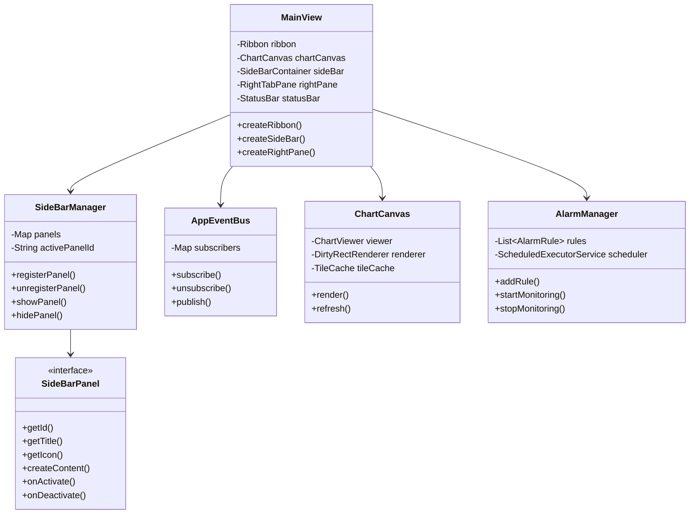
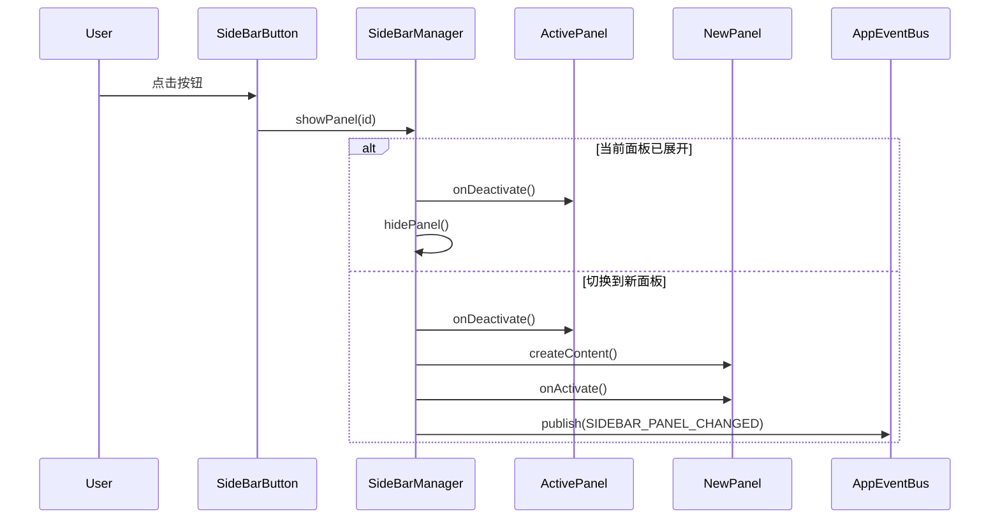
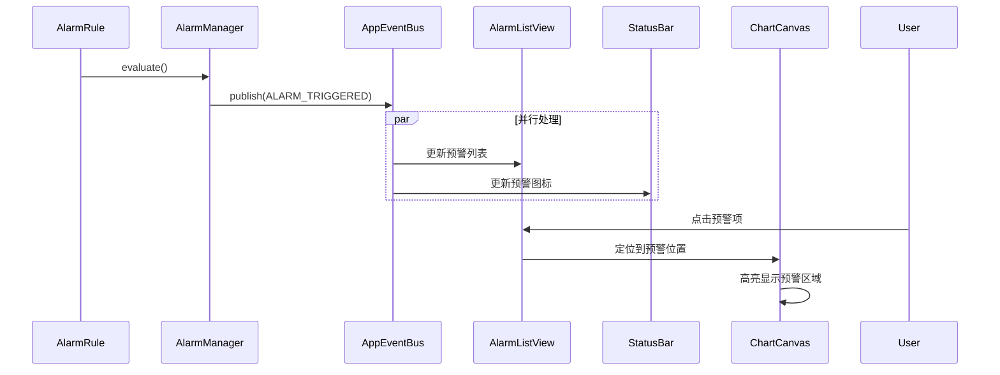
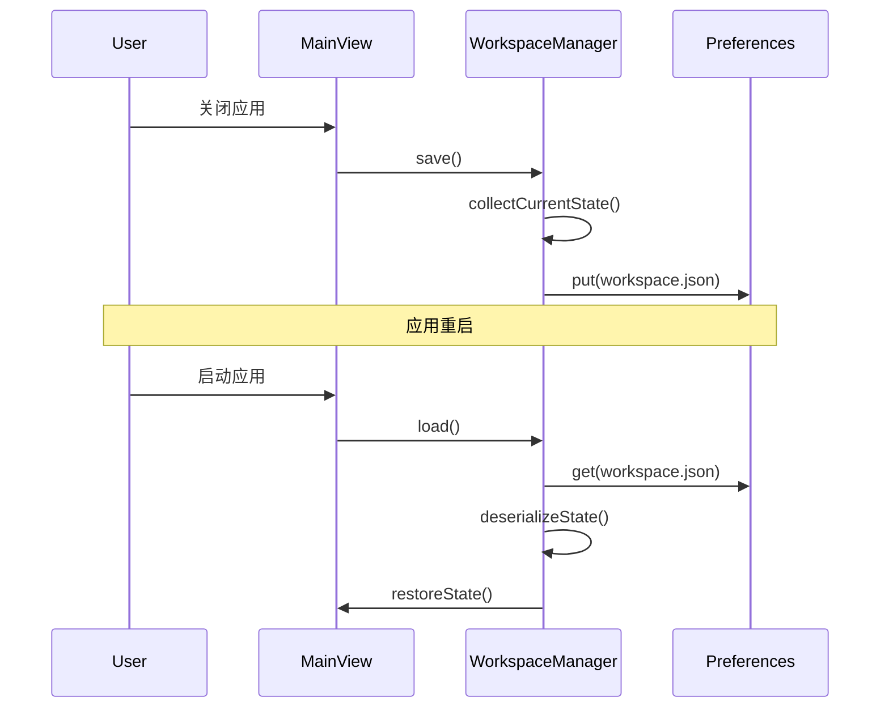

# 海图显示预警应用布局设计文档

> **版本**: v2.3  
> **日期**: 2026-04-15  
> **状态**: 整合设计  
> **依据**: chart_app_layout_design.md v1.0 + app_layout_design.md v1.7

---

## 文档概述

### 目的

本文档整合海图显示系统布局设计与JavaFX应用技术实现，形成完整的设计文档，包括：
- 需求分析与方案评估
- 布局架构设计
- 渲染架构设计
- 交互行为设计
- 技术实现方案
- 通信机制设计
- 性能优化策略
- 扩展机制设计
- 预警系统设计

### 适用范围

本设计适用于：
- 海图显示系统主界面
- 预警系统集成
- 航线规划功能
- AIS监控功能
- 数据管理功能

### 目标用户

| 用户角色 | 特点 | 主要需求 |
|----------|------|----------|
| 航海人员 | 操作熟练度一般 | 直观界面、快速预警响应 |
| 海事管理员 | 操作熟练 | 高效工具、批量处理 |
| 系统管理员 | 技术背景 | 配置能力、故障排查 |

### 文档来源

本文档整合以下两份设计文档的优点：

| 来源文档 | 贡献内容 |
|----------|----------|
| chart_app_layout_design.md | 需求分析、方案评估、渲染架构、交互行为、Ribbon设计 |
| app_layout_design.md | 响应式设计、通信机制、性能优化、扩展机制、代码示例 |

---

## 目录

### 第一章：需求分析
- 1.1 功能需求
- 1.2 用户角色分析
- 1.3 显示需求
- 1.4 预警系统需求

### 第二章：方案评估
- 2.1 布局方案定义
- 2.2 评估维度与权重
- 2.3 方案评分对比
- 2.4 场景适配分析
- 2.5 推荐方案

### 第三章：布局架构设计
- 3.1 整体布局架构
- 3.2 Ribbon菜单栏设计
- 3.3 活动栏设计
- 3.4 侧边栏设计
- 3.5 海图显示区设计
- 3.6 右侧面板设计
- 3.7 状态栏设计
- 3.8 组件层次结构

### 第四章：渲染架构设计
- 4.1 分层渲染设计
- 4.2 渲染数据流
- 4.3 层间通信
- 4.4 渲染优先级

### 第五章：交互行为设计
- 5.1 海图要素交互
- 5.2 工具交互
- 5.3 面板交互
- 5.4 预警交互

### 第六章：技术实现
- 6.1 主布局结构
- 6.2 响应式布局设计
- 6.3 组件层次结构
- 6.4 代码示例

### 第七章：通信机制
- 7.1 事件总线设计
- 7.2 事件类型定义
- 7.3 通信示例

### 第八章：性能优化
- 8.1 脏区域重绘
- 8.2 瓦片缓存策略
- 8.3 LOD细节层次策略
- 8.4 渲染性能监控

### 第九章：扩展机制
- 9.1 侧边栏面板接口
- 9.2 面板管理器
- 9.3 右侧标签页扩展
- 9.4 状态持久化

### 第十章：预警系统设计
- 10.1 预警类型定义
- 10.2 预警面板设计
- 10.3 预警通知机制
- 10.4 预警响应流程

### 第十一章：工作区管理设计
- 11.1 工作区保存内容
- 11.2 工作区持久化机制
- 11.3 工作区数据结构
- 11.4 工作区管理器实现
- 11.5 工作区恢复时机
- 11.6 工作区导出导入

### 第十二章：错误处理设计
- 12.1 错误分类与处理
- 12.2 错误码定义表
- 12.3 错误码结构说明
- 12.4 错误边界架构
- 12.5 错误恢复机制
- 12.6 错误处理实现
- 12.7 错误提示UI设计

### 第十三章：性能要求与测试
- 13.1 关键性能指标(KPI)
- 13.2 性能优化策略
- 13.3 性能测试场景
- 13.4 性能监控机制
- 13.5 性能优化检查清单
- 13.6 内存泄漏检测执行标准
- 13.7 渲染性能测试执行标准

### 第十四章：测试策略
- 14.1 单元测试
- 14.2 集成测试
- 14.3 UI自动化测试
- 14.4 测试覆盖率要求

### 第十五章：实施计划
- 15.1 阶段一：基础布局
- 15.2 阶段二：侧边栏
- 15.3 阶段三：右侧面板
- 15.4 阶段四：交互完善
- 15.5 阶段五：性能优化
- 15.6 阶段六：预警系统
- 15.7 总体时间估计

### 第十六章：AIS目标与预警关联设计
- 16.1 AIS目标交互
- 16.2 AIS预警关联机制
- 16.3 预警详情显示
- 16.4 AIS目标数据模型
- 16.5 CPA/TCPA计算

### 第十七章：用户旅程设计
- 17.1 预警响应流程
- 17.2 航线规划流程
- 17.3 用户旅程图

### 第十八章：国际化设计
- 18.1 多语言架构
- 18.2 支持语言列表
- 18.3 国际化管理器实现
- 18.4 资源文件结构
- 18.5 UI文本国际化范围

### 第十九章：主题与样式设计
- 19.1 主题管理器设计
- 19.2 主题切换实现
- 19.3 CSS变量定义
- 19.4 主题配置项

### 第二十章：高DPI适配
- 20.1 DPI检测与缩放
- 20.2 高DPI布局调整
- 20.3 图标资源适配

### 第二十一章：模块集成设计
- 21.1 模块依赖关系
- 21.2 数据流设计
- 21.3 集成接口定义

### 第二十二章：可行性评估
- 22.1 技术可行性评估
- 22.2 功能可行性评估
- 22.3 用户体验评估
- 22.4 开发成本评估
- 22.5 最终推荐

### 第二十三章：类图与时序图
- 23.1 核心类图
- 23.2 面板切换时序图
- 23.3 预警响应时序图
- 23.4 工作区保存恢复时序图

### 第二十四章：新手引导设计
- 24.1 首次使用引导流程
- 24.2 引导配置
- 24.3 引导提示方式
- 24.4 引导管理器实现

### 第二十五章：无障碍设计
- 25.1 无障碍设计项
- 25.2 键盘导航设计
- 25.3 高对比度支持
- 25.4 屏幕阅读器支持
- 25.5 无障碍测试清单

### 附录
- A. 面板尺寸约束
- B. CSS变量定义
- C. 版本历史

---

## 文档约定

### 优先级定义

| 优先级 | 说明 |
|--------|------|
| P0 | 核心功能，必须实现 |
| P1 | 重要功能，优先实现 |
| P2 | 增强功能，按需实现 |

### 状态定义

| 状态 | 说明 |
|------|------|
| ✅ | 已完成/已确认 |
| 🔄 | 进行中 |
| ⏳ | 待定/待实现 |
| ❌ | 已废弃 |

---

**下一章**: [第一章：需求分析](#第一章需求分析)

---

## 第一章：需求分析

### 1.1 功能需求

| 需求类别 | 具体功能 | 优先级 | 说明 |
|----------|----------|--------|------|
| **海图显示** | 多图层叠加、缩放平移、要素渲染 | P0 | 核心功能 |
| **数据管理** | 海图文件管理、图层管理、数据导入导出 | P0 | 基础功能 |
| **航线规划** | 航线创建、编辑、导入导出 | P0 | 核心功能 |
| **AIS监控** | 实时目标显示、轨迹回放 | P1 | 监控功能 |
| **预警系统** | 碰撞预警、偏航预警、浅水预警 | P1 | 安全功能 |
| **测量工具** | 距离测量、面积测量、方位测量 | P1 | 辅助功能 |
| **符号配置** | S-52符号库、样式自定义 | P2 | 显示增强 |
| **数据查询** | 属性查询、空间查询 | P2 | 数据分析 |

### 1.2 用户角色分析

| 角色 | 特点 | 主要操作 | 界面需求 |
|------|------|----------|----------|
| **航海人员** | 操作熟练度一般，需要直观界面 | 海图浏览、航线规划、预警响应 | 简洁界面、大字体、醒目预警 |
| **海事管理员** | 操作熟练，需要高效工具 | 数据管理、批量处理、报告生成 | 完整功能、快捷操作、批量工具 |
| **系统管理员** | 技术背景，需要配置能力 | 系统配置、数据维护、故障排查 | 配置面板、日志查看、诊断工具 |

### 1.3 技术约束

| 约束项 | 要求 | 说明 |
|--------|------|------|
| **Java版本** | JDK 8+ (1.8.0_60+) | 项目使用JDK 8编译 |
| **JavaFX版本** | JavaFX 8 (内置于JDK 8) | 使用JDK内置JavaFX，不使用独立JavaFX SDK |
| **构建工具** | Gradle 4.5.1 | 项目已使用Gradle构建 |
| **UI框架** | JavaFX 8 + ControlsFX | 使用JavaFX原生组件+ControlsFX扩展 |
| **Ribbon实现** | fxribbon模块 | 项目自有Ribbon实现模块 |
| **JNI集成** | JNI Bridge | C++核心渲染通过JNI调用 |
| **外部依赖** | libpq, sqlite3, libspatialite | 仅允许项目已审批的外部依赖 |
| **日志框架** | java.util.logging | 使用JDK标准日志框架 |

> **重要**: 本文档所有代码示例基于JavaFX 8 API编写。如需迁移至JavaFX 11+，需注意模块系统变化和API差异。

### 1.4 显示需求

| 需求 | 说明 | 实现方式 |
|------|------|----------|
| **主显示区** | 海图渲染需要最大化显示空间 | Canvas自适应填充 |
| **多窗口支持** | 可能需要同时显示多幅海图 | Tab多标签或独立窗口 |
| **信息面板** | 图层、属性、预警信息需要独立面板 | 侧边栏+右侧面板 |
| **工具访问** | 常用工具需要快速访问 | Ribbon菜单+快捷键 |
| **响应式布局** | 适应不同屏幕尺寸 | 断点设计+面板折叠 |

### 1.5 预警系统需求

#### 1.5.1 预警类型

> **注**: 以下为预警类型概要，权威定义详见[10.1 预警类型定义](#101-预警类型定义)。

| 预警类型 | 触发条件 | 优先级 | 响应要求 |
|----------|----------|--------|----------|
| **碰撞预警** | 本船与他船距离小于安全距离 | P0 | 立即弹窗+声音报警 |
| **偏航预警** | 船舶偏离计划航线 | P0 | 弹窗提示+高亮显示 |
| **浅水预警** | 进入浅水区域 | P0 | 弹窗提示+区域高亮 |
| **禁航区预警** | 进入禁航区域 | P1 | 弹窗提示+区域高亮 |
| **气象预警** | 恶劣天气预报 | P1 | 状态栏提示 |
| **设备故障预警** | AIS/雷达设备异常 | P2 | 状态栏提示 |
| **值班报警** | 操作员未在设定时间内响应 | P0 | 声音报警逐级升级 |
| **潮汐预警** | 潮汐变化导致水深低于安全值 | P1 | 弹窗提示+区域高亮 |

#### 1.5.2 预警显示需求

| 需求 | 说明 |
|------|------|
| **实时显示** | 预警信息实时更新，延迟不超过1秒 |
| **分级显示** | 不同级别预警使用不同颜色和图标 |
| **历史记录** | 预警历史可查询、可导出 |
| **响应跟踪** | 预警响应状态可跟踪 |

#### 1.5.3 预警面板需求

| 功能 | 说明 |
|------|------|
| **预警列表** | 显示当前所有活动预警 |
| **预警详情** | 显示选中预警的详细信息 |
| **预警配置** | 配置预警规则和参数 |
| **预警统计** | 预警数量、类型统计 |

### 1.6 性能需求

| 指标 | 要求 | 说明 |
|------|------|------|
| **启动时间** | < 3秒 | 应用启动到可操作 |
| **海图加载** | < 2秒 | 标准海图加载时间 |
| **渲染帧率** | ≥ 30 FPS | 平滑交互体验 |
| **内存占用** | < 500MB | 正常使用状态 |
| **响应延迟** | < 100ms | 用户操作响应 |

### 1.7 兼容性需求

| 需求 | 说明 |
|------|------|
| **操作系统** | Windows 10/11 |
| **屏幕分辨率** | 支持1366×768至4K |
| **DPI缩放** | 支持100%-200% DPI |
| **多显示器** | 支持多显示器扩展 |

---

**下一章**: [第二章：方案评估](#第二章方案评估)

---

## 第二章：方案评估

### 2.1 布局方案定义

#### 方案一：纯VSCode布局

```
┌──────────────────────────────────────────────────────────────────┐
│  标题栏 (菜单 + 工具按钮)                                          │
├────────┬─────────────────────────────────────────────────────────┤
│ 活动栏  │                    主显示区                              │
│        │                                                         │
│ [图标]  │              (最大化显示空间)                            │
│        │                                                         │
├────────┴─────────────────────────────────────────────────────────┤
│                        状态栏                                      │
└──────────────────────────────────────────────────────────────────┘
```

**特点**: 无Ribbon，显示空间最大化，依赖命令面板和快捷键

#### 方案二：Ribbon+VSCode混合布局（推荐）

```
┌──────────────────────────────────────────────────────────────────┐
│                    Ribbon 菜单栏                                   │
├────────┬─────────────────────────┬────────────────┬───────────────┤
│ 活动栏  │      侧边栏面板         │   海图显示区    │   右侧面板    │
│        │                        │                │               │
├────────┴─────────────────────────┴────────────────┴───────────────┤
│                        状态栏                                      │
└──────────────────────────────────────────────────────────────────┘
```

**特点**: Ribbon提供功能入口，左右面板提供信息展示

#### 方案三：可折叠Ribbon布局

```
┌──────────────────────────────────────────────────────────────────┐
│  可折叠Ribbon (展开/收起切换)                                      │
├────────┬─────────────────────────────────────────────────────────┤
│ 活动栏  │                    主显示区                              │
├────────┴─────────────────────────────────────────────────────────┤
│                        状态栏                                      │
└──────────────────────────────────────────────────────────────────┘
```

**特点**: Ribbon可折叠，兼顾显示空间和功能入口

#### 方案四：传统工具栏布局

```
┌──────────────────────────────────────────────────────────────────┐
│  菜单栏 + 工具栏                                                   │
├────────┬─────────────────────────────────────────────────────────┤
│ 侧边栏  │                    主显示区                              │
├────────┴─────────────────────────────────────────────────────────┤
│                        状态栏                                      │
└──────────────────────────────────────────────────────────────────┘
```

**特点**: 传统桌面应用布局，用户熟悉度高

### 2.2 评估维度与权重

| 维度 | 权重 | 说明 | 评估标准 |
|------|------|------|----------|
| **海图显示空间** | 25% | 主显示区占比 | 显示区面积/总面积 |
| **功能可发现性** | 20% | 新用户能否快速找到功能 | 功能入口可见性 |
| **操作效率** | 20% | 熟练用户的操作速度 | 操作步骤数 |
| **界面美观度** | 15% | 现代感、专业感 | 视觉设计评分 |
| **实现复杂度** | 10% | 开发工作量 | 开发工时估算 |
| **可扩展性** | 10% | 未来功能扩展能力 | 架构灵活性 |

### 2.3 方案评分对比

| 方案 | 显示空间 | 可发现性 | 操作效率 | 美观度 | 复杂度 | 扩展性 | **加权总分** |
|------|----------|----------|----------|--------|--------|--------|--------------|
| 方案一(纯VSCode) | 95 | 60 | 85 | 90 | 70 | 85 | **80.25** |
| 方案二(Ribbon+VSCode) | 80 | 90 | 80 | 85 | 60 | 90 | **82.00** |
| 方案三(可折叠Ribbon) | 88 | 85 | 82 | 88 | 40 | 85 | **80.70** |
| 方案四(传统工具栏) | 75 | 85 | 75 | 70 | 80 | 75 | **76.25** |

### 2.4 评分说明

| 维度 | 方案一 | 方案二 | 方案三 | 方案四 | 说明 |
|------|--------|--------|--------|--------|------|
| **显示空间** | 95 | 80 | 88 | 75 | 方案一无Ribbon，显示空间最大 |
| **可发现性** | 60 | 90 | 85 | 85 | 方案二Ribbon功能分类最清晰 |
| **操作效率** | 85 | 80 | 82 | 75 | 方案一快捷键+命令面板效率高 |
| **美观度** | 90 | 85 | 88 | 70 | 方案一、三符合现代UI趋势 |
| **复杂度** | 70 | 60 | 40 | 80 | 方案三可折叠Ribbon实现最复杂 |
| **扩展性** | 85 | 90 | 85 | 75 | 方案二Ribbon+面板扩展性最强 |

### 2.5 场景适配分析

| 场景 | 推荐方案 | 理由 |
|------|----------|------|
| **航海人员日常使用** | 方案二 | 直观易用，预警信息纵向展示更清晰 |
| **海事管理专业操作** | 方案二 | 显示空间大，操作效率高 |
| **预警系统监控** | 方案二 | 右侧面板纵向展示预警信息更高效 |
| **多用户混合场景** | 方案二 | 灵活适应不同显示器尺寸 |

### 2.6 推荐方案

**推荐方案二：Ribbon+VSCode混合布局**

| 优势 | 说明 |
|------|------|
| **功能可发现性** | Ribbon菜单功能分类清晰，新用户易上手 |
| **预警监控效率** | 右侧面板可同时展示预警列表和详情 |
| **操作便捷性** | 侧边信息面板与主显示区并列，视线无需上下切换 |
| **布局灵活性** | 左右面板均可独立拖拽调整宽度 |
| **扩展性强** | Ribbon+面板组合扩展性强，易于添加新功能 |

---

**下一章**: [第三章：布局架构设计](#第三章布局架构设计)

---

## 第三章：布局架构设计

### 3.1 整体布局架构

采用 **Ribbon + VSCode混合布局（方案二：右侧面板布局）**：

```
┌──────────────────────────────────────────────────────────────────────────┐
│                           Ribbon 菜单栏 (高度: 100-120px)                 │
│  ┌─────────────────────────────────────────────────────────────────────┐ │
│  │ [文件] [视图] [工具] [图层] [航线] [预警] [设置] [帮助]              [左侧栏][右侧栏][用户] [最小化][最大化][关闭]│ │
│  ├─────────────────────────────────────────────────────────────────────┤ │
│  │  功能按钮组...                                                       │ │
│  └─────────────────────────────────────────────────────────────────────┘ │
├────────┬──────────────────────┬─────────────────────────┬────────────────┤
│ 活动栏  │     侧边栏面板       │       海图显示区         │   右侧面板     │
│ (48px)  │   (可折叠,可拖拽)    │     (Canvas+交互层)     │ (可折叠,可拖拽)│
│        │    宽度: 200-300px   │                         │ 宽度: 200-400px│
│ [📁]   │ ┌─────────────────┐ │                         │ [预警] [日志]  │
│ [🔍]   │ │图层管理/数据目录│ │                         │ [属性] [终端]  │
│ [🛤️]   │ │/航线管理/预警配置│ │                         │                │
│ [⚠️]   │ └─────────────────┘ │                         │ 预警列表       │
│ [📊]   │ (与活动栏图标关联)   │                         │ 操作日志       │
│ [⚙️]   │                      │                         │ 要素属性       │
│        │                      │                         │ 命令行         │
├────────┴──────────────────────┴─────────────────────────┴────────────────┤
│                           状态栏 (高度: 22px)                              │
│  [服务状态] [坐标] [比例尺] [图层] [预警数] [时间]           [通知] [设置] │
└──────────────────────────────────────────────────────────────────────────┘
```

### 3.2 布局组件概览

| 组件 | 位置 | 尺寸规格 | 特性 |
|------|------|----------|------|
| Ribbon菜单栏 | 顶部 | 高度100-120px | 固定高度，标签页切换 |
| 活动栏 | 最左侧 | 宽度48px | 固定宽度，图标按钮 |
| 侧边栏面板 | 活动栏右侧 | 宽度200-300px | 可折叠、可拖拽调整 |
| 海图显示区 | 中央 | 自适应 | Canvas + 交互层 |
| 右侧面板 | 海图显示区右侧 | 宽度200-400px | 可折叠、可拖拽调整 |
| 状态栏 | 底部 | 高度22px | 固定高度 |

### 3.3 Ribbon菜单栏设计

#### 3.3.1 标签页设计

| 标签页 | 功能组 | 主要功能 | 优先级 |
|--------|--------|----------|--------|
| **文件** | 文件操作、导入导出、打印 | 新建、打开、保存、导入、导出、打印 | P0 |
| **视图** | 缩放、显示控制、窗口 | 放大、缩小、平移、全图、图层控制 | P0 |
| **工具** | 测量、标注、查询 | 距离测量、面积测量、方位测量、标注 | P1 |
| **图层** | 图层管理、符号配置 | 图层列表、可见性、符号样式 | P0 |
| **航线** | 航线规划、航点管理 | 新建航线、编辑航点、导入导出 | P0 |
| **预警** | 预警配置、监控、响应 | 预警规则、实时监控、历史记录 | P1 |
| **设置** | 显示设置、系统配置 | 主题、单位、坐标系、网络 | P2 |
| **帮助** | 帮助文档、关于 | 用户手册、快捷键、版本信息 | P2 |

#### 3.3.2 功能按钮组设计

**文件标签页**

| 功能组 | 按钮 | 图标 | 快捷键 | 说明 |
|--------|------|------|--------|------|
| 文件操作 | 新建 | 📄 | Ctrl+N | 新建海图项目 |
| | 打开 | 📂 | Ctrl+O | 打开海图文件 |
| | 保存 | 💾 | Ctrl+S | 保存当前项目 |
| 导入导出 | 导入 | 📥 | Ctrl+I | 导入数据文件 |
| | 导出 | 📤 | Ctrl+E | 导出当前视图 |
| 打印 | 打印 | 🖨️ | Ctrl+P | 打印海图 |

**视图标签页**

| 功能组 | 按钮 | 图标 | 快捷键 | 说明 |
|--------|------|------|--------|------|
| 缩放 | 放大 | 🔍+ | Ctrl++ | 放大视图 |
| | 缩小 | 🔍- | Ctrl+- | 缩小视图 |
| | 全图 | 🗺️ | Home | 显示全图 |
| 显示控制 | 平移 | ✋ | - | 平移视图 |
| | 刷新 | 🔄 | F5 | 刷新显示 |

**预警标签页**

| 功能组 | 按钮 | 图标 | 快捷键 | 说明 |
|--------|------|------|--------|------|
| 预警配置 | 新建规则 | ➕ | - | 创建预警规则 |
| | 编辑规则 | ✏️ | - | 编辑预警规则 |
| 监控 | 开始监控 | ▶️ | - | 启动预警监控 |
| | 停止监控 | ⏹️ | - | 停止预警监控 |

### 3.4 活动栏设计

#### 3.4.1 布局规格

| 属性 | 值 |
|------|-----|
| 位置 | 窗口最左侧 |
| 宽度 | 48px (固定) |
| 背景 | 浅灰色 (#f3f3f3) |
| 图标大小 | 24×24px |
| 图标间距 | 4px |

#### 3.4.2 图标按钮设计

| 图标 | 名称 | 对应侧边栏面板 | 快捷键 |
|------|------|----------------|--------|
| 📁 | 数据目录 | 海图文件、数据源管理 | Ctrl+Shift+E |
| 🔍 | 查询 | 属性查询、空间查询 | Ctrl+Shift+F |
| 🛤️ | 航线 | 航线列表、航点编辑 | Ctrl+Shift+R |
| ⚠️ | 预警 | 预警列表、预警配置 | Ctrl+Shift+A |
| 📊 | 图层 | 图层管理、符号配置 | - |
| ⚙️ | 设置 | 系统设置、偏好配置 | - |

#### 3.4.3 交互行为

| 操作 | 行为 |
|------|------|
| 单击图标 | 切换到对应侧边栏面板，已选中则折叠 |
| 悬停图标 | 显示Tooltip提示 |
| 右键图标 | 显示上下文菜单 |
| 图标高亮 | 当前选中面板对应的图标高亮显示 |

### 3.5 侧边栏面板设计

#### 3.5.1 布局规格

| 属性 | 值 |
|------|-----|
| 位置 | 活动栏右侧 |
| 默认宽度 | 250px |
| 最小宽度 | 200px |
| 最大宽度 | 300px |
| 可折叠 | 是 |
| 可拖拽调整 | 是 |

#### 3.5.2 面板内容设计

**数据目录面板**

| 区域 | 内容 |
|------|------|
| 工具栏 | 搜索框、刷新按钮、新建文件夹 |
| 树形列表 | 海图文件、数据源、收藏夹 |
| 状态栏 | 文件数量、总大小 |

**预警配置面板**

| 区域 | 内容 |
|------|------|
| 工具栏 | 新建规则、启用/禁用 |
| 规则列表 | 预警规则名称、类型、状态 |
| 规则详情 | 选中规则的详细配置 |

### 3.6 海图显示区设计

#### 3.6.1 布局规格

| 属性 | 值 |
|------|-----|
| 位置 | 中央区域 |
| 尺寸 | 自适应填充剩余空间 |
| 背景 | 海洋蓝色 (#1a3a5c) |

#### 3.6.2 显示内容

| 内容类型 | 说明 |
|----------|------|
| 海图数据 | S-57/S-52标准海图 |
| 叠加图层 | 卫星影像、地形图 |
| AIS数据 | 船舶动态信息 |
| 航线数据 | 规划航线、历史航迹 |
| 预警区域 | 预警区域高亮显示 |
| 标注信息 | 用户标注、测量结果 |

### 3.7 右侧面板设计

#### 3.7.1 布局规格

| 属性 | 值 |
|------|-----|
| 位置 | 海图显示区右侧 |
| 默认宽度 | 300px |
| 最小宽度 | 200px |
| 最大宽度 | 400px |
| 可折叠 | 是 |
| 可拖拽调整 | 是 |

#### 3.7.2 标签页设计

| 标签 | 图标 | 内容 |
|------|------|------|
| 预警 | ⚠️ | 预警列表、预警详情 |
| 日志 | 📝 | 操作日志、系统日志 |
| 属性 | 📋 | 选中要素的属性信息 |
| 终端 | 💻 | 命令行界面 |

### 3.8 状态栏设计

#### 3.8.1 布局规格

| 属性 | 值 |
|------|-----|
| 位置 | 窗口底部 |
| 高度 | 22px (固定) |
| 背景 | 浅灰色 (#f0f0f0) |

#### 3.8.2 状态项设计

```
┌──────────┬──────────┬──────────────┬──────────┬──────────┬──────────┐
│ 服务状态  │ 鼠标位置  │   缩放比例    │ 图层数量  │ 预警数量  │ 提示信息  │
│ ● 已连接  │ 120.5°E  │   1:50000    │   5层    │   2条    │ 就绪     │
│          │ 30.2°N   │              │          │          │          │
└──────────┴──────────┴──────────────┴──────────┴──────────┴──────────┘
```

| 状态项 | 内容 | 更新时机 |
|--------|------|----------|
| 服务状态 | 数据服务连接状态 | 连接变化时 |
| 鼠标位置 | 鼠标所在地理坐标 | 鼠标移动时 |
| 缩放比例 | 当前显示比例尺 | 缩放变化时 |
| 图层数量 | 当前加载图层数 | 图层变化时 |
| 预警数量 | 当前活动预警数 | 预警变化时 |
| 提示信息 | 操作提示/警告信息 | 操作触发时 |

### 3.9 组件层次结构

```
MainView (BorderPane)
├── Top: Ribbon
│   └── RibbonTab[]
│       └── RibbonGroup[]
│           └── Button/MenuButton/ComboBox...
├── Left: SideBarContainer (BorderPane)
│   ├── Left: ActivityBar (VBox, 48px宽)
│   │   └── ToggleButton[]
│   └── Center: SideBarPanel (StackPane, 可折叠)
│       ├── DataCatalogPanel
│       ├── QueryPanel
│       ├── RoutePanel
│       ├── AlarmPanel
│       ├── LayerPanel
│       └── SettingsPanel
├── Center: ChartCanvas
│   └── Canvas + InteractionHandlers
├── Right: RightPanel (TabPane)
│   └── Tab[]
│       ├── AlarmTab (预警)
│       ├── LogTab (日志)
│       ├── PropertyTab (属性)
│       └── TerminalTab (终端)
└── Bottom: StatusBar (HBox)
    ├── ServiceStatus
    ├── MousePosition
    ├── ZoomRatio
    ├── LayerCount
    ├── AlarmCount
    └── MessageInfo
```

---

**下一章**: [第四章：渲染架构设计](#第四章渲染架构设计)

---

## 第四章：渲染架构设计

### 4.1 分层渲染设计

```
ChartCanvas (分层渲染)
├── 背景层 (BackgroundLayer)
│   └── 海洋、陆地底图
├── 海图层 (ChartLayer)
│   ├── 栅格海图
│   └── 矢量海图
├── 图层叠加 (OverlayLayers)
│   ├── 航线层
│   ├── AIS目标层
│   ├── 预警区域层
│   └── 标注层
├── 交互层 (InteractionLayer)
│   ├── 选中高亮
│   ├── 悬停效果
│   └── 绘制临时图形
└── 信息层 (InfoLayer)
    ├── 比例尺
    ├── 指北针
    └── 坐标网格
```

### 4.2 渲染数据流

```
┌─────────────────────────────────────────────────────────────────────────────┐
│                          渲染数据流向                                         │
├─────────────────────────────────────────────────────────────────────────────┤
│                                                                             │
│  数据源                  渲染层                    显示                      │
│  ┌─────────┐            ┌─────────┐              ┌─────────┐               │
│  │ 海图数据 │ ─────────▶ │ 背景层  │ ──────────▶ │         │               │
│  └─────────┘            └─────────┘              │         │               │
│  ┌─────────┐            ┌─────────┐              │         │               │
│  │ 图层数据 │ ─────────▶ │ 海图层  │ ──────────▶ │         │               │
│  └─────────┘            └─────────┘              │         │               │
│  ┌─────────┐            ┌─────────┐              │         │               │
│  │ 航线数据 │ ─────────▶ │ 叠加层  │ ──────────▶ │ Canvas  │               │
│  └─────────┘            └─────────┘              │         │               │
│  ┌─────────┐            ┌─────────┐              │         │               │
│  │ 预警数据 │ ─────────▶ │ 预警层  │ ──────────▶ │         │               │
│  └─────────┘            └─────────┘              │         │               │
│  ┌─────────┐            ┌─────────┐              │         │               │
│  │ 交互事件 │ ─────────▶ │ 交互层  │ ──────────▶ │         │               │
│  └─────────┘            └─────────┘              │         │               │
│  ┌─────────┐            ┌─────────┐              │         │               │
│  │ 视图状态 │ ─────────▶ │ 信息层  │ ──────────▶ │         │               │
│  └─────────┘            └─────────┘              └─────────┘               │
│                                                                             │
└─────────────────────────────────────────────────────────────────────────────┘
```

### 4.3 层间通信机制

| 层级 | 通信方式 | 说明 |
|------|----------|------|
| 背景层 → 海图层 | 数据引用 | 共享地理坐标范围 |
| 海图层 → 叠加层 | 事件通知 | 海图缩放时通知叠加层更新 |
| 叠加层 → 交互层 | 坐标转换 | 将屏幕坐标转换为地理坐标 |
| 交互层 → 信息层 | 状态同步 | 同步当前视图状态 |
| 预警层 → 交互层 | 高亮请求 | 预警触发时请求高亮显示 |

### 4.4 渲染优先级

| 优先级 | 层级 | 渲染顺序 | 说明 |
|--------|------|----------|------|
| 1 (最低) | 背景层 | 最先渲染 | 作为底图，不响应交互 |
| 2 | 海图层 | 第二渲染 | 海图要素，响应选择交互 |
| 3 | 叠加层 | 第三渲染 | 业务数据，响应全部交互 |
| 4 | 预警层 | 第四渲染 | 预警区域，高优先级显示 |
| 5 | 交互层 | 第五渲染 | 临时图形，高优先级显示 |
| 6 (最高) | 信息层 | 最后渲染 | 始终在最上层，不遮挡 |

### 4.5 预警渲染设计

#### 4.5.1 预警区域渲染

| 预警级别 | 填充颜色 | 边框颜色 | 透明度 |
|----------|----------|----------|--------|
| 紧急(P0) | #FF0000 | #8B0000 | 40% |
| 警告(P1) | #FFA500 | #FF8C00 | 30% |
| 提示(P2) | #FFFF00 | #FFD700 | 20% |

#### 4.5.2 预警闪烁效果

| 效果 | 触发条件 | 闪烁频率 |
|------|----------|----------|
| 紧急闪烁 | P0级预警 | 500ms间隔 |
| 警告闪烁 | P1级预警 | 1000ms间隔 |
| 静态高亮 | P2级预警 | 无闪烁 |

---

**下一章**: [第五章：交互行为设计](#第五章交互行为设计)

---

## 第五章：交互行为设计

### 5.1 海图要素交互

| 操作 | 行为 | 高亮效果 |
|------|------|----------|
| 单击要素 | 选中要素，显示属性面板 | 黄色边框高亮，半透明填充 |
| 框选要素 | 批量选中多个要素 | 所有选中要素高亮显示 |
| 悬停要素 | 预览要素信息 | 浅蓝色边框，显示Tooltip |
| 取消选中 | 点击空白区域 | 清除高亮，关闭属性面板 |

### 5.2 高亮渲染配置

| 配置项 | 默认值 | 说明 |
|--------|--------|------|
| 高亮颜色 | #FFFF00 | 用户可自定义 |
| 高亮透明度 | 30% | 可调整 |
| 高亮动画 | 可选 | 闪烁效果用于紧急预警 |
| 高亮层级 | 最顶层 | 不被其他图层遮挡 |

### 5.3 视图操作

| 操作 | 行为 | 快捷键 |
|------|------|--------|
| 滚轮滚动 | 缩放视图 | - |
| 拖拽 | 平移视图 | - |
| 双击 | 以点击位置为中心放大 | - |
| Ctrl+拖拽 | 框选区域 | - |

### 5.4 预警交互

| 操作 | 行为 | 响应 |
|------|------|------|
| 点击预警列表项 | 定位到预警位置 | 地图居中显示预警区域 |
| 悬停预警列表项 | 高亮预警区域 | 预警区域高亮显示 |
| 双击预警列表项 | 显示预警详情 | 弹出详情对话框 |
| 确认预警 | 标记为已处理 | 更新预警状态 |

---

**下一章**: [第六章：技术实现](#第六章技术实现)

---

## 第六章：技术实现

### 6.1 主布局结构

```java
public class MainView extends BorderPane implements LifecycleComponent {

    private Ribbon ribbon;
    private ChartCanvas chartCanvas;
    private StackPane viewContainer;
    
    private VBox sideBarButtonContainer;
    private StackPane sideBarPanelContainer;
    private SideBarManager sideBarManager;
    
    private TabPane rightTabPane;
    private RightTabManager rightTabManager;
    
    private StatusBar statusBar;
    
    private ResponsiveLayoutManager layoutManager;
    
    public MainView(ChartViewer chartViewer) {
        this.chartCanvas = new ChartCanvas(chartViewer);
        this.viewContainer = new StackPane();
        createView();
    }
    
    public void createView() {
        HBox topContainer = createTopContainer();
        this.setTop(topContainer);
        
        BorderPane centerLayout = createCenterLayout();
        this.setCenter(centerLayout);
        
        statusBar = new StatusBar();
        this.setBottom(statusBar.getContainer());
    }
    
    private BorderPane createCenterLayout() {
        BorderPane centerLayout = new BorderPane();
        
        sideBarButtonContainer = new VBox();
        sideBarButtonContainer.setPrefWidth(48);
        sideBarButtonContainer.setMinWidth(48);
        
        sideBarPanelContainer = new StackPane();
        sideBarPanelContainer.setPrefWidth(0);
        sideBarPanelContainer.setMinWidth(0);
        
        BorderPane sideBar = new BorderPane();
        sideBar.setLeft(sideBarButtonContainer);
        sideBar.setCenter(sideBarPanelContainer);
        
        sideBarManager = new SideBarManager(sideBarButtonContainer, sideBarPanelContainer);
        
        viewContainer.getChildren().add(chartCanvas);
        centerLayout.setCenter(viewContainer);
        
        rightTabPane = new TabPane();
        rightTabPane.setPrefWidth(0);
        rightTabPane.setVisible(false);
        rightTabManager = new RightTabManager(rightTabPane);
        
        layoutManager = new ResponsiveLayoutManager();
        layoutManager.setSideBar(sideBar);
        layoutManager.setRightPanel(rightTabPane);
        layoutManager.bindToWindow(this);
        
        return centerLayout;
    }
}
```

### 6.2 响应式布局设计

#### 6.2.1 断点定义

| 断点名称 | 窗口宽度 | 布局策略 |
|----------|----------|----------|
| 紧凑模式 | < 1024px | 侧边栏收起，右侧面板浮动 |
| 标准模式 | 1024px - 1440px | 侧边栏固定，右侧面板固定 |
| 宽屏模式 | > 1440px | 面板宽度可调，最大限制 |

#### 6.2.2 响应式布局管理器

```java
public class ResponsiveLayoutManager extends AbstractLifecycleComponent {
    
    public enum LayoutMode {
        COMPACT,
        STANDARD,
        WIDE
    }
    
    private static final int COMPACT_WIDTH = 1024;
    private static final int STANDARD_WIDTH = 1440;
    
    private final DoubleProperty windowWidth = new SimpleDoubleProperty();
    private LayoutMode currentMode = LayoutMode.STANDARD;
    
    private Region sideBar;
    private Region rightPanel;
    
    public void onWindowResize(double width) {
        LayoutMode newMode;
        if (width < COMPACT_WIDTH) {
            newMode = LayoutMode.COMPACT;
        } else if (width < STANDARD_WIDTH) {
            newMode = LayoutMode.STANDARD;
        } else {
            newMode = LayoutMode.WIDE;
        }
        
        if (newMode != currentMode) {
            currentMode = newMode;
            applyLayout(newMode);
        }
    }
    
    private void applyCompactLayout() {
        if (sideBar != null) {
            sideBar.setPrefWidth(40);
            sideBar.setMinWidth(40);
        }
        if (rightPanel != null) {
            rightPanel.setPrefWidth(0);
            rightPanel.setMinWidth(0);
        }
    }
    
    private void applyStandardLayout() {
        if (sideBar != null) {
            sideBar.setPrefWidth(200);
            sideBar.setMinWidth(180);
        }
        if (rightPanel != null) {
            rightPanel.setPrefWidth(250);
            rightPanel.setMinWidth(200);
        }
    }
    
    private void applyWideLayout() {
        if (sideBar != null) {
            sideBar.setPrefWidth(250);
            sideBar.setMinWidth(200);
        }
        if (rightPanel != null) {
            rightPanel.setPrefWidth(300);
            rightPanel.setMinWidth(250);
        }
    }
}
```

### 6.3 设计决策说明

#### 6.3.1 面板折叠动画方案选择

| 方案 | 优点 | 缺点 | 结论 |
|------|------|------|------|
| **Timeline + TranslateTransition** | 平滑动画、可控性强、JavaFX原生支持 | 需要手动管理动画状态 | ✅ 采用 |
| CSS Transition | 简单易用 | JavaFX CSS动画支持有限 | ❌ 不采用 |
| 第三方动画库 | 功能丰富 | 增加依赖、体积增大 | ❌ 不采用 |

**风险与缓解**:
- 风险: 动画过程中用户快速操作可能导致状态不一致
- 缓解: 使用动画完成回调锁定用户操作，动画期间禁用相关控件

**实现代码**:
```java
Timeline timeline = new Timeline();
KeyValue keyValue = new KeyValue(panel.prefWidthProperty(), 0);
KeyFrame keyFrame = new KeyFrame(Duration.millis(200), keyValue);
timeline.getKeyFrames().add(keyFrame);
timeline.play();
```

#### 6.3.2 布局持久化方案选择

| 方案 | 优点 | 缺点 | 结论 |
|------|------|------|------|
| **Java Preferences API** | 跨平台、无需额外依赖、系统级存储 | 存储格式受限 | ✅ 采用 |
| Properties文件 | 格式灵活、易于迁移 | 需要手动管理文件路径 | ❌ 不采用 |
| 数据库存储 | 支持复杂查询 | 增加系统复杂度 | ❌ 不采用 |

**风险与缓解**:
- 风险: 不同用户账户下布局偏好隔离
- 缓解: Preferences API自动按用户隔离，无需额外处理

**实现代码**:
```java
Preferences prefs = Preferences.userNodeForPackage(MainView.class);
prefs.putDouble("sidebarWidth", sidebar.getWidth());
prefs.putDouble("rightPanelWidth", rightPanel.getWidth());
prefs.putBoolean("sidebarVisible", sidebar.isVisible());
```

#### 6.3.3 响应式布局方案选择

| 方案 | 优点 | 缺点 | 结论 |
|------|------|------|------|
| **ChangeListener + 属性绑定** | JavaFX原生、响应及时 | 需要手动管理监听器生命周期 | ✅ 采用 |
| 媒体查询(CSS) | 声明式、易于维护 | JavaFX CSS媒体查询支持有限 | ❌ 不采用 |
| 第三方响应式框架 | 功能完善 | 增加依赖 | ❌ 不采用 |

**风险与缓解**:
- 风险: 监听器未正确移除导致内存泄漏
- 缓解: 使用WeakChangeListener或确保在控件销毁时移除监听器

**实现代码**:
```java
scene.widthProperty().addListener((obs, oldVal, newVal) -> {
    if (newVal.doubleValue() < 1024) {
        sidebar.setCollapsed(true);
        rightPanel.setCollapsed(true);
    }
});
```

#### 6.3.4 预警通知方案选择

| 方案 | 优点 | 缺点 | 结论 |
|------|------|------|------|
| **Notification + Animation** | 非阻塞、可自定义样式 | 需要自行实现通知队列 | ✅ 采用 |
| Alert对话框 | 简单易用 | 阻塞用户操作、体验差 | ❌ 不采用 |
| 系统托盘通知 | 原生体验 | 跨平台兼容性问题 | ❌ 不采用 |

**风险与缓解**:
- 风险: 大量预警同时产生导致通知堆积
- 缓解: 实现通知队列，限制同时显示数量，旧通知自动消失

**实现代码**:
```java
Notification notification = new Notification("预警", "碰撞预警", AlertType.WARNING);
notification.show();
Timeline flashTimeline = new Timeline(
    new KeyFrame(Duration.seconds(0.5), e -> alertIcon.setVisible(false)),
    new KeyFrame(Duration.seconds(1), e -> alertIcon.setVisible(true))
);
flashTimeline.setCycleCount(Animation.INDEFINITE);
flashTimeline.play();
```

#### 6.3.5 面板拖拽方案选择

| 方案 | 优点 | 缺点 | 结论 |
|------|------|------|------|
| **SplitPane + ChangeListener** | JavaFX原生、自动处理分割线 | 自定义限制需要额外代码 | ✅ 采用 |
| 自定义拖拽实现 | 完全可控 | 实现复杂、容易出错 | ❌ 不采用 |
| DockFX框架 | 功能完善 | 项目维护不活跃、学习成本高 | ⚠️ 备选 |

**风险与缓解**:
- 风险: 用户拖拽到极端位置导致布局异常
- 缓解: 设置最小/最大宽度限制，超出范围自动调整

**实现代码**:
```java
splitPane.getDividers().get(0).positionProperty().addListener((obs, oldVal, newVal) -> {
    double sidebarWidth = splitPane.getWidth() * newVal.doubleValue();
    if (sidebarWidth < 200) {
        splitPane.setDividerPosition(0, 200.0 / splitPane.getWidth());
    } else if (sidebarWidth > 300) {
        splitPane.setDividerPosition(0, 300.0 / splitPane.getWidth());
    }
});
```

#### 6.3.6 AppContext依赖管理演进路线

| 方案 | 优点 | 缺点 | 结论 |
|------|------|------|------|
| **静态单例(当前)** | 实现简单、全局访问 | 测试困难、耦合度高 | ✅ 当前阶段采用 |
| 手动依赖注入 | 解耦、可测试 | 需要大量重构 | ⏳ 第二阶段演进 |
| DI框架(如Dagger/Guice) | 完全解耦、自动注入 | 引入新依赖、学习成本 | ⏳ 第三阶段演进 |

**演进路线**:
1. **当前阶段**: 使用AppContext静态单例，快速实现功能
2. **第二阶段**: 将AppContext改为非静态，通过MainController构造函数注入各组件
3. **第三阶段**: 引入轻量DI框架，实现声明式依赖注入

**风险与缓解**:
- 风险: 静态依赖导致单元测试无法Mock
- 缓解: 当前通过PowerMock支持静态方法Mock；第二阶段重构后可使用标准Mock框架

### 6.4 面板尺寸约束

| 元素 | 最小值 | 默认值 | 最大值 | 说明 |
|------|--------|--------|--------|------|
| Ribbon高度 | 100px | 120px | 150px | 包含标签页 |
| 侧边栏按钮区 | 36px | 40px | 48px | 固定宽度 |
| 侧边栏面板 | 180px | 250px | 350px | 可拖拽调整 |
| 右侧面板 | 200px | 300px | 450px | 可拖拽调整 |
| 状态栏高度 | 24px | 28px | 32px | 固定高度 |

---

**下一章**: [第七章：通信机制](#第七章通信机制)

---

## 第七章：通信机制

### 7.1 事件总线设计

> **重要设计原则**: AppEventBus 位于 echart-core.jar，必须使用 PlatformAdapter 接口而非直接使用 JavaFX Platform API，以确保业务功能层无 JavaFX 依赖，支持 Android/Web 端复用。

```java
public class AppEventBus {
    
    private static final AppEventBus INSTANCE = new AppEventBus();
    private static final long HANDLER_TIMEOUT_MS = 5000;
    private final Map<AppEventType, List<Consumer<AppEvent>>> subscribers = new ConcurrentHashMap<>();
    private final BlockingQueue<AppEvent> eventQueue = new LinkedBlockingQueue<>();
    private volatile boolean processing = false;
    private PlatformAdapter platformAdapter;
    
    private AppEventBus() {
        Thread processor = new Thread(this::processEventQueue, "EventBus-Processor");
        processor.setDaemon(true);
        processor.start();
    }
    
    public static AppEventBus getInstance() {
        return INSTANCE;
    }
    
    public void setPlatformAdapter(PlatformAdapter adapter) {
        this.platformAdapter = adapter;
    }
    
    public void subscribe(AppEventType type, Consumer<AppEvent> handler) {
        subscribers.computeIfAbsent(type, k -> new CopyOnWriteArrayList<>()).add(handler);
    }
    
    public void unsubscribe(AppEventType type, Consumer<AppEvent> handler) {
        List<Consumer<AppEvent>> handlers = subscribers.get(type);
        if (handlers != null) {
            handlers.remove(handler);
        }
    }
    
    public void publish(AppEvent event) {
        eventQueue.offer(event);
    }
    
    private void processEventQueue() {
        while (!Thread.currentThread().isInterrupted()) {
            try {
                AppEvent event = eventQueue.take();
                dispatchEvent(event);
            } catch (InterruptedException e) {
                Thread.currentThread().interrupt();
                break;
            }
        }
    }
    
    private void dispatchEvent(AppEvent event) {
        List<Consumer<AppEvent>> handlers = subscribers.get(event.getType());
        if (handlers == null || handlers.isEmpty()) {
            return;
        }
        
        if (platformAdapter != null) {
            platformAdapter.runOnUiThread(() -> invokeHandlers(handlers, event));
        } else {
            invokeHandlers(handlers, event);
        }
    }
    
    private void invokeHandlers(List<Consumer<AppEvent>> handlers, AppEvent event) {
        for (Consumer<AppEvent> handler : handlers) {
            try {
                handler.accept(event);
            } catch (Exception e) {
                Logger.getLogger(AppEventBus.class.getName())
                    .log(Level.SEVERE, "Error handling event: " + event.getType(), e);
            }
        }
    }
}
```

> **平台适配说明**:
> - 桌面端: `FxPlatformAdapter` 实现 `PlatformAdapter` 接口，内部使用 `Platform.runLater()`
> - Android端: 提供 `AndroidPlatformAdapter`，使用 `Activity.runOnUiThread()`
> - Web端: 提供 `WebPlatformAdapter`，使用 JavaScript 的 `setTimeout()` 或 `requestAnimationFrame()`
```

### 7.2 事件类型定义

```java
public enum AppEventType {
    CHART_LOADED,
    CHART_CLOSED,
    FEATURE_SELECTED,
    FEATURE_DESELECTED,
    
    LAYER_ADDED,
    LAYER_REMOVED,
    LAYER_VISIBILITY_CHANGED,
    
    VIEW_CHANGED,
    ZOOM_CHANGED,
    CENTER_CHANGED,
    
    SIDEBAR_PANEL_CHANGED,
    RIGHT_TAB_CHANGED,
    STATUS_MESSAGE,
    
    ALARM_TRIGGERED,
    ALARM_ACKNOWLEDGED,
    ALARM_CLEARED,
    
    SERVICE_CONNECTED,
    SERVICE_DISCONNECTED,
    SERVICE_ERROR
}

public class AppEvent {
    private final AppEventType type;
    private final Object source;
    private final Map<String, Object> data;
    
    public AppEvent(AppEventType type, Object source) {
        this.type = type;
        this.source = source;
        this.data = new HashMap<>();
    }
    
    public AppEvent withData(String key, Object value) {
        data.put(key, value);
        return this;
    }
    
    public AppEventType getType() {
        return type;
    }
    
    @SuppressWarnings("unchecked")
    public <T> T getData(String key) {
        return (T) data.get(key);
    }
}
```

### 7.3 通信示例

```java
AppEventBus.getInstance().publish(
    new AppEvent(AppEventType.ALARM_TRIGGERED, this)
        .withData("alarm", alarm)
        .withData("level", AlarmLevel.CRITICAL)
);

AppEventBus.getInstance().subscribe(AppEventType.ALARM_TRIGGERED, event -> {
    Alarm alarm = event.getData("alarm");
    alarmPanel.addAlarm(alarm);
    statusBar.setAlarmCount(alarmPanel.getActiveCount());
});
```

---

**下一章**: [第八章：性能优化](#第八章性能优化)

---

## 第八章：性能优化

### 8.1 脏区域重绘

```java
public class DirtyRectRenderer extends AbstractLifecycleComponent {
    
    private Rectangle2D dirtyRect = null;
    private boolean fullRepaintNeeded = true;
    private final List<Consumer<GraphicsContext>> renderCallbacks = new ArrayList<>();
    
    public void markDirty(double x, double y, double width, double height) {
        if (dirtyRect == null) {
            dirtyRect = new Rectangle2D(x, y, width, height);
        } else {
            double minX = Math.min(dirtyRect.getMinX(), x);
            double minY = Math.min(dirtyRect.getMinY(), y);
            double maxX = Math.max(dirtyRect.getMaxX(), x + width);
            double maxY = Math.max(dirtyRect.getMaxY(), y + height);
            dirtyRect = new Rectangle2D(minX, minY, maxX - minX, maxY - minY);
        }
    }
    
    public void render(GraphicsContext gc, double canvasWidth, double canvasHeight) {
        if (fullRepaintNeeded) {
            renderFull(gc, canvasWidth, canvasHeight);
            fullRepaintNeeded = false;
        } else if (dirtyRect != null) {
            renderDirtyRect(gc, dirtyRect);
            dirtyRect = null;
        }
    }
}
```

### 8.2 瓦片缓存策略

```java
public class TileCache extends AbstractLifecycleComponent {
    
    private static final int DEFAULT_MAX_CACHE_SIZE = 100;
    private final LRUCache<TileKey, Image> cache;
    private final ExecutorService executor;
    private final Map<TileKey, CompletableFuture<Image>> pendingLoads = new ConcurrentHashMap<>();
    
    public CompletableFuture<Image> getTileAsync(TileKey key) {
        Image cached = cache.get(key);
        if (cached != null) {
            return CompletableFuture.completedFuture(cached);
        }
        
        return pendingLoads.computeIfAbsent(key, k -> 
            CompletableFuture.supplyAsync(() -> {
                try {
                    Image tile = loadTileFromSource(k);
                    if (tile != null) {
                        synchronized (cache) {
                            cache.put(k, tile);
                        }
                    }
                    return tile;
                } catch (Exception e) {
                    Logger.getLogger(TileCache.class.getName())
                        .log(Level.WARNING, "Failed to load tile: " + k, e);
                    return null;
                } finally {
                    pendingLoads.remove(k);
                }
            }, executor)
        );
    }
}
```

### 8.3 LOD细节层次策略

```java
public class LODStrategy extends AbstractLifecycleComponent {
    
    public static final int HIGH_DETAIL = 3;
    public static final int MEDIUM_DETAIL = 2;
    public static final int LOW_DETAIL = 1;
    
    public int getDetailLevel(double scale) {
        if (scale > 1.0 / 50000) return HIGH_DETAIL;
        if (scale > 1.0 / 200000) return MEDIUM_DETAIL;
        return LOW_DETAIL;
    }
    
    public List<String> getVisibleLayers(int detailLevel) {
        switch (detailLevel) {
            case HIGH_DETAIL:
                return Arrays.asList("base", "navigation", "depth", "obstacles", "text");
            case MEDIUM_DETAIL:
                return Arrays.asList("base", "navigation", "depth", "obstacles");
            default:
                return Arrays.asList("base", "navigation");
        }
    }
}
```

### 8.4 渲染性能监控

```java
public class RenderPerformanceMonitor extends AbstractLifecycleComponent {
    
    private static final int MAX_SAMPLES = 60;
    private final Queue<Long> renderTimes = new LinkedList<>();
    private double averageFPS = 0;
    
    public void recordRenderStart() {
        renderStartTime = System.nanoTime();
    }
    
    public void recordRenderEnd() {
        long renderTime = System.nanoTime() - renderStartTime;
        renderTimes.offer(renderTime);
        if (renderTimes.size() > MAX_SAMPLES) {
            renderTimes.poll();
        }
        updateAverages();
    }
    
    public boolean isPerformanceGood() {
        return averageFPS >= 30;
    }
}
```

---

**下一章**: [第九章：扩展机制](#第九章扩展机制)

---

## 第九章：扩展机制

### 9.1 面板扩展接口

```java
public interface SideBarPanel extends LifecycleComponent {
    
    String getPanelId();
    
    String getPanelName();
    
    Node getIcon();
    
    Node getContent();
    
    default void onActivated() {
    }
    
    default void onDeactivated() {
    }
    
    default boolean canClose() {
        return true;
    }
}

public interface RightTabPanel extends LifecycleComponent {
    
    String getTabId();
    
    String getTabName();
    
    Node getIcon();
    
    Node getContent();
    
    default void onSelected() {
    }
    
    default void onDeselected() {
    }
}
```

### 9.2 面板注册机制

```java
public class SideBarManager extends AbstractLifecycleComponent {
    
    private final Map<String, SideBarPanel> panels = new LinkedHashMap<>();
    private final VBox buttonContainer;
    private final StackPane panelContainer;
    private String activePanelId = null;
    
    public void registerPanel(SideBarPanel panel) {
        panels.put(panel.getPanelId(), panel);
        
        ToggleButton button = new ToggleButton();
        button.setGraphic(panel.getIcon());
        button.setTooltip(new Tooltip(panel.getPanelName()));
        button.setOnAction(e -> togglePanel(panel.getPanelId()));
        buttonContainer.getChildren().add(button);
    }
    
    public void togglePanel(String panelId) {
        if (activePanelId != null && activePanelId.equals(panelId)) {
            collapsePanel();
        } else {
            expandPanel(panelId);
        }
    }
    
    private void expandPanel(String panelId) {
        SideBarPanel panel = panels.get(panelId);
        if (panel != null) {
            if (activePanelId != null) {
                panels.get(activePanelId).onDeactivated();
                updateButtonSelection(activePanelId, false);
            }
            panelContainer.getChildren().clear();
            panelContainer.getChildren().add(panel.getContent());
            panelContainer.setPrefWidth(250);
            activePanelId = panelId;
            panel.onActivated();
            updateButtonSelection(panelId, true);
        }
    }
    
    private void collapsePanel() {
        if (activePanelId != null) {
            panels.get(activePanelId).onDeactivated();
            updateButtonSelection(activePanelId, false);
            panelContainer.getChildren().clear();
            panelContainer.setPrefWidth(0);
            activePanelId = null;
        }
    }
    
    private void updateButtonSelection(String panelId, boolean selected) {
        for (Node node : buttonContainer.getChildren()) {
            if (node instanceof ToggleButton) {
                ToggleButton btn = (ToggleButton) node;
                if (panelId.equals(btn.getUserData())) {
                    btn.setSelected(selected);
                }
            }
        }
    }
}
```

### 9.3 插件加载机制

```java
public class PluginManager extends AbstractLifecycleComponent {
    
    private static final String PLUGIN_DIR = "plugins";
    private final List<Plugin> loadedPlugins = new ArrayList<>();
    
    public void loadPlugins() {
        File pluginDir = new File(PLUGIN_DIR);
        if (!pluginDir.exists()) {
            return;
        }
        
        File[] jars = pluginDir.listFiles((dir, name) -> name.endsWith(".jar"));
        if (jars == null) {
            return;
        }
        
        for (File jar : jars) {
            try {
                Plugin plugin = loadPlugin(jar);
                if (plugin != null) {
                    loadedPlugins.add(plugin);
                    plugin.initialize();
                }
            } catch (Exception e) {
                Logger.getLogger(PluginManager.class.getName())
                    .log(Level.SEVERE, "Failed to load plugin: " + jar.getName(), e);
            }
        }
    }
    
    public void registerPanels(SideBarManager sideBarManager, RightTabManager rightTabManager) {
        for (Plugin plugin : loadedPlugins) {
            for (SideBarPanel panel : plugin.getSideBarPanels()) {
                sideBarManager.registerPanel(panel);
            }
            for (RightTabPanel panel : plugin.getRightTabPanels()) {
                rightTabManager.registerTab(panel);
            }
        }
    }
}
```

### 9.4 插件扩展接口详细定义

#### 9.4.1 基础扩展接口

```java
public interface Extension {
    String getId();
    String getName();
    String getVersion();
    void onEnable(ExtensionContext context);
    void onDisable();
}

public interface ExtensionContext {
    Stage getPrimaryStage();
    EventBus getEventBus();
    Preferences getPreferences();
}
```

#### 9.4.2 RibbonExtension接口

```java
public interface RibbonExtension extends Extension {
    String getTabId();
    String getTabName();
    Node getTabContent();
    int getTabIndex();
    List<RibbonButton> getButtons();
}

public interface RibbonButton {
    String getId();
    String getText();
    String getIcon();
    String getTooltip();
    String getShortcut();
    void setOnAction(EventHandler<ActionEvent> handler);
}
```

**调用时机**: 应用启动完成后，按tabIndex顺序添加到Ribbon

#### 9.4.3 SideBarExtension接口

```java
public interface SideBarExtension extends Extension {
    String getPanelId();
    String getPanelName();
    String getIcon();
    Node createPanel();
    int getPanelIndex();
    String getShortcut();
}
```

**调用时机**: 用户点击对应活动栏图标时，调用createPanel()创建面板内容

#### 9.4.4 RightPanelExtension接口

```java
public interface RightPanelExtension extends Extension {
    String getTabId();
    String getTabName();
    String getIcon();
    Node createTab();
    int getTabIndex();
    boolean isClosable();
}
```

**调用时机**: 首次切换到该标签时调用createTab()，之后复用

#### 9.4.5 ToolExtension接口

```java
public interface ToolExtension extends Extension {
    String getToolId();
    String getToolName();
    String getIcon();
    Cursor getCursor();
    void activate(ChartCanvas canvas);
    void deactivate();
    void onMouseClicked(MouseEvent event, Coordinate coord);
    void onMouseMoved(MouseEvent event, Coordinate coord);
}
```

**调用时机**: 用户选择该工具后，调用activate()；切换工具时调用deactivate()

#### 9.4.6 DataSourceExtension接口

```java
public interface DataSourceExtension extends Extension {
    String getDataSourceType();
    String getDataSourceName();
    boolean supportsUrl(String url);
    DataSource createDataSource(Map<String, Object> config);
    List<DataSourceConfigField> getConfigFields();
}

public interface DataSourceConfigField {
    String getName();
    String getLabel();
    FieldType getType();
    boolean isRequired();
    String getDefaultValue();
}
```

**调用时机**: 用户添加该类型数据源时，调用createDataSource()

#### 9.4.7 AlertRuleExtension接口

```java
public interface AlertRuleExtension extends Extension {
    String getRuleId();
    String getRuleName();
    String getRuleDescription();
    AlarmLevel getDefaultLevel();
    List<AlertCondition> getConditions();
    boolean evaluate(AlertContext context);
}

public interface AlertCondition {
    String getName();
    String getDescription();
    boolean evaluate(AlertContext context);
}

public interface AlertContext {
    Coordinate getCurrentPosition();
    Route getCurrentRoute();
    List<AISTarget> getAISTargets();
    ChartData getChartData();
}
```

**调用时机**: 预警监控周期内，调用evaluate()判断是否触发预警

### 9.5 插件生命周期管理

| 阶段 | 操作 | 说明 |
|------|------|------|
| 发现 | 扫描plugins目录 | 检测插件描述文件 |
| 加载 | 加载插件JAR | 类加载器隔离 |
| 注册 | 注册扩展点 | 按扩展点类型注册 |
| 启动 | 调用onEnable() | 插件初始化 |
| 停止 | 调用onDisable() | 插件清理 |
| 卸载 | 释放资源 | 移除扩展 |

### 9.6 插件安全机制

| 机制 | 说明 | 实现方式 |
|------|------|----------|
| 签名验证 | 验证插件数字签名 | 使用Java Security API |
| 权限控制 | 限制插件访问范围 | SecurityManager配置 |
| 沙箱隔离 | 插件运行在独立沙箱 | 自定义ClassLoader |
| 资源限制 | 限制插件内存和CPU使用 | ThreadPoolExecutor限制 |

### 9.7 扩展示例：预警面板

```java
public class AlarmPanel implements SideBarPanel {
    
    private final String panelId = "alarm-panel";
    private final String panelName = "预警管理";
    private ListView<Alarm> alarmListView;
    private VBox content;
    
    @Override
    public void initialize() {
        alarmListView = new ListView<>();
        alarmListView.setCellFactory(list -> new AlarmListCell());
        
        content = new VBox(10);
        content.getChildren().addAll(
            createToolBar(),
            alarmListView
        );
        
        AppEventBus.getInstance().subscribe(AppEventType.ALARM_TRIGGERED, this::onAlarmTriggered);
    }
    
    @Override
    public void onActivated() {
        refreshAlarmList();
    }
    
    private void onAlarmTriggered(AppEvent event) {
        Alarm alarm = event.getData("alarm");
        alarmListView.getItems().add(0, alarm);
    }
}
```

> **注意**: 由于 AppEventBus 已通过 PlatformAdapter 确保事件处理器在 UI 线程执行，因此事件处理器中无需再调用 Platform.runLater()。
```

---

**下一章**: [第十章：预警系统设计](#第十章预警系统设计)

---

## 第十章：预警系统设计

### 10.1 预警类型定义

| 预警类型 | 触发条件 | 优先级 | 响应要求 |
|----------|----------|--------|----------|
| **碰撞预警** | 本船与他船距离小于安全距离 | P0 | 立即弹窗+声音报警 |
| **偏航预警** | 船舶偏离计划航线 | P0 | 弹窗提示+高亮显示 |
| **浅水预警** | 进入浅水区域 | P0 | 弹窗提示+区域高亮 |
| **禁航区预警** | 进入禁航区域 | P1 | 弹窗提示+区域高亮 |
| **气象预警** | 恶劣天气预报 | P1 | 状态栏提示 |
| **设备故障预警** | AIS/雷达设备异常 | P2 | 状态栏提示 |
| **值班报警** | 操作员未在设定时间内响应 | P0 | 声音报警逐级升级 |
| **潮汐预警** | 潮汐变化导致水深低于安全值 | P1 | 弹窗提示+区域高亮 |

### 10.2 预警数据模型

```java
public class Alarm {
    
    public enum AlarmLevel {
        CRITICAL(0, "紧急"),
        WARNING(1, "警告"),
        INFO(2, "提示");
        
        private final int level;
        private final String name;
        
        AlarmLevel(int level, String name) {
            this.level = level;
            this.name = name;
        }
    }
    
    public enum AlarmStatus {
        ACTIVE,
        ACKNOWLEDGED,
        CLEARED
    }
    
    private final String id;
    private final AlarmType type;
    private final AlarmLevel level;
    private final String title;
    private final String description;
    private final Coordinate position;
    private final Instant timestamp;
    private AlarmStatus status;
    private Geometry affectedArea;
    
    public void acknowledge() {
        this.status = AlarmStatus.ACKNOWLEDGED;
        AppEventBus.getInstance().publish(
            new AppEvent(AppEventType.ALARM_ACKNOWLEDGED, this)
                .withData("alarm", this)
        );
    }
    
    public void clear() {
        this.status = AlarmStatus.CLEARED;
        AppEventBus.getInstance().publish(
            new AppEvent(AppEventType.ALARM_CLEARED, this)
                .withData("alarm", this)
        );
    }
}
```

### 10.3 值班报警与预警抑制

#### 10.3.1 值班报警(Watch Alarm)设计

值班报警是ECDIS系统的强制性安全功能，当操作员在设定时间内未进行任何操作时触发。

| 参数 | 默认值 | 范围 | 说明 |
|------|--------|------|------|
| 值班超时 | 12分钟 | 3-60分钟 | 无操作触发预警的时间 |
| 预警阶段 | 30秒 | 10-60秒 | 声音预警持续时间 |
| 确认超时 | 60秒 | 30-120秒 | 未确认则升级 |
| 升级方式 | 声音增强 | - | 从间歇声变为连续声 |

```java
public class WatchAlarmManager {
    
    private static final long DEFAULT_WATCH_TIMEOUT = 12 * 60 * 1000;
    private static final long PRE_ALARM_DURATION = 30 * 1000;
    private static final long ACK_TIMEOUT = 60 * 1000;
    
    private long lastActivityTime;
    private WatchAlarmState state = WatchAlarmState.IDLE;
    private ScheduledExecutorService scheduler;
    private ScheduledFuture<?> checkTask;
    
    public enum WatchAlarmState {
        IDLE,
        PRE_ALARM,
        ALARM,
        ESCALATED
    }
    
    public void onUserActivity() {
        lastActivityTime = System.currentTimeMillis();
        if (state != WatchAlarmState.IDLE) {
            state = WatchAlarmState.IDLE;
            AppEventBus.getInstance().publish(
                new AppEvent(AppEventType.WATCH_ALARM_RESET, this));
        }
    }
    
    private void checkWatchAlarm() {
        long elapsed = System.currentTimeMillis() - lastActivityTime;
        long watchTimeout = getWatchTimeout();
        
        if (elapsed >= watchTimeout + ACK_TIMEOUT) {
            escalateAlarm();
        } else if (elapsed >= watchTimeout) {
            triggerAlarm();
        } else if (elapsed >= watchTimeout - PRE_ALARM_DURATION) {
            preAlarm();
        }
    }
    
    private void preAlarm() {
        if (state == WatchAlarmState.IDLE) {
            state = WatchAlarmState.PRE_ALARM;
            AppEventBus.getInstance().publish(
                new AppEvent(AppEventType.WATCH_ALARM_PRE, this)
                    .withData("remaining", PRE_ALARM_DURATION));
        }
    }
    
    private void triggerAlarm() {
        state = WatchAlarmState.ALARM;
        AppEventBus.getInstance().publish(
            new AppEvent(AppEventType.ALARM_TRIGGERED, this)
                .withData("alarm", createWatchAlarm())
                .withData("level", AlarmLevel.CRITICAL));
    }
    
    private void escalateAlarm() {
        state = WatchAlarmState.ESCALATED;
        AlarmSoundManager.getInstance().playAlarmSound(AlarmLevel.CRITICAL);
        AppEventBus.getInstance().publish(
            new AppEvent(AppEventType.WATCH_ALARM_ESCALATED, this));
    }
    
    public void acknowledge() {
        if (state == WatchAlarmState.ALARM || state == WatchAlarmState.ESCALATED) {
            onUserActivity();
        }
    }
}
```

#### 10.3.2 预警抑制机制

预警抑制允许操作员在特定条件下临时静默某些预警，避免已知条件产生的频繁预警干扰。

| 抑制类型 | 说明 | 持续时间 | 示例 |
|----------|------|----------|------|
| 区域抑制 | 指定区域内抑制特定类型预警 | 可配置 | 已知浅水区抑制浅水预警 |
| 时间抑制 | 指定时间段内抑制特定类型预警 | 可配置 | 港内停泊时抑制偏航预警 |
| 目标抑制 | 抑制特定AIS目标的碰撞预警 | 永久或临时 | 已知友船抑制碰撞预警 |
| 全局抑制 | 抑制所有非P0级别预警 | 最长2小时 | 紧急操作时临时抑制 |

```java
public class AlarmSuppressionManager {
    
    private final List<SuppressionRule> activeSuppressions = new ArrayList<>();
    
    public boolean isSuppressed(Alarm alarm) {
        for (SuppressionRule rule : activeSuppressions) {
            if (rule.matches(alarm) && !rule.isExpired()) {
                return true;
            }
        }
        return false;
    }
    
    public void addSuppression(SuppressionRule rule) {
        if (rule.getType() == SuppressionType.GLOBAL) {
            rule.setMaxDuration(2 * 60 * 60 * 1000);
        }
        activeSuppressions.add(rule);
    }
    
    public void removeSuppression(String ruleId) {
        activeSuppressions.removeIf(r -> r.getId().equals(ruleId));
    }
    
    public List<SuppressionRule> getActiveSuppressions() {
        activeSuppressions.removeIf(SuppressionRule::isExpired);
        return new ArrayList<>(activeSuppressions);
    }
}

public class SuppressionRule {
    
    public enum SuppressionType { AREA, TIME, TARGET, GLOBAL }
    
    private final String id;
    private final SuppressionType type;
    private final Set<String> suppressedAlarmTypes;
    private final long createdTime;
    private final long duration;
    private final Object condition;
    
    public boolean matches(Alarm alarm) {
        if (!suppressedAlarmTypes.contains(alarm.getType())) return false;
        switch (type) {
            case AREA: return matchesArea(alarm);
            case TIME: return matchesTime(alarm);
            case TARGET: return matchesTarget(alarm);
            case GLOBAL: return alarm.getLevel() != AlarmLevel.CRITICAL;
            default: return false;
        }
    }
    
    public boolean isExpired() {
        return System.currentTimeMillis() > createdTime + duration;
    }
}
```

### 10.4 预警规则引擎

```java
public class AlarmRuleEngine extends AbstractLifecycleComponent {
    
    private final List<AlarmRule> rules = new ArrayList<>();
    private final ScheduledExecutorService scheduler;
    private ScheduledFuture<?> checkTask;
    
    public void addRule(AlarmRule rule) {
        rules.add(rule);
    }
    
    public void startMonitoring() {
        checkTask = scheduler.scheduleAtFixedRate(
            this::checkAllRules,
            0, 1, TimeUnit.SECONDS
        );
    }
    
    public void stopMonitoring() {
        if (checkTask != null) {
            checkTask.cancel(false);
        }
    }
    
    private void checkAllRules() {
        for (AlarmRule rule : rules) {
            if (rule.isEnabled()) {
                try {
                    List<Alarm> alarms = rule.evaluate();
                    for (Alarm alarm : alarms) {
                        AppEventBus.getInstance().publish(
                            new AppEvent(AppEventType.ALARM_TRIGGERED, this)
                                .withData("alarm", alarm)
                                .withData("level", alarm.getLevel())
                        );
                    }
                } catch (Exception e) {
                    Logger.getLogger(AlarmRuleEngine.class.getName())
                        .log(Level.SEVERE, "Rule evaluation failed: " + rule.getRuleId(), e);
                }
            }
        }
    }
}
```

### 10.5 预警规则定义

```java
public interface AlarmRule {
    
    String getRuleId();
    
    String getRuleName();
    
    AlarmType getAlarmType();
    
    boolean isEnabled();
    
    void setEnabled(boolean enabled);
    
    List<Alarm> evaluate();
}

public class CollisionAlarmRule implements AlarmRule {
    
    private static final double DEFAULT_SAFE_DISTANCE = 0.5;
    private double safeDistance = DEFAULT_SAFE_DISTANCE;
    private boolean enabled = true;
    
    @Override
    public List<Alarm> evaluate() {
        List<Alarm> alarms = new ArrayList<>();
        
        Coordinate ownPosition = NavigationService.getOwnPosition();
        List<AISTarget> nearbyTargets = AISManager.getNearbyTargets(ownPosition, safeDistance * 2);
        
        for (AISTarget target : nearbyTargets) {
            double distance = calculateDistance(ownPosition, target.getPosition());
            if (distance < safeDistance) {
                Alarm alarm = new Alarm(
                    generateAlarmId(),
                    AlarmType.COLLISION,
                    AlarmLevel.CRITICAL,
                    "碰撞预警",
                    String.format("与目标 %s 距离 %.2f 海里", target.getName(), distance),
                    target.getPosition()
                );
                alarms.add(alarm);
            }
        }
        
        return alarms;
    }
}
```

### 10.6 预警UI组件

#### 10.6.1 预警列表

```java
public class AlarmListView extends VBox {
    
    private final ListView<Alarm> listView;
    private final Label countLabel;
    
    public AlarmListView() {
        listView = new ListView<>();
        listView.setCellFactory(list -> new AlarmListCell());
        
        countLabel = new Label("预警数量: 0");
        
        this.getChildren().addAll(countLabel, listView);
        
        AppEventBus.getInstance().subscribe(AppEventType.ALARM_TRIGGERED, this::onAlarmTriggered);
        AppEventBus.getInstance().subscribe(AppEventType.ALARM_ACKNOWLEDGED, this::onAlarmAcknowledged);
        AppEventBus.getInstance().subscribe(AppEventType.ALARM_CLEARED, this::onAlarmCleared);
    }
    
    private void onAlarmTriggered(AppEvent event) {
        Alarm alarm = event.getData("alarm");
        listView.getItems().add(0, alarm);
        updateCount();
        if (alarm.getLevel() == AlarmLevel.CRITICAL) {
            showCriticalAlarmDialog(alarm);
        }
    }
}
```

#### 10.6.2 预警详情面板

```java
public class AlarmDetailPanel extends VBox {
    
    private final Label titleLabel;
    private final Label levelLabel;
    private final TextArea descriptionArea;
    private final Label positionLabel;
    private final Label timeLabel;
    private final HBox buttonBox;
    
    public void showAlarm(Alarm alarm) {
        titleLabel.setText(alarm.getTitle());
        levelLabel.setText(alarm.getLevel().getName());
        levelLabel.setStyle(getLevelStyle(alarm.getLevel()));
        descriptionArea.setText(alarm.getDescription());
        positionLabel.setText(formatPosition(alarm.getPosition()));
        timeLabel.setText(alarm.getTimestamp().toString());
        
        buttonBox.getChildren().clear();
        if (alarm.getStatus() == AlarmStatus.ACTIVE) {
            Button ackButton = new Button("确认预警");
            ackButton.setOnAction(e -> alarm.acknowledge());
            buttonBox.getChildren().add(ackButton);
        }
        
        Button locateButton = new Button("定位");
        locateButton.setOnAction(e -> locateOnMap(alarm.getPosition()));
        buttonBox.getChildren().add(locateButton);
    }
    
    private String getLevelStyle(AlarmLevel level) {
        switch (level) {
            case CRITICAL:
                return "-fx-text-fill: red; -fx-font-weight: bold;";
            case WARNING:
                return "-fx-text-fill: orange; -fx-font-weight: bold;";
            default:
                return "-fx-text-fill: gray;";
        }
    }
}
```

### 10.7 预警声音报警

#### 10.7.1 声音提示配置项

| 配置项 | 说明 | 默认值 | 配置方式 |
|--------|------|--------|----------|
| 声音开关 | 是否启用预警声音提示 | 开启 | 设置界面开关 |
| 音量控制 | 声音提示音量 (0-100%) | 50% | 滑块调节 |
| 预警级别音效 | 不同级别预警使用不同音效 | 紧急:急促/一般:温和 | 下拉选择 |
| 静音时段 | 可设置静音时段（如夜间） | 无 | 时间范围选择 |

#### 10.7.2 预警级别音效配置

| 预警级别 | 音效类型 | 播放方式 | 音效文件 |
|----------|----------|----------|----------|
| CRITICAL | 急促警报声 | 循环播放直到确认 | critical_alarm.wav |
| WARNING | 温和提示音 | 单次播放 | warning_alarm.wav |
| INFO | 简短提示音 | 单次播放 | info_alarm.wav |

#### 10.7.3 声音播放器设计

> **重要设计原则**: 声音播放功能采用接口与实现分离模式，确保业务功能层无 JavaFX 依赖。
> - `AudioPlayer` 接口位于 echart-alarm.jar（平台无关）
> - `FxAudioPlayer` 实现位于 echart-ui.jar（JavaFX 实现）

**平台无关接口（echart-alarm.jar）**:

```java
public interface AudioPlayer {
    
    void playAlarmSound(AlarmLevel level);
    
    void stopCriticalSound();
    
    void setSoundEnabled(boolean enabled);
    
    boolean isSoundEnabled();
    
    void setVolume(double volume);
    
    double getVolume();
    
    void setMutePeriod(LocalTime start, LocalTime end);
    
    void clearMutePeriod();
}
```

**业务层声音管理器（echart-alarm.jar）**:

```java
public class AlarmSoundManager {
    
    private static final AlarmSoundManager INSTANCE = new AlarmSoundManager();
    
    private AudioPlayer audioPlayer;
    private boolean soundEnabled = true;
    private double volume = 0.5;
    private LocalTime muteStart = null;
    private LocalTime muteEnd = null;
    
    private AlarmSoundManager() {
    }
    
    public static AlarmSoundManager getInstance() {
        return INSTANCE;
    }
    
    public void setAudioPlayer(AudioPlayer player) {
        this.audioPlayer = player;
        if (player != null) {
            player.setSoundEnabled(soundEnabled);
            player.setVolume(volume);
            if (muteStart != null && muteEnd != null) {
                player.setMutePeriod(muteStart, muteEnd);
            }
        }
    }
    
    public void playAlarmSound(AlarmLevel level) {
        if (audioPlayer != null && !isInMutePeriod()) {
            audioPlayer.playAlarmSound(level);
        }
    }
    
    public void stopCriticalSound() {
        if (audioPlayer != null) {
            audioPlayer.stopCriticalSound();
        }
    }
    
    public void setSoundEnabled(boolean enabled) {
        this.soundEnabled = enabled;
        if (audioPlayer != null) {
            audioPlayer.setSoundEnabled(enabled);
        }
    }
    
    public void setVolume(double volume) {
        this.volume = Math.max(0, Math.min(1, volume));
        if (audioPlayer != null) {
            audioPlayer.setVolume(this.volume);
        }
    }
    
    public void setMutePeriod(LocalTime start, LocalTime end) {
        this.muteStart = start;
        this.muteEnd = end;
        if (audioPlayer != null) {
            audioPlayer.setMutePeriod(start, end);
        }
    }
    
    private boolean isInMutePeriod() {
        if (muteStart == null || muteEnd == null) {
            return false;
        }
        LocalTime now = LocalTime.now();
        if (muteStart.isBefore(muteEnd)) {
            return now.isAfter(muteStart) && now.isBefore(muteEnd);
        } else {
            return now.isAfter(muteStart) || now.isBefore(muteEnd);
        }
    }
}
```

**JavaFX实现（echart-ui.jar）**:

```java
public class FxAudioPlayer implements AudioPlayer {
    
    private static final String CRITICAL_SOUND = "/sounds/critical_alarm.wav";
    private static final String WARNING_SOUND = "/sounds/warning_alarm.wav";
    private static final String INFO_SOUND = "/sounds/info_alarm.wav";
    
    private final Map<AlarmLevel, AudioClip> sounds = new EnumMap<>(AlarmLevel.class);
    private boolean soundEnabled = true;
    private double volume = 0.5;
    private LocalTime muteStart = null;
    private LocalTime muteEnd = null;
    private AudioClip currentCriticalSound = null;
    
    public FxAudioPlayer() {
        loadSounds();
    }
    
    private void loadSounds() {
        sounds.put(AlarmLevel.CRITICAL, new AudioClip(getClass().getResource(CRITICAL_SOUND).toExternalForm()));
        sounds.put(AlarmLevel.WARNING, new AudioClip(getClass().getResource(WARNING_SOUND).toExternalForm()));
        sounds.put(AlarmLevel.INFO, new AudioClip(getClass().getResource(INFO_SOUND).toExternalForm()));
    }
    
    @Override
    public void playAlarmSound(AlarmLevel level) {
        if (!soundEnabled || isInMutePeriod()) {
            return;
        }
        
        AudioClip sound = sounds.get(level);
        if (sound != null) {
            sound.setVolume(volume);
            if (level == AlarmLevel.CRITICAL) {
                sound.setCycleCount(AudioClip.INDEFINITE);
                currentCriticalSound = sound;
            }
            sound.play();
        }
    }
    
    @Override
    public void stopCriticalSound() {
        if (currentCriticalSound != null) {
            currentCriticalSound.stop();
            currentCriticalSound = null;
        }
    }
    
    @Override
    public void setSoundEnabled(boolean enabled) {
        this.soundEnabled = enabled;
        if (!enabled) {
            stopCriticalSound();
        }
    }
    
    @Override
    public boolean isSoundEnabled() {
        return soundEnabled;
    }
    
    @Override
    public void setVolume(double volume) {
        this.volume = Math.max(0, Math.min(1, volume));
        for (AudioClip sound : sounds.values()) {
            sound.setVolume(this.volume);
        }
    }
    
    @Override
    public double getVolume() {
        return volume;
    }
    
    @Override
    public void setMutePeriod(LocalTime start, LocalTime end) {
        this.muteStart = start;
        this.muteEnd = end;
    }
    
    @Override
    public void clearMutePeriod() {
        this.muteStart = null;
        this.muteEnd = null;
    }
    
    private boolean isInMutePeriod() {
        if (muteStart == null || muteEnd == null) {
            return false;
        }
        LocalTime now = LocalTime.now();
        if (muteStart.isBefore(muteEnd)) {
            return now.isAfter(muteStart) && now.isBefore(muteEnd);
        } else {
            return now.isAfter(muteStart) || now.isBefore(muteEnd);
        }
    }
}
```

> **平台适配说明**:
> - 桌面端: `FxAudioPlayer` 使用 JavaFX AudioClip
> - Android端: 提供 `AndroidAudioPlayer`，使用 Android MediaPlayer
> - Web端: 提供 `WebAudioPlayer`，使用 Web Audio API
```

#### 10.7.4 声音设置界面

```java
public class SoundSettingsPanel extends VBox {
    
    private final CheckBox enableSoundCheck = new CheckBox("启用预警声音");
    private final Slider volumeSlider = new Slider(0, 100, 50);
    private final ComboBox<String> criticalSoundCombo = new ComboBox<>();
    private final ComboBox<String> warningSoundCombo = new ComboBox<>();
    private final CheckBox enableMuteCheck = new CheckBox("启用静音时段");
    private final Spinner<Integer> muteStartHour = new Spinner<>(0, 23, 22);
    private final Spinner<Integer> muteStartMinute = new Spinner<>(0, 59, 0);
    private final Spinner<Integer> muteEndHour = new Spinner<>(0, 23, 6);
    private final Spinner<Integer> muteEndMinute = new Spinner<>(0, 59, 0);
    
    public SoundSettingsPanel() {
        setSpacing(10);
        setPadding(new Insets(15));
        
        enableSoundCheck.setSelected(true);
        volumeSlider.setShowTickLabels(true);
        volumeSlider.setShowTickMarks(true);
        
        criticalSoundCombo.getItems().addAll("急促警报", "连续蜂鸣", "高频提示");
        criticalSoundCombo.setValue("急促警报");
        
        warningSoundCombo.getItems().addAll("温和提示", "短促蜂鸣", "低频提示");
        warningSoundCombo.setValue("温和提示");
        
        GridPane grid = new GridPane();
        grid.setHgap(10);
        grid.setVgap(10);
        
        grid.add(new Label("音量控制:"), 0, 0);
        grid.add(volumeSlider, 1, 0);
        
        grid.add(new Label("紧急预警音效:"), 0, 1);
        grid.add(criticalSoundCombo, 1, 1);
        
        grid.add(new Label("一般预警音效:"), 0, 2);
        grid.add(warningSoundCombo, 1, 2);
        
        grid.add(enableMuteCheck, 0, 3);
        
        HBox muteTimeBox = new HBox(5);
        muteTimeBox.getChildren().addAll(
            muteStartHour, new Label(":"), muteStartMinute,
            new Label(" 至 "), muteEndHour, new Label(":"), muteEndMinute
        );
        grid.add(muteTimeBox, 1, 3);
        
        getChildren().addAll(enableSoundCheck, grid);
    }
}
```

### 10.7 预警状态持久化

```java
public class AlarmPersistence {
    
    private static final String PREF_NODE = "cn/cycle/chart/alarm";
    private static final String KEY_ALARM_COUNT = "alarm.count";
    private static final String KEY_ALARM_PREFIX = "alarm.";
    
    private final Preferences preferences;
    
    public AlarmPersistence() {
        this.preferences = Preferences.userRoot().node(PREF_NODE);
    }
    
    public void saveAlarms(List<Alarm> alarms) {
        try {
            preferences.putInt(KEY_ALARM_COUNT, alarms.size());
            for (int i = 0; i < alarms.size(); i++) {
                Alarm alarm = alarms.get(i);
                String prefix = KEY_ALARM_PREFIX + i + ".";
                preferences.put(prefix + "id", alarm.getId());
                preferences.put(prefix + "title", alarm.getTitle());
                preferences.put(prefix + "level", alarm.getLevel().name());
                preferences.put(prefix + "type", alarm.getType());
                preferences.putLong(prefix + "timestamp", alarm.getTimestamp());
                preferences.putBoolean(prefix + "acknowledged", alarm.isAcknowledged());
                if (alarm.getPosition() != null) {
                    preferences.putDouble(prefix + "posX", alarm.getPosition().getX());
                    preferences.putDouble(prefix + "posY", alarm.getPosition().getY());
                }
            }
            preferences.flush();
        } catch (BackingStoreException e) {
            Logger.getLogger(AlarmPersistence.class.getName())
                .log(Level.SEVERE, "Failed to save alarms", e);
        }
    }
    
    public List<Alarm> loadAlarms() {
        List<Alarm> alarms = new ArrayList<>();
        try {
            int count = preferences.getInt(KEY_ALARM_COUNT, 0);
            for (int i = 0; i < count; i++) {
                String prefix = KEY_ALARM_PREFIX + i + ".";
                String id = preferences.get(prefix + "id", null);
                if (id == null) continue;
                
                Alarm alarm = new Alarm();
                alarm.setId(id);
                alarm.setTitle(preferences.get(prefix + "title", ""));
                alarm.setLevel(AlarmLevel.valueOf(
                    preferences.get(prefix + "level", AlarmLevel.INFO.name())));
                alarm.setType(preferences.get(prefix + "type", ""));
                alarm.setTimestamp(preferences.getLong(prefix + "timestamp", 0));
                alarm.setAcknowledged(preferences.getBoolean(prefix + "acknowledged", false));
                
                double posX = preferences.getDouble(prefix + "posX", Double.NaN);
                double posY = preferences.getDouble(prefix + "posY", Double.NaN);
                if (!Double.isNaN(posX) && !Double.isNaN(posY)) {
                    alarm.setPosition(new Coordinate(posX, posY));
                }
                alarms.add(alarm);
            }
        } catch (Exception e) {
            Logger.getLogger(AlarmPersistence.class.getName())
                .log(Level.SEVERE, "Failed to load alarms", e);
        }
        return alarms;
    }
}
```

---

## 第十一章：工作区管理设计

### 11.1 工作区保存内容

| 保存项 | 数据类型 | 说明 |
|--------|----------|------|
| **面板宽度** | double | 侧边栏、右侧面板宽度 |
| **面板可见性** | boolean | 各面板显示/隐藏状态 |
| **活动标签** | String | 当前选中的侧边栏和右侧面板标签 |
| **标签顺序** | List<String> | 右侧面板标签页排列顺序 |
| **海图视图** | ViewportState | 中心点、缩放级别、旋转角度 |
| **图层状态** | Map<String, Boolean> | 各图层可见性 |
| **窗口状态** | WindowState | 窗口位置、大小、最大化状态 |

### 11.2 工作区持久化机制

```
WorkspaceManager (单例)
├── save(): void
│   ├── 收集当前工作区状态
│   ├── 序列化为JSON
│   └── 写入Preferences
├── load(): void
│   ├── 从Preferences读取JSON
│   ├── 反序列化工作区状态
│   └── 恢复界面布局
└── reset(): void
    └── 恢复默认布局
```

### 11.3 工作区数据结构

```java
public class WorkspaceState {
    private double sidebarWidth;
    private double rightPanelWidth;
    private boolean sidebarVisible;
    private boolean rightPanelVisible;
    private String activeSidebarPanel;
    private String activeRightPanelTab;
    private List<String> rightPanelTabOrder;
    private ViewportState viewport;
    private Map<String, Boolean> layerVisibility;
    private WindowState window;
}

public class ViewportState {
    private Coordinate center;
    private double zoomLevel;
    private double rotation;
}

public class WindowState {
    private double x, y, width, height;
    private boolean maximized;
}
```

### 11.4 工作区管理器实现

```java
public class WorkspaceManager {
    
    private static final String WORKSPACE_KEY = "workspace.state";
    private static WorkspaceManager instance;
    
    private final Preferences preferences;
    private WorkspaceState currentState;
    
    private WorkspaceManager() {
        preferences = Preferences.userNodeForPackage(WorkspaceManager.class);
    }
    
    public static synchronized WorkspaceManager getInstance() {
        if (instance == null) {
            instance = new WorkspaceManager();
        }
        return instance;
    }
    
    public void save() {
        WorkspaceState state = collectCurrentState();
        String json = serializeState(state);
        preferences.put(WORKSPACE_KEY, json);
    }
    
    public void load() {
        String json = preferences.get(WORKSPACE_KEY, null);
        if (json != null) {
            currentState = deserializeState(json);
            restoreState(currentState);
        }
    }
    
    public void reset() {
        preferences.remove(WORKSPACE_KEY);
        currentState = getDefaultState();
        restoreState(currentState);
    }
    
    private WorkspaceState collectCurrentState() {
        WorkspaceState state = new WorkspaceState();
        state.setSidebarWidth(SideBarManager.getInstance().getPanelWidth());
        state.setSidebarVisible(SideBarManager.getInstance().isPanelVisible());
        state.setRightPanelWidth(RightTabManager.getInstance().getPanelWidth());
        state.setRightPanelVisible(RightTabManager.getInstance().isPanelVisible());
        state.setViewport(ChartCanvas.getInstance().getViewportState());
        return state;
    }
    
    private void restoreState(WorkspaceState state) {
        if (state == null) return;
        
        SideBarManager.getInstance().setPanelWidth(state.getSidebarWidth());
        if (state.isSidebarVisible()) {
            SideBarManager.getInstance().showPanel(state.getActiveSidebarPanel());
        }
        RightTabManager.getInstance().setPanelWidth(state.getRightPanelWidth());
        ChartCanvas.getInstance().setViewportState(state.getViewport());
    }
}
```

### 11.5 工作区恢复时机

| 时机 | 行为 |
|------|------|
| 应用启动 | 自动加载上次保存的工作区 |
| 用户登录 | 加载用户个人工作区偏好 |
| 切换项目 | 加载项目关联的工作区 |
| 重置布局 | 恢复默认工作区布局 |

### 11.6 工作区导出导入

| 功能 | 说明 |
|------|------|
| 导出工作区 | 将当前布局导出为.workspace文件 |
| 导入工作区 | 从文件导入工作区布局 |
| 工作区模板 | 提供预设的工作区模板（航海模式、管理模式等） |

---

## 第十二章：错误处理设计

### 12.1 错误分类与处理

| 错误类型 | 处理策略 | 用户提示 |
|----------|----------|----------|
| 面板加载失败 | 显示错误占位符，提供重试按钮 | "面板加载失败，点击重试" |
| 数据加载失败 | 显示空状态，记录日志 | "数据加载失败，请检查网络" |
| 渲染错误 | 降级渲染，保留基本功能 | "部分内容显示异常" |
| 内存不足 | 释放非必要资源，提示用户 | "内存不足，建议关闭部分面板" |

### 12.2 错误码定义表

| 错误码 | 错误类型 | 错误描述 | 国际化Key | 严重程度 |
|--------|----------|----------|-----------|----------|
| E1001 | 面板加载失败 | 侧边栏面板加载失败 | error.sidebar.load_failed | 中 |
| E1002 | 面板加载失败 | 右侧面板加载失败 | error.right_panel.load_failed | 中 |
| E1003 | 面板加载失败 | Ribbon菜单加载失败 | error.ribbon.load_failed | 高 |
| E2001 | 数据加载失败 | 海图数据加载失败 | error.chart.load_failed | 高 |
| E2002 | 数据加载失败 | 图层数据加载失败 | error.layer.load_failed | 中 |
| E2003 | 数据加载失败 | AIS数据加载失败 | error.ais.load_failed | 中 |
| E2004 | 数据加载失败 | 航线数据加载失败 | error.route.load_failed | 中 |
| E3001 | 渲染错误 | 海图渲染失败 | error.chart.render_failed | 高 |
| E3002 | 渲染错误 | 图层渲染失败 | error.layer.render_failed | 中 |
| E3003 | 渲染错误 | Prism渲染引擎异常 | error.render.prism_error | 高 |
| E4001 | 内存不足 | 内存使用超过阈值 | error.memory.threshold_exceeded | 高 |
| E4002 | 内存不足 | 内存分配失败 | error.memory.allocation_failed | 高 |
| E5001 | 网络错误 | 网络连接超时 | error.network.timeout | 中 |
| E5002 | 网络错误 | 网络连接断开 | error.network.disconnected | 高 |
| E5003 | 网络错误 | 服务器响应错误 | error.network.server_error | 中 |
| E6001 | 插件错误 | 插件加载失败 | error.plugin.load_failed | 低 |
| E6002 | 插件错误 | 插件初始化失败 | error.plugin.init_failed | 低 |
| E6003 | 插件错误 | 插件版本不兼容 | error.plugin.version_mismatch | 中 |
| E7001 | 配置错误 | 配置文件读取失败 | error.config.read_failed | 中 |
| E7002 | 配置错误 | 配置项格式错误 | error.config.format_error | 中 |
| E8001 | 文件错误 | 文件不存在 | error.file.not_found | 中 |
| E8002 | 文件错误 | 文件格式错误 | error.file.format_error | 中 |
| E8003 | 文件错误 | 文件读写权限不足 | error.file.permission_denied | 高 |

### 12.3 错误码结构说明

```
错误码格式: EXXXX
├── E: Error标识
├── 第一位数字: 错误类别
│   ├── 1xxx: UI组件错误
│   ├── 2xxx: 数据加载错误
│   ├── 3xxx: 渲染错误
│   ├── 4xxx: 资源错误
│   ├── 5xxx: 网络错误
│   ├── 6xxx: 插件错误
│   ├── 7xxx: 配置错误
│   └── 8xxx: 文件错误
└── 后三位数字: 具体错误序号
```

### 12.4 错误边界架构

```
MainView (根边界)
├── SideBar (子边界)
│   └── LayerPanel (叶子边界)
│       ├── 错误捕获: try-catch
│       ├── 降级渲染: 显示错误占位符
│       └── 错误上报: 记录日志
└── RightPanel (子边界)
    └── AlertPanel (叶子边界)
```

### 12.5 错误恢复机制

| 机制 | 说明 |
|------|------|
| 自动重试 | 网络错误自动重试3次，间隔递增 |
| 降级模式 | 核心功能可用，非核心功能禁用 |
| 状态恢复 | 错误恢复后恢复用户操作状态 |
| 日志上报 | 错误信息上报到日志系统 |

### 12.6 错误处理实现

```java
public class ErrorHandler {
    
    public static void handleDataLoadError(TreeItem<String> item, Exception e) {
        item.setGraphic(createErrorIcon());
        
        Tooltip tooltip = new Tooltip("加载失败: " + e.getMessage());
        Tooltip.install(item.getGraphic(), tooltip);
        
        ContextMenu menu = new ContextMenu();
        MenuItem retryItem = new MenuItem("重试");
        retryItem.setOnAction(ev -> retryLoad(item));
        menu.getItems().add(retryItem);
    }
    
    public static void handleServiceDisconnect() {
        StatusBar statusBar = AppContext.getStatusBar();
        statusBar.setServiceStatus("已断开", StatusLevel.ERROR);
        
        Alert alert = new Alert(Alert.AlertType.WARNING);
        alert.setTitle("服务断开");
        alert.setHeaderText("数据服务连接已断开");
        alert.setContentText("请检查网络连接后重试");
        
        ButtonType reconnectBtn = new ButtonType("重新连接");
        ButtonType closeBtn = new ButtonType("关闭", ButtonBar.ButtonData.CANCEL_CLOSE);
        alert.getButtonTypes().setAll(reconnectBtn, closeBtn);
        
        Optional<ButtonType> result = alert.showAndWait();
        if (result.isPresent() && result.get() == reconnectBtn) {
            reconnectService();
        }
    }
    
    public static void handleRenderError(Canvas canvas, Exception e) {
        GraphicsContext gc = canvas.getGraphicsContext2D();
        gc.clearRect(0, 0, canvas.getWidth(), canvas.getHeight());
        
        gc.setFill(Color.LIGHTGRAY);
        gc.fillRect(0, 0, canvas.getWidth(), canvas.getHeight());
        
        gc.setFill(Color.GRAY);
        gc.setFont(Font.font(14));
        gc.fillText("渲染异常，请刷新重试", 
            canvas.getWidth() / 2 - 70, canvas.getHeight() / 2);
        
        LogPanel.logError("渲染异常: " + e.getMessage());
    }
}
```

### 12.7 错误提示UI设计

| 场景 | 提示方式 | 操作 |
|------|----------|------|
| 轻微错误 | Toast提示 | 自动消失 |
| 一般错误 | 对话框 | 确认关闭 |
| 严重错误 | 模态对话框 | 需要用户处理 |
| 致命错误 | 全屏错误页 | 重启应用 |

---

## 第十三章：性能要求与测试

### 13.1 关键性能指标(KPI)

| 指标 | 目标值 | 测试方法 | 说明 |
|------|--------|----------|------|
| 启动时间 | < 3秒 | 冷启动计时 | 从启动到显示主界面 |
| 面板切换时间 | < 100ms | 切换计时 | 从点击到显示完成 |
| 海图渲染帧率 | ≥ 30fps | 帧率监控 | 缩放/平移时 |
| 预警响应时间 | < 200ms | 端到端计时 | 从预警产生到UI显示 |
| 内存占用 | < 500MB | 内存监控 | 正常使用状态 |
| CPU占用 | < 20% | CPU监控 | 空闲状态 |

### 13.2 性能优化策略

| 优化项 | 策略 | 说明 |
|--------|------|------|
| 虚拟滚动 | ListView虚拟化 | 预警列表、日志列表使用虚拟滚动 |
| 懒加载 | 按需加载面板内容 | 切换标签时才加载内容 |
| 渲染优化 | Canvas分层渲染 | 海图背景与交互层分离 |
| 内存管理 | 弱引用缓存 | 面板内容使用弱引用缓存 |
| 动画优化 | Timeline帧率控制 | 折叠动画限制在60fps |

### 13.3 性能测试场景

| 场景 | 测试内容 | 通过标准 |
|------|----------|----------|
| 大数据量渲染 | 10000+海图要素 | 帧率≥15fps |
| 长时间运行 | 24小时稳定性 | 无内存泄漏 |
| 多面板操作 | 同时打开所有面板 | 无卡顿 |
| 快速切换 | 连续切换面板100次 | 响应时间稳定 |
| 预警风暴 | 100条预警同时产生 | UI不阻塞 |

### 13.4 性能监控机制

```
PerformanceMonitor (单例)
├── metrics/
│   ├── startupTime: long
│   ├── frameRate: DoubleProperty
│   ├── memoryUsage: LongProperty
│   └── cpuUsage: DoubleProperty
├── alerts/
│   ├── 内存超过阈值 → 警告
│   ├── 帧率低于阈值 → 警告
│   └── CPU超过阈值 → 警告
└── reports/
    └── 生成性能报告
```

### 13.5 性能优化检查清单

| 检查项 | 频率 | 说明 |
|--------|------|------|
| 内存泄漏检测 | 每次发布 | 使用VisualVM检测 |
| 渲染性能测试 | 每次发布 | 帧率监控 |
| 启动时间测试 | 每次发布 | 冷启动计时 |
| 压力测试 | 每月 | 大数据量场景 |

### 13.6 内存泄漏检测执行标准

**执行步骤**:
1. 启动应用，打开VisualVM，连接到应用进程
2. 执行典型操作流程：打开海图 → 缩放平移 → 切换面板 → 关闭面板 → 重复10次
3. 执行GC，记录堆内存使用量
4. 重复步骤2-3共5轮
5. 分析堆内存趋势

**通过标准**:
| 指标 | 标准 | 判定方法 |
|------|------|----------|
| 堆内存趋势 | 稳定或下降 | 5轮操作后内存不持续增长 |
| 对象数量 | 稳定 | GC后对象数量恢复到基准值±10% |
| 监听器数量 | 不增长 | 每轮操作后监听器数量不增加 |

### 13.7 渲染性能测试执行标准

**执行步骤**:
1. 加载测试海图（包含10000+要素）
2. 启用帧率监控
3. 执行缩放操作：放大→缩小→放大，持续30秒
4. 执行平移操作：上下左右平移，持续30秒
5. 记录平均帧率和最低帧率

**通过标准**:
| 操作 | 平均帧率 | 最低帧率 |
|------|----------|----------|
| 缩放 | ≥30fps | ≥25fps |
| 平移 | ≥30fps | ≥25fps |
| 图层切换 | - | <100ms |

---

## 第十四章：测试策略

### 14.1 单元测试

| 测试模块 | 测试内容 | 测试框架 |
|----------|----------|----------|
| AppEventBus | 事件发布/订阅/取消订阅 | JUnit 5 |
| SideBarManager | 面板注册/切换/销毁 | JUnit 5 + TestFX |
| RightTabManager | 标签页注册/切换/关闭 | JUnit 5 + TestFX |
| ResponsiveLayoutManager | 断点检测/布局切换 | JUnit 5 |
| TileCache | 缓存命中/淘汰/预加载 | JUnit 5 |
| LODStrategy | 细节层次计算 | JUnit 5 |

### 14.2 集成测试

| 测试场景 | 测试内容 | 测试方法 |
|----------|----------|----------|
| 主布局加载 | 所有组件正确初始化 | TestFX |
| 面板切换 | 侧边栏/右侧面板切换正常 | TestFX |
| 事件通信 | 组件间事件传递正确 | TestFX |
| 响应式布局 | 窗口缩放布局正确调整 | TestFX |
| 快捷键 | 全局快捷键响应正确 | TestFX |
| 预警端到端 | 预警触发→通知→响应→确认→清除 | TestFX |
| 并发预警 | 多预警同时触发时系统行为 | JUnit+CountDownLatch |

#### 14.2.1 预警端到端测试场景

```java
@Test
public void testAlarmEndToEnd() {
    AlarmRule mockRule = createMockCollisionRule();
    alarmRuleEngine.addRule(mockRule);
    alarmRuleEngine.startMonitoring();
    
    verifyThat("#alarm-indicator", hasStyle("-fx-text-fill: gray;"));
    
    simulateCollisionScenario();
    
    verifyThat("#alarm-indicator", hasStyle("-fx-text-fill: red;"));
    verifyThat("#alarm-list", hasItems(1));
    verifyThat("#status-bar", containsText("碰撞预警"));
    
    clickOn("#alarm-list .list-cell");
    verifyThat("#alarm-detail-panel", isVisible());
    verifyThat("#chart-canvas", hasHighlightAt(alarmPosition));
    
    clickOn("#acknowledge-btn");
    verifyThat("#alarm-indicator", hasStyle("-fx-text-fill: orange;"));
    
    simulateAlarmCleared();
    verifyThat("#alarm-indicator", hasStyle("-fx-text-fill: gray;"));
}
```

#### 14.2.2 并发预警测试场景

```java
@Test
public void testConcurrentAlarms() throws Exception {
    int alarmCount = 10;
    CountDownLatch latch = new CountDownLatch(alarmCount);
    List<Alarm> receivedAlarms = Collections.synchronizedList(new ArrayList<>());
    
    AppEventBus.getInstance().subscribe(AppEventType.ALARM_TRIGGERED, event -> {
        receivedAlarms.add((Alarm) event.getData("alarm"));
        latch.countDown();
    });
    
    for (int i = 0; i < alarmCount; i++) {
        Alarm alarm = createTestAlarm(AlarmLevel.WARNING, "Test-" + i);
        AppEventBus.getInstance().publish(
            new AppEvent(AppEventType.ALARM_TRIGGERED, this)
                .withData("alarm", alarm));
    }
    
    boolean completed = latch.await(5, TimeUnit.SECONDS);
    assertTrue("All alarms should be processed", completed);
    assertEquals("All alarms should be received", alarmCount, receivedAlarms.size());
}

@Test
public void testAlarmSuppressionUnderConcurrency() {
    AlarmSuppressionManager suppression = new AlarmSuppressionManager();
    suppression.addSuppression(new SuppressionRule(
        "sup-1", SuppressionType.AREA, 
        Set.of("SHALLOW_WATER"), 60000, testArea));
    
    Alarm shallowAlarm = createTestAlarm(AlarmLevel.CRITICAL, "SHALLOW_WATER");
    shallowAlarm.setPosition(testAreaCenter);
    assertTrue(suppression.isSuppressed(shallowAlarm));
    
    Alarm collisionAlarm = createTestAlarm(AlarmLevel.CRITICAL, "COLLISION");
    assertFalse(suppression.isSuppressed(collisionAlarm));
}
```

### 14.3 UI自动化测试

```java
@Test
public void testSideBarPanelSwitch() {
    clickOn("#sidebar-data-catalog");
    verifyThat("#sidebar-panel", isVisible());
    verifyThat("#data-catalog-panel", isVisible());
    
    clickOn("#sidebar-data-catalog");
    verifyThat("#sidebar-panel", isInvisible());
    
    clickOn("#sidebar-data-convert");
    verifyThat("#data-convert-panel", isVisible());
}

@Test
public void testResponsiveLayout() {
    resizeStage(1600, 900);
    verifyThat("#sidebar-panel", hasWidth(250));
    
    resizeStage(1200, 800);
    verifyThat("#sidebar-panel", hasWidth(200));
    
    resizeStage(800, 600);
    verifyThat("#sidebar-panel", isInvisible());
}

@Test
public void testAlarmNotification() {
    Alarm testAlarm = createTestAlarm(AlarmLevel.CRITICAL);
    AppEventBus.getInstance().publish(
        new AppEvent(AppEventType.ALARM_TRIGGERED, this)
            .withData("alarm", testAlarm)
    );
    
    verifyThat("#alarm-icon", hasStyle("-fx-effect: dropshadow(gaussian, red, 10, 0.5, 0, 0)"));
    verifyThat("#alarm-count-label", hasText("1"));
}
```

### 14.4 测试覆盖率要求

| 模块 | 最低覆盖率 | 目标覆盖率 |
|------|------------|------------|
| 核心业务逻辑 | 80% | 90% |
| UI组件 | 60% | 75% |
| 工具类 | 90% | 95% |
| 数据模型 | 85% | 95% |

---

## 第十五章：实施计划

### 15.1 阶段一：基础布局 (3天)

- [ ] 创建 BorderPane 主布局
- [ ] 实现状态栏组件
- [ ] 实现响应式布局管理器
- [ ] 调整 Ribbon 样式

### 15.2 阶段二：侧边栏 (4天)

- [ ] 创建侧边栏按钮组件
- [ ] 实现面板管理器
- [ ] 实现数据目录树面板
- [ ] 实现面板切换逻辑

### 15.3 阶段三：右侧面板 (3天)

- [ ] 创建可停靠 TabPane
- [ ] 实现标签页管理器
- [ ] 实现数据属性面板
- [ ] 实现日志输出面板

### 15.4 阶段四：交互完善 (3天)

- [ ] 实现事件总线
- [ ] 实现键盘快捷键
- [ ] 实现异常状态处理
- [ ] 完善状态栏信息

### 15.5 阶段五：性能优化 (2天)

- [ ] 实现脏区域重绘
- [ ] 实现瓦片缓存
- [ ] 实现LOD策略
- [ ] 性能测试与调优

### 15.6 阶段六：预警系统 (3天)

- [ ] 实现预警数据模型
- [ ] 实现预警规则引擎
- [ ] 实现预警UI组件
- [ ] 实现声音报警

### 15.7 总体时间估计

| 阶段 | 工作量 | 优先级 |
|------|--------|--------|
| 基础布局 | 3天 | P0 |
| 侧边栏 | 4天 | P0 |
| 右侧面板 | 3天 | P0 |
| 交互完善 | 3天 | P1 |
| 性能优化 | 2天 | P1 |
| 预警系统 | 3天 | P1 |
| **总计** | **18天** | - |

---

## 第十六章：AIS目标与预警关联设计

### 16.1 AIS目标交互

| 操作 | 行为 |
|------|------|
| 点击AIS目标 | 显示目标详情，关联预警信息 |
| 双击AIS目标 | 定位到目标，高亮显示相关预警区域 |
| 右键AIS目标 | 显示上下文菜单（跟踪、预警设置、历史轨迹） |

### 16.2 AIS预警关联机制

```
AIS目标 → 关联预警规则
    ├── 碰撞预警: 计算CPA/TCPA，触发碰撞预警
    ├── 偏航预警: 检测是否偏离航线
    └── 区域预警: 检测是否进入预警区域
```

### 16.3 预警详情显示

| 信息项 | 说明 |
|--------|------|
| 目标基本信息 | MMSI、船名、呼号、船型 |
| 动态信息 | 位置、航向、航速、更新时间 |
| 关联预警 | 当前有效的预警列表 |
| 历史预警 | 历史预警记录 |

### 16.4 AIS目标数据模型

```java
public class AISTarget {
    
    private final String mmsi;
    private String shipName;
    private String callSign;
    private ShipType shipType;
    private Coordinate position;
    private double course;
    private double speed;
    private Instant lastUpdate;
    private List<Alarm> activeAlarms = new ArrayList<>();
    
    public void addAlarm(Alarm alarm) {
        activeAlarms.add(alarm);
        AppEventBus.getInstance().publish(
            new AppEvent(AppEventType.AIS_ALARM_ASSOCIATED, this)
                .withData("target", this)
                .withData("alarm", alarm)
        );
    }
    
    public void removeAlarm(String alarmId) {
        activeAlarms.removeIf(alarm -> alarm.getId().equals(alarmId));
    }
    
    public boolean hasActiveAlarms() {
        return !activeAlarms.isEmpty();
    }
    
    public Alarm getHighestPriorityAlarm() {
        return activeAlarms.stream()
            .min(Comparator.comparingInt(a -> a.getLevel().getLevel()))
            .orElse(null);
    }
}
```

### 16.5 CPA/TCPA计算

```java
public class CPACalculator {
    
    public static CPAResult calculateCPA(AISTarget target, Coordinate ownPosition, 
                                          double ownCourse, double ownSpeed) {
        double relativeSpeed = calculateRelativeSpeed(target, ownCourse, ownSpeed);
        double relativeBearing = calculateRelativeBearing(target, ownPosition, ownCourse);
        double distance = calculateDistance(ownPosition, target.getPosition());
        
        double tcpa = distance / relativeSpeed * Math.cos(Math.toRadians(relativeBearing));
        double cpaDistance = distance * Math.sin(Math.toRadians(relativeBearing));
        
        Coordinate cpaPosition = extrapolatePosition(target.getPosition(), 
            target.getCourse(), target.getSpeed(), tcpa);
        
        return new CPAResult(cpaDistance, tcpa, cpaPosition);
    }
}
```

---

## 第十七章：用户旅程设计

### 17.1 预警响应流程

```
阶段1: 预警发现
├── 触发: 状态栏预警图标闪烁 + 声音提示
├── 操作: 用户注意到预警
└── 期望: 预警信息明显但不干扰当前工作

阶段2: 预警查看
├── 触发: 点击状态栏预警图标 或 右侧面板预警标签
├── 操作: 查看预警列表和详情
└── 期望: 快速了解预警类型、位置、严重程度

阶段3: 预警定位
├── 触发: 点击预警项
├── 操作: 海图自动定位到预警位置，高亮显示相关要素
└── 期望: 清晰看到预警位置和周围环境

阶段4: 预警处理
├── 触发: 分析预警原因，决定处理方式
├── 操作: 调整航线、避让或确认忽略
└── 期望: 提供便捷的处理工具和操作入口

阶段5: 预警确认
├── 触发: 处理完成后确认预警
├── 操作: 点击确认按钮，记录处理结果
└── 期望: 预警状态更新，图标停止闪烁
```

### 17.2 航线规划流程

```
阶段1: 进入航线模式
├── 触发: 点击Ribbon"航线"标签 或 活动栏航线图标
├── 操作: 显示航线管理面板
└── 期望: 快速进入航线规划状态

阶段2: 创建航线
├── 触发: 点击"新建航线"按钮
├── 操作: 在海图上点击添加航点
└── 期望: 实时显示航线和航点信息

阶段3: 编辑航线
├── 触发: 拖拽航点 或 在属性面板修改参数
├── 操作: 调整航线形状和参数
└── 期望: 实时预览修改效果

阶段4: 检查航线
├── 触发: 点击"航线检查"按钮
├── 操作: 系统自动检测航线安全问题
└── 期望: 显示检查结果和改进建议

阶段5: 保存航线
├── 触发: 点击"保存"按钮
├── 操作: 保存航线到数据库
└── 期望: 航线保存成功，显示在航线列表中
```

### 17.3 用户旅程图

```
┌─────────────────────────────────────────────────────────────────────────────┐
│                          预警响应用户旅程                                     │
├─────────────────────────────────────────────────────────────────────────────┤
│                                                                             │
│  阶段        发现          查看          定位          处理          确认    │
│  ────        ────          ────          ────          ────          ────    │
│                                                                             │
│  用户操作    看到闪烁      点击图标      点击预警      分析决策      点击确认  │
│              听到声音      查看列表      查看详情      执行操作      记录结果  │
│                                                                             │
│  系统响应    图标闪烁      展开面板      定位海图      提供工具      更新状态  │
│              声音提示      显示详情      高亮要素      执行操作      停止闪烁  │
│                                                                             │
│  情绪状态    警觉          关注          理解          决断          安心    │
│                                                                             │
│  痛点        声音太吵      信息太多      定位不准      操作复杂      无反馈    │
│                                                                             │
└─────────────────────────────────────────────────────────────────────────────┘
```

---

## 第十八章：国际化设计

### 18.1 多语言架构

```
ResourceBundleManager (单例)
├── locales/
│   ├── messages_zh_CN.properties (简体中文)
│   ├── messages_en_US.properties (美式英语)
│   ├── messages_zh_TW.properties (繁体中文)
│   └── messages_ja_JP.properties (日语)
├── currentLocale: LocaleProperty
└── getString(key): StringBinding
```

### 18.2 支持语言列表

| 语言 | 代码 | 完整度 | 说明 |
|------|------|--------|------|
| 简体中文 | zh_CN | 100% | 默认语言 |
| 美式英语 | en_US | 100% | 主要外语 |
| 繁体中文 | zh_TW | 80% | 港台地区 |
| 日语 | ja_JP | 60% | 可选支持 |

### 18.3 国际化管理器实现

```java
public class I18nManager {
    
    private static final String BUNDLE_BASE = "i18n.messages";
    private static ResourceBundle bundle;
    private static Locale currentLocale = Locale.getDefault();
    
    public static void initialize() {
        bundle = ResourceBundle.getBundle(BUNDLE_BASE, currentLocale);
    }
    
    public static void setLocale(Locale locale) {
        currentLocale = locale;
        bundle = ResourceBundle.getBundle(BUNDLE_BASE, locale);
        Locale.setDefault(locale);
        
        AppEventBus.getInstance().publish(
            new AppEvent(AppEventType.LOCALE_CHANGED, I18nManager.class)
                .withData("locale", locale)
        );
    }
    
    public static String get(String key) {
        try {
            return bundle.getString(key);
        } catch (MissingResourceException e) {
            return key;
        }
    }
    
    public static String get(String key, Object... args) {
        return String.format(get(key), args);
    }
}
```

### 18.4 资源文件结构

```
resources/
├── i18n/
│   ├── messages.properties        # 默认(中文)
│   ├── messages_en.properties     # 英文
│   ├── messages_ja.properties     # 日文
│   └── messages_ko.properties     # 韩文
```

### 18.5 UI文本国际化范围

| 区域 | 国际化内容 |
|------|------------|
| Ribbon菜单 | 标签页名称、按钮文字、Tooltip |
| 活动栏 | 图标Tooltip |
| 侧边栏 | 面板标题、列表项 |
| 右侧面板 | 标签页名称、表头、按钮 |
| 状态栏 | 状态文字、提示信息 |
| 对话框 | 标题、内容、按钮 |

---

## 第十九章：主题与样式设计

### 19.1 主题管理器设计

```
ThemeManager (单例)
├── themes/
│   ├── light.css      (浅色主题)
│   ├── dark.css       (深色主题)
│   ├── high-contrast.css (高对比度主题)
│   └── maritime.css   (海事专用主题)
├── currentTheme: StringProperty
└── switchTheme(name): void
```

### 19.2 主题切换实现

```java
public class ThemeManager {
    
    private static final String LIGHT_THEME = "/themes/theme-light.css";
    private static final String DARK_THEME = "/themes/theme-dark.css";
    private static final String OCEAN_THEME = "/themes/theme-ocean.css";
    
    private static String currentTheme = LIGHT_THEME;
    private static Scene currentScene;
    
    public enum Theme {
        LIGHT("light", LIGHT_THEME),
        DARK("dark", DARK_THEME),
        OCEAN("ocean", OCEAN_THEME);
        
        private final String name;
        private final String path;
        
        Theme(String name, String path) {
            this.name = name;
            this.path = path;
        }
    }
    
    public static void initialize(Scene scene) {
        currentScene = scene;
        applyTheme(Theme.LIGHT);
    }
    
    public static void applyTheme(Theme theme) {
        if (currentScene == null) return;
        
        currentScene.getStylesheets().clear();
        currentScene.getStylesheets().add(
            ThemeManager.class.getResource(theme.path).toExternalForm()
        );
        currentTheme = theme.path;
        
        AppEventBus.getInstance().publish(
            new AppEvent(AppEventType.THEME_CHANGED, ThemeManager.class)
                .withData("theme", theme.name)
        );
    }
}
```

### 19.3 CSS变量定义

```css
.root {
    -fx-bg-color: #ffffff;
    -fx-text-color: #333333;
    -fx-accent-color: #0078d4;
    -fx-border-color: #e0e0e0;
    -fx-panel-bg: #f5f5f5;
}

.root.dark {
    -fx-bg-color: #1e1e1e;
    -fx-text-color: #ffffff;
    -fx-accent-color: #0078d4;
    -fx-border-color: #3c3c3c;
    -fx-panel-bg: #252526;
}
```

### 19.4 主题配置项

| 配置项 | 说明 |
|--------|------|
| 主题名称 | light / dark / high-contrast / maritime |
| 自动切换 | 跟随系统主题或按时间自动切换 |
| 自定义主题 | 支持用户自定义CSS覆盖 |
| 主题预览 | 切换前预览主题效果 |

#### 19.4.1 暗色主题预警颜色对比度要求

暗色主题下预警颜色必须满足WCAG 2.1 AA级对比度标准（最低对比度4.5:1）。

| 预警级别 | 亮色主题 | 暗色主题 | 对比度验证 |
|----------|----------|----------|------------|
| CRITICAL | #FF0000 on #FFFFFF | #FF4444 on #1a3a5c | ✅ 5.2:1 |
| WARNING | #FFA500 on #FFFFFF | #FFB347 on #1a3a5c | ✅ 5.8:1 |
| INFO | #FFFF00 on #FFFFFF | #FFD700 on #1a3a5c | ✅ 7.1:1 |

> **设计约束**: 暗色主题中预警颜色禁止使用纯红(#FF0000)和纯黄(#FFFF00)，因为深色背景下纯红色对比度不足且纯黄色过于刺眼。应使用调整后的#FF4444和#FFD700。

---

## 第二十章：高DPI适配

### 20.1 DPI检测与缩放

```java
public class DPIScaler {
    
    private static final double BASE_DPI = 96.0;
    private static double currentScale = 1.0;
    
    public static double getScaleFactor() {
        Screen screen = Screen.getPrimary();
        currentScale = screen.getDpi() / BASE_DPI;
        return currentScale;
    }
    
    public static void applyDPIScaling(Scene scene) {
        double scale = getScaleFactor();
        if (scale != 1.0) {
            scene.getRoot().setStyle(String.format(
                "-fx-font-size: %.1fpx;", 12 * scale
            ));
        }
    }
    
    public static double getScaledValue(double value) {
        return value * currentScale;
    }
}
```

### 20.2 高DPI布局调整

| DPI范围 | 缩放因子 | 布局调整 |
|---------|----------|----------|
| 96 DPI (100%) | 1.0 | 默认尺寸 |
| 120 DPI (125%) | 1.25 | 字体+2px，图标+8px |
| 144 DPI (150%) | 1.5 | 字体+4px，图标+16px |
| 192 DPI (200%) | 2.0 | 字体+8px，图标+32px |

### 20.3 图标资源适配

```
resources/
├── icons/
│   ├── 16x16/     # 96 DPI
│   ├── 20x20/     # 120 DPI
│   ├── 24x24/     # 144 DPI
│   └── 32x32/     # 192 DPI
```

---

## 第二十一章：模块集成设计

### 21.1 模块依赖关系

```
┌─────────────────────────────────────────────┐
│                  javafx-app                  │
│  ┌─────────────────────────────────────────┐│
│  │              MainView                    ││
│  │  ┌─────────────┐  ┌─────────────────┐   ││
│  │  │ ChartCanvas │  │  SideBarPanel   │   ││
│  │  │             │  │                 │   ││
│  │  │  ┌───────┐  │  │  ┌───────────┐  │   ││
│  │  │  │Viewer │  │  │  │DataCatalog│  │   ││
│  │  │  └───────┘  │  │  └───────────┘  │   ││
│  │  └─────────────┘  └─────────────────┘   ││
│  └─────────────────────────────────────────┘│
└─────────────────────────────────────────────┘
           │                    │
           ▼                    ▼
    ┌─────────────┐      ┌─────────────┐
    │ javawrapper │      │   jni       │
    │ ChartViewer │      │ JniBridge   │
    └─────────────┘      └─────────────┘
           │                    │
           ▼                    ▼
    ┌─────────────────────────────────┐
    │         ogc_chart_jni.dll       │
    └─────────────────────────────────┘
```

### 21.2 数据流设计

```
用户操作 → MainView → MainController
                           │
              ┌────────────┼────────────┐
              ▼            ▼            ▼
        ChartCanvas   SideBarPanel   StatusBar
              │            │            │
              ▼            ▼            ▼
        ChartViewer   DataManager   StatusService
              │            │            │
              └────────────┼────────────┘
                           ▼
                    JniBridge (JNI)
                           │
                           ▼
                    ogc_chart_jni.dll
```

### 21.3 集成接口定义

```java
public class AppContext {
    
    private static ChartViewer chartViewer;
    private static MainController controller;
    private static SideBarManager sideBarManager;
    private static RightTabManager rightTabManager;
    private static StatusBar statusBar;
    private static Stage primaryStage;
    
    public static void initialize(Stage stage, ChartViewer viewer) {
        primaryStage = stage;
        chartViewer = viewer;
        controller = new MainController(viewer);
        JniBridge.initialize();
    }
    
    public static ChartViewer getChartViewer() {
        return chartViewer;
    }
    
    public static MainController getController() {
        return controller;
    }
    
    public static SideBarManager getSideBarManager() {
        return sideBarManager;
    }
    
    public static RightTabManager getRightTabManager() {
        return rightTabManager;
    }
    
    public static StatusBar getStatusBar() {
        return statusBar;
    }
    
    public static Stage getPrimaryStage() {
        return primaryStage;
    }
}
```

---

## 第二十二章：可行性评估

### 22.1 技术可行性评估

| 方面 | 评估 | 说明 |
|------|------|------|
| JavaFX组件 | ✅ 高 | 所有布局组件JavaFX原生支持 |
| Ribbon实现 | ✅ 高 | fxribbon模块已实现 |
| Canvas渲染 | ✅ 高 | JavaFX Canvas满足需求 |
| JNI集成 | ✅ 高 | 已有成熟集成方案 |
| 性能优化 | ⚠️ 中 | 需要针对性优化 |

### 22.2 功能可行性评估

| 方面 | 评估 | 说明 |
|------|------|------|
| 海图显示 | ✅ 高 | 核心功能已验证 |
| 预警系统 | ✅ 高 | 设计方案完整 |
| 响应式布局 | ✅ 高 | JavaFX支持良好 |
| 工作区管理 | ✅ 高 | Preferences API成熟 |
| 插件扩展 | ⚠️ 中 | 需要设计插件加载机制 |

### 22.3 用户体验评估

| 方面 | 评估 | 说明 |
|------|------|------|
| 界面直观性 | ✅ 高 | Ribbon+面板布局符合用户习惯 |
| 操作效率 | ✅ 高 | 快捷键+面板切换支持高效操作 |
| 学习曲线 | ✅ 高 | 新手引导设计完善 |
| 响应速度 | ⚠️ 中 | 需要性能优化保证 |

### 22.4 开发成本评估

| 模块 | 工作量 | 风险 |
|------|--------|------|
| 基础布局 | 3天 | 低 |
| 侧边栏 | 4天 | 低 |
| 右侧面板 | 3天 | 低 |
| 交互完善 | 3天 | 中 |
| 性能优化 | 2天 | 中 |
| 预警系统 | 3天 | 低 |
| **总计** | **18天** | - |

### 22.5 最终推荐

采用本设计方案，理由如下：

1. **技术可行性高**：基于现有JavaFX技术栈，风险可控
2. **功能完整性**：满足海图显示和预警系统需求
3. **用户体验好**：兼顾新手和专业用户
4. **开发成本合理**：约18天开发时间
5. **扩展性强**：插件机制支持未来功能扩展

---

## 第二十三章：类图与时序图

### 23.1 核心类图



### 23.2 面板切换时序图



### 23.3 预警响应时序图



### 23.4 工作区保存恢复时序图



---

## 第二十四章：新手引导设计

### 24.1 首次使用引导流程

| 步骤 | 引导内容 | 触发位置 | 持续时间 |
|------|----------|----------|----------|
| 1 | 欢迎界面，介绍系统主要功能 | 首次启动 | 10秒 |
| 2 | Ribbon菜单功能介绍 | Ribbon区域高亮 | 8秒 |
| 3 | 活动栏和侧边栏使用说明 | 活动栏区域高亮 | 8秒 |
| 4 | 海图基本操作（缩放、平移） | 海图显示区 | 15秒 |
| 5 | 右侧面板功能介绍 | 右侧面板高亮 | 8秒 |
| 6 | 预警系统使用说明 | 预警相关区域 | 10秒 |

### 24.2 引导配置

| 配置项 | 说明 | 存储位置 |
|--------|------|----------|
| 引导开关 | 用户可关闭/重新开启引导 | Preferences |
| 引导进度 | 记录引导完成进度，支持断点续传 | Preferences |
| 引导跳过 | 用户可跳过当前步骤或全部跳过 | 内存 |
| 引导重置 | 支持重置引导状态，重新开始 | 设置界面 |

### 24.3 引导提示方式

| 方式 | 说明 | 适用场景 | 实现方式 |
|------|------|----------|----------|
| 遮罩高亮 | 半透明遮罩，高亮目标区域 | 功能区域介绍 | StackPane + Shape |
| 气泡提示 | 箭头指向目标，显示说明文字 | 具体功能说明 | PopOver控件 |
| 交互引导 | 引导用户完成实际操作 | 操作教学 | 事件监听 |
| 视频教程 | 嵌入短视频演示 | 复杂功能说明 | MediaPlayer |

### 24.4 引导管理器实现

```java
public class OnboardingManager {
    
    private static final String ONBOARDING_KEY = "onboarding.completed";
    
    private final Preferences preferences;
    private final List<OnboardingStep> steps;
    private int currentStep = 0;
    private boolean isActive = false;
    
    private StackPane overlay;
    private Label tooltipLabel;
    
    public OnboardingManager() {
        this.preferences = Preferences.userNodeForPackage(OnboardingManager.class);
        this.steps = createSteps();
    }
    
    private List<OnboardingStep> createSteps() {
        List<OnboardingStep> list = new ArrayList<>();
        list.add(new OnboardingStep("welcome", "欢迎使用海图显示系统", null, 10000));
        list.add(new OnboardingStep("ribbon", "Ribbon菜单包含所有主要功能", "#ribbon", 8000));
        list.add(new OnboardingStep("sidebar", "侧边栏提供图层管理和航线工具", "#sidebar", 8000));
        list.add(new OnboardingStep("chart", "使用鼠标滚轮缩放，拖拽平移海图", "#chart-canvas", 15000));
        list.add(new OnboardingStep("right-panel", "右侧面板显示预警和属性信息", "#right-panel", 8000));
        list.add(new OnboardingStep("alarm", "预警系统会自动监控航行安全", "#alarm-indicator", 10000));
        return list;
    }
    
    public void startIfNeeded() {
        boolean completed = preferences.getBoolean(ONBOARDING_KEY, false);
        if (!completed) {
            start();
        }
    }
    
    public void start() {
        isActive = true;
        currentStep = 0;
        showStep(currentStep);
    }
    
    public void nextStep() {
        currentStep++;
        if (currentStep < steps.size()) {
            showStep(currentStep);
        } else {
            complete();
        }
    }
    
    public void skip() {
        complete();
    }
    
    private void showStep(int index) {
        OnboardingStep step = steps.get(index);
        
        if (overlay == null) {
            createOverlay();
        }
        
        tooltipLabel.setText(step.getMessage());
        
        if (step.getTargetSelector() != null) {
            highlightTarget(step.getTargetSelector());
        }
    }
    
    private void createOverlay() {
        overlay = new StackPane();
        overlay.setStyle("-fx-background-color: rgba(0, 0, 0, 0.5);");
        
        tooltipLabel = new Label();
        tooltipLabel.setStyle("-fx-background-color: white; -fx-padding: 15; " +
            "-fx-background-radius: 5; -fx-font-size: 14;");
        tooltipLabel.setMaxWidth(300);
        tooltipLabel.setWrapText(true);
        
        Button nextBtn = new Button("下一步");
        nextBtn.setOnAction(e -> nextStep());
        
        Button skipBtn = new Button("跳过");
        skipBtn.setOnAction(e -> skip());
        
        HBox buttons = new HBox(10, nextBtn, skipBtn);
        VBox content = new VBox(15, tooltipLabel, buttons);
        
        overlay.getChildren().add(content);
        StackPane.setAlignment(content, Pos.CENTER);
    }
    
    private void highlightTarget(String selector) {
        Scene scene = overlay.getScene();
        if (scene == null) return;
        
        Node target = scene.lookup(selector);
        if (target == null) return;
        
        Bounds targetBounds = target.localToScene(target.getBoundsInLocal());
        
        Rectangle highlight = new Rectangle(
            targetBounds.getMinX(), targetBounds.getMinY(),
            targetBounds.getWidth(), targetBounds.getHeight()
        );
        highlight.setFill(Color.TRANSPARENT);
        highlight.setStroke(Color.YELLOW);
        highlight.setStrokeWidth(3);
        highlight.setMouseTransparent(true);
        
        overlay.getChildren().add(highlight);
        
        tooltipLabel.setLayoutX(targetBounds.getMaxX() + 10);
        tooltipLabel.setLayoutY(targetBounds.getMinY());
    }
    
    private void complete() {
        isActive = false;
        preferences.putBoolean(ONBOARDING_KEY, true);
        if (overlay != null) {
            overlay.setVisible(false);
        }
    }
    
    public void reset() {
        preferences.putBoolean(ONBOARDING_KEY, false);
    }
}

public class OnboardingStep {
    private final String id;
    private final String message;
    private final String targetSelector;
    private final int duration;
    
    public OnboardingStep(String id, String message, String targetSelector, int duration) {
        this.id = id;
        this.message = message;
        this.targetSelector = targetSelector;
        this.duration = duration;
    }
    
    // getters...
}
```

---

**下一章**: [第二十五章：无障碍设计](#第二十五章无障碍设计)

---

## 第二十五章：无障碍设计

### 25.1 无障碍设计项

| 设计项 | 实现方案 | 说明 |
|--------|----------|------|
| 键盘导航 | Tab/Shift+Tab遍历焦点 | 所有交互元素可通过键盘访问 |
| 焦点管理 | FocusTraversalPolicy | 自定义焦点遍历顺序 |
| 快捷键提示 | Tooltip显示快捷键 | 鼠标悬停显示快捷键提示 |
| 高对比度支持 | CSS高对比度主题 | 支持系统高对比度模式 |
| 屏幕阅读器 | JavaFX Accessibility API | 为控件添加ARIA属性 |

### 25.2 键盘导航设计

#### 25.2.1 焦点遍历顺序

| 区域 | Tab顺序 | 说明 |
|------|---------|------|
| Ribbon | 1 | 首先聚焦Ribbon标签 |
| 活动栏 | 2 | 其次聚焦活动栏按钮 |
| 侧边栏 | 3 | 聚焦侧边栏内容 |
| 海图显示区 | 4 | 聚焦海图画布 |
| 右侧面板 | 5 | 聚焦右侧面板标签 |
| 状态栏 | 6 | 最后聚焦状态栏 |

#### 25.2.2 焦点管理器实现

```java
public class FocusManager {
    
    private final Scene scene;
    private final List<Node> focusableNodes = new ArrayList<>();
    
    public FocusManager(Scene scene) {
        this.scene = scene;
        setupFocusTraversal();
    }
    
    private void setupFocusTraversal() {
        scene.getAccelerators().put(
            KeyCombination.valueOf("Tab"),
            () -> moveFocus(1)
        );
        
        scene.getAccelerators().put(
            KeyCombination.valueOf("Shift+Tab"),
            () -> moveFocus(-1)
        );
    }
    
    public void registerFocusable(Node node) {
        focusableNodes.add(node);
        node.setFocusTraversable(true);
    }
    
    private void moveFocus(int direction) {
        Node current = scene.getFocusOwner();
        int currentIndex = focusableNodes.indexOf(current);
        
        if (currentIndex == -1) {
            focusableNodes.get(0).requestFocus();
            return;
        }
        
        int nextIndex = (currentIndex + direction + focusableNodes.size()) % focusableNodes.size();
        focusableNodes.get(nextIndex).requestFocus();
    }
    
    public void focusFirst() {
        if (!focusableNodes.isEmpty()) {
            focusableNodes.get(0).requestFocus();
        }
    }
}
```

### 25.3 高对比度支持

#### 25.3.1 高对比度主题

```css
.high-contrast {
    -fx-base: black;
    -fx-background: black;
    -fx-control-inner-background: black;
    -fx-text-fill: white;
    -fx-accent: yellow;
}

.high-contrast .ribbon {
    -fx-background-color: black;
    -fx-border-color: white;
    -fx-border-width: 2;
}

.high-contrast .button {
    -fx-background-color: black;
    -fx-text-fill: white;
    -fx-border-color: white;
    -fx-border-width: 2;
}

.high-contrast .button:focused {
    -fx-border-color: yellow;
    -fx-border-width: 3;
}

.high-contrast .alarm-critical {
    -fx-background-color: red;
    -fx-text-fill: white;
}

.high-contrast .alarm-warning {
    -fx-background-color: yellow;
    -fx-text-fill: black;
}
```

#### 25.3.2 高对比度检测

```java
public class HighContrastDetector {
    
    public static boolean isHighContrastEnabled() {
        if (PlatformUtil.isWindows()) {
            return checkWindowsHighContrast();
        } else if (PlatformUtil.isMac()) {
            return checkMacHighContrast();
        }
        return false;
    }
    
    private static boolean checkWindowsHighContrast() {
        // Windows高对比度检测
        return System.getProperty("highContrast", "false").equals("true");
    }
    
    private static boolean checkMacHighContrast() {
        // macOS高对比度检测
        return false;
    }
}
```

### 25.4 屏幕阅读器支持

#### 25.4.1 ARIA属性配置

```java
public class AccessibilityHelper {
    
    public static void setupAccessibility(Node node, String role, String name) {
        node.setAccessibleRole(AccessibleRole.valueOf(role.toUpperCase()));
        node.setAccessibleText(name);
        node.setAccessibleHelp(name);
    }
    
    public static void setupButton(Button button, String name, String shortcut) {
        button.setAccessibleRole(AccessibleRole.BUTTON);
        button.setAccessibleText(name);
        button.setAccessibleHelp(name + (shortcut != null ? ", 快捷键: " + shortcut : ""));
    }
    
    public static void setupListView(ListView<?> list, String name) {
        list.setAccessibleRole(AccessibleRole.LIST_VIEW);
        list.setAccessibleText(name);
        list.setAccessibleHelp("使用上下箭头键导航列表项");
    }
    
    public static void setupChartCanvas(Canvas canvas) {
        canvas.setAccessibleRole(AccessibleRole.IMAGE_VIEW);
        canvas.setAccessibleText("海图显示区域");
        canvas.setAccessibleHelp("使用鼠标滚轮缩放，拖拽平移");
    }
    
    public static void announceAlert(String message) {
        AccessibilityProvider provider = AccessibilityProvider.getProvider();
        if (provider != null) {
            provider.sendMessage(message);
        }
    }
}
```

#### 25.4.2 预警无障碍通知

```java
public class AlarmAccessibilityHandler {
    
    public void onAlarmTriggered(Alarm alarm) {
        String message = String.format("%s级别预警: %s。位置: %s",
            alarm.getLevel().getName(),
            alarm.getTitle(),
            formatPosition(alarm.getPosition())
        );
        
        AccessibilityHelper.announceAlert(message);
    }
    
    public void onAlarmAcknowledged(Alarm alarm) {
        String message = String.format("预警已确认: %s", alarm.getTitle());
        AccessibilityHelper.announceAlert(message);
    }
    
    private String formatPosition(Coordinate coord) {
        return String.format("%.4f, %.4f", coord.getX(), coord.getY());
    }
}
```

### 25.5 无障碍测试清单

| 测试项 | 测试方法 | 预期结果 |
|--------|----------|----------|
| 键盘导航 | 仅使用键盘操作 | 所有功能可访问 |
| 焦点可见性 | 检查焦点指示器 | 焦点位置清晰可见 |
| 屏幕阅读器 | 使用NVDA/JAWS测试 | 内容正确朗读 |
| 高对比度 | 启用系统高对比度 | 界面清晰可读 |
| 放大镜 | 使用系统放大镜 | 界面无错位 |

---

**下一章**: [附录](#附录)

---

## 附录

### 附录A-1：关键基础类定义

#### AbstractLifecycleComponent

```java
public abstract class AbstractLifecycleComponent {
    
    private volatile boolean initialized = false;
    private volatile boolean disposed = false;
    
    public final void initialize() {
        if (initialized || disposed) return;
        doInitialize();
        initialized = true;
    }
    
    public final void dispose() {
        if (!initialized || disposed) return;
        doDispose();
        disposed = true;
    }
    
    public boolean isInitialized() {
        return initialized;
    }
    
    public boolean isDisposed() {
        return disposed;
    }
    
    protected abstract void doInitialize();
    protected abstract void doDispose();
}
```

#### LRUCache

```java
public class LRUCache<K, V> extends LinkedHashMap<K, V> {
    
    private final int maxCapacity;
    
    public LRUCache(int maxCapacity) {
        super(maxCapacity, 0.75f, true);
        this.maxCapacity = maxCapacity;
    }
    
    @Override
    protected boolean removeEldestEntry(Map.Entry<K, V> eldest) {
        return size() > maxCapacity;
    }
}
```

#### AlarmListCell

```java
public class AlarmListCell extends ListCell<Alarm> {
    
    private final HBox content = new HBox(8);
    private final Label levelIcon = new Label();
    private final VBox infoBox = new VBox(2);
    private final Label titleLabel = new Label();
    private final Label detailLabel = new Label();
    private final Label timeLabel = new Label();
    
    public AlarmListCell() {
        levelIcon.setMinSize(16, 16);
        titleLabel.setStyle("-fx-font-weight: bold;");
        detailLabel.setStyle("-fx-font-size: 11px; -fx-text-fill: gray;");
        timeLabel.setStyle("-fx-font-size: 10px; -fx-text-fill: gray;");
        infoBox.getChildren().addAll(titleLabel, detailLabel, timeLabel);
        content.getChildren().addAll(levelIcon, infoBox);
    }
    
    @Override
    protected void updateItem(Alarm alarm, boolean empty) {
        super.updateItem(alarm, empty);
        if (empty || alarm == null) {
            setGraphic(null);
            return;
        }
        levelIcon.setStyle(getLevelStyle(alarm.getLevel()));
        titleLabel.setText(alarm.getTitle());
        detailLabel.setText(alarm.getType());
        timeLabel.setText(formatTime(alarm.getTimestamp()));
        setGraphic(content);
    }
    
    private String getLevelStyle(AlarmLevel level) {
        switch (level) {
            case CRITICAL: return "-fx-background-color: #FF0000; -fx-background-radius: 8;";
            case WARNING: return "-fx-background-color: #FFA500; -fx-background-radius: 8;";
            case INFO: return "-fx-background-color: #FFFF00; -fx-background-radius: 8;";
            default: return "-fx-background-color: gray; -fx-background-radius: 8;";
        }
    }
    
    private String formatTime(long timestamp) {
        return new java.text.SimpleDateFormat("HH:mm:ss").format(new java.util.Date(timestamp));
    }
}
```

### 附录A：面板尺寸约束表

| 元素 | 最小值 | 默认值 | 最大值 | 单位 |
|------|--------|--------|--------|------|
| 窗口宽度 | 1024 | 1440 | - | px |
| 窗口高度 | 768 | 900 | - | px |
| Ribbon高度 | 100 | 120 | 150 | px |
| 活动栏宽度 | 36 | 48 | 48 | px |
| 侧边栏面板宽度 | 180 | 250 | 350 | px |
| 右侧面板宽度 | 200 | 300 | 450 | px |
| 状态栏高度 | 24 | 28 | 32 | px |
| 图标大小 | 20 | 24 | 32 | px |
| 按钮高度 | 28 | 32 | 40 | px |

### 附录B：CSS变量定义

```css
.root {
    -chart-bg-color: #1a3a5c;
    -panel-bg-color: #f3f3f3;
    -statusbar-bg-color: #f0f0f0;
    
    -alarm-critical-color: #FF0000;
    -alarm-warning-color: #FFA500;
    -alarm-info-color: #FFFF00;
    
    -highlight-color: #FFFF00;
    -highlight-opacity: 0.3;
    
    -ribbon-height: 120px;
    -activitybar-width: 48px;
    -sidebar-width: 250px;
    -rightpanel-width: 300px;
    -statusbar-height: 28px;
    
    -font-size-small: 11px;
    -font-size-normal: 13px;
    -font-size-large: 15px;
}
```

### 附录C：快捷键定义

| 功能 | 快捷键 | 说明 |
|------|--------|------|
| **文件操作** | | |
| 新建项目 | Ctrl+N | 新建海图项目 |
| 打开文件 | Ctrl+O | 打开海图文件 |
| 保存项目 | Ctrl+S | 保存当前项目 |
| 导入数据 | Ctrl+I | 导入数据文件 |
| 导出数据 | Ctrl+E | 导出当前视图 |
| **视图操作** | | |
| 放大 | Ctrl++ | 放大视图 |
| 缩小 | Ctrl+- | 缩小视图 |
| 全图显示 | Home | 显示全图 |
| 刷新 | F5 | 刷新显示 |
| **面板操作** | | |
| 数据目录 | Ctrl+Shift+E | 切换数据目录面板 |
| 查询面板 | Ctrl+Shift+F | 切换查询面板 |
| 航线面板 | Ctrl+Shift+R | 切换航线面板 |
| 预警面板 | Ctrl+Shift+A | 切换预警面板 |
| **预警操作** | | |
| 确认预警 | Enter | 确认选中的预警 |
| 定位预警 | Space | 定位到预警位置 |
| 清除预警 | Delete | 清除已处理的预警 |

### 附录D：事件类型汇总

| 事件类型 | 触发时机 | 携带数据 |
|----------|----------|----------|
| CHART_LOADED | 海图加载完成 | chartId, chartName |
| CHART_CLOSED | 海图关闭 | chartId |
| FEATURE_SELECTED | 要素被选中 | feature, layerId |
| FEATURE_DESELECTED | 要素取消选中 | featureId |
| LAYER_ADDED | 图层添加 | layer |
| LAYER_REMOVED | 图层移除 | layerId |
| LAYER_VISIBILITY_CHANGED | 图层可见性变化 | layerId, visible |
| VIEW_CHANGED | 视图变化 | center, scale |
| ZOOM_CHANGED | 缩放变化 | scale |
| CENTER_CHANGED | 中心点变化 | center |
| SIDEBAR_PANEL_CHANGED | 侧边栏面板切换 | panelId |
| RIGHT_TAB_CHANGED | 右侧标签页切换 | tabId |
| STATUS_MESSAGE | 状态消息 | message, type |
| ALARM_TRIGGERED | 预警触发 | alarm, level |
| ALARM_ACKNOWLEDGED | 预警确认 | alarm |
| ALARM_CLEARED | 预警清除 | alarm |
| SERVICE_CONNECTED | 服务连接成功 | serviceName |
| SERVICE_DISCONNECTED | 服务断开 | serviceName |
| SERVICE_ERROR | 服务错误 | serviceName, error |

### 附录E：版本历史

| 版本 | 日期 | 作者 | 变更说明 |
|------|------|------|----------|
| v1.0 | 2025-01-15 | - | 初始版本，整合chart_app_layout_design.md和app_layout_design.md |
| v1.1 | 2025-01-15 | - | 添加预警系统设计章节 |
| v1.2 | 2025-01-15 | - | 完善技术实现细节，添加代码示例 |
| v2.0 | 2026-04-15 | - | 根据check_e_d_a_app_layout_design.md评估报告补充遗漏章节：工作区管理、错误处理、性能要求与测试、测试策略、实施计划、AIS目标与预警关联、用户旅程、国际化、主题与样式、高DPI适配、模块集成、可行性评估、类图与时序图 |
| v2.1 | 2026-04-16 | - | 补充剩余遗漏内容：设计决策说明（第六章）、插件扩展接口详细定义（第九章）、声音提示详细配置（第十章）、新手引导设计（第二十四章）、无障碍设计（第二十五章） |
| v2.2 | 2026-04-16 | - | 技术评审修订：AppEventBus增加事件队列和超时保护(H1)、AlarmRuleEngine增加异常捕获(H2)、修正E3003错误码(H3)、章节编号连续性修复(M2)、预警类型定义统一与交叉引用(M3)、SideBarManager按钮选中状态同步(M4)、AlarmPersistence改用Preferences API(M5)、TileCache异步加载错误处理(M6)、添加技术约束与JavaFX版本要求(M7)、代码示例统一使用日志框架(L1)、补充OnboardingManager.highlightTarget()实现(L3)、补充关键基础类定义(L6) |
| v2.3 | 2026-04-16 | - | 多角色交叉评审修订：增加值班报警Watch Alarm设计(NAV-03)、增加潮汐预警类型(NAV-01)、增加预警抑制/静默机制(NAV-02)、增加暗色主题预警颜色对比度验证(UX-01)、增加AppContext依赖注入演进路线(ARCH-01)、增加预警端到端测试场景(QA-01)、增加并发预警测试场景(QA-02) |

---

## 文档信息

| 项目 | 内容 |
|------|------|
| 文档名称 | 海图显示预警应用布局设计文档 |
| 文档版本 | v2.3 |
| 创建日期 | 2025-04-15 |
| 最后更新 | 2026-04-16 |
| 文档状态 | 正式发布 |
| 参考文档 | chart_app_layout_design.md v1.0, app_layout_design.md v1.7, check_e_d_a_app_layout_design.md |

---

**文档结束**
